# Wadi — Architecture Views & Use Cases

**Status:** Companion to [`architecture.md`](./architecture.md) — illustrative, not normative
**Date:** 2026-07-31
**Scope:** Visual views of the wadi architecture (system context, service connectivity, lifecycles, graph schema, deployment topologies) plus concrete use cases traced end-to-end through the components. Where this document and `architecture.md` disagree, `architecture.md` wins; section references (§) point into it.

**How to read this document:** diagrams show *shape* — few words, consistent colors; the facts (protocols, ownership, payloads) live in the table right next to each diagram. Color code used throughout:
🟦 clients · 🟪 wadi services · 🟩 data stores · ⬜ file volumes · 🟧 external systems.

---

## Table of Contents

**Part I — Views**
1. [System context — who uses wadi](#1-system-context)
2. [Service connectivity map — the runtime picture](#2-service-connectivity-map)
3. [Analysis lifecycle — snapshot & job state machines](#3-analysis-lifecycle)
4. [Storage tiers & rebuildability](#4-storage-tiers--rebuildability)
5. [Stitched graph schema (Neo4j)](#5-stitched-graph-schema)
6. [Deployment topologies](#6-deployment-topologies)

**Part II — Use Cases**
7. [UC1 — Register & analyze a system (local dev)](#uc1--register--analyze-a-system-local-dev)
8. [UC2 — Coding agent traces a cross-service flow (MCP)](#uc2--coding-agent-traces-a-cross-service-flow-mcp)
9. [UC3 — Security review: auth-consistency audit](#uc3--security-review-auth-consistency-audit)
10. [UC4 — Per-commit CI analysis with quality gates](#uc4--per-commit-ci-analysis-with-quality-gates)
11. [UC5 — Teaching the system: coverage gaps → hints](#uc5--teaching-the-system-coverage-gaps--hints)
12. [UC6 — LLM gap resolution & promotion loop](#uc6--llm-gap-resolution--promotion-loop)
13. [UC7 — Partial coverage: placeholders → full nodes](#uc7--partial-coverage-placeholders--full-nodes)
14. [UC8 — Contributor adds a framework pack](#uc8--contributor-adds-a-framework-pack)
15. [Coverage matrix — use cases × components](#coverage-matrix)

---

# Part I — Views

## 1. System context

Who touches wadi from the outside. There are exactly three supported surfaces — REST API, MCP server, exported artifacts (§14); the frontend is itself just a REST client, and the databases are *not* a surface.

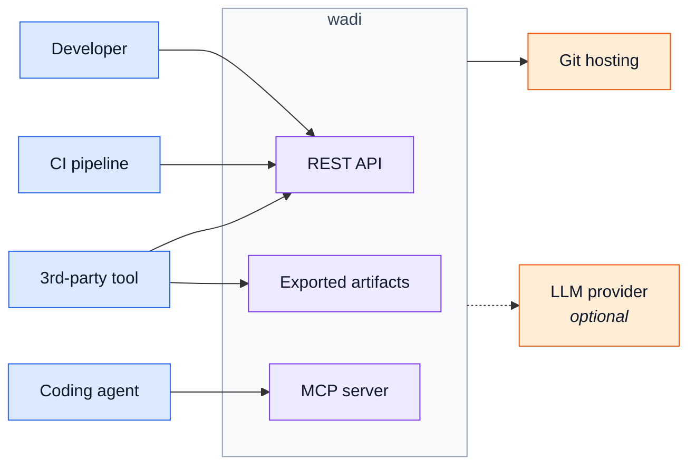

| Actor | Surface | Typical action |
|---|---|---|
| Developer | REST via `wadi` CLI, or frontend UI | register a system, run analysis, browse results |
| Coding agent | MCP (stdio locally, HTTP remotely) | query ground truth: endpoints, flows, auth |
| CI pipeline | REST via thin CLI (no container runtime needed) | per-commit re-analysis, quality gates |
| Third-party tool | OpenAPI-generated clients, or `wadi export` files | build products on top of wadi (§14) |
| Git hosting | outbound only | clone / fetch at pinned SHAs |
| LLM provider | outbound, **only if a key is configured** | gap resolution (§5.6) — absent key = edge doesn't exist |

---

## 2. Service connectivity map

The central view: every runtime component and who initiates each connection. Labels name the channel; the numbered table below carries the detail.

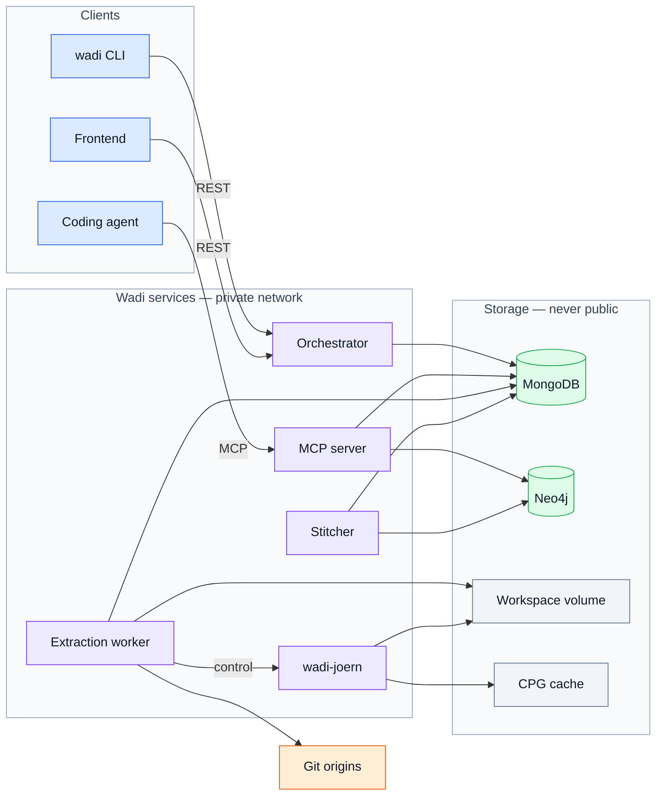

### Every connection, in detail

| # | Connection | Channel | What flows |
|---|---|---|---|
| 1 | CLI → Orchestrator | REST `/api/v1` (:9234) | all work commands: analyze, systems, exports |
| 2 | Frontend → Orchestrator | REST `/api/v1` | everything the UI shows — no privileged path |
| 3 | Agent → MCP server | stdio (local) / HTTP :9236 (remote) | architecture-level tool calls, read-only |
| 4 | Orchestrator ↔ MongoDB | driver via `wadi-storage` | **writes:** systems, snapshots, jobs, hints |
| 5 | Worker ↔ MongoDB | driver via `wadi-storage` | claims jobs; **writes:** per-service artifacts |
| 6 | Worker → Git origins | git (via `wadi-repo`) | clone / fetch at pinned SHAs |
| 7 | Worker → wadi-joern | cpgqls | **control only** — import, run pass/pack, small queries |
| 8 | Worker ↔ Workspace volume | files | worktrees, delombok; reads Joern's bulk export |
| 9 | wadi-joern → Workspace volume | files | reads source; **writes bulk subgraph export** (§5.1) |
| 10 | wadi-joern → CPG cache | files | `.cpg` keyed by content hash — evictable |
| 11 | Stitcher ↔ MongoDB | driver via `wadi-storage` | reads artifacts; **writes:** coverage report |
| 12 | Stitcher → Neo4j | Bolt | **writes:** the stitched system graph |
| 13 | MCP server → Mongo + Neo4j | driver / Bolt | reads only — no orchestrator hop (§8) |
| — | *(future)* MCP → Orchestrator | REST | write-ish tools like `analyze_system` (P4) |

*(Phase 7 adds `llm-resolver`: reads Tier 1 + coverage report, writes its own `llm_proposals` collection — same pattern as rows 4/5/11; omitted from the map to keep it readable.)*

### What the map proves

| Property | Where to look |
|---|---|
| **Services never call each other** (P1) | No edge between orchestrator, worker, and stitcher — they meet only at MongoDB (jobs + artifacts). |
| **Single writer per domain** (P4) | Every bold "writes" in the table has exactly one owner. |
| **Two channels to Joern, on purpose** (§5.1) | Row 7 is control; row 9 is bulk data. The query server is never used for bulk graph transfer. |
| **MCP bypasses the orchestrator** (§8) | Row 13 — sibling readers over the same `wadi-storage` lib; no latency, no second schema. |
| **Joern is a dead end** (P2/P5) | Nothing points at Joern except the worker, and only during extraction. Query time never touches a graph engine. |
| **One hard topology constraint** (§13) | Rows 8 + 9 — worker and Joern must share the workspace volume in every deployment. |

---

## 3. Analysis lifecycle

### Snapshot lifecycle

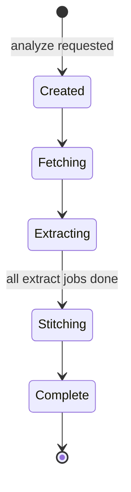

| State | What happens | On partial failure (P10) |
|---|---|---|
| Created | branches resolved to exact SHAs — the frozen commit set (§4) | — |
| Fetching | workspace materialized from the bare-clone cache | — |
| Extracting | one job per (service × language); unchanged services copy artifacts forward | failed service → placeholder node + coverage entry; **snapshot still completes** |
| Stitching | calls matched to endpoints; graph + coverage report written | unresolved calls become explicit "undetermined" facts |
| Complete | immutable — snapshots accumulate as the history mechanism (§4) | coverage report is the first thing every surface shows |

### Job state machine

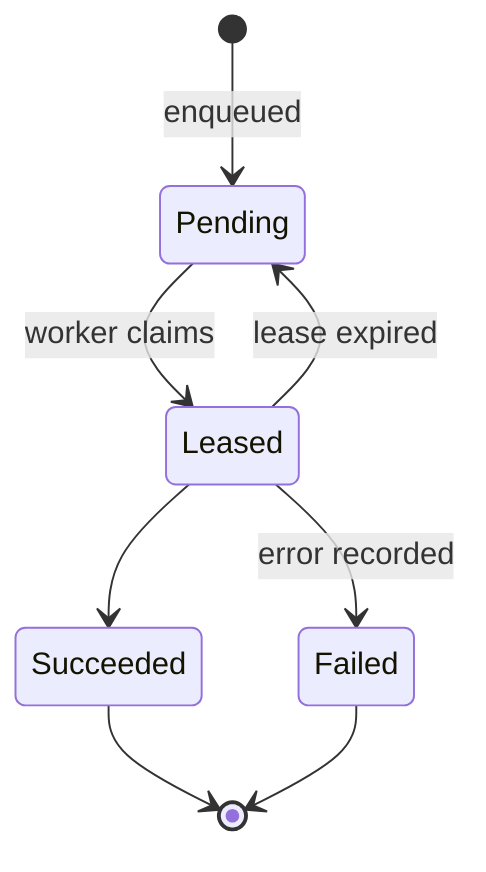

Claims are **lease-based with heartbeat** (§7): a worker crash mid-extraction expires the lease and the job silently requeues — no stranded snapshots, no human intervention.

---

## 4. Storage tiers & rebuildability

Each tier is reconstructible from the one to its left; **only Tier 1 is backed up**.

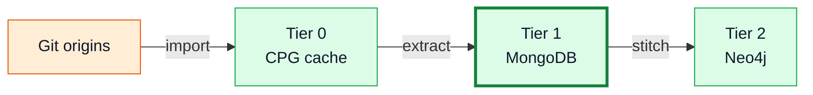

| Tier | Holds | Nature | Cost if deleted |
|---|---|---|---|
| 0 — CPG cache | `.cpg` files keyed (service, language, content-hash) | cache | recompute time (Joern re-imports) |
| **1 — MongoDB** | versioned artifacts **+ the human knowledge layer** (hints) | **source of truth — the backup target** | **data loss** |
| 2 — Neo4j | stitched cross-service graph | derived view | one stitcher re-run |

---

## 5. Stitched graph schema

A minimal worked example of the graph the stitcher writes (§5.4). *Illustrative — `RemoteCall` site nodes are elided; edges originate at call sites in the real schema.*

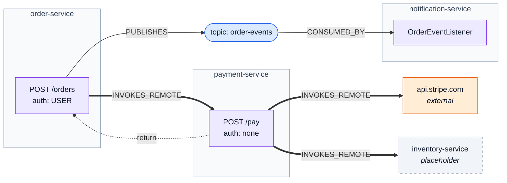

Three semantics are visible in the shapes:

1. **Sync REST gets a return edge** — traversals walk into the downstream handler and back, like an inlined call. **Async MQ deliberately has none** — fan-out is not a call, and pattern inference depends on that distinction (§5.4).
2. **Three target kinds** keep partial coverage honest: analyzed service (full interior) · external API (real dependency, no interior) · placeholder (config says it exists; wadi wasn't given the repo — a built-in "grant access" to-do list).
3. **Every edge carries two orthogonal annotations**, never blended (P7):

| Annotation | Values | Meaning |
|---|---|---|
| Confidence | `EXACT` · `HIGH` · `HEURISTIC` · `NONE` | how sure the match is |
| Provenance | `machine-proven` · `config-resolved` · `heuristic` · `llm-guessed` · `human-asserted` · *(future)* `federated` | **who** claims it |

---

## 6. Deployment topologies

Same pinned images everywhere; only orchestration and callers differ (§13, §14).

### Local — `wadi up`

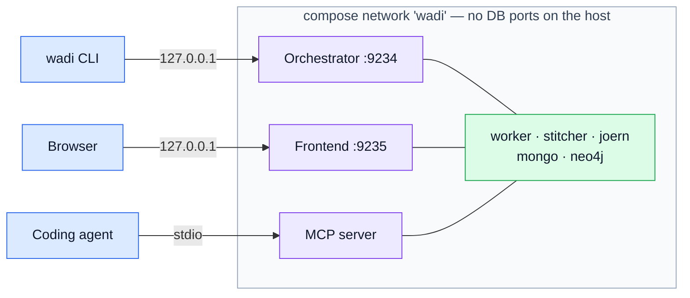

| Rule | Detail |
|---|---|
| Only two host ports | API :9234 (always) and UI :9235 (`wadi ui`) — loopback only; the WADI keypad block (§13) |
| DBs stay private | reachable only on the compose network; `--expose-db` opts into loopback debug ports 9240–9242 |
| Joern is on-demand | started when extract jobs exist, stopped when idle — idle stack ≈ 1–1.5 GB, Joern's multi-GB JVM exists only during analysis |
| MCP over stdio | `wadi mcp` runs the pinned MCP image joined to the same network — no port at all |

### Team server + remote clients

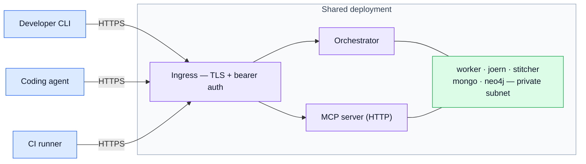

| Rule | Detail |
|---|---|
| Clients need no container runtime | just the CLI + `WADI_API_URL` / `WADI_API_TOKEN` (§15 contexts) |
| Remote MCP = HTTP behind the ingress | exposing databases to make remote stdio work is explicitly forbidden (§13) |
| This is the CI shape | the persistent server keeps clone/CPG caches and prior snapshots → per-commit analysis only rebuilds changed services (UC4) |

---

# Part II — Use Cases

Each use case names its actor and goal, walks the flow through the Part I connectivity map, and notes the degradation path — P10 means there always is one.

## UC1 — Register & analyze a system (local dev)

**Actor:** developer · **Surface:** CLI (or frontend) · **Phase:** 1

The foundational flow — already specified as the sequence diagram in `architecture.md` §4, so not repeated here. Summary trace:

1. `wadi up` — CLI renders the embedded compose definition, starts the stack, health-checks every service.
2. `wadi analyze . --wait` — registers the cwd as a `System` (local `path:` source), triggers analysis.
3. Orchestrator resolves SHAs and creates jobs → worker materializes the workspace, discovers service boundaries, drives Joern per (service × language), assembles ICFGs, writes artifacts → stitcher matches calls to endpoints, writes graph + coverage report ([§3 lifecycle](#3-analysis-lifecycle)).
4. CLI polls to a terminal state; exits 0/1; `--output json` for scripting.

**First thing surfaced afterward:** `wadi coverage <snapshot>` — what the map knows it doesn't know, *before* trusting what it claims (§5.4).

**Degradation:** a service whose CPG import fails becomes a placeholder node + coverage entry; the snapshot still completes.

---

## UC2 — Coding agent traces a cross-service flow (MCP)

**Actor:** coding agent (e.g., writing integration tests) · **Surface:** MCP stdio · **Phase:** 1–2

The killer local artifact (§13): the agent queries ground truth instead of fuzzy-searching source files.

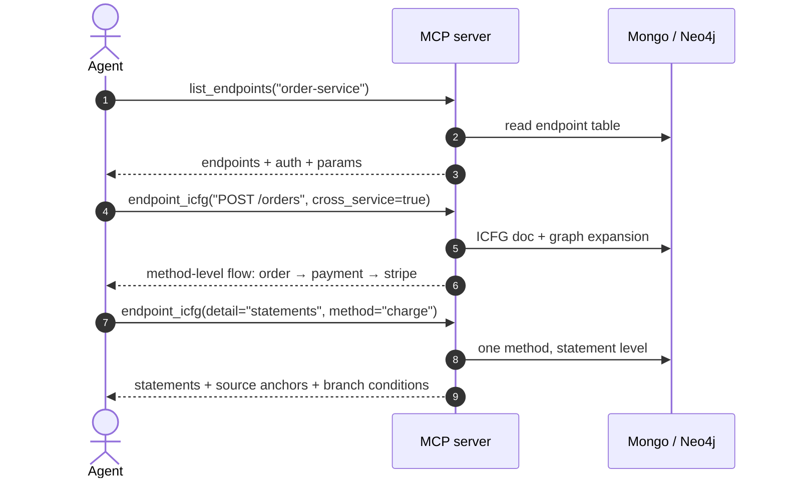

**Load-bearing design points exercised:** pre-assembled ICFG documents mean no graph engine at query time (P2); **method-level roll-up by default** protects the agent's context window — statement detail is an explicit, method-scoped drill-down (§8); every node carries a source anchor, so the agent can jump to real code.

**Degradation:** an unresolved downstream target appears as an explicit "target undetermined" fact — the agent sees the gap, never a false edge (P7/P10).

---

## UC3 — Security review: auth-consistency audit

**Actor:** security engineer (via frontend/CLI, or agent via MCP) · **Phase:** 2–3

**Goal:** find endpoints where enforcement is *not* maintained across service hops — e.g., an `ADMIN`-only endpoint whose downstream dependency requires nothing.

1. Extraction merges each endpoint's **structured auth** from three evidence sources (§5.2): security-annotation tags + security-DSL rule tags (in-graph) + config-analyzer keys — every claim carries its evidence ref.
2. The stitched graph holds auth on every endpoint plus **token-propagation evidence** on call sites (does this site forward the `Authorization` header? — §5.1).
3. The auth-consistency walk (Phase 3) compares upstream vs. downstream requirements along `INVOKES_REMOTE` edges, distinguishing **"downstream unprotected"** from **"downstream trusts the gateway"** via the propagation evidence.
4. Findings land in the analysis service's own collection (§10 single-writer pattern), surface via MCP/frontend, and later feed the CI gate `--fail-on new-unauthenticated-endpoint` (Phase 6).

**Degradation:** idioms wadi can't yet prove (e.g., dynamic Express middleware order, §12) are over-approximated with confidence markers — *wrong* security facts are worse than absent ones, so uncertainty is always labeled.

---

## UC4 — Per-commit CI analysis with quality gates

**Actor:** CI pipeline · **Surface:** CLI in client/remote mode · **Phase:** 2, gates in 5

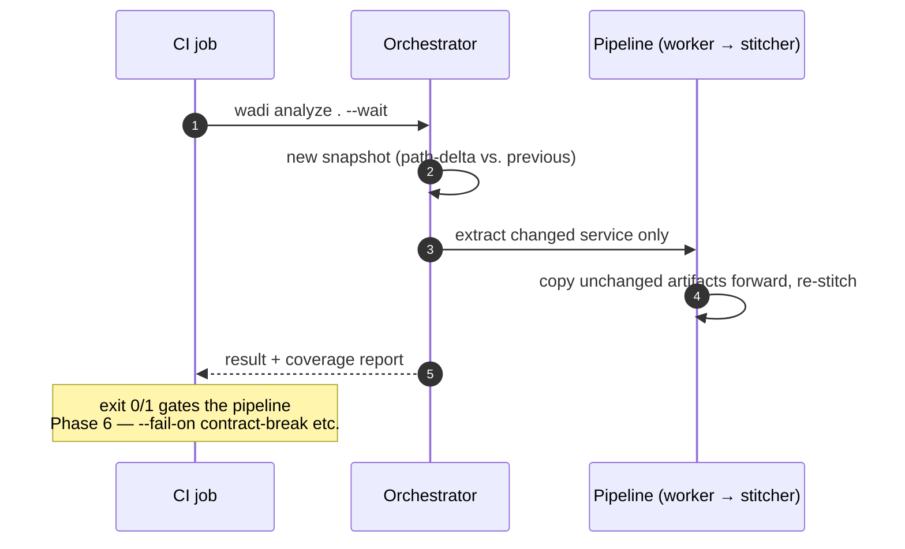

**Why client/server is the recommended CI shape (§14):** the persistent deployment keeps the bare-clone cache, the content-hash CPG cache, and prior snapshots — so a commit touching one service re-analyzes one service. The runner needs **no container runtime**, just the CLI. Ephemeral mode (stack inside the job) works but is cold every run — fine nightly, not per-commit.

**Degradation:** stack unreachable → exit code 3, distinct from analysis failure (§15) — pipelines can tell infra problems from findings.

---

## UC5 — Teaching the system: coverage gaps → hints

**Actor:** developer who knows the answer statics can't reach · **Phase:** 4

The P10 flywheel: every unknown is an invitation to teach, and corrections are permanent, shared assets.

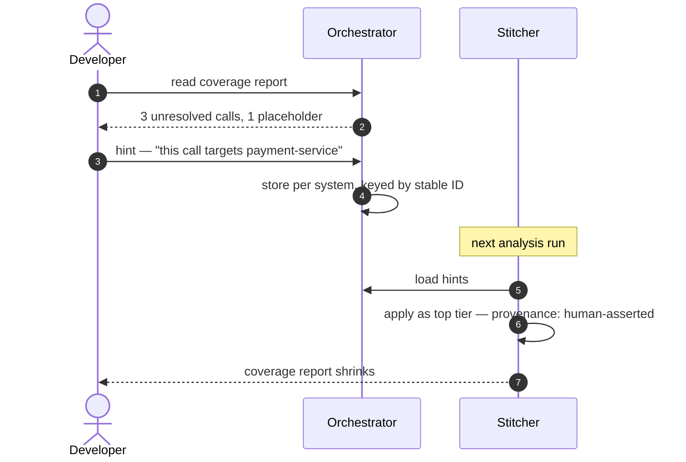

**The four hint kinds** (§11), each targeting a specific static-analysis ceiling: **target binding** (runtime-computed URLs) · **external declaration** ("this is Stripe") · **routing annotation** (content-based MQ filtering) · **suppression** (telemetry noise).

**Why this compounds:** hints are stored **per system, not per snapshot**, keyed by stable content-derived IDs (§7) — they re-anchor automatically on every run, survive re-analysis, and travel three ways: shared team server, `wadi export`, or a repo-committed `.wadi/hints.yml` reviewed like code. A hint whose anchor no longer matches is flagged stale — never silently misapplied.

---

## UC6 — LLM gap resolution & promotion loop

**Actor:** system (opt-in), then human reviewer · **Phase:** 6

**Precondition:** an LLM key (or local model) is configured. Without it this flow does not exist — and nothing else degrades (P7 corollary).

1. **The coverage report is the work queue** — `llm-resolver` runs per named gap, so spend scales with static confusion, not codebase size.
2. Each gap gets an **evidence packet** (backward slice, pinned-SHA source, config candidates) and a **constrained question**: "one of these 14 known endpoints, or `external`, or `unknown`" — never open generation.
3. Proposals are artifacts in its own `llm_proposals` collection (single writer, P4), content-hash cached — same gap + same evidence = no re-ask.
4. The stitcher consumes proposals at `llm-guessed` provenance — above unmatched, below `human-asserted`.
5. **Promotion:** one click turns a confirmed proposal into a permanent `human-asserted` hint (UC5 machinery); that gap never re-asks the LLM. **Rejections are remembered symmetrically** — the same wrong guess never returns; the gap stays honestly open.

**Privacy edge:** evidence packets contain source snippets — they leave the deployment only when an external provider is explicitly configured; local models (Ollama/vLLM compose profile) keep source in-deployment (§5.6).

---

## UC7 — Partial coverage: placeholders → full nodes

**Actor:** team onboarding wadi incrementally · **Phase:** 2+

**Scenario:** a team registers the 5 repos it owns; the system actually has 12 services.

1. Extraction and stitching proceed normally for the 5 analyzed services.
2. Config resolution surfaces service names with no analyzed service behind them → **placeholder nodes** stating why they're empty; calls to `api.stripe.com` become **external API** nodes (§5.4).
3. The coverage report lists placeholders prominently — it *is* the "grant access to these repos" to-do list.
4. The team registers `inventory-service` → next snapshot upgrades the placeholder to a full service, **no rework**: matching keys on config-resolved identity, not node kind.
5. At org scale (Phase 11), the same upgrade happens via **federated boundary-only bundles** — another team publishes endpoints + outbound calls without sharing source; the node carries `federated` provenance with per-bundle staleness surfaced.

This is why P10 is a principle rather than a feature: partial coverage is the *normal* state of a real deployment, and the architecture makes it honest instead of silently wrong.

---

## UC8 — Contributor adds a framework pack

**Actor:** contributor (internal or community) · **Phase:** any — the §10 playbook

**Scenario:** add Kafka support for Java.

1. Write a small declarative CPGQL pack in `joern-platform/.../packs/java/kafka/` tagging producer/consumer sites (`sink=mq:kafka`) — tags drawn **only from the versioned registry** in `wadi-contracts` (§7; CI fails on unregistered tags).
2. Add the conformance fixture: tiny sample repo + `expected/*.json` (P8) — CI validates the contribution, not maintainer trust.
3. **Nothing else changes:** the worker discovers packs generically; contracts, storage, stitcher, MCP, and frontend are framework-blind. (A new *mechanism* — vs. framework — additionally needs one additive enum value and one stitcher matching rule, §10.)

The touchpoints for the most common kind of growth are exactly two directories in one module — the layering's extensibility test, passed.

---

## Coverage matrix

Every component of the [connectivity map](#2-service-connectivity-map), exercised by at least one use case — the check that the layer architecture serves the real scenarios, not just the diagrams.

| | CLI | Frontend | Orchestrator | Worker | wadi-joern | Stitcher | MCP server | Mongo | Neo4j | Volumes |
|---|:-:|:-:|:-:|:-:|:-:|:-:|:-:|:-:|:-:|:-:|
| **UC1** analyze | ● | ○ | ● | ● | ● | ● | | ● | ● | ● |
| **UC2** agent trace | | | | | | | ● | ● | ● | |
| **UC3** auth audit | ○ | ○ | | ● | ● | ● | ● | ● | ● | |
| **UC4** CI gate | ● | | ● | ● | ● | ● | | ● | ● | ● |
| **UC5** hints | ○ | ● | ● | | | ● | ○ | ● | ● | |
| **UC6** LLM loop | | ● | ● | | | ● | | ● | ● | |
| **UC7** placeholders | ○ | ● | ● | ● | | ● | ○ | ● | ● | |
| **UC8** add a pack | | | | ● | ● | | | | | ● |

● primary path · ○ alternative surface for the same flow *(UC6 additionally exercises `llm-resolver`, Phase 7)*

Two observations the matrix makes visible:

1. **MongoDB is the hub, and that's by design** — it appears in every row because contracts-in-Mongo is the *only* coupling surface (P1). The services never appear in each other's rows as dependencies, only as pipeline stages meeting at storage.
2. **Joern appears only in extraction-time rows** (UC1/3/4/8) and never in consumption-time rows (UC2/5/6/7) — the materialize-and-discard principle (P2) holding in practice: everything users and agents touch is served from Tiers 1–2.
