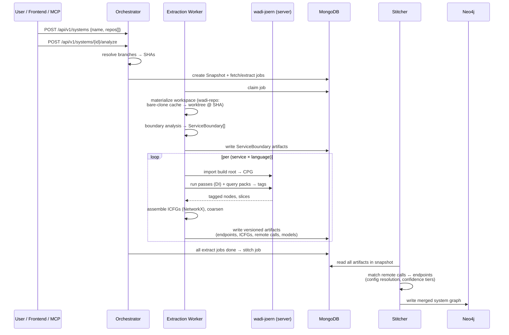
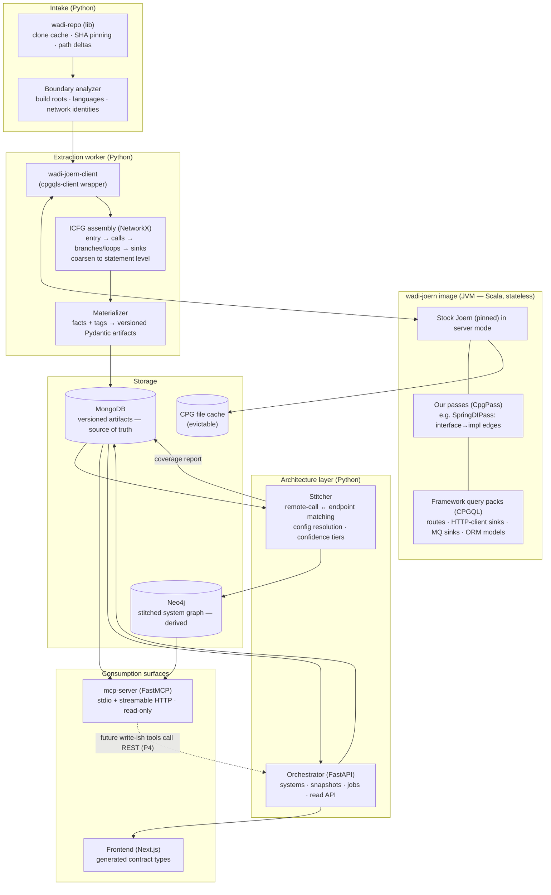

# Wadi — Architecture Design

**Status:** Draft for review
**Date:** 2026-07-20 · **Last revised:** 2026-07-31
**Scope:** The complete architectural backbone of wadi — a polyglot microservice static-analysis platform built on Joern. This document records every structural decision *and its rationale* (including rejected alternatives) so each choice can be reviewed and revised before implementation begins.
**Companions:** [`joern-migration-architecture.md`](./joern-migration-architecture.md) — the original migration study that selected Joern and defined the analysis approach. Wadi adopts its analysis design (query packs, ICFG assembly, stitching, MCP) but is **clean-slate**: no legacy data contracts, no legacy consumers. · [`architecture-views.md`](./architecture-views.md) — the visual layer: system context, the full service-connectivity map (every connection with protocol and direction), lifecycle state machines, the stitched-graph schema, deployment topologies, and end-to-end use cases traced against the components. This document stays the normative decision record; that one shows how the pieces connect and proves the layering serves the real scenarios.

---

## Table of Contents

1. [Overview & Goals](#1-overview--goals)
2. [Architectural Principles](#2-architectural-principles)
3. [Stack & Rationale](#3-stack--rationale)
4. [System Model: System / Snapshot / Service](#4-system-model-system--snapshot--service)
5. [Layer Architecture](#5-layer-architecture)
6. [Storage Architecture](#6-storage-architecture)
7. [Data Contracts](#7-data-contracts)
8. [MCP Server Design](#8-mcp-server-design)
9. [Repository Layout](#9-repository-layout)
10. [Extensibility Playbook](#10-extensibility-playbook)
11. [Roadmap](#11-roadmap)
12. [Risks & Mitigations](#12-risks--mitigations)
13. [Distribution & Deliverables](#13-distribution--deliverables)
14. [Consumption & Integration Surfaces](#14-consumption--integration-surfaces)
15. [CLI Design](#15-cli-design)
16. [Engineering Standards (Open-Source Grade)](#16-engineering-standards-open-source-grade)

---

## 1. Overview & Goals

Wadi statically analyzes an entire microservice system — polyglot, one repo or many — and materializes a queryable, ground-truth model of its architecture.

### Product goals

For any registered system:

1. **Endpoint inventory** — every REST endpoint of every service, with method, URI, parameters, auth requirements.
2. **Per-endpoint interprocedural control flow graph (ICFG)** — from the endpoint entry point through every call, branch, and loop down to the data layer (repository/ORM/driver calls).
3. **Outbound-communication detection** — HTTP/REST remote calls, message-queue publish/consume, and other inter-service mechanisms, with URLs/topics recovered via dataflow rather than regex heuristics.
4. **Cross-service stitching** — when service A calls service B, the graph branches into B's handler. Each endpoint's flow is complete across the whole system, including through message queues.
5. **Data-shape recovery** — what data each endpoint touches and the ORM model shapes persisted per service.
6. **LLM-consumable interface** — an MCP server exposing architecture-level tools, so coding agents query ground truth instead of fuzzy-searching source files (e.g., for test generation or auth analysis across services).
7. **Frontend** — a web UI to register systems, run analyses, browse services/endpoints, and inspect ICFGs and the system graph.
8. **Extensible by construction** — new languages, frameworks, analyses, and consumers are additive modules, not modifications to the core.
9. **Security-aware by default** — authorization and authentication are extracted *as part of* the core analysis, not as an afterthought: per-endpoint auth (annotations, security DSL, config) is a structured field on every endpoint, and the stitched graph supports cross-service auth-consistency analysis ("is enforcement maintained from upstream call to downstream handler?"). **Auth is pack-based like all framework knowledge — never Spring-shaped:** each ecosystem's auth idiom maps to the *same* structured auth output — Spring Security (annotations/DSL), FastAPI (`Depends`/`Security` dependencies), Django (`@login_required`/`@permission_required`, DRF `permission_classes`), Express/Node (middleware chains — order-dependent, so extracted with over-approximation + confidence markers) — landing with each language's phase (§11).

### What wadi is built on

[Joern](https://joern.io) (Apache-2.0) provides per-service **code property graphs** (AST + CFG + call graph + types + dataflow) via ~12 language frontends. Joern owns everything *inside* a single service's code; wadi owns everything *between* services — boundary discovery, identity, config resolution, stitching, storage, and the consumption surfaces. That division (established in the companion doc, §4) is the product's moat: the in-process analysis is commodity; the cross-service layer is the contribution.

---

## 2. Architectural Principles

These rules are the backbone. Every future module must satisfy them; every deviation should update this section first.

**P1 — Coupling only through contracts.** Services never import each other and never call each other except where explicitly documented (single-writer rule, P4). All inter-service communication happens through **versioned JSON artifacts in MongoDB** and the job collection. Shared code lives in `libs/*` packages only.

**P2 — Extract once, materialize, discard.** The CPG is a working set, not a product. The extraction worker walks it once, writes JSON artifacts, and the CPG becomes an evictable cache entry. Nothing downstream ever holds a connection to a graph engine (Joern) at query time.

**P3 — Topology erasure.** Whether a system is one monorepo or twenty repos is visible only to the intake layer. After service-boundary discovery, everything operates on *services within a snapshot* (§4).

**P4 — Single writer per data domain.** Every data domain has exactly one writing service, and every new domain gets exactly one owner. Current assignments: the orchestrator writes systems/snapshots/jobs (and owns the hint store, §11); the extraction worker writes per-service artifacts; the stitcher writes the Neo4j graph *and* the coverage-report collection (§5.4); `llm-resolver` writes its proposals collection (§5.6); future analysis services each own their new collection (§10). Readers go straight to storage via `wadi-storage`. Anything that needs to *cause* a write in another domain calls that domain's owner (e.g., a future MCP `analyze_system` tool calls the orchestrator's REST API).

**P5 — The Joern layer is stateless and disposable.** Stock, pinned Joern — **never forked**. All customization lives in Joern's designed extension points (CpgPass, CPGQL query packs, tags) compiled into a jar and baked into the `wadi-joern` image. Frontend gaps go upstream as PRs. Every CPG and every Joern container can be deleted; nothing is lost but recompute time.

**P6 — The extension decision rule.** For every new capability:
> *Does it need to see inside one service's code graph?* → **Scala** (pass or query pack in `joern-platform`).
> *Does it span services, configs, or already-extracted artifacts?* → **Python** (service or library).

Many features split across the rule: e.g., "resolve this REST call's URL" starts as a generic backward slice (Scala/CPGQL, in-graph) and finishes in config resolution (Python, cross-service). The graph side emits *facts with confidence markers*; the architecture side refines them.

**P7 — Symbolic truth, LLM judgment.** The graph layers make exhaustive, verifiable claims (endpoint inventories, ICFGs). LLMs are used only where statics structurally cannot answer (runtime-config URLs, ambiguous DI) and their outputs are marked low-confidence — never silently mixed into ground truth. Corollary: **the core pipeline requires no LLM** — extraction, tagging, ICFG assembly, and stitching are deterministic and run fully offline with no API keys; every LLM touch (gap resolution, method summaries, semantic labeling) is an optional enrichment activated only when a key is configured, and their absence degrades coverage, never correctness.

**P8 — Every framework pack ships with a conformance fixture.** A tiny sample repo plus expected-output JSON, diffed in CI. This is the required template for all catalog growth (§10).

**P9 — Time and versioning.** Every stored artifact carries `schema_version`, its snapshot key, and timezone-aware UTC timestamps.

**P10 — Honest unknowns, durable human knowledge.** What wadi cannot see or determine is **materialized, never omitted**: inaccessible services become placeholder nodes stating why they're empty; runtime-undeterminable targets become explicit "target undetermined" facts. Every unknown is an invitation for a human to teach the system — and human corrections are **permanent assets**: stored per system (never per snapshot), re-anchored across runs via stable IDs (§7), provenance-marked, and never silently lost. The system's accuracy compounds with use; the accumulated knowledge layer is backed up alongside Tier 1 and included in exports.

---

## 3. Stack & Rationale

| Layer | Choice | Rationale (and rejected alternatives) |
|---|---|---|
| Graph engine | **Joern**, stock, version-pinned | Only multi-language CPG engine with native CFG/dataflow, permissive license, and server mode. *Rejected: CodeQL (license bars commercial use), Fraunhofer CPG (kept as fallback if a frontend disappoints), tree-sitter+custom (rebuilds Joern), Semgrep (no graphs).* See companion doc §3. |
| Joern extensions | **Scala** (sbt module → jar in `wadi-joern` image) | Not a choice — CpgPass and query packs are Scala by requirement. Kept minimal: tag + edge-add only. |
| Backend services | **Python 3.12+, FastAPI, Pydantic v2**; uv workspace; pyright strict; ruff; pytest | The two hardest modules sit on Python's strengths: the official Joern client (`cpgqls-client`) and NetworkX for graph algorithms (ICFG assembly, stitching, pattern matching). Ecosystem alignment: Privado rules, atom slices, research tooling are Python/Scala. Batch/CPU-bound workload shape fits Python workers. *Rejected: TypeScript core (hand-rolled CPGQL client + thin graph-algorithm ecosystem on the critical path); JVM core (weaker MCP/LLM tooling, slower research iteration); hybrid Python/TS backend (permanent two-toolchain tax for a small team — revisit if the team splits into analysis vs product owners).* |
| MCP server | **Official Python MCP SDK (FastMCP)** | First-class SDK; Pydantic models double as tool schemas; shares the Joern client for a future raw-query escape hatch. TS SDK's earlier access to brand-new protocol features is irrelevant for a stable tool set. |
| Frontend | **Next.js (App Router) + TypeScript** | User choice. Contract types are **generated** from Pydantic JSON Schema (§7) — single source of truth, no drift. |
| Artifact store | **MongoDB** | Versioned JSON documents per snapshot; source of truth. *Rejected for v1: Postgres/JSONB (fine choice, but the artifact shapes are deeply nested documents with no relational queries planned).* |
| System graph | **Neo4j** | Cross-service traversals and pattern queries in Cypher; fully derived from Mongo, rebuildable (§6). |
| CPG cache | Filesystem volume (object storage later) | Keyed `(service, language, content-hash)`; evictable (P5). |
| Jobs | **Mongo-backed job collection + polling workers** (v1) | Fewest moving parts. The queue is behind a `wadi-storage` interface; swap to Redis/arq or similar later without touching services. *Rejected for v1: Redis/Celery/RabbitMQ (extra infra before scale demands it).* |
| Repo intake | **`wadi-repo` library** (git CLI under the hood) | Clone/fetch/checkout, bare-clone cache, SHA resolution, path-delta computation. *Rejected for v1: a standalone repo-manager service — becomes worthwhile only with GitHub App auth, org-wide listing, or webhooks; the library boundary makes that split mechanical later.* |

---

## 4. System Model: System / Snapshot / Service

Target systems may live in a single monorepo or across many repos. Wadi unifies both with three deliberately decoupled concepts:

| Concept | Definition | Cardinality |
|---|---|---|
| **System** | A registered analysis target: `{name, repos: [{url, branch, credRef}]}`. The **only** place repo topology exists. | 1 repo (monorepo) or N repos |
| **Snapshot** | One analysis run's frozen commit-set: each repo's branch resolved to an exact SHA at kickoff (`{repo → sha}`). All artifacts, ICFGs, and stitching are keyed by snapshot — this is what makes cross-service stitching consistent (never mixing service A @ Monday with service B @ Friday). | many per system |
| **Service** | The unit Joern analyzes. **Discovered, not declared**: the boundary analyzer scans the fetched workspace for build roots (Maven/Gradle modules, `package.json`, `pyproject.toml`, docker-compose entries, k8s manifests) and network identities (hostnames, ports, env). | monorepo → many per repo; multi-repo → 1+ per repo |

### Intake & analysis workflow



### Properties worth noting

- **Topology erasure (P3):** after boundary analysis, nothing downstream knows how many repos existed. Extraction, storage, stitching, MCP, and frontend all operate on `(snapshot, service)`.
- **Incremental rebuilds:** `wadi-repo` computes changed paths between two snapshots of the same repo; changed paths map to service build roots; only changed services get CPG rebuilds. Unchanged services' artifacts are copied forward to the new snapshot (cheap document writes, no re-analysis).
- **Polyglot services:** a service with two languages yields one CPG *per language* (Joern has no in-engine polyglot graph — by design). Their facts unify in the artifact layer; cross-language flow inside one service is treated like any other boundary the stitcher can learn to cross later.
- **Workspaces are disposable:** a shared volume of checkouts, rebuildable from the bare-clone cache; the cache itself is rebuildable from origin.
- **Boundary overrides (P10, one layer earlier than hints):** discovery is heuristic and *everything downstream keys on it* — so boundaries are teachable exactly like stitching is. A repo-committed **`.wadi/services.yml`** (and a `services:` override on `System`) can force-split, force-merge, rename, or exclude paths; merged at intake, provenance-marked, shared via git like hints. Scheduling: the **minimal API-only `services:` override ships in Phase 3** (insurance before TrainTicket — the first repo where discovery will realistically misfire); the full teachable `.wadi/services.yml` version lands in Phase 4 (§11). The hints system covers stitching mistakes; this covers the layer beneath them.
- **Snapshots are the history mechanism.** Snapshots are immutable and accumulate per system (§7 forbids in-place rewrites), so "browse previous runs" is a snapshot picker over existing data, and cross-run comparison ("what changed between commit A's run and commit B's run") is a future feature over existing artifacts — no new storage concepts. Likewise, multiple registered Systems *are* the multi-project story. Neither needs backend changes beyond frontend/API surface (scheduled Phase 4, §11).

---

## 5. Layer Architecture

> The diagram below shows the *conceptual layers*. For the **runtime service-connectivity map** — every component and connection labeled with protocol and direction, plus deployment topologies and use-case traces — see [`architecture-views.md`](./architecture-views.md).



### 5.1 `joern-platform` (Scala — the in-graph layer)

Everything that must see inside a single service's code graph (P6):

- **Passes (`CpgPass`)** mutate the graph. First: **SpringDIPass** — resolves `@Autowired`/constructor-injected interface dependencies to implementations (EXACT / `@Primary` / `@Qualifier` / AMBIGUOUS strategy) and adds interface→impl call edges, so every downstream traversal transparently crosses DI boundaries. Without it, endpoint→data-layer walks dead-end at service interfaces.
- **Query packs (CPGQL)** find and **tag** nodes: `endpoint=GET /orders`, `sink=db`, `sink=http-client`, `sink=mq:kafka`, `model=Order`. Tags persist in the CPG; the worker collects tags rather than re-detecting. Packs are small (tens of declarative lines per framework) and per **language × framework**: Spring routes/stereotypes, RestTemplate/WebClient/Feign sinks, JPA/Mongo models, and **Spring Security** (`@PreAuthorize`/`@Secured`/`@RolesAllowed`, `SecurityConfig` DSL rule chains — real graph queries replacing the predecessor's regex over `SecurityConfig.java` — and token-propagation sites: does a call site forward the `Authorization` header / use a Feign interceptor) first; FastAPI/Flask, Express, SQLAlchemy, Kafka/Rabbit clients later. Seeded from Privado's OSS rule packs and Code2DFD's technology catalog.
- **Bulk subgraph export:** a small command in our jar dumps each endpoint-reachable subgraph (nodes, edges, tags) as JSON to the **shared workspace volume** (§13 topology constraint — already shared), which the worker reads directly. The cpgqls query channel is for *control* (run pass/pack, small queries) — never bulk graph transfer, the query server's known weak spot. P6 untouched: same division of labor, different wire. **Validated in week one of Phase 1** (§11) — it's on the critical path of everything. **Export schema 2.0.0 (Phase 2):** a sink site emits **one row per sliced candidate value** (multi-path slices, §5.2 step 4), each row carrying the inner call id, slice-evidence text, and token-propagation marker; endpoints carry declared params and raw `auth=` tag evidence; SecurityFilterChain rules and `@Value` config-key references travel in their own top-level sections because those facts live outside the endpoint-reachable closure. *Rejected: staging these as several minor bumps — multi-candidate rows break the "one row per site" reading assumption, which is semantically breaking however it is versioned, and both sides live in one repo and move lockstep.*
- **Conformance fixtures** (P8): each pack ships a tiny sample repo + expected JSON.
- **Docker image:** stock pinned Joern + our jar, run in server mode. One long-lived container in dev; horizontally scalable later since it's stateless (P5).

### 5.2 Extraction worker (Python)

The pipeline owner: claims jobs, materializes the workspace, runs boundary analysis, then per (service × language):

1. Build (or cache-hit) the CPG via `wadi-joern-client` — for Java, after a **delombok preprocessing step** (Lombok-generated constructors/getters don't exist in source and would dead-end DI and dataflow, §12).
2. Run passes and applicable packs; collect tags and requested slices. Bulk graph data arrives via the export file on the shared volume (§5.1), not the query channel.
3. **Assemble per-endpoint ICFGs** in NetworkX: start at each endpoint-tagged method, walk the DI-augmented call graph, stitch per-method CFGs, terminate at tagged sinks; coarsen expression-level CFG to statement granularity; mark branch/loop/call node kinds, remote calls, MQ publishes, and data-layer sinks with confidence markers.
4. Run backward slices for URL/topic argument reconstruction (through variables, fields, `String.format`, config keys) — dataflow replaces regex heuristics. Slices follow **all paths**: a call whose target depends on a condition (branch calls service X or Y) or on a multi-valued variable yields the full set of candidate values — one remote-call fact per candidate, each attached to its branch in the ICFG. For an architecture map this over-approximation is the *correct* answer (both X and Y are real dependencies), not a precision loss. Targets that are genuinely runtime-only (e.g., hostname from a DB row) degrade gracefully: the call is still a first-class fact with whatever shape is known (e.g., path only), matched at HEURISTIC confidence or left unmatched — never silently dropped, never falsely resolved (P7).
5. **Merge authorization evidence** into each endpoint's structured auth field: security-annotation tags + `SecurityConfig`-DSL rule tags (in-graph) + security keys from the config analyzer (application.yml — the same component that feeds the stitcher's phone book). Three sources, one structured result, each claim carrying its evidence ref.
6. Write versioned artifacts to Mongo (sole writer of its domain, P4).

**§5.2.4 URL slicer — Phase 2 implementation decisions (recorded, binding):**

- **The slicer is a bounded recursive evaluator** (`wadi.slicing.UrlSlicer`) over the AST plus structural assignment lookup — literals, string concatenation (cross-product of candidates), `String.format`, locals, fields (including constructor-lowered member initializers), `@Value("${key}")` config keys, and the Lombok getter bridge. *Rejected: `reachableBy`-driven slicing — flow paths are not reconstructed values; value rebuilding is structural work either way, and engine cost on pathological graphs is unpredictable.* Locals/fields with several assignments yield **one candidate per assignment** (§5.2 over-approximation), each capped at HIGH because the reaching definition is unproven — reaching-def precision (the OssDataFlow overlay) is a recorded future refinement; nothing consumes the DDG yet, so extraction does not pay its cost.
- **Config keys stay symbolic:** `@Value("${key}")` renders as a `${key}` template variable at HIGH confidence — the *stitcher* resolves it against the caller's extracted config facts (P6 split); the exporter also emits every `@Value` field CPG-wide as a `config_refs` row with anchor and context.
- **Confidence per candidate:** EXACT (all literal, single path) > HIGH (via config key / single-assignment field; benign holes allowed) > HEURISTIC (non-benign hole, budget truncation, multi-assignment fan-out) > NONE (nothing recovered — e.g. a URL from a DB row). A `{?}` hole that occupies one complete path segment is **benign** — it aligns with the endpoint identity form and never lowers confidence; a hole in the authority always does.
- **Interprocedural return resolution:** a call into an in-CPG body (DI-resolved implementations included) resolves its return expression with the call-site arguments bound to the parameters — hop-budgeted (default 2) and cycle-guarded; resolution through a hop caps at HIGH. **Constant-map lookups:** `map.get(k)` resolves when every visible `put` on that local map is literal→literal and `k` evaluates to one literal (the TrainTicket service-registry idiom — where the map, not the URL path, is the ground truth); any non-constant put poisons the map and the lookup stays an honest hole. *Rejected: over-approximating an unknown key to all map values — a 38-entry registry would explode the candidate set with mostly-false edges.*
- **Gateway discovery locator (§5.4.1):** `spring.cloud.gateway.discovery.locator.enabled` is extracted as a boundary fact; the phone book resolves `/{service-name}/**` through a locator-enabled gateway by treating the first path segment as the target's discovery name (stripped before endpoint matching). Explicit routes win over the locator; an unknown locator name becomes a config-known placeholder — the gateway config itself declares it as a target.
- **Budgets, floor, honesty:** depth/candidates/visited/wall-clock budgets; truncation marks candidates HEURISTIC with a note in the evidence. The Phase-1 literal/concat recovery stays as the floor — results are never worse than before. The slicer never throws and never returns nothing; every candidate carries a human-readable trace, and Lombok-blocked resolutions carry the exact marker (`lombok-generated interior`) the coverage report counts (recorded user decision: exact anchors + getter bridge; run-delombok revisited only if coverage data shows real losses).
- **Fixture inventory:** `spring-petstore-mini` stays frozen as the Phase 1 regression baseline (assertions upgrade when the slicer legitimately improves an answer); **`petstore-system`** is the Phase 2 two-service fixture — compose + application.yml identities aligned with the caller URLs, exercising config-key slicing, branch-dependent multi-candidates, the DB-row NONE trap, and (M5) the security pack, which it doubles as the P8 fixture for.

**§5.2.5 Slicer corrections — Tranche 1 (recorded 2026-08-01, binding):**

The TrainTicket/CIMET cross-validation exposed that the slicer's budget model and two honesty rules were wrong. Decisions:

- **Depth measures indirection, not expression size.** A `+`-concat chain is flattened and charged **one** depth level regardless of operand count; depth is spent on the hops that carry analytical risk — local/field assignment lookups, interprocedural returns, map lookups. *Rejected: the uniform per-AST-level charge (Phase 2 as-shipped) — Java's left-associative `+` made a five-operand URL burn four levels before any real work, starving the interprocedural + constant-map stages; on TrainTicket this manifested as 21 resolvable calls (long concats or chained locals, e.g. `drawbackMoney`'s five-operand URL) reported undetermined while the identical idiom with ≤3 operands resolved.*
- **A budget-starved resolution must say so.** Truncation propagates through every composition point — in particular, a constant-map lookup whose *key* resolution was truncated reports `slice-budget-truncated`, not "key is not a single constant" (which was factually false: the key was a literal), and the fabricated hole carries the truncated flag so confidence caps at HEURISTIC. *Rejected: treating starved holes as benign path-segment holes — they shipped at HIGH and were indistinguishable from honest unknowns, which is how the bug survived every run since the Phase 2 commit (P10 violation).*
- **Member lookup is owner-scoped.** `resolveMember` matches field assignments within the owning `TypeDecl` (falling back to the declaring type of the access), never CPG-global by field name. *Rejected: global name matching (Phase 2 as-shipped) — two classes with a field named `url` conflated into a false multi-assignment fan-out.*
- **Verb recovery follows the value, not just the name:** `exchange`/`execute` read a literal `HttpMethod.X` field-access argument (any position — the overloads move it); `headForHeaders` → HEAD, `optionsForAllow` → OPTIONS join the name map; WebClient-family verbs come from the fluent chain root (`.get()`/`.post()`/…/`.method(HttpMethod.X)`). A dynamic verb (`HttpMethod.valueOf(expr)`, unresolvable `.method(x)`) stays `null` — an honest unknown, never a guess (P10). Verb presence upgrades stitcher path-tier confidence to EXACT (§5.4), so this is a precision fix, not cosmetics.
- **WebClient sinks anchor on the URI-bearing step.** The fluent chain's `.uri(...)` call (receiver `WebClient$…UriSpec`) is the sink; the chain root supplies the verb; `mechanism` is `webclient`. *Rejected: tagging the chain root (Phase 2 as-shipped) — `.get()` carries no URL argument, so every WebClient sink exported `value=null` and was mislabeled `resttemplate`.*
- **Sinks never vanish silently.** An HTTP-shaped call whose receiver type javasrc2cpg could not resolve is exported as a **suspected sink** fact (`unresolved-receiver-type`) — countable, never blended into resolved results (P7). Sinks in methods outside the endpoint-reachable closure are exported as an **unreachable-sink inventory** (site + URL best-effort), not dropped: dead code is excluded from the architecture map *by design*, but the exclusion itself is a queryable fact — it is also exactly what cross-tool comparisons (CIMET counts dead call sites) need to reconcile counts.

### 5.3 Orchestrator (FastAPI)

Owns systems, snapshots, and jobs (sole writer); exposes the REST API — mounted at `/api/v1` from the first endpoint (§14) — consumed by the frontend, the CLI, and third-party integrations (`/api/v1/systems`, `/api/v1/snapshots/{id}/services`, `/api/v1/services/{id}/endpoints`, `/api/v1/endpoints/{id}/icfg`, …). Also serves **source-on-demand**: `GET /api/v1/snapshots/{id}/source?file&lines` reads the text **that was actually analyzed** — the exact pinned-SHA text from the bare-clone cache for untouched files, and the **delombok'ed variant** for Lombok-touched files (stored alongside the workspace; the response flags `variant: "generated"` so the UI badges it). This is forced by the guarantee itself: anchors are extracted from the analyzed text, so serving the original for preprocessed files would misalign every line. *Rejected: line-mapping back to originals — delombok emits no source maps; permanent fragile machinery to preserve a guarantee it would still break.* Where no source access exists (federated boundary-only bundles), the endpoint says so explicitly (P10). Pure I/O coordination — no analysis logic.

### 5.4 Stitcher (Python)

The novel layer — no engine can do this, because a CPG is per-program and cross-service flow is an *architecture* fact requiring config knowledge:

1. Reads all artifacts in one snapshot: endpoint tables, remote calls and MQ interactions with sliced URLs/topics + confidence, plus config resolution inputs (application.yml service names, compose hostnames, discovery names, gateway route prefixes).
2. Matches remote calls to target endpoints via confidence tiers — EXACT / HIGH / HEURISTIC / NONE; the fuzzy tier is a fallback, not load-bearing, because dataflow-recovered URLs are far better than regex-recovered ones.
   - **Target classification:** every resolved call lands on one of three node kinds — an **analyzed service** (full interior), an **external API** (address matches no known service's network identity — e.g., `api.stripe.com`; a real dependency edge to a node with no interior), or a **placeholder service** (config-resolved name with no analyzed service behind it — the system has services wadi wasn't given). Placeholders make partial coverage honest and double as a "grant access to these repos" to-do list; registering the missing repo later upgrades the placeholder to a full service on the next snapshot with no rework.
   - **Provenance on every edge**, alongside confidence: machine-proven / config-resolved / heuristic / LLM-guessed (P7) / human-asserted (stitching hints, below).
3. Writes the merged graph to Neo4j:
   - **Sync REST:** `(:RemoteCall)-[:INVOKES_REMOTE {url, confidence, mechanism}]->(:Endpoint)` **plus a return edge** — traversals walk into service B's flow and back, like an inlined call.
   - **Async MQ:** `(:Producer)-[:PUBLISHES]->(:Topic)-[:CONSUMED_BY]->(:Handler)` — **deliberately no return edge**; async fan-out is not a call, and pattern inference depends on the distinction.
   - Cross-service **cycles** are fine (graph edges, never tree inlining); fan-out depth is bounded per query, not per graph.
4. Emits a snapshot-level **coverage report** (its own collection — the stitcher is that domain's single writer, P4): counts and listings of placeholder services, external APIs, unresolved/low-confidence calls, and applied/stale hints. Every consumer (frontend, MCP, CLI) surfaces this *first* — the user always sees what the map knows it doesn't know (P10) before trusting what it claims.
5. Later: architectural pattern/anti-pattern inference (gateway, saga, event-driven, shared-DB, cyclic dependency) as Cypher queries over this graph.

**Phase 2 implementation decisions (recorded, binding):**

- **Config-analyzer split (P2/P6):** the worker parses config sources (compose, application.yml) at extraction time into `NetworkIdentity` facts on the boundary artifact; the stitcher builds its phone book from artifacts only and never touches source. The parser is worker-local until a second consumer exists. *Rejected: a shared config lib (single consumer today); stitcher-side parsing (violates P2).*
- **Phone-book precedence:** compose hostname → application/discovery name → gateway route (longest prefix, strip, re-resolve; depth-capped at 4; indirection caps resolution tier at HIGH) → port-only heuristic (HEURISTIC tier, never load-bearing). Conflicts are never picked-from: every claimant becomes a candidate (one edge each at HEURISTIC) and the conflict lands in the coverage report. Cross-namespace shadowing resolves by precedence but is still reported. *Rejected: name-first ordering (a discovery name would shadow the network authority that demonstrably routes the call); flat merged namespace (loses the "why did this resolve" evidence).*
- **One `Confidence` enum, composed:** edge confidence = min(U url-recovery, R resolution, P path/verb). R: direct unambiguous hit = EXACT, gateway indirection or port disagreement = HIGH, ambiguity/port-only/bare-hostname = HEURISTIC. P: verb agrees + literal/template segments = EXACT, path exact but verb unknown = HIGH, a call-side `{?}` absorbing an endpoint literal = HEURISTIC (the endpoint's own `{?}` absorbing a call segment is what a template means — still EXACT). NONE exists only as UNDETERMINED edges; a "matched" edge can never be NONE. Provenance stays a single orthogonal value (P7): any heuristic step → `heuristic`; phone book consulted → `config-resolved`; no config involved (literal external address) → `machine-proven`.
- **Every call fact yields ≥1 edge (P10):** UNDETERMINED is an edge row plus a coverage entry with a machine-readable `reason_code` — accepted limitations are queryable, never just prose. The vocabulary is a versioned registry in `wadi-contracts` (like the tag vocabulary): `url-undetermined`, `url-unparseable`, `no-endpoint-match`, `lombok-generated-interior`, `slice-budget-truncated`, `unresolved-receiver-type`, plus config-fact notes (`config-multi-doc-partial`, `config-profile-files-skipped`) carried on the boundary artifact. `host-unresolvable` is **removed** — documented since Phase 2 but never emitted; unresolved hosts classify as external/placeholder nodes, which is the better answer (recorded correction, Tranche 1). A host that resolves to an analyzed service whose endpoints don't match stays UNDETERMINED with evidence (never fabricate an endpoint). Bare unresolved single-label hostnames become HEURISTIC placeholders (they land on the grant-access to-do list); dotted/IP hosts become external nodes. `${key}` template URLs resolve against the *caller's* extracted config facts before parsing.
- **Stitched edges are Tier-1 Mongo artifacts** (`stitched_edges`, stitcher single-writer, P4) written *before* Neo4j; the graph is a pure derived view rebuilt by delete-by-snapshot + batched idempotent writes (§6 rebuildability). Snapshot partitioning: a `snapshot_id` property on every node with composite uniqueness constraints (Community edition has one database; label-per-snapshot is unindexable). The return edge (`RETURNS_TO`) exists **only toward analyzed targets** — external/placeholder nodes have no interior to walk back out of. MQ node labels are reserved; their writers land with the Phase 3 packs. *Rejected: Neo4j-only edges (puts truth in the derived store, breaks Tier-2 evictability).*
- **Failure semantics:** a stitcher crash fails the stitch job and the snapshot — an empty graph served as truth is worse than an absent one (§12). The lifecycle table's "partial failure still completes" applies to *analytical* gaps (placeholders, undetermined facts), not process crashes. Recovery: lease-based auto-retry plus an explicit restitch operation (orchestrator-created job over the stored artifacts — never re-extraction); both converge because every write path is replace-by-snapshot.
- **Hint-readiness:** the matcher consults a `HintProvider` before mechanism rules (null in Phase 2); a hit short-circuits with `human-asserted` provenance. Edge ids are content-derived (`hash(remote_call_id, target key)`), placeholder ids derive from the logical name alone — both stable across snapshots so Phase 4 hints and upgrades re-anchor by join.

**§5.4.2 Outbound-call coverage matrix (recorded 2026-08-01; audit of the full stitching pipeline against real-world Java/Spring idioms).**

The frontier of what stitching handles is recorded here — every scenario is *handled*, *planned* (tranche-tagged, tracked as a GitHub issue), or *honestly undecidable* (permanent, surfaced via reason codes). A scenario absent from this matrix is a gap in the matrix, not an accepted limitation. Wherever the pipeline can perceive an unhandled shape it must emit a reason code (the audit's core lesson: the difference between a gap and a blind spot is whether you can count it); shapes it cannot perceive at all are exactly why this matrix exists.

*Client APIs* — handled: RestTemplate (all methods), `@FeignClient` (name/value/url/path, Spring-MVC mappings), WebClient (T1). Planned T2: RestClient, `@HttpExchange` interfaces, `RequestEntity`-form `exchange`, `RestTemplateBuilder.rootUri`/`baseUrl` splits (relative call-site paths must report "base undetermined", never a fabricated absolute), Feign interface inheritance, raw-Feign `@RequestLine`, `@RequestMapping(method=…)` on Feign methods. Planned T2 (lower): AsyncRestTemplate, OAuth2RestTemplate/RestOperations, JDK `HttpClient`, OkHttp, Apache HttpClient. Out of scope until demanded by coverage data: Retrofit, Unirest (test-scoped clients like RestAssured classify by source-set and are excluded from production topology).

*URL construction* — handled: literals, `+` concat (flattened, T1), `String.format` (`%s`/`%d`), locals/fields (owner-scoped, T1), `static final` constants, field-level `@Value`, interprocedural returns (hop-budgeted), same-method literal constant maps, Lombok getter bridge. Planned T2: `UriComponentsBuilder` chains (regression vs. the predecessor study — priority), parameter/constructor-level `@Value`, `@ConfigurationProperties` beans, ternary/switch expressions, `StringBuilder`, `String.concat/join/formatted`, `MessageFormat`, `URI.create`, field-held/`Map.of` constant maps, `System.getenv` with literal defaults. Honestly undecidable: URLs from response data (HATEOAS hrefs), reflection/SpEL-built URLs — reason-coded, never guessed.

*Target resolution* — handled: compose service names, `spring.application.name`, port heuristics, Spring Cloud Gateway string-form `Path=`/`StripPrefix=` routes + discovery locator, `lb://` URIs, `${key}` templates against caller env. Planned T3: Kubernetes DNS (all four spellings + Service manifests + injected env — today these become false *external* nodes, the largest deployment-model gap), profile config files + multi-doc YAML profiles (base doc parsed in T1; profile *merge* is T3), compose `environment:`/`env_file`/aliases/overrides, config-server/`bootstrap.yml` (the piggymetrics pattern), Eureka/Consul explicit registration names (`discovery_names` gains its first writer), gateway `RewritePath`/map-form predicates/properties-form routes/Java `RouteLocatorBuilder`/Zuul, `server.servlet.context-path` applied to endpoint matching.

*Reachability* — handled: endpoint-rooted BFS over CALL edges incl. DI edges. Planned T4: lambda/method-ref/anonymous-class bodies (METHOD_REF traversal), non-endpoint roots (`@Scheduled`, `@EventListener`, `@KafkaListener`/`@RabbitListener`, `ApplicationRunner`), constructor/initializer bodies. Recorded semantics: dead code stays excluded from the map; the unreachable-sink inventory (T1) is the reconciliation surface.

*Non-HTTP* — MQ stitching, gRPC, WebSocket: Phase 3 (§11), unchanged by this audit.

### 5.5 MCP server & frontend

Sibling thin read layers over storage — detailed in §8 and consuming the generated types of §7 respectively. The frontend talks REST to the orchestrator only; the MCP server reads storage directly.

### 5.6 LLM enrichment layer (`llm-resolver`, Phase 6 — design fixed now)

Static-first is absolute (P7): everything provable is proven symbolically; the LLM only fills labeled gaps. The machinery:

1. **The coverage report (§5.4) is the work queue** — the LLM is invoked only per named gap (unresolved target, ambiguous DI, unmatched consumer, undocumented method), so spend scales with static confusion, not codebase size.
2. **Evidence packets in, constrained choices out:** each gap gets the backward slice, surrounding pinned-SHA source (§5.3), config candidates, and a **closed candidate list** ("one of these 14 known endpoints, or `external`, or `unknown`") — constrained selection over the inventory, not open generation; `unknown` is always a legal answer. Structured output via `wadi-contracts` models; the model's reasoning stored as inspectable evidence.
3. **Proposals are artifacts:** `llm-resolver` is a standard §10 analysis service — reads Tier 1 + coverage report, single writer of its `llm_proposals` collection, never mutates other domains. The stitcher consumes proposals at the `llm-guessed` provenance tier (below `human-asserted`, above unmatched). Each proposal records model, version, and evidence-packet hash → content-hash caching (same gap + same evidence = no re-ask), auditability, stable reruns.
4. **The promotion loop:** proposals surface in the UI as suggestions with evidence; one-click confirmation **promotes a proposal to a human-asserted hint** (§11 knowledge layer) — permanent, top-tier, shared, and that gap never re-asks the LLM (verification *freezes* the answer — human memory replaces model nondeterminism). **Rejections are remembered symmetrically:** a rejected proposal is stored and never re-surfaced for the same evidence hash — the gap stays honestly open (or the reviewer supplies the correct hint in place) instead of the same wrong guess returning every run. Confirmed and rejected are both knowledge.
5. **Provider-agnostic & capped:** `WADI_LLM_PROVIDER/MODEL/API_KEY/BASE_URL` (§13 config; the OpenAI-compatible endpoint shape covers external APIs *and* self-hosted/local models — Ollama/vLLM — identically); per-snapshot budget caps; no key → core untouched, gaps stay honestly unresolved (P7 corollary). **Privacy note:** evidence packets contain source snippets — they leave the deployment only when an external provider is explicitly configured; local-model support is therefore a data-governance requirement, not a convenience. No model ships inside wadi images (footprint); local inference is instead a **config-gated compose profile**: `WADI_LLM_LOCAL` (default `false`) → `wadi up` starts a stock inference container (Ollama/vLLM image, weights pulled on first use with an explicit size warning) and auto-wires `WADI_LLM_BASE_URL` to it — the same profile + attached-resource mechanics as `wadi ui` and external DBs (§13). **Precedence:** an explicitly configured endpoint/key always beats the local flag (explicit > local > none) — no surprise containers for users with their own setup.

---

## 6. Storage Architecture

Three tiers, each holding a different representation of "the graph":

| Tier | Store | Holds | Nature |
|---|---|---|---|
| 0 | Filesystem / object storage | `.cpg` files keyed `(service, language, content-hash)` | **Cache** — evictable, rebuildable from repos. A CPG is queryable only inside a Joern JVM; outside it, it's dead weight. Never a database. |
| 1 | **MongoDB** | Versioned JSON artifacts per `(snapshot, service)`: service boundaries, endpoint tables, **per-endpoint ICFG documents**, remote calls, MQ interactions, data models; plus systems/snapshots/jobs | **Source of truth.** "Give me the ICFG of `GET /orders/{id}`" is a single document read — no JVM, no graph engine. |
| 2 | **Neo4j** | The stitched cross-service system graph per snapshot: service/endpoint/topic nodes, `INVOKES_REMOTE` + MQ edges with confidence, pattern annotations | **Derived, materialized view** — rebuildable from Tier 1 at any time. |

### Query routing

| Question | Answered by |
|---|---|
| List services / endpoints of a snapshot | Mongo |
| ICFG of endpoint X within its service | Mongo (pre-assembled document) |
| Full cross-service flow of endpoint X down to every DB it touches | Neo4j traversal (linking back to Mongo ICFG docs for in-service detail) |
| MQ topology, architecture patterns, impact analysis ("what breaks if B changes") | Neo4j |
| Ad-hoc deep code question nobody materialized | Escape hatch: reload cached CPG into wadi-joern, live query (slow path, optional) |

### Rebuildability chain

`repos (origin) → Tier 0 → Tier 1 → Tier 2`. Each tier is reconstructible from the one to its left; only Tier 1 is backed up. Deleting Tier 0 costs recompute time; deleting Tier 2 costs a stitcher re-run.

**Document size (decided now):** a fat endpoint's ICFG (deep call closure × per-node anchors/source text) can exceed Mongo's 16MB document limit — and the unhandled failure mode is a write error at the *end* of an expensive extraction. `wadi-storage` transparently **chunks oversized ICFGs** (`endpoint_id` + `part` with a manifest document); readers see one logical artifact through the single storage seam. *Rejected: GridFS — opaque blobs, forfeits queryability.* Noted evolution if size/duplication grows: endpoints within one service share most of their call closure, so per-endpoint inlining stores the same methods repeatedly — the deeper fix is per-method CFG documents stored once, composed per endpoint.

**Retention (future policy, not architecture):** snapshots accumulate per system and ICFG documents aren't small. Growth is softened by copy-forward of unchanged services and by Tier 2 being evictable for old snapshots; when it matters, add a retention policy ("keep last N snapshots per system + user-pinned ones") — a config knob over existing keys, no structural change.

---

## 7. Data Contracts

The contracts are the spine of the modularity story (P1): they are the *only* coupling surface between services, and between backend and frontend.

- **Definition:** Pydantic v2 models in `libs/wadi-contracts` — the single source of truth.
- **Envelope:** every artifact carries `schema_version`, `snapshot_id`, `service`, `created_at` (tz-aware UTC).
- **Core models:**

| Model | Purpose (key fields) |
|---|---|
| `System` | name, repos[{source: url \| local path, branch?, credRef?}] — local `path:` sources are first-class (required for `wadi analyze .`, §13) |
| `Snapshot` | system_id, {repo → sha}, status, timestamps |
| `ServiceBoundary` | name, repo, build_root, languages[], network identity (hostnames/ports/env), build system, **`kind`** (v1: `service`; reserved: `function`, `edge-worker`, `firmware` — activated Phase 9, §11) |
| `Endpoint` | id, service, http_method, full_uri, simplified_uri (`{?}` placeholders), path/query/body params, response type, **structured auth** (`authenticated`, `roles[]`, `mechanism`, evidence refs — merged from annotations + security DSL + config, §5.2 step 5), handler ref, **`trigger`** (v1: `http`; reserved: `queue`, `stream`, `schedule`) |
| `ICFG` | endpoint_id, nodes[] (kind: entry/exit/statement/branch/loop/call/return), edges[] (incl. true/false branch labels), sink + remote-call markers, exception flow. **Branch nodes carry their condition** (expression text + structured operand refs where recoverable, esp. payload-derived operands) — nearly free at extraction time; enables payload simulation (Phase 8, §11). **Every node carries a source anchor** (file, start/end line) **+ its one-line source text** (graph labels are real code) **+ its owning-method ref** — the roll-up key for progressive disclosure (statement ↔ method ↔ service views from one artifact). **Method entry nodes carry** signature, params/return type, doc-comment (Javadoc/docstring), and derived behavior badges from tags (touches-DB / calls-service-X / publishes-topic / throws). Full source bodies are **never duplicated into artifacts** — served on demand (§5.3) |
| `RemoteCall` | site ref, mechanism (http client), verb, url (sliced) + confidence, raw evidence, auth-propagation marker (§5.1 token-propagation evidence) |
| `MQInteraction` | direction (publish/consume), broker type, topic (sliced) + confidence, site ref |
| `DataModel` | entity name, fields, relations, persistence framework |
| `ExtractionJob` | type (fetch/extract/stitch), snapshot_id, service?, status, claims (**lease-based with heartbeat — an expired lease requeues the job**, so a worker crash mid-extraction never strands it), timestamps, error |
| `StitchedEdge` (Phase 2) | one per-call-site match result, owned by the **caller's** service: remote_call_id, target kind (`analyzed` \| `external` \| `placeholder` \| `undetermined`), target refs, url, **confidence and provenance as two orthogonal fields — never blended (P7)**, evidence trail. Content-derived id = hash(remote_call_id, target key) — stable across snapshots for hint anchoring (§5.4). One `RemoteCall` fact can yield N edges (ambiguity/over-approximation, §5.2). *Rejected: resolution fields on `RemoteCall` itself — would make the stitcher a writer of a worker-owned artifact (P4).* |
| `CoverageReport` (Phase 2) | snapshot-level: totals, placeholder/external listings, unresolved calls **with machine-readable reason codes** (limitations are queryable, never just prose), phone-book conflicts, applied/stale hint ids (schema reserved now; hints land Phase 4). Uses the **snapshot envelope variant** — same envelope minus `service` (no owning service exists). *Rejected: a sentinel service id — lies to every reader and index.* |

- **Frontend type generation:** `make schema` exports JSON Schema from the Pydantic models → `json-schema-to-typescript` → `frontend/src/generated/`. CI fails if generated types are stale. *Rejected: hand-maintained TS types (drift) and zod-first contracts (would invert the source of truth away from the analysis layer).* 
- **Evolution:** additive changes bump minor `schema_version`; breaking changes bump major and require a reader migration note in the model's docstring. Snapshot keying means old artifacts are never rewritten in place.
- **Tag vocabulary is contract-governed (day-zero rule):** the tag namespace (`endpoint=…`, `sink=db|http-client|mq:<broker>`, `model=…`, and since registry 1.1.0 the security namespaces `auth=…`, `auth-rule=…`, `token-propagation=…` — §5.1) is a **versioned registry in `wadi-contracts`** — not a pack convention. Tags prefixed `wadi-` (e.g. `wadi-di`) are exporter-private plumbing between passes and the export step — never exported, exempt from the registry. Packs may only emit registered tags (conformance fixtures fail CI otherwise); artifact writes validate against the registry; federated bundle ingestion (§11 org hub) validates vocabulary + `schema_version` at the door and flags unknowns by name rather than silently absorbing them (P10). One language everywhere — local run, team server, org hub; in federation, the contracts package (schemas + registry) *is* the interchange protocol.
- **Identity stability (day-zero rule):** IDs for services and endpoints are **deterministic and content-derived** (e.g., endpoint id = hash of service + HTTP method + normalized URI), never random per run. The same logical endpoint keeps the same id across snapshots, so cross-snapshot history and diffing ("what changed between run A and run B") is a join, not a matching problem. Nearly free now, nearly impossible to retrofit. (Precedent: CIMET's `EndpointIdGenerator`, companion doc §2.3.)

---

## 8. MCP Server Design

**Positioning:** raw-CPG MCP servers exist (codebadger et al. — GPL, reference only, never vendored). Wadi's MCP server is different in kind: it serves **architecture-level answers from the materialized index and stitched graph** — tools no single-codebase CPG server can offer. LLMs are never expected to write CPGQL (a documented failure mode); tools are high-level and semantic.

### Connectivity (the decided shape)

The MCP server is a **separate service, but not a client of the orchestrator**. Both are thin sibling layers importing the same `wadi-storage` + `wadi-contracts` libs and reading Mongo/Neo4j directly — same repository functions, same models, no HTTP hop, no schema drift. *Rejected: MCP as REST-gateway shim over the orchestrator — adds latency and a second schema surface while the orchestrator holds no logic the MCP layer needs; and it would make the whole backend a dependency of every local agent session.*

The one place the arrow flips (P4): future **write-ish tools** (e.g., `analyze_system` to trigger a fresh run) call the orchestrator's REST API, because job orchestration is the orchestrator's domain.

### Transports

Same codebase, two modes: **stdio** (spawned locally by a coding agent; needs only DB connection strings — the orchestrator need not be running) and **streamable HTTP** (a container in docker-compose for shared/remote use).

### Tools

| Tool | Answers | Backed by |
|---|---|---|
| `list_systems()` / `list_snapshots(system)` | what's analyzed | Mongo |
| `list_services(snapshot)` | service inventory + languages + network identity | Mongo |
| `list_endpoints(service)` | endpoint table with auth/params | Mongo |
| `endpoint_icfg(endpoint_id, cross_service=false, detail="methods")` | the flow graph — **method-level roll-up by default** (owning-method key, §7); `detail="statements"` drills into a named method; with `cross_service=true`, expanded via Neo4j into downstream handlers | Mongo (+ Neo4j) |
| `remote_edges(service)` | who this service calls / who calls it | Neo4j |
| `mq_topology(snapshot)` | producers → topics → consumers | Neo4j |
| `find_flows(source, sink)` | e.g., "endpoints reaching table X" | Neo4j + Mongo |
| `coverage_report(snapshot)` | what the map knows it doesn't know: placeholders, external APIs, unresolved/low-confidence calls, stale hints (§5.4 — surface before trusting claims) | Mongo |
| *(later)* `detect_patterns(snapshot)` | gateway/saga/event-driven/anti-patterns | Neo4j |
| *(later)* `raw_query(service, cpgql)` escape hatch | ad-hoc live slice on a warm CPG | wadi-joern via shared client |

v1 (Phase 1) ships the listing tools (`list_systems`/`list_snapshots`, `list_services`, `list_endpoints`) plus `endpoint_icfg`; `coverage_report` and the graph-backed tools land with the stitcher (Phase 2+, §11). Tool outputs are the same Pydantic models as the stored artifacts — one schema everywhere.

**Progressive disclosure is the default, not an option:** a 5,000-node statement-level ICFG would drown the very context window these tools exist to save. Every graph-returning tool answers at method-level roll-up first (the §7 owning-method key applied to the killer surface); statement-level detail is an explicit, method-scoped drill-down. Schema unity is preserved — the roll-up is a view over the same models, not a second schema.

---

## 9. Repository Layout

Monorepo. Python packages form a uv workspace; `joern-platform` is an independent sbt project; the frontend is an independent Next.js app. Services depend on `libs/*` only — never on each other (P1).

```
wadi/
├── docs/
│   ├── architecture.md                  # this document (living)
│   ├── architecture-views.md            # visual companion: connectivity map, use cases
│   └── joern-migration-architecture.md  # reference: tool evaluation & analysis design
│
├── joern-platform/                      # ALL Scala/JVM code
│   ├── build.sbt                        # depends on pinned Joern version
│   ├── src/main/scala/wadi/passes/      # CpgPass impls (SpringDIPass first)
│   ├── src/main/scala/wadi/packs/       # framework query packs (spring/ first)
│   ├── src/test/scala/                  # pack/pass tests against fixture CPGs
│   ├── fixtures/                        # conformance suite (P8)
│   │   └── spring-petstore-mini/        #   sample repo + expected/*.json
│   └── Dockerfile                       # stock Joern (pinned) + our jar → wadi-joern image
│
├── libs/                                # shared Python packages (uv workspace members)
│   ├── wadi-contracts/                  # Pydantic v2 models = THE data contracts (§7)
│   │   └── scripts/export_schema.py     #   → JSON Schema → frontend TS types
│   ├── wadi-storage/                    # Mongo + Neo4j repositories + job queue.
│   │                                    #   The ONLY package importing DB drivers.
│   ├── wadi-config/                     # pydantic-settings: WADI_* env vars, .env support —
│   │                                    #   the ONLY way services receive config (§13)
│   ├── wadi-repo/                       # git intake: clone cache, SHA resolution, path deltas
│   └── wadi-joern-client/               # cpgqls-client wrapper: import, run pass/pack, collect tags
│
├── cli/                                 # `wadi` CLI (uv workspace member) — the user-facing
│                                        #   deliverable: up/down/analyze/ui/mcp/upgrade (§15);
│                                        #   embeds the compose definition, pins image versions
│
├── services/                            # each: FastAPI app or worker entrypoint + Dockerfile
│   ├── orchestrator/                    # systems/snapshots/jobs owner + read API (:9234, §13 ports)
│   ├── extraction-worker/               # job pipeline (§5.2); boundary/ analyzer module inside
│   ├── stitcher/                        # snapshot-wide matching → Neo4j (§5.4)
│   └── mcp-server/                      # FastMCP tools (§8)
│
├── frontend/                            # Next.js (App Router) + TS
│   └── src/generated/                   # contract types — generated, never hand-edited
│
├── infra/
│   ├── docker-compose.yml               # all services + stores (profiles: frontend, expose-db,
│   │                                    #   local-llm). Source of truth — the CLI embeds this
│   │                                    #   rendered definition at release build (§15)
│   └── .env.example
│
├── Makefile                             # make up / test / schema / slice
├── pyproject.toml                       # uv workspace root; shared ruff/pyright config
└── README.md
```

---

## 10. Extensibility Playbook

How each anticipated kind of growth lands in this structure — the test of the backbone.

**Add a framework (e.g., FastAPI routes, or Kafka for Java):**
1. New pack in `joern-platform/src/.../packs/<lang>/<framework>/` tagging routes/sinks/models.
2. New conformance fixture: tiny sample repo + `expected/*.json` (P8).
3. Nothing else changes — the worker discovers packs generically and collects tags; artifacts, storage, MCP, and frontend are framework-blind.

**Add a language (e.g., Go):**
1. Verify/spike the Joern frontend (`gosrc2cpg`) quality; gaps → upstream PRs (P5).
2. Boundary analyzer learns the build-root convention (e.g., `go.mod`).
3. Add the language's framework packs + fixtures.
4. The extraction pipeline, ICFG assembly, contracts, and everything downstream are unchanged — they operate on tags and graph shapes, not languages.

**Add a communication mechanism (e.g., gRPC, GraphQL federation, WebSockets):**
1. New packs tagging the mechanism's call sites and handlers (per language × client library, as usual).
2. Additive `mechanism` value in the contracts (`RemoteCall`/edge models — minor `schema_version` bump).
3. A matching rule in the stitcher for that mechanism's identity scheme (gRPC matches on service/method name rather than URL; the confidence-tier and provenance machinery is mechanism-agnostic).
4. Neo4j edges already carry `mechanism` — graph, MCP, and frontend need no structural change.

**Add an MCP tool:** one typed function in `mcp-server` calling existing `wadi-storage` repositories. If it must trigger work, it calls the orchestrator's REST API (P4).

**Add an analysis service (e.g., pattern inference, security analyzer, test-scenario generator):** a new `services/*` member that reads Tier 1/2 via `wadi-storage` and writes its *own* new artifact collection (it becomes that domain's single writer). It never touches Joern or other services.

**Add an enrichment inside extraction (e.g., response-schema recovery, validation rules):** a new step in the worker pipeline emitting new fields/models in `wadi-contracts` (minor `schema_version` bump) — additive for all readers.

**Replace the graph engine (worst case):** reproduce Tier 1 artifacts from a different substrate (e.g., Fraunhofer CPG). Everything from Mongo outward — stitcher, Neo4j, MCP, frontend — is untouched by construction (P2).

---

## 11. Roadmap

**Phasing strategy — depth before breadth.** One language (Java/Spring) is taken to *research-grade* depth first — stitching, security analysis, realistic scale (TrainTicket), the knowledge layer, contract checking — before any second language lands. Rationale: the deep capabilities are the research drivers and the differentiators, while language breadth is guaranteed-additive by construction (§10 playbook, language-blind tag vocabulary) — deferring breadth carries zero structural risk; deferring depth would delay everything that makes wadi novel. Phases 8–10 schedule the former "later pool"; the detailed capability designs live in the design-notes list at the end of this section.

### Phase 1 — Backbone + vertical slice (first build)

Skeleton of everything in §9, plus one **working end-to-end path** proving the architecture:

1. `spring-petstore-mini` fixture: 2 controllers, service→repository DI, one RestTemplate call, one Mongo repository + expected JSON.
2. `wadi-joern` image: pinned Joern + `spring-endpoints` pack + `SpringDIPass` + HTTP-client and repository sink packs.
3. Extraction worker: full pipeline — workspace fetch → boundary scan (Maven) → CPG → passes/packs → NetworkX ICFG assembly → Mongo artifacts.
4. Orchestrator: `POST /api/v1/systems`, `POST /api/v1/systems/{id}/analyze`, job flow, read API (versioned from the first endpoint, §14).
5. MCP server: `list_systems`/`list_snapshots`, `list_services`, `list_endpoints`, `endpoint_icfg` (stdio + HTTP).
6. Frontend: Next.js scaffold + generated types + one page (service list → endpoint table → ICFG JSON viewer).
7. Stitcher: skeleton only (module, contracts, Neo4j connection, no-op pipeline).
8. **Conformance e2e test in CI**: submit fixture as a system → diff extracted endpoints/ICFG against expected JSON.
9. Thin `wadi` CLI from day one (`up`, `down`, `status`, `analyze <path> --wait`, `mcp`) per the §15 design — compose-wrapper + REST client only, `--output json`, stable exit codes. `System` accepts local `path:` sources.
10. **Week-one validation:** the bulk-export transport (§5.1) proven on the fixture before anything builds on it; the `lombok-mini` fixture passing (§12). **Time-to-first-value target set and measured:** 10-service medium system ≤15 min cold / ≤3 min warm-cache on a laptop — a miss triggers parallel Joern containers earlier than planned. TTFV is a tracked number from Phase 1 onward, because adoption behavior changes completely if first value takes 40 minutes.

### Phase 2 — Cross-service stitching

Config resolution (compose/app.yml/discovery/gateways), remote-call ↔ endpoint matching with confidence tiers, Neo4j graph population, `remote_edges` + cross-service `endpoint_icfg` MCP tools. The **spring-security pack + auth-evidence merge** land here (goal 9, §5.1/§5.2) — per-endpoint structured auth ships with the first stitched graphs. Fixture grows to two services calling each other (one with role-protected endpoints). **Cut line if the phase sprawls:** stitching + auth are the soul and stay; export, contexts, and the GitHub Action move to Phase 3+ safely. Integration surface work lands here too (§14): `wadi export`, bearer-token auth enforcement on the API, contexts/remote mode in the CLI, and the GitHub Action — the first shared-deployment story.

### Phase 3 — Real-world depth on Java: async + security analysis

The research-showcase phase — one language, taken further than existing tools go:

1. **MQ/async stitching (Java):** Kafka/Rabbit packs, producer/consumer pairing on sliced topic names, Topic nodes in Neo4j (async edge semantics, §5.4), `mq_topology` tool.
2. **Auth-consistency analysis** (design notes below): the upstream-vs-downstream enforcement walk over stitched edges with token-propagation evidence; findings collection + MCP surface.
3. **Minimal boundary override** (`services:` on `System`, API-only — §4): the escape hatch must exist *before* the first realistic-scale repo, where discovery heuristics will first misfire.
4. **TrainTicket as the flagship benchmark fixture** (~40 services, Fudan): endpoints, auth, sync + async stitching validated at realistic scale against ground truth reused from the team's prior project — also the research baseline (the EMSE benchmark numbers are the ones to beat).
5. **Incremental-rebuild hardening:** path-delta rebuilds proven at TrainTicket scale.
6. **Accuracy dashboard** (per-release, CI-published): endpoint F1 vs. the Code2DFD 0.86 baseline, URL-resolution rate by confidence tier, stitch match rate — measured against TrainTicket ground truth. Conformance fixtures prove *not broken*; this proves *how good*, over time — the credibility artifact for a product whose entire pitch is ground truth.
7. **Coverage-matrix tranches (§5.4.2):** T2 (client APIs + URL idioms) and T3 (deployment-model resolution: K8s DNS, profiles, config-server, gateway filters, context-path) land in this phase, ordered by measured reason-code counts from the benchmark set — the matrix's gaps are prioritized by data, not guesses. T4 (reachability roots) may slip to Phase 4; it changes the reachable set and therefore every published count, so it lands alone.

### Phase 4 — Human knowledge layer, history & frontend maturity

1. **Stitching hints** (design notes below): all four hint kinds, repo-committed `.wadi/hints.yml` + server-side store, stale flagging, sharing paths — plus the full **boundary-override** mechanism (`.wadi/services.yml`, §4 — the minimal API-only `services:` override shipped in Phase 3), the same teachability applied one layer earlier. The flywheel starts here — TrainTicket-scale coverage reports supply the first real gap lists to teach against.
2. **History & snapshot diff:** frontend snapshot timeline; `compare_snapshots(a, b)` API/MCP tool (stable IDs make it a join).
3. **Frontend maturity:** system registration + analyze/progress UI (requires the credential-storage decision, design notes), coverage-first views, hint-review screens, and basic rendered flow/system diagrams (pulled forward — needed to *see* extraction quality, not just read it).

### Phase 5 — Contract checking & breaking-change detection

Provider-side schema recovery + consumer-side `sends[]`/`reads[]` worker enrichments; the **contract-checker analysis service**; compatibility API/MCP/CLI surfaces; **CI gates go live**: `--fail-on contract-break` and `--fail-on new-unauthenticated-endpoint` (goal 9). New fixture pattern: version pairs (before/after + expected break report). Full design in the notes below.

### Phase 6 — LLM enrichment & pattern inference

The **`llm-resolver` service** (§5.6): coverage-report-driven gap resolution with evidence packets, constrained candidate selection, `llm-guessed` provenance, and the proposal→hint promotion/rejection loop — **the Phase 4 hints infrastructure is the prerequisite**. Plus: Cypher pattern/anti-pattern queries with `detect_patterns` + `find_flows` tools; LLM method summaries; LLM-drafted packs validated by the conformance suite.

### Phase 7 — Language expansion

Python end-to-end through the *same* worker: FastAPI routes, `requests`/`httpx` sinks, SQLAlchemy/pymongo models, and the FastAPI auth pack (`Depends`/`Security` → the same structured auth shape, proving goal 9 is framework-neutral, not Spring-shaped). **Gate first** (companion doc §11): if `pysrc2cpg` dataflow quality disappoints, evaluate Fraunhofer CPG before further investment. Then Django; then Express/Node (auth needs its own design pass — middleware-order dependence, §12 risks); further languages by demand.

### Phase 8 — Deep consumption

**Payload walk-through simulation** (tiers 1–2, design notes below) + the `simulate_payload` MCP tool; **progressive drill-down UI** (service → method → statement with source panels); additional export formats (SARIF, GraphML).

### Phase 9 — Architecture breadth

**Serverless / edge / IoT** (design notes below): the config analyzer's IaC layer (serverless.yml/SAM/Terraform; CDK/Pulumi via synthesized output), `kind`/`trigger` contract fields activated. Snapshot **retention policy** knob (§6).

### Phase 10 — Org scale-out

**Federation** (artifact-bundle source kind, boundary-only bundles, `federated` provenance) → **org hub** (composite snapshots + staleness surfacing, ingestion API, ownership metadata) → **multi-tenancy** (teams/permissions on the §14 auth base). Designs in the notes below.

**Unscheduled / speculative:** lite mode (embedded stores, §13); SMT-backed symbolic execution (simulation tier 3); non-wadi evidence ingestion (`observed-at-runtime` provenance); webhooks.

### Capability design notes (phase-assigned above — the detailed designs live here)

- **History browsing & snapshot diff:** frontend snapshot timeline per system; a `compare_snapshots(a, b)` API/MCP tool reporting endpoints/edges/flows added, removed, changed. Enabled by snapshot immutability (§4) and stable content-derived IDs (§7) — without the ID rule this becomes a fuzzy-matching project.
- **Frontend system registration & analysis triggering:** a "New System" form + "Analyze" button + job progress view — thin UI over the existing `POST /api/v1/systems` / `analyze` endpoints (P4 keeps the frontend a pure API client). Requires the credential-storage decision for private repos (`credRef` target — e.g., orchestrator-owned encrypted collection, write-only via API; revisit before first shared deployment).
- **The human knowledge layer (stitching hints — P10 made concrete):** user-supplied teachings, stored **per system** (not per snapshot) so they persist across every run, keyed by the stable content-derived IDs (§7) so they re-anchor automatically on each snapshot. Hint kinds, each targeting a specific static-analysis ceiling:
  - **Target binding** — "this call goes to service X" (runtime-computed URLs);
  - **External declaration** — "this is external (Stripe)" (internal-lookalike calls);
  - **Routing annotation** — "on topic X, messages with `type=refund` are consumed by handler Y" (Kafka/EventBridge **content-based filtering**, which statics can only over-approximate);
  - **Suppression** — "ignore this call site" (health checks, telemetry noise).
  Applied by the stitcher as the top tier but labeled `human-asserted` (provenance never blends); hints whose anchor no longer matches are flagged stale for review, never silently misapplied. Entered via API/frontend/MCP; owned by the orchestrator (P4); backed up with Tier 1 and included in `wadi export` (they are accumulated user investment — the "gets smarter with use" asset).
  **Sharing:** (a) a shared team deployment shares hints automatically (they're per-system server state); (b) export/import carries them between deployments; (c) the developer-native mechanism — a **repo-committed `.wadi/hints.yml`**, merged with server-side hints at snapshot intake: fixes travel by git, arrive via pull request (reviewed like code), and are automatically present for every teammate's local run and CI.
- **Retention policy** for old snapshots (§6).
- **Auth-consistency analysis (security stitching):** with structured auth on every endpoint (goal 9) and token-propagation tags on call sites (§5.1), a walk over `INVOKES_REMOTE` edges detects auth gaps — *endpoint requiring `ADMIN` calls a downstream endpoint requiring nothing*, distinguishing "downstream unprotected" from "downstream trusts the gateway" via the propagation evidence. Lands in Phase 3 as Cypher queries or a dedicated §10 analysis service writing its own findings collection; feeds the Phase 5 CI `--fail-on` policy ("new unauthenticated endpoint") and agent queries over MCP. **Benchmark fixture: TrainTicket** (Fudan) — the standard ~40-service academic corpus, with ground-truth endpoint/auth expectations reusable from the team's prior project — the first realistic-scale conformance fixture for endpoints + auth + stitching together.
- **Service-to-service contract recovery & breaking-change detection:** extend provider-side schema recovery (§10's response-schema enrichment) with **consumer-side dependency recovery** — at each tagged call site, dataflow slices record what the caller sends and *which response fields it actually reads* (the load-bearing subset, with code locations). Cross-snapshot diffing on stable IDs (§7) then yields attributable breaks: *"service A v-next breaks consumer B: endpoint X no longer provides field Y, read at file:line."* Effectively consumer-driven contract testing (Pact-style) **inferred from code instead of hand-written**. Lands as: worker enrichments (provider schemas + consumer field-usage on `RemoteCall`) + a **contract-checker analysis service** (textbook §10 pattern — reads Tier 1 across snapshots, writes compatibility-report artifacts). Feeds the CI `--fail-on contract-break` gate (§14) and, at the org hub, cross-team pre-deploy warnings along ownership lines. P10 applies: dynamic-language schema recovery is partial and confidence-marked; unprovable field-reads are reported as unknown, never assumed safe.
- **Frontend progressive drill-down:** service-to-service view → method-to-method roll-up → full statement/branch/loop detail with source panels — pure UI work over data that already supports it (Neo4j graph / owning-method roll-up / ICFG nodes + source-on-demand, §7 + §5.3). Deliberately additive: no extraction or contract changes required when built.
- **LLM method summaries:** natural-language "what this function does" for methods lacking doc-comments — marked machine-generated (P7, never blended with symbolic facts), cached by method content hash so unchanged code never re-summarizes.
- **Payload walk-through simulation:** given an endpoint and a concrete payload, traverse its ICFG evaluating branch conditions that reference payload-derived data; conditions depending on external state (DB, other services, time) **fork the walk and are reported as unknowns** (P10) — yielding a pruned, highlighted set of feasible paths, continued cross-service via stitched edges with the forwarded payload projection (consumer `sends[]`). Tier 1 (cheap): payload vs. recovered request schema + validation rules → "breaks at the door" with code location. Tier 2: the guided walk (requires branch conditions in ICFG artifacts, §7). Tier 3 (unpromised research direction): SMT-backed symbolic execution for path feasibility proofs and reverse queries ("what payload reaches this sink?"). Lands as a §10 analysis service ("flow simulator" — reads materialized ICFGs + schemas, never touches Joern) + one MCP tool `simulate_payload(endpoint, payload)`. Killer consumer: agent test generation — predicting which path each candidate input exercises turns test-writing into coverage planning (product goal 6).
- **Serverless / edge / IoT support:** the stitcher's model (callable identities + call-site facts + config resolution + provenance-labeled matching) is architecture-style-agnostic; these land as additive growth, not redesign. Lambda handler = endpoint with a `queue`/`stream`/`http` trigger declared in IaC; `lambda.invoke`/MQTT clients = new sink packs; DynamoDB-stream choreography maps onto the existing producer→topic→consumer async model. The real investment is the **config analyzer growing an IaC layer** (serverless.yml/SAM/Terraform: declarative, tractable; CDK/Pulumi are *programs* — resolve via their synthesized CloudFormation output or deployed state, else degrade to labeled low confidence). The `kind`/`trigger` fields reserved in §7 keep the contracts from ossifying around service+REST in the meantime.
- **Federated wadi (per-team agents composing one org-wide map):** each team runs wadi over only the services it owns and *publishes artifact bundles* — full, or **boundary-only** (endpoints, outbound calls, topics — the interface without the ICFG interiors, mirroring how teams already share API contracts, not implementations). Another team's wadi imports a bundle as a contributed source: its placeholder for that service becomes a real node with real endpoints, no source access required. This is architecturally cheap **because the stitcher never consumes source code — only artifacts (P2) — so the versioned artifact contracts + published JSON Schemas (§14) already are the federation protocol.** Reserved now to keep it cheap: (1) `System` repo sources gain a future `artifact-bundle` source kind alongside `url`/`path`; (2) provenance vocabulary includes `federated` so contributed claims are always distinguishable (P10).
- **Org hub (the aggregation endgame of federation):** an org-level wadi holding the whole-organization map — **not a new service, a deployment role**: the same stack configured with a System of mostly `artifact-bundle` sources; stitcher/Neo4j/MCP/frontend/coverage report work unchanged, worker+Joern idle (on-demand lifecycle → near-zero cost). Genuinely new pieces, all additive: (1) **composite snapshots** — federation necessarily mixes bundle ages, so the single-commit-set invariant (§4) generalizes to a recorded set of (bundle, version, produced-at) with **staleness surfaced per bundle** in the coverage report (P10: consistency becomes known-and-displayed, not falsely guaranteed); (2) a bundle **ingestion API** on the orchestrator (schema-checked at the door via the published JSON Schemas); (3) **ownership metadata** (team → services) enabling org-level queries along real team boundaries ("what breaks downstream if team B changes X"). Someday-note: the hub could ingest non-wadi evidence (service catalogs, gateways, runtime traces) as additional provenance types — e.g. `observed-at-runtime` complementing static claims.
- **Multi-tenancy** (teams/permissions) if wadi becomes a shared product — the §14 bearer-token API design is the door left open; nothing else is built for this yet.

---

## 12. Risks & Mitigations

| Risk | Mitigation |
|---|---|
| CPG import cost (minutes, JVM heap) hurts interactive UX | Async job model from day one; CPG cache keyed by content hash; path-delta rebuilds only changed services |
| Joern frontend maturity varies by language (Python/JS dataflow < Java) | Per-language spike gate before product investment (language expansion, Phase 7); Fraunhofer CPG as fallback; upstream PRs |
| Framework catalog is permanent DIY work | Small declarative packs + tags; seeded from Privado/Code2DFD; LLM-drafted + conformance-tested (P8) |
| Cross-service URL resolution imperfect (runtime config, gateways) | Dataflow slices + config analyzer + confidence tiers; fuzzy matching as fallback, not load-bearing; LLM gap-resolution marked low-confidence |
| DB "shape" from code = ORM shape, not true DDL | Accepted for v1; migration-file parser (Flyway/Liquibase/Alembic) as a future worker enrichment |
| Joern version churn breaks extensions | Pinned version per release; extensions only via stable APIs (CpgPass, CPGQL, tags, server); conformance suite catches regressions on upgrade |
| Solo/small-team maintenance burden | One backend toolchain (Python); Scala surface kept minimal and declarative; heavy reuse of existing ecosystem (cpgqls-client, NetworkX, FastMCP) |
| License hygiene (commercialization intended) | Joern Apache-2.0 ✅; codebadger GPL-3.0 reference-only, never vendored; CodeQL excluded. **MongoDB is SSPL**: fine for the local/self-hosted product (users run their own Mongo); irrelevant until a wadi-as-SaaS offering exists, at which point review — SSPL restricts offering *the database itself* as a service, which wadi doesn't, but record the analysis before launch (Postgres/JSONB remains the recorded fallback, §3) |
| **Lombok erases code that source-only parsing needs** — `javasrc2cpg` parses source; Lombok-generated constructors (`@RequiredArgsConstructor`, the dominant modern Spring constructor-injection idiom), getters, and builders don't exist in it, so DI resolution *and* call-graph/dataflow slices (URL recovery) dead-end on Lombok codebases | **Delombok preprocessing in the worker** before CPG import (fixes the whole class: DI, getters, builders) + SpringDIPass treats `@RequiredArgsConstructor` final fields as injection sites. Delombok rewrites files, so **source anchors refer to the delombok'ed text, and source-on-demand serves that variant, flagged** (§5.3) — anchors and served source stay aligned by construction. `lombok-mini` conformance fixture from Phase 1 **asserts anchor correctness, not just DI resolution**; verified in the spike |
| `--fetch-dependencies` executes the target repo's build tooling (Gradle resolution runs its build scripts = arbitrary code execution on behalf of the analyzed repo) | Fine for analyze-my-own-code; **off by default on shared deployments** analyzing repos the operator doesn't fully trust; worker sandboxing (§13 production topology) |
| **Express/Node auth extraction is order-dependent** — middleware chains (`app.use` registration sequence) decide what's protected; a pattern-match that ignores order will claim wrong auth, and *wrong* security facts are worse than absent ones (goal 9) | Dedicated design pass before the Node phase — model middleware registration order (router mounting, path prefixes, sub-routers) rather than copying the annotation-style packs; over-approximate + confidence-mark where order is dynamic; conformance fixtures must cover multiple middleware orderings, not just one happy path |
| LLM enrichment cost, privacy, and answer quality | Coverage-report-scoped invocation + per-snapshot budget caps; constrained candidate selection (inventory or `unknown` — no open generation); `llm-guessed` provenance never blends into ground truth; promotion/rejection memory stops re-asking; local-model option keeps source in-deployment (§5.6) |
| Federated bundles mix ages — staleness masquerading as current truth | Composite snapshots record (bundle, version, produced-at); per-bundle staleness surfaced in the coverage report before any claim is trusted (§11 org hub, P10) |

---

## 13. Distribution & Deliverables

**Decision: the deliverable is a `wadi` CLI wrapping published, version-pinned Docker images** — the pattern proven by Supabase (`supabase start`), Airbyte, and similar local-first multi-service products. The docker-compose file is an implementation detail inside the CLI, not the product.

### What users install and run

**PyPI is the canonical distribution channel; every other channel wraps the same versioned package.**

| Channel | Command | Role |
|---|---|---|
| PyPI (canonical) | `uv tool install wadi-sh` (or `pipx install wadi-sh`) — installs the **`wadi`** command | Isolated-venv CLI install on macOS / Linux / WSL2. Lead with uv: it fetches a managed Python 3.12+ if the system lacks one. |
| Homebrew | `brew install wadi-sh/tap/wadi` | macOS convenience formula (own tap) wrapping the PyPI package — command stays `wadi`. |
| curl one-liner | `curl -fsSL https://trywadi.com/install.sh \| sh` | ~30-line hosted script: bootstraps uv if missing, then `uv tool install wadi-sh` (uv handles PATH wiring). Gives the single-binary-style UX with zero binary-packaging pipeline. Script kept short, readable, and checksummed; docs always show the manual `uv tool install` alternative beside it. |
| Docker image + GitHub Action | `ghcr.io/wadi-sh/cli` · `wadi-sh/analyze-action@v1` | The CI surface (§14). |

**Naming (checked 2026-07-31, revised 2026-08-01):** PyPI `wadi` is taken (KWR Water Research Institute's dormant hydrology library — file a PEP 541 transfer request opportunistically, never plan around it) and npm `wadi`, `github.com/wadi`, and `wadi.dev` are all occupied. The claimed namespace: **domain `trywadi.com`, GitHub org `wadi-sh`, PyPI `wadi-sh`** (all verified free 2026-08-01) — one brand string across org, GHCR, tap, and package; install lines are copy-pasted from docs, so brand consistency beats a descriptive suffix (+ register `wadi-cli` on PyPI as a defensive stub: it's the natural guess for "the wadi CLI" and the typo-squat surface). Org and domain deliberately don't mirror (the Tailwind pattern — tailwindcss.com / `tailwindlabs`): `.com` keeps the canonical domain cheap and familiar. Known trade-off, accepted: the `-sh` org suffix conventionally implies owning `wadi.sh` (astral-sh/astral.sh) — so **register `wadi.sh` defensively** (unregistered as of 2026-08-01) and redirect it to trywadi.com; it must never become canonical. sbt `organization` is `com.trywadi` — reverse-domain of the owned domain, per JVM convention. Package name ≠ command name: every channel installs the **`wadi`** command; the KWR package is a library with no CLI, so no PATH collision exists. *Rejected: `wadi.sh` as canonical domain (preference for .com); `trywadi` as org (marketing verb frozen into permanent GHCR paths); `wadilabs`/`wadihq`/`wadi-byte` (no product connection); `wadi-cli` as org (hosts non-CLI services — `ghcr.io/wadi-cli/frontend` misleads); `wadish.com`/`wadi-sh.com` (read as one word / fail the say-it-aloud test).* Homebrew: own tap now (full control over release cadence, keeps the CLI↔image version pairing exact); submit to **homebrew-core** once its notability thresholds (stars/downloads) are met — formula name `wadi` verified free there, so plain `brew install wadi` becomes available at that milestone.

*Deliberately deferred: true single-binary releases (PyInstaller/shiv + per-OS×arch build matrix + macOS notarization) — permanent packaging toil, justified only if evidence shows "installs Python tooling under the hood" is itself an adoption barrier. For a tool that requires a container runtime anyway, unlikely.*

```
wadi up                    # pull pinned images, start the stack, health-check
wadi analyze .             # register cwd (or repo URLs) as a system, run a snapshot
wadi ui                    # start the frontend profile + open the browser (shipped in Phase 2 by user decision — no phase was assigned in the roadmap)
wadi mcp                   # run the MCP server over stdio (for coding agents)
wadi mcp install           # write the MCP config snippet for Claude Code etc.
wadi status / down / upgrade
```

Host requirement: a compose-compatible container runtime (Docker Desktop, Podman, OrbStack; native Docker Engine on Linux). Everything else — JVM for Joern, Mongo, Neo4j, service runtimes — ships inside images, pinned and tested together. **Machines that only run the CLI in remote/client mode (CI runners, developers pointed at a team server) need no container runtime at all** — just the CLI (§14, §15).

### Release artifacts (per version, one tag across the set)

1. Images on GHCR under `ghcr.io/wadi-sh/`: `joern`, `orchestrator`, `worker`, `stitcher`, `mcp`, `frontend`, `cli` (+ pinned stock `mongo`/`neo4j` references).
2. The `wadi-sh` package (PyPI + Homebrew tap `wadi-sh/tap`), embedding the compose definition with those exact image tags — solving the version-compatibility matrix that "compose file + `latest`" would create (artifacts written by worker vX must be read by MCP/frontend vX-compatible code). **`wadi-contracts` publishes to PyPI from the same tag, and the CLI pins it exactly (`wadi-contracts==<version>`, guard-enforced)** — workspace sources don't exist outside the monorepo, so a CLI wheel whose contracts dep is absent or unpinned is uninstallable or version-skewed (v0.1.0 shipped exactly this way and was uninstallable). *Rejected: vendoring the contract models into the CLI wheel (duplicates the single source of truth, and §14 wants the contracts importable by third parties anyway); a loose pin like `~=` (reintroduces the compatibility matrix the exact image pins exist to kill).*
3. The MCP config snippet as a documented one-liner.
4. **Contract artifacts** (§14): the orchestrator's OpenAPI spec (`/api/v1`) and the JSON Schemas exported from `wadi-contracts` — the language-neutral integration contract for anything building on wadi.
5. The `wadi-sh/analyze-action` GitHub Action (thin wrapper over the CLI image) and the hosted, checksummed `install.sh` at trywadi.com.

### Why this shape

- **The MCP server is the killer local artifact**: `wadi up` once, then agents use it daily via stdio — which is exactly why the MCP server is standalone with a stdio transport (§8) and needs only DB connection strings.
- **`wadi analyze .` requires local `path:` repo sources** as first-class `System` entries (§7) with the workspace volume mounting them — cheap to build in now, annoying to retrofit.
- **Same images serve every deployment story** — laptop, shared team server, future cloud/SaaS; different orchestration, identical artifacts.
- Docs must be upfront that Joern wants real JVM heap (several GB for large services) and analysis is a batch job — which the async job model already assumes.

*Rejected alternatives:* bare compose file as the product (developer-tool UX, hand-managed versions/upgrades); fully native no-Docker install (would require users to manage JVM + Mongo + Neo4j, or an architectural fork to embedded stores — see below); desktop app (wrong audience for now).

*Possible future "lite mode":* a no-Docker single-binary-ish mode by swapping storage to embedded engines (e.g., SQLite/DuckDB for artifacts, Kuzu for the graph) behind the same `wadi-storage` interface (P1 makes this feasible without touching services). Only pursue if demand shows Docker is a real adoption barrier.

### Orchestration & runtime footprint

**Docker Compose is the local runner; Kubernetes is never required.** A local k8s (k3s/kind) ships a control plane consuming hundreds of MB before wadi does anything — the wrong trade for a laptop product; compose is the standard for local-first multi-service stacks (Supabase, Airbyte, Sentry self-hosted). Because the deliverable is pinned OCI images, k8s/Helm/ECS remain available later as *deployment recipes*, not architecture changes.

The weight lives in three components, so the design lever is lifecycle, not orchestrator choice:

| Component | Cost | Lifecycle rule |
|---|---|---|
| `wadi-joern` | JVM, several GB **during analysis** | **On-demand** (P5 — stateless/disposable): started when extract jobs exist, stopped after an idle timeout. Steady-state cost: zero. |
| Neo4j | JVM, 0.5–1GB+ if uncapped | Always-on (core), but heap/pagecache pinned for the local profile; first candidate for an embedded swap (Kuzu) if lite mode happens |
| MongoDB | ~200–400MB | Always-on (source of truth), `mem_limit` capped |
| Our services (orchestrator, worker, stitcher, MCP) | Tens of MB each (Python) | Core; MCP additionally spawns per-session over stdio |
| Frontend | Small | Compose profile — started by `wadi ui`, not `wadi up` |

Plus: compose logging capped with size-rotated json-file (`max-size`), so long-running stacks never grow unbounded logs. Target idle footprint for `wadi up`: **~1–1.5GB** (core four + capped DBs), with the multi-GB Joern cost existing only for the minutes an analysis batch runs.

### Ports & network isolation (no collisions with other local stacks)

1. **No database ports are published to the host.** Services reach Mongo/Neo4j by service name on the compose network; `wadi mcp` joins the same network (`docker run -i --network wadi`). Wadi therefore never claims 27017/7474/7687 — it coexists with any other stack's or natively installed databases, and no unauthenticated DB listens on the host. Debug access is opt-in: `wadi up --expose-db` enables a profile publishing them on loopback (for Compass / Neo4j Browser).
2. **Only the orchestrator API and frontend are published:** bound to `127.0.0.1` (never `0.0.0.0`). **Default ports — the WADI keypad block (W-A-D-I → 9-2-3-4):**

   | Port | What | Open when |
   |---|---|---|
   | **9234** | Orchestrator API | Always (`wadi up`) |
   | **9235** | Frontend UI | `wadi ui` profile |
   | 9236 | MCP streamable-HTTP | Optional profile (local default is stdio — no port) |
   | 9240 / 9241 / 9242 | Mongo / Neo4j-HTTP / Neo4j-Bolt (debug) | `--expose-db` only — offset from stock defaults so debug mode can't collide with natively installed DBs |

   The 92xx block avoids every common dev-tool port (3000/5173/8000/8080/9000/9090/9092/9200/9229, all DB defaults) and sits below OS ephemeral ranges (Linux 32768+, macOS 49152+), so nothing claims it transiently. All overridable via `WADI_API_PORT` / `WADI_UI_PORT` (and siblings); `wadi up` pre-checks availability and fails with a message naming the override variable — not compose's raw bind error. The CLI's local context discovers the API URL from the running stack (§15), so overrides propagate for free.
3. **Fixed compose project name (`-p wadi`):** containers, network, and volumes are namespaced `wadi_*` — no clashes with another stack's `mongo` container or `default` network, and a second `wadi up` converges on the existing stack instead of duplicating it.

### Production topology notes (cloud/VM deployments)

The local isolation *principle* — private by default, only API + UI exposed — generalizes; the *mechanism* changes per platform. Rules that keep it true:

1. **Network posture maps 1:1:** compose-network privacy → private subnets / security groups / internal ingress. Databases and internal services (wadi-joern, worker, stitcher) are never publicly reachable; only the orchestrator API and frontend sit behind the platform ingress, with TLS terminated there and §14 bearer-token auth enforced. Mixed resource scenarios (e.g., Atlas Mongo + local-container Neo4j) need no special handling — each resource is an independent URI.
2. **Remote MCP = HTTP transport, never exposed DBs.** stdio's "only needs DB connection strings" property is for local stacks; for shared deployments, agents use the streamable-HTTP MCP endpoint (§8) behind the same ingress/auth. Exposing databases to developer machines to make remote stdio work is explicitly forbidden.
3. **Joern lifecycle belongs to the deployment layer.** The worker only ever dials `WADI_JOERN_URL` — it never manages Joern's container. Locally the CLI/compose implement on-demand start/stop; in the cloud, run Joern always-on (sized for the team) or via the platform's own scaling (ECS capacity, k8s Jobs).
4. **Topology constraint: worker and wadi-joern share workspace storage.** Joern imports source from the filesystem, so the two must share a volume view — same host/pod, or shared storage (EFS/Azure Files). This is inherent to Joern's ingestion model; deployment planning must honor it.
5. **Untrusted-repo analysis:** `--fetch-dependencies` runs the target repo's build tooling — arbitrary code execution on behalf of the analyzed repo (§12). On shared deployments analyzing repos the operator doesn't fully trust, it is **off by default**, and the worker runs least-privilege (no credentials beyond its job, restricted egress).

### Configuration — 12-factor from day zero

Backing services are **attached resources, identified by URI, injected via environment** — never assumed to be sibling containers. Rules:

1. **All service config comes from env vars**, read through one shared `wadi-config` settings package (pydantic-settings, `WADI_` prefix, `.env` support). No config is baked into images; no service hardcodes a dependency address.
2. **Canonical variables, named `WADI_<RESOURCE>_<PROPERTY>` — never an unqualified `WADI_URL`/`WADI_TOKEN`:** `WADI_MONGO_URI`, `WADI_NEO4J_URI`, `WADI_JOERN_URL`, `WADI_CPG_CACHE_DIR`, `WADI_WORKSPACE_DIR`; client-side: `WADI_API_URL` + `WADI_API_TOKEN` (bearer auth to a remote deployment, §14). Swapping local Mongo for **Atlas** (`mongodb+srv://…`) or local Neo4j for **Aura** (`neo4j+s://…`) is an env change — drivers handle SRV/TLS natively; `wadi-storage` being the sole DB-driver importer (§9) guarantees there is exactly one consuming seam.
3. **Local DB containers are defaults, not architecture:** when an external URI is configured for a store, `wadi up` skips starting its local container (compose profiles).
4. **Every service exposes `/healthz`** (liveness + readiness) — the common denominator that lets compose, a VM, ECS, Azure Container Apps, or k8s supervise the same images identically.
5. **Secrets are env-injected** — automatically compatible with cloud secret managers (their integration story is env injection); never in images or committed defaults.

Deployment stories this yields, all from the same images: laptop (`wadi up`); **VM on AWS/Azure** (install Docker, drop `.env`, same compose — identical to laptop); **container platforms** (same images + env vars under the platform's orchestrator). The only stateful volumes are DB data (if local), CPG cache, and workspace — all covered by the §6 rebuildability chain, and managed DBs outsource even the one backup.

---

## 14. Consumption & Integration Surfaces

Wadi is a **headless engine with published contracts**; the CLI, frontend, and MCP server are merely its first three clients. This section fixes the rules that make "other products build on wadi" an architectural property rather than an accident.

### The three supported surfaces (and one explicit non-surface)

| Surface | Consumer | Contract |
|---|---|---|
| **REST API** — orchestrator, mounted at `/api/v1` | Programs and services building on wadi; the `wadi` CLI itself | OpenAPI spec, published per release |
| **MCP server** (stdio + HTTP) | LLM/coding agents | Tool schemas = the same Pydantic contract models (§7, §8) |
| **Exported artifacts** — `wadi export <snapshot>` | Offline/file-based tools, data pipelines | JSON files validating against the published `wadi-contracts` schemas; later SARIF (security tooling) and GraphML/Cypher (graph tooling) |

**Non-surface:** MongoDB and Neo4j are internal. The sole exception is the in-repo mcp-server (a sibling sharing `wadi-storage`, §8); third parties never read the databases directly — otherwise every storage change breaks unknown external consumers and storage can never be refactored. External tools are *readers* of the surfaces above; anything that must trigger work calls the orchestrator's REST API (P4).

### Day-zero decisions

1. **API versioning from the first endpoint:** everything under `/api/v1`. Retrofitting versioning onto a public API is miserable; the prefix is free on day one.
2. **Publish the OpenAPI spec per release** (FastAPI generates it) — clients in any language can be code-generated from it.
3. **Publish the JSON Schemas per release** — already generated for the frontend's TS types (§7); shipping them makes the contract set language-neutral.
4. **`wadi export` lands early** (Phase 2): the cheapest integration surface — a tool that can read files can build on wadi with zero coupling to our infrastructure.
5. **The API assumes bearer-token auth from day one** (design, headers, 401 semantics), enforced when the first shared deployment lands — so auth is never a breaking change.
6. **Deep integrations** (tools that persist their own analysis results) follow the §10 pattern: a new `services/*`-style member reading Tier 1/2 via `wadi-storage` and becoming single writer of its own artifact collection. This is the supported shape for products built *on* wadi, stated here as a commitment.

*Explicit non-goals for now:* plugin SDK, webhooks/event bus. The three surfaces cover every known consumer; revisit webhooks ("notify on snapshot completion") only when polling demonstrably hurts.

### Usage modes

Same images, same API everywhere — modes differ only in *where the stack runs and who calls it*:

| Mode | Stack runs | Machine needs |
|---|---|---|
| **Local dev** | Laptop (`wadi up`) | Container runtime + CLI |
| **Client / remote** (team server, CI) | Persistent shared deployment | CLI only (`WADI_API_URL` + `WADI_API_TOKEN`) |
| **Ephemeral CI** | Inside the CI job | Docker-capable runner |

### CI/CD integration

**Recommended shape: client/server** (the SonarQube scanner→server model). A persistent wadi deployment keeps the bare-clone cache, the content-hash CPG cache, and prior snapshots — the only shape where per-commit analysis is viable, because a commit touching one service re-analyzes one service and copies the rest forward (§4). CI jobs run only the thin CLI:

```yaml
- run: uv tool install wadi-sh==1.4.2
- run: wadi analyze . --wait --output json
  # target selected by WADI_API_URL + WADI_API_TOKEN env vars — the ephemeral-context mechanism (§15)
```

**Ephemeral mode** (stack spun up inside the job) works but is cold every run — full multi-minute Joern imports for every service. Acceptable for nightly audits; not for per-commit.

The `wadi-sh/analyze-action` GitHub Action (and a GitLab template) wrap the same CLI. CI-critical CLI behavior — `--wait`, stable exit codes, `--output json` — is specified in §15. *Phase 5 (§11):* `--fail-on` policies (contract-break, new endpoint without auth, new cross-service cycle) — where CI integration becomes an architectural quality gate rather than just re-indexing.

---

## 15. CLI Design

**The CLI is a compose-wrapper plus REST-client and nothing more** — zero analysis logic, zero DB access, identical behavior against a laptop stack, a team server, or CI.

### Two backends, nothing else

| Command family | Backend | Mechanism |
|---|---|---|
| Lifecycle: `up` `down` `status` `upgrade` | Container runtime | Compose definition embedded as a package resource with exact image tags baked at release; rendered to `~/.local/share/wadi/compose.yml`; shells out to `docker compose` (Docker Desktop / Podman / OrbStack compatible). *Rejected: Docker SDK container management — reimplements compose.* |
| Work: `analyze` `export` `systems` `snapshots` `services` `endpoints` | Orchestrator REST API (`/api/v1`) | Typed httpx client using `wadi-contracts` models. **Never imports `wadi-storage`, never touches Mongo/Neo4j.** This makes local and remote mode one code path — and makes the CLI the first consumer of the public API: if the CLI can do everything over REST, third parties can too (§14). |

### Stack

**Python, Typer + httpx + Rich**, as the `cli/` member of the uv workspace. Dependency tree kept deliberately tiny (`typer`, `httpx`, `rich`, `pydantic`, `wadi-contracts`) so `uv tool install wadi-sh` stays fast and clean. *Rejected: Go single-binary CLI — second toolchain, can't reuse the Pydantic contracts (drift on every schema change); if a no-Python install story ever matters, PyInstaller/shiv on this same codebase is the escape hatch, not a rewrite.*

### Contexts (local vs. remote)

Modeled on `kubectl`/`docker` contexts — a context is a named API target stored in `~/.config/wadi/config.toml`:

```
wadi context add team https://wadi.acme.dev --token-stdin
wadi analyze .                   # current context
wadi --context team analyze .    # explicit
```

- The **local** context (default) is special only in that lifecycle commands work there; its API URL is discovered from the running compose stack.
- CI needs no config file: `WADI_API_URL` + `WADI_API_TOKEN` env vars act as an ephemeral context. (`WADI_API_TOKEN` is the bearer token for the target deployment, §14 — issued by the server's admin, injected from the CI secret store.)
- *Rejected: a bare `--remote URL` flag — breaks down the moment one person has both a laptop stack and a team server (token management, "which one did that hit?").*

### `wadi mcp`

Container passthrough: `wadi mcp` execs `docker run -i --network wadi ghcr.io/wadi-sh/mcp:<pinned>` with stdio attached. Keeps the CLI thin (no pymongo/neo4j/FastMCP deps) and **guarantees the MCP server version matches the stack that wrote the artifacts** (§13's compatibility property). `wadi mcp install` writes the MCP config snippet for coding agents, pointing at `wadi mcp`. *Rejected: importing mcp-server in-process — drags the full DB-driver dependency tree into every CLI install.*

### Scripting & CI surface

- `--output json` on every read command (Rich tables are only the human default).
- `--wait` on `analyze`: poll jobs to a terminal state.
- Stable, documented exit codes: **0** success · **1** analysis/job failed · **2** usage error · **3** stack/API unreachable.

### Versioning & upgrade

- One version spans the release set: CLI `1.4.2` embeds compose with images tagged `1.4.2`.
- Every API call carries the CLI version; the orchestrator returns its own; mismatch beyond the compatibility policy → loud warning (matters in remote mode, where someone else upgrades the server).
- `wadi upgrade` = upgrade the CLI package (bringing new pinned tags) → `compose pull` → restart. Data migrations, if ever needed, run as orchestrator startup tasks — never CLI logic.

### Phase 1 command set

```
wadi up / down / status / upgrade                 # lifecycle (local context only)
wadi analyze <path|--repo URL>... [--wait] [--output json]
wadi systems / snapshots / services / endpoints   # reads, table or JSON
wadi coverage <snapshot-id>                       # Phase 2 — the coverage report (§5.4), first thing to check
wadi restitch <snapshot-id> [--wait]              # Phase 2 — re-run stitching over stored artifacts (§5.4 recovery; no re-extraction)
wadi export <snapshot-id> --dir ./out             # Phase 2
wadi mcp / wadi mcp install
wadi context list / add / use                     # Phase 2 — lands with remote mode (§11)
```

### Testing

Unit tests with a mocked API for command logic; one e2e in CI — `wadi up → analyze fixture → export → diff against expected JSON` — which doubles as the whole-stack conformance test exercised through the public surface (P8 spirit, applied to the product's front door).

---

## 16. Engineering Standards (Open-Source Grade)

The codebase is built **as if strangers will read, run, and contribute to it from day one** — because that is the quality bar, whether or not the repo is public yet.

### Code quality gates (CI-enforced, not aspirational)

- **Python:** pyright **strict** + ruff (already §3); every public function typed; Pydantic models documented. **Scala:** scalafmt + warnings-as-errors; packs stay declarative (tens of lines — a pack needing hundreds is a design smell).
- **Tests are the contract:** unit tests per package, conformance fixtures per pack (P8), the whole-stack e2e (§15), and CI fails on stale generated types (§7). Coverage tracked and visible; well-tested beats fast-merged.
- **No drive-by dependencies:** every new dependency is a reviewed decision (license-checked — the §12 hygiene table applies to every addition, automated via CI license scan).
- **Docs move with code:** a PR that changes behavior updates the relevant doc/docstring in the same PR. This document stays the ADR-style decision record (rationale + rejected alternatives — the format every future decision follows).

### Repository conventions

- Semantic versioning on the single release version (§13); a maintained `CHANGELOG`; conventional commit style for a readable history.
- A `README` that gets a stranger from clone to running fixture analysis in minutes; `CONTRIBUTING.md` with "write a framework pack" as the featured contribution path (fixture-gated, so CI — not maintainer trust — validates contributions); issue/PR templates.
- `SECURITY.md` with a disclosure contact — non-negotiable for a tool that reads private source code. Telemetry, if ever added, is **opt-in only**.
- `docs/` splits **design docs** (this file, future ADRs) from **user docs** (a docs site, later).

### If/when actually open-sourced (deferred decisions, groundwork done)

License would be **Apache-2.0** (matches Joern, patent grant, enterprise-friendly; §12 hygiene already keeps the tree clean for it). The one decision that must precede the *first external contribution*: **CLA vs. DCO** (CLA preserves open-core/re-licensing options; DCO is lower-friction — retrofitting either is painful). The pack catalog + conformance-fixture gate is the natural community surface and directly mitigates §12's "catalog is permanent DIY work" risk.
