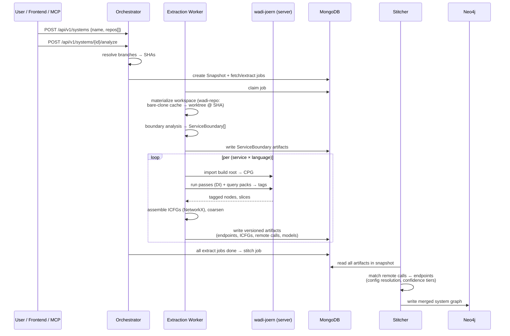
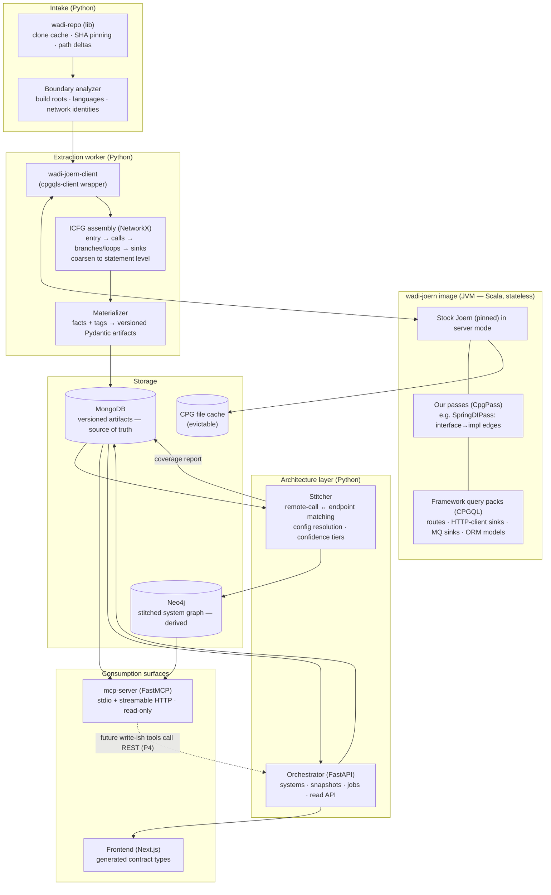

# Wadi — Architecture Design

**Status:** Draft for review
**Date:** 2026-07-20 · **Last revised:** 2026-07-31
**Scope:** The complete architectural backbone of wadi — a polyglot microservice static-analysis platform built on Joern. This document records every structural decision *and its rationale* (including rejected alternatives) so each choice can be reviewed and revised before implementation begins.
**Companions:** [`joern-migration-architecture.md`](./joern-migration-architecture.md) — the original migration study that selected Joern and defined the analysis approach. Wadi adopts its analysis design (query packs, ICFG assembly, stitching, MCP) but is **clean-slate**: no legacy data contracts, no legacy consumers. · [`architecture-views.md`](./architecture-views.md) — the visual layer: system context, the full service-connectivity map (every connection with protocol and direction), lifecycle state machines, the stitched-graph schema, deployment topologies, and end-to-end use cases traced against the components. This document stays the normative decision record; that one shows how the pieces connect and proves the layering serves the real scenarios.

---

## Table of Contents

1. [Overview & Goals](#1-overview--goals)
2. [Architectural Principles](#2-architectural-principles)
3. [Stack & Rationale](#3-stack--rationale)
4. [System Model: System / Snapshot / Service](#4-system-model-system--snapshot--service)
5. [Layer Architecture](#5-layer-architecture)
6. [Storage Architecture](#6-storage-architecture)
7. [Data Contracts](#7-data-contracts)
8. [MCP Server Design](#8-mcp-server-design)
9. [Repository Layout](#9-repository-layout)
10. [Extensibility Playbook](#10-extensibility-playbook)
11. [Roadmap](#11-roadmap)
12. [Risks & Mitigations](#12-risks--mitigations)
13. [Distribution & Deliverables](#13-distribution--deliverables)
14. [Consumption & Integration Surfaces](#14-consumption--integration-surfaces)
15. [CLI Design](#15-cli-design)
16. [Engineering Standards (Open-Source Grade)](#16-engineering-standards-open-source-grade)

---

## 1. Overview & Goals

Wadi statically analyzes an entire microservice system — polyglot, one repo or many — and materializes a queryable, ground-truth model of its architecture.

### Product goals

For any registered system:

1. **Endpoint inventory** — every REST endpoint of every service, with method, URI, parameters, auth requirements.
2. **Per-endpoint interprocedural control flow graph (ICFG)** — from the endpoint entry point through every call, branch, and loop down to the data layer (repository/ORM/driver calls).
3. **Outbound-communication detection** — HTTP/REST remote calls, message-queue publish/consume, and other inter-service mechanisms, with URLs/topics recovered via dataflow rather than regex heuristics.
4. **Cross-service stitching** — when service A calls service B, the graph branches into B's handler. Each endpoint's flow is complete across the whole system, including through message queues.
5. **Data-shape recovery** — what data each endpoint touches and the ORM model shapes persisted per service.
6. **LLM-consumable interface** — an MCP server exposing architecture-level tools, so coding agents query ground truth instead of fuzzy-searching source files (e.g., for test generation or auth analysis across services).
7. **Frontend** — a web UI to register systems, run analyses, browse services/endpoints, and inspect ICFGs and the system graph.
8. **Extensible by construction** — new languages, frameworks, analyses, and consumers are additive modules, not modifications to the core.
9. **Security-aware by default** — authorization and authentication are extracted *as part of* the core analysis, not as an afterthought: per-endpoint auth (annotations, security DSL, config) is a structured field on every endpoint, and the stitched graph supports cross-service auth-consistency analysis ("is enforcement maintained from upstream call to downstream handler?"). **Auth is pack-based like all framework knowledge — never Spring-shaped:** each ecosystem's auth idiom maps to the *same* structured auth output — Spring Security (annotations/DSL), FastAPI (`Depends`/`Security` dependencies), Django (`@login_required`/`@permission_required`, DRF `permission_classes`), Express/Node (middleware chains — order-dependent, so extracted with over-approximation + confidence markers) — landing with each language's phase (§11).

10. **The bird's-eye view for AI-authored code (recorded 2026-08-03).** The framing wadi targets: code is increasingly written by LLMs and decreasingly *read* by humans — the volume makes line-by-line review impractical, and the reading loop that used to catch misbehavior is breaking. Wadi's answer is a trustworthy high level: for every endpoint, everything it does — calls, branches, loops, auth, data — legible in seconds without opening the source. The developer reads the *map*, not the code; the map closes the gap the LLM era opened. This framing has a hard consequence recorded as a standing constraint: **the ICFG is the product's load-bearing claim, not plumbing.** A missing branch or loop is not a graph bug — it is wadi misrepresenting what an endpoint does to a user who, by design, will not double-check the source. Control-flow fidelity therefore ranks with P10 in prioritization decisions (Phase 2.6 is its enforcement), and every future analysis layer (data-flow, auth-consistency, MQ) states explicitly which CFG guarantees it assumes.

### What wadi is built on

[Joern](https://joern.io) (Apache-2.0) provides per-service **code property graphs** (AST + CFG + call graph + types + dataflow) via ~12 language frontends. Joern owns everything *inside* a single service's code; wadi owns everything *between* services — boundary discovery, identity, config resolution, stitching, storage, and the consumption surfaces. That division (established in the companion doc, §4) is the product's moat: the in-process analysis is commodity; the cross-service layer is the contribution.

---

## 2. Architectural Principles

These rules are the backbone. Every future module must satisfy them; every deviation should update this section first.

**P1 — Coupling only through contracts.** Services never import each other and never call each other except where explicitly documented (single-writer rule, P4). All inter-service communication happens through **versioned JSON artifacts in MongoDB** and the job collection. Shared code lives in `libs/*` packages only.

**P2 — Extract once, materialize, discard.** The CPG is a working set, not a product. The extraction worker walks it once, writes JSON artifacts, and the CPG becomes an evictable cache entry. Nothing downstream ever holds a connection to a graph engine (Joern) at query time.

**P3 — Topology erasure.** Whether a system is one monorepo or twenty repos is visible only to the intake layer. After service-boundary discovery, everything operates on *services within a snapshot* (§4).

**P4 — Single writer per data domain.** Every data domain has exactly one writing service, and every new domain gets exactly one owner. Current assignments: the orchestrator writes systems/snapshots/jobs (and owns the hint store, §11); the extraction worker writes per-service artifacts; the stitcher writes the Neo4j graph *and* the coverage-report collection (§5.4); `llm-resolver` writes its proposals collection (§5.6); future analysis services each own their new collection (§10). Readers go straight to storage via `wadi-storage`. Anything that needs to *cause* a write in another domain calls that domain's owner (e.g., a future MCP `analyze_system` tool calls the orchestrator's REST API).

**P5 — The Joern layer is stateless and disposable.** Stock, pinned Joern — **never forked**. All customization lives in Joern's designed extension points (CpgPass, CPGQL query packs, tags) compiled into a jar and baked into the `wadi-joern` image. Frontend gaps go upstream as PRs. Every CPG and every Joern container can be deleted; nothing is lost but recompute time.

**P6 — The extension decision rule.** For every new capability:
> *Does it need to see inside one service's code graph?* → **Scala** (pass or query pack in `joern-platform`).
> *Does it span services, configs, or already-extracted artifacts?* → **Python** (service or library).

Many features split across the rule: e.g., "resolve this REST call's URL" starts as a generic backward slice (Scala/CPGQL, in-graph) and finishes in config resolution (Python, cross-service). The graph side emits *facts with confidence markers*; the architecture side refines them.

**P7 — Symbolic truth, LLM judgment.** The graph layers make exhaustive, verifiable claims (endpoint inventories, ICFGs). LLMs are used only where statics structurally cannot answer (runtime-config URLs, ambiguous DI) and their outputs are marked low-confidence — never silently mixed into ground truth. Corollary: **the core pipeline requires no LLM** — extraction, tagging, ICFG assembly, and stitching are deterministic and run fully offline with no API keys; every LLM touch (gap resolution, method summaries, semantic labeling) is an optional enrichment activated only when a key is configured, and their absence degrades coverage, never correctness.

**P8 — Every framework pack ships with a conformance fixture.** A tiny sample repo plus expected-output JSON, diffed in CI. This is the required template for all catalog growth (§10). *Amended 2026-08-05 (§5.2.10):* a fixture must enumerate the **framework's** shape space, not the corpus's — and its goldens must assert the **absence of drops** (detected-site counts), not only the presence of expected facts. A presence-only golden can never fail on a shape its author did not imagine, which is how eight auth shapes and an entire reactive stack passed CI.

**P9 — Time and versioning.** Every stored artifact carries `schema_version`, its snapshot key, and timezone-aware UTC timestamps.

**P10 — Honest unknowns, durable human knowledge.** What wadi cannot see or determine is **materialized, never omitted**: inaccessible services become placeholder nodes stating why they're empty; runtime-undeterminable targets become explicit "target undetermined" facts. Every unknown is an invitation for a human to teach the system — and human corrections are **permanent assets**: stored per system (never per snapshot), re-anchored across runs via stable IDs (§7), provenance-marked, and never silently lost. The system's accuracy compounds with use; the accumulated knowledge layer is backed up alongside Tier 1 and included in exports.

---

## 3. Stack & Rationale

| Layer | Choice | Rationale (and rejected alternatives) |
|---|---|---|
| Graph engine | **Joern**, stock, version-pinned | Only multi-language CPG engine with native CFG/dataflow, permissive license, and server mode. *Rejected: CodeQL (license bars commercial use), Fraunhofer CPG (kept as fallback if a frontend disappoints), tree-sitter+custom (rebuilds Joern), Semgrep (no graphs).* See companion doc §3. |
| Joern extensions | **Scala** (sbt module → jar in `wadi-joern` image) | Not a choice — CpgPass and query packs are Scala by requirement. Kept minimal: tag + edge-add only. |
| Backend services | **Python 3.12+, FastAPI, Pydantic v2**; uv workspace; pyright strict; ruff; pytest | The two hardest modules sit on Python's strengths: the official Joern client (`cpgqls-client`) and NetworkX for graph algorithms (ICFG assembly, stitching, pattern matching). Ecosystem alignment: Privado rules, atom slices, research tooling are Python/Scala. Batch/CPU-bound workload shape fits Python workers. *Rejected: TypeScript core (hand-rolled CPGQL client + thin graph-algorithm ecosystem on the critical path); JVM core (weaker MCP/LLM tooling, slower research iteration); hybrid Python/TS backend (permanent two-toolchain tax for a small team — revisit if the team splits into analysis vs product owners).* |
| MCP server | **Official Python MCP SDK (FastMCP)** | First-class SDK; Pydantic models double as tool schemas; shares the Joern client for a future raw-query escape hatch. TS SDK's earlier access to brand-new protocol features is irrelevant for a stable tool set. |
| Frontend | **Next.js (App Router) + TypeScript** | User choice. Contract types are **generated** from Pydantic JSON Schema (§7) — single source of truth, no drift. |
| Artifact store | **MongoDB** | Versioned JSON documents per snapshot; source of truth. *Rejected for v1: Postgres/JSONB (fine choice, but the artifact shapes are deeply nested documents with no relational queries planned).* |
| System graph | **Neo4j** | Cross-service traversals and pattern queries in Cypher; fully derived from Mongo, rebuildable (§6). |
| CPG cache | Filesystem volume (object storage later) | Keyed `(service, language, content-hash)`; evictable (P5). |
| Jobs | **Mongo-backed job collection + polling workers** (v1) | Fewest moving parts. The queue is behind a `wadi-storage` interface; swap to Redis/arq or similar later without touching services. *Rejected for v1: Redis/Celery/RabbitMQ (extra infra before scale demands it).* |
| Repo intake | **`wadi-repo` library** (git CLI under the hood) | Clone/fetch/checkout, bare-clone cache, SHA resolution, path-delta computation. *Rejected for v1: a standalone repo-manager service — becomes worthwhile only with GitHub App auth, org-wide listing, or webhooks; the library boundary makes that split mechanical later.* |

---

## 4. System Model: System / Snapshot / Service

Target systems may live in a single monorepo or across many repos. Wadi unifies both with three deliberately decoupled concepts:

| Concept | Definition | Cardinality |
|---|---|---|
| **System** | A registered analysis target: `{name, repos: [{url, branch, credRef}]}`. The **only** place repo topology exists. | 1 repo (monorepo) or N repos |
| **Snapshot** | One analysis run's frozen commit-set: each repo's branch resolved to an exact SHA at kickoff (`{repo → sha}`). All artifacts, ICFGs, and stitching are keyed by snapshot — this is what makes cross-service stitching consistent (never mixing service A @ Monday with service B @ Friday). | many per system |
| **Service** | The unit Joern analyzes. **Discovered, not declared**: the boundary analyzer scans the fetched workspace for build roots (Maven/Gradle modules, `package.json`, `pyproject.toml`, docker-compose entries, k8s manifests) and network identities (hostnames, ports, env). | monorepo → many per repo; multi-repo → 1+ per repo |

### Intake & analysis workflow



### Properties worth noting

- **Topology erasure (P3):** after boundary analysis, nothing downstream knows how many repos existed. Extraction, storage, stitching, MCP, and frontend all operate on `(snapshot, service)`.
- **Incremental rebuilds:** `wadi-repo` computes changed paths between two snapshots of the same repo; changed paths map to service build roots; only changed services get CPG rebuilds. Unchanged services' artifacts are copied forward to the new snapshot (cheap document writes, no re-analysis).
- **Polyglot services:** a service with two languages yields one CPG *per language* (Joern has no in-engine polyglot graph — by design). Their facts unify in the artifact layer; cross-language flow inside one service is treated like any other boundary the stitcher can learn to cross later.
- **Workspaces are disposable:** a shared volume of checkouts, rebuildable from the bare-clone cache; the cache itself is rebuildable from origin.
- **Boundary overrides (P10, one layer earlier than hints):** discovery is heuristic and *everything downstream keys on it* — so boundaries are teachable exactly like stitching is. A repo-committed **`.wadi/services.yml`** (and a `services:` override on `System`) can force-split, force-merge, rename, or exclude paths; merged at intake, provenance-marked, shared via git like hints. Scheduling: the **minimal API-only `services:` override ships in Phase 3** (insurance before TrainTicket — the first repo where discovery will realistically misfire); the full teachable `.wadi/services.yml` version lands in Phase 4 (§11). The hints system covers stitching mistakes; this covers the layer beneath them.
- **Snapshots are the history mechanism.** Snapshots are immutable and accumulate per system (§7 forbids in-place rewrites), so "browse previous runs" is a snapshot picker over existing data, and cross-run comparison ("what changed between commit A's run and commit B's run") is a future feature over existing artifacts — no new storage concepts. Likewise, multiple registered Systems *are* the multi-project story. Neither needs backend changes beyond frontend/API surface (scheduled Phase 4, §11).

---

## 5. Layer Architecture

> The diagram below shows the *conceptual layers*. For the **runtime service-connectivity map** — every component and connection labeled with protocol and direction, plus deployment topologies and use-case traces — see [`architecture-views.md`](./architecture-views.md).



### 5.1 `joern-platform` (Scala — the in-graph layer)

Everything that must see inside a single service's code graph (P6):

- **Passes (`CpgPass`)** mutate the graph. First: **SpringDIPass** — resolves `@Autowired`/constructor-injected interface dependencies to implementations (EXACT / `@Primary` / `@Qualifier` / AMBIGUOUS strategy) and adds interface→impl call edges, so every downstream traversal transparently crosses DI boundaries. Without it, endpoint→data-layer walks dead-end at service interfaces.
- **Query packs (CPGQL)** find and **tag** nodes: `endpoint=GET /orders`, `sink=db`, `sink=http-client`, `sink=mq:kafka`, `model=Order`. Tags persist in the CPG; the worker collects tags rather than re-detecting. Packs are small (tens of declarative lines per framework) and per **language × framework**: Spring routes/stereotypes, RestTemplate/WebClient/Feign sinks, JPA/Mongo models, and **Spring Security** (`@PreAuthorize`/`@Secured`/`@RolesAllowed`, `SecurityConfig` DSL rule chains — real graph queries replacing the predecessor's regex over `SecurityConfig.java` — and token-propagation sites: does a call site forward the `Authorization` header / use a Feign interceptor) first; FastAPI/Flask, Express, SQLAlchemy, Kafka/Rabbit clients later. Seeded from Privado's OSS rule packs and Code2DFD's technology catalog.
- **Bulk subgraph export:** a small command in our jar dumps each endpoint-reachable subgraph (nodes, edges, tags) as JSON to the **shared workspace volume** (§13 topology constraint — already shared), which the worker reads directly. The cpgqls query channel is for *control* (run pass/pack, small queries) — never bulk graph transfer, the query server's known weak spot. P6 untouched: same division of labor, different wire. **Validated in week one of Phase 1** (§11) — it's on the critical path of everything. **Export schema 2.0.0 (Phase 2):** a sink site emits **one row per sliced candidate value** (multi-path slices, §5.2 step 4), each row carrying the inner call id, slice-evidence text, and token-propagation marker; endpoints carry declared params and raw `auth=` tag evidence; SecurityFilterChain rules and `@Value` config-key references travel in their own top-level sections because those facts live outside the endpoint-reachable closure. *Rejected: staging these as several minor bumps — multi-candidate rows break the "one row per site" reading assumption, which is semantically breaking however it is versioned, and both sides live in one repo and move lockstep.*
- **Conformance fixtures** (P8): each pack ships a tiny sample repo + expected JSON.
- **Docker image:** stock pinned Joern + our jar, run in server mode. One long-lived container in dev; horizontally scalable later since it's stateless (P5).

### 5.2 Extraction worker (Python)

The pipeline owner: claims jobs, materializes the workspace, runs boundary analysis, then per (service × language):

1. Build (or cache-hit) the CPG via `wadi-joern-client` — for Java, after a **delombok preprocessing step** (Lombok-generated constructors/getters don't exist in source and would dead-end DI and dataflow, §12).
2. Run passes and applicable packs; collect tags and requested slices. Bulk graph data arrives via the export file on the shared volume (§5.1), not the query channel.
3. **Assemble per-endpoint ICFGs** in NetworkX: start at each endpoint-tagged method, walk the DI-augmented call graph, stitch per-method CFGs, terminate at tagged sinks; coarsen expression-level CFG to statement granularity; mark branch/loop/call node kinds, remote calls, MQ publishes, and data-layer sinks with confidence markers.
4. Run backward slices for URL/topic argument reconstruction (through variables, fields, `String.format`, config keys) — dataflow replaces regex heuristics. Slices follow **all paths**: a call whose target depends on a condition (branch calls service X or Y) or on a multi-valued variable yields the full set of candidate values — one remote-call fact per candidate, each attached to its branch in the ICFG. For an architecture map this over-approximation is the *correct* answer (both X and Y are real dependencies), not a precision loss. Targets that are genuinely runtime-only (e.g., hostname from a DB row) degrade gracefully: the call is still a first-class fact with whatever shape is known (e.g., path only), matched at HEURISTIC confidence or left unmatched — never silently dropped, never falsely resolved (P7).
5. **Merge auth enforcement** into each endpoint's structured auth field. Every construct that can gate a request — security annotations, filter-chain rules, chain bypasses, interceptors, servlet filters, aspects, in-handler checks — becomes one enforcement record carrying its effect, resolution and active state, sourced from in-graph tags and the config analyzer (application.yml — the same component that feeds the stitcher's phone book). The claim is derived only when every in-scope enforcement was read; one opaque enforcement withholds it. The model, the coverage matrix, and the measured defects it replaced are recorded in **§5.2.9**.
6. Write versioned artifacts to Mongo (sole writer of its domain, P4).

**§5.2.4 URL slicer — Phase 2 implementation decisions (recorded, binding):**

- **The slicer is a bounded recursive evaluator** (`wadi.slicing.UrlSlicer`) over the AST plus structural assignment lookup — literals, string concatenation (cross-product of candidates), `String.format`, locals, fields (including constructor-lowered member initializers), `@Value("${key}")` config keys, and the Lombok getter bridge. *Rejected: `reachableBy`-driven slicing — flow paths are not reconstructed values; value rebuilding is structural work either way, and engine cost on pathological graphs is unpredictable.* Locals/fields with several assignments yield **one candidate per assignment** (§5.2 over-approximation), each capped at HIGH because the reaching definition is unproven — reaching-def precision (the OssDataFlow overlay) is a recorded future refinement; nothing consumes the DDG yet, so extraction does not pay its cost.
- **Config keys stay symbolic:** `@Value("${key}")` renders as a `${key}` template variable at HIGH confidence — the *stitcher* resolves it against the caller's extracted config facts (P6 split); the exporter also emits every `@Value` field CPG-wide as a `config_refs` row with anchor and context.
- **Confidence per candidate:** EXACT (all literal, single path) > HIGH (via config key / single-assignment field; benign holes allowed) > HEURISTIC (non-benign hole, budget truncation, multi-assignment fan-out) > NONE (nothing recovered — e.g. a URL from a DB row). A `{?}` hole that occupies one complete path segment is **benign** — it aligns with the endpoint identity form and never lowers confidence; a hole in the authority always does.
- **Interprocedural return resolution:** a call into an in-CPG body (DI-resolved implementations included) resolves its return expression with the call-site arguments bound to the parameters — hop-budgeted (default 2) and cycle-guarded; resolution through a hop caps at HIGH. **Constant-map lookups:** `map.get(k)` resolves when every visible `put` on that local map is literal→literal and `k` evaluates to one literal (the TrainTicket service-registry idiom — where the map, not the URL path, is the ground truth); any non-constant put poisons the map and the lookup stays an honest hole. *Rejected: over-approximating an unknown key to all map values — a 38-entry registry would explode the candidate set with mostly-false edges.*
- **Gateway discovery locator (§5.4.1):** `spring.cloud.gateway.discovery.locator.enabled` is extracted as a boundary fact; the phone book resolves `/{service-name}/**` through a locator-enabled gateway by treating the first path segment as the target's discovery name (stripped before endpoint matching). Explicit routes win over the locator; an unknown locator name becomes a config-known placeholder — the gateway config itself declares it as a target.
- **Budgets, floor, honesty:** depth/candidates/visited/wall-clock budgets; truncation marks candidates HEURISTIC with a note in the evidence. The Phase-1 literal/concat recovery stays as the floor — results are never worse than before. The slicer never throws and never returns nothing; every candidate carries a human-readable trace, and Lombok-blocked resolutions carry the exact marker (`lombok-generated interior`) the coverage report counts (recorded user decision: exact anchors + getter bridge; run-delombok revisited only if coverage data shows real losses).
- **Fixture inventory:** `spring-petstore-mini` stays frozen as the Phase 1 regression baseline (assertions upgrade when the slicer legitimately improves an answer); **`petstore-system`** is the Phase 2 two-service fixture — compose + application.yml identities aligned with the caller URLs, exercising config-key slicing, branch-dependent multi-candidates, the DB-row NONE trap, and (M5) the security pack, which it doubles as the P8 fixture for.

**§5.2.5 Slicer corrections — Tranche 1 (recorded 2026-08-01, binding):**

The TrainTicket/CIMET cross-validation exposed that the slicer's budget model and two honesty rules were wrong. Decisions:

- **Depth measures indirection, not expression size.** A `+`-concat chain is flattened and charged **one** depth level regardless of operand count; depth is spent on the hops that carry analytical risk — local/field assignment lookups, interprocedural returns, map lookups. *Rejected: the uniform per-AST-level charge (Phase 2 as-shipped) — Java's left-associative `+` made a five-operand URL burn four levels before any real work, starving the interprocedural + constant-map stages; on TrainTicket this manifested as 21 resolvable calls (long concats or chained locals, e.g. `drawbackMoney`'s five-operand URL) reported undetermined while the identical idiom with ≤3 operands resolved.*
- **A budget-starved resolution must say so.** Truncation propagates through every composition point — in particular, a constant-map lookup whose *key* resolution was truncated reports `slice-budget-truncated`, not "key is not a single constant" (which was factually false: the key was a literal), and the fabricated hole carries the truncated flag so confidence caps at HEURISTIC. *Rejected: treating starved holes as benign path-segment holes — they shipped at HIGH and were indistinguishable from honest unknowns, which is how the bug survived every run since the Phase 2 commit (P10 violation).*
- **Member lookup is owner-scoped.** `resolveMember` matches field assignments within the owning `TypeDecl` (falling back to the declaring type of the access), never CPG-global by field name. *Rejected: global name matching (Phase 2 as-shipped) — two classes with a field named `url` conflated into a false multi-assignment fan-out.*
- **Verb recovery follows the value, not just the name:** `exchange`/`execute` read a literal `HttpMethod.X` field-access argument (any position — the overloads move it); `headForHeaders` → HEAD, `optionsForAllow` → OPTIONS join the name map; WebClient-family verbs come from the fluent chain root (`.get()`/`.post()`/…/`.method(HttpMethod.X)`). A dynamic verb (`HttpMethod.valueOf(expr)`, unresolvable `.method(x)`) stays `null` — an honest unknown, never a guess (P10). Verb presence upgrades stitcher path-tier confidence to EXACT (§5.4), so this is a precision fix, not cosmetics.
- **WebClient sinks anchor on the URI-bearing step.** The fluent chain's `.uri(...)` call (receiver `WebClient$…UriSpec`) is the sink; the chain root supplies the verb; `mechanism` is `webclient`. *Rejected: tagging the chain root (Phase 2 as-shipped) — `.get()` carries no URL argument, so every WebClient sink exported `value=null` and was mislabeled `resttemplate`.*
- **Sinks never vanish silently.** An HTTP-shaped call whose receiver type javasrc2cpg could not resolve is exported as a **suspected sink** fact (`unresolved-receiver-type`) — countable, never blended into resolved results (P7). Sinks in methods outside the reachable closure (endpoints ∪ async roots since T4, §5.4.2) are exported as an **unreachable-sink inventory** (site + URL best-effort), not dropped: dead code is excluded from the architecture map *by design*, but the exclusion itself is a queryable fact — it is also exactly what cross-tool comparisons (CIMET counts dead call sites) need to reconcile counts.

### 5.3 Orchestrator (FastAPI)

Owns systems, snapshots, and jobs (sole writer); exposes the REST API — mounted at `/api/v1` from the first endpoint (§14) — consumed by the frontend, the CLI, and third-party integrations (`/api/v1/systems`, `/api/v1/snapshots/{id}/services`, `/api/v1/services/{id}/endpoints`, `/api/v1/endpoints/{id}/icfg`, …). Also serves **source-on-demand**: `GET /api/v1/snapshots/{id}/source?file&lines` reads the text **that was actually analyzed** — the exact pinned-SHA text from the bare-clone cache for untouched files, and the **delombok'ed variant** for Lombok-touched files (stored alongside the workspace; the response flags `variant: "generated"` so the UI badges it). This is forced by the guarantee itself: anchors are extracted from the analyzed text, so serving the original for preprocessed files would misalign every line. *Rejected: line-mapping back to originals — delombok emits no source maps; permanent fragile machinery to preserve a guarantee it would still break.* Where no source access exists (federated boundary-only bundles), the endpoint says so explicitly (P10). Pure I/O coordination — no analysis logic.

### 5.4 Stitcher (Python)

The novel layer — no engine can do this, because a CPG is per-program and cross-service flow is an *architecture* fact requiring config knowledge:

1. Reads all artifacts in one snapshot: endpoint tables, remote calls and MQ interactions with sliced URLs/topics + confidence, plus config resolution inputs (application.yml service names, compose hostnames, discovery names, gateway route prefixes).
2. Matches remote calls to target endpoints via confidence tiers — EXACT / HIGH / HEURISTIC / NONE; the fuzzy tier is a fallback, not load-bearing, because dataflow-recovered URLs are far better than regex-recovered ones.
   - **Target classification:** every resolved call lands on one of three node kinds — an **analyzed service** (full interior), an **external API** (address matches no known service's network identity — e.g., `api.stripe.com`; a real dependency edge to a node with no interior), or a **placeholder service** (config-resolved name with no analyzed service behind it — the system has services wadi wasn't given). Placeholders make partial coverage honest and double as a "grant access to these repos" to-do list; registering the missing repo later upgrades the placeholder to a full service on the next snapshot with no rework.
   - **Provenance on every edge**, alongside confidence: machine-proven / config-resolved / heuristic / LLM-guessed (P7) / human-asserted (stitching hints, below).
3. Writes the merged graph to Neo4j:
   - **Sync REST:** `(:RemoteCall)-[:INVOKES_REMOTE {url, confidence, mechanism}]->(:Endpoint)` **plus a return edge** — traversals walk into service B's flow and back, like an inlined call.
   - **Async MQ:** `(:Producer)-[:PUBLISHES]->(:Topic)-[:CONSUMED_BY]->(:Handler)` — **deliberately no return edge**; async fan-out is not a call, and pattern inference depends on the distinction.
   - Cross-service **cycles** are fine (graph edges, never tree inlining); fan-out depth is bounded per query, not per graph.
4. Emits a snapshot-level **coverage report** (its own collection — the stitcher is that domain's single writer, P4): counts and listings of placeholder services, external APIs, unresolved/low-confidence calls, and applied/stale hints. Every consumer (frontend, MCP, CLI) surfaces this *first* — the user always sees what the map knows it doesn't know (P10) before trusting what it claims.
5. Later: architectural pattern/anti-pattern inference (gateway, saga, event-driven, shared-DB, cyclic dependency) as Cypher queries over this graph.

**Phase 2 implementation decisions (recorded, binding):**

- **Config-analyzer split (P2/P6):** the worker parses config sources (compose, application.yml) at extraction time into `NetworkIdentity` facts on the boundary artifact; the stitcher builds its phone book from artifacts only and never touches source. The parser is worker-local until a second consumer exists. *Rejected: a shared config lib (single consumer today); stitcher-side parsing (violates P2).*
- **Phone-book precedence:** compose hostname → application/discovery name → gateway route (longest prefix, strip, re-resolve; depth-capped at 4; indirection caps resolution tier at HIGH) → port-only heuristic (HEURISTIC tier, never load-bearing). Conflicts are never picked-from: every claimant becomes a candidate (one edge each at HEURISTIC) and the conflict lands in the coverage report. Cross-namespace shadowing resolves by precedence but is still reported. *Rejected: name-first ordering (a discovery name would shadow the network authority that demonstrably routes the call); flat merged namespace (loses the "why did this resolve" evidence).*
- **One `Confidence` enum, composed:** edge confidence = min(U url-recovery, R resolution, P path/verb). R: direct unambiguous hit = EXACT, gateway indirection or port disagreement = HIGH, ambiguity/port-only/bare-hostname = HEURISTIC. P: verb agrees + literal/template segments = EXACT, path exact but verb unknown = HIGH, a call-side `{?}` absorbing an endpoint literal = HEURISTIC (the endpoint's own `{?}` absorbing a call segment is what a template means — still EXACT). NONE exists only as UNDETERMINED edges; a "matched" edge can never be NONE. Provenance stays a single orthogonal value (P7): any heuristic step → `heuristic`; phone book consulted → `config-resolved`; no config involved (literal external address) → `machine-proven`.
- **Every call fact yields ≥1 edge (P10):** UNDETERMINED is an edge row plus a coverage entry with a machine-readable `reason_code` — accepted limitations are queryable, never just prose. The vocabulary is a versioned registry in `wadi-contracts` (like the tag vocabulary): `url-undetermined`, `url-unparseable`, `no-endpoint-match`, `lombok-generated-interior`, `slice-budget-truncated`, plus config-fact notes (`config-multi-doc-partial`, `config-profile-files-skipped`) carried on the boundary artifact. `host-unresolvable` is **removed** — documented since Phase 2 but never emitted; unresolved hosts classify as external/placeholder nodes, which is the better answer (recorded correction, Tranche 1). `unresolved-receiver-type` is **removed** in 1.16.0 for the same reason, found by the §7 liveness rule: nothing ever emitted it, because an unresolved-receiver call is a **suspected sink** — carried by `RemoteCall.suspected` and counted by `CoverageTotals.suspected_call_sites`, which the stitcher deliberately excludes from `call_sites`. Emitting it as a reason code too would double-represent the same sites across two populations and break that reconciliation; a suspected sink is a call fact carrying a doubt, an unresolved entry is a resolution that failed. The name stays in this section as prose for the mechanism. A host that resolves to an analyzed service whose endpoints don't match stays UNDETERMINED with evidence (never fabricate an endpoint). Bare unresolved single-label hostnames become HEURISTIC placeholders (they land on the grant-access to-do list); dotted/IP hosts become external nodes. `${key}` template URLs resolve against the *caller's* extracted config facts before parsing.
- **Stitched edges are Tier-1 Mongo artifacts** (`stitched_edges`, stitcher single-writer, P4) written *before* Neo4j; the graph is a pure derived view rebuilt by delete-by-snapshot + batched idempotent writes (§6 rebuildability). Snapshot partitioning: a `snapshot_id` property on every node with composite uniqueness constraints (Community edition has one database; label-per-snapshot is unindexable). The return edge (`RETURNS_TO`) exists **only toward analyzed targets** — external/placeholder nodes have no interior to walk back out of. MQ node labels are reserved; their writers land with the Phase 3 packs. *Rejected: Neo4j-only edges (puts truth in the derived store, breaks Tier-2 evictability).*
- **Failure semantics:** a stitcher crash fails the stitch job and the snapshot — an empty graph served as truth is worse than an absent one (§12). The lifecycle table's "partial failure still completes" applies to *analytical* gaps (placeholders, undetermined facts), not process crashes. Recovery: lease-based auto-retry plus an explicit restitch operation (orchestrator-created job over the stored artifacts — never re-extraction); both converge because every write path is replace-by-snapshot.
- **Hint-readiness:** the matcher consults a `HintProvider` before mechanism rules (null in Phase 2); a hit short-circuits with `human-asserted` provenance. Edge ids are content-derived (`hash(remote_call_id, target key)`), placeholder ids derive from the logical name alone — both stable across snapshots so Phase 4 hints and upgrades re-anchor by join.

**§5.2.6 Analysis-unit construction — the source-union model (recorded 2026-08-02, binding).**

The upstream-TrainTicket benchmark exposed a class beneath every extraction gap: the analysis unit was literally `checkout/<build_root>` handed to javasrc2cpg with no sibling sources, no type aids, and no exclusions — so an in-repo shared module (`ts-common`, imported by 41/42 services) left every shared type unresolvable, which broke DI signature matching and dropped 29 real HTTP calls out of the endpoint closure. Corpus survey (train-ticket ×2, yas, plus FTGO/petclinic/Sock-Shop/Online-Boutique from literature) sized the whole class. Decisions:

- **Module graph + classification are boundary facts.** Discovery parses each Maven leaf module's coordinates and `<dependencies>` (pure XML, nothing executed) into an in-repo module graph, and classifies every module: **service** (Spring Boot main / controllers / compose identity), **library** (depended on by an in-repo module, no service markers — e.g. `ts-common`, yas `common-library`, yas `payment-paypal` "service-shaped plugin"), or **noise** (no analyzable sources / archived trees). Libraries and noise are not analyzed as services; the classification is recorded on the boundary artifact, never silent.
- **Staged transitive source union.** A service's parse input is a staged directory: its own build root at the stage root (service-relative anchors and content-derived ids stay byte-identical), plus the sources of its transitive in-repo **library** dependencies under `.wadi-libs/<artifact>/`. Shared types resolve as first-class source; delombok covers the union for free (its scope is the frontend's inputPath); library code never contributes endpoints (classification guarantees no controllers) and `.wadi-libs/` sinks are excluded from the service's unreachable inventory (they would duplicate across every dependent — the library's own facts belong to whichever service reaches them). *Rejected: whole-repo union CPG — cross-service class-name collisions corrupt call targets and endpoint attribution (CodeQL documents the same failure), and re-parse cost is paid on every service.* Service→service module dependencies (FTGO `*-api` idiom, yas `payment`→`payment-paypal`) stage the dependency's sources the same way without merging service identities.
- **`--fetch-dependencies` is REJECTED, permanently.** Verified in Joern source: the Maven path shells out to `mvn` (POM-declared repositories and `.mvn/extensions.xml` core extensions execute) and the Gradle path evaluates build scripts via the Tooling API — arbitrary code execution on untrusted repos, network-nondeterministic. The recorded substitute (tracked, not yet built): coursier-resolved jars from declaratively-parsed coordinates, fetched in a gated cache-warm step, fed to `--inference-jar-paths` (jar *metadata* only — nothing from the jar executes or enters the CPG). Delombok remains the model for the pinned-tool exception; project build plugins and annotation processors are never run.
- **Resolution resilience for what union cannot see** (external jars, cross-repo shapes): `SpringDIPass` normalizes short-name vs FQN renderings and falls back to name+arity matching when exact signatures fail against unresolved types — every such edge carries a distinct `wadi-di` tag so downstream confidence degrades honestly; the interface→abstract-base→impl hierarchy resolves transitively, preferring body-carrying implementations (a DI edge onto a bodiless stub dead-ends the closure BFS — the exact mechanism that turned a resolution miss into vanished calls). The same short-name normalization applies to `UrlSlicer`'s owner-scoped member lookup. *Rejected: keeping exact-string matching — SpringDIPass was the only pass without the short-name fallback every sibling pass already carries.*
- **Discovery hygiene.** The frontend is passed exclusion patterns: `src/test` trees (test code is not production topology; it previously entered every CPG unremarked) and known shadow/archive trees (`old-docs/`, `.evosuite-work/`-style duplicated source shadows that silently duplicate every class in the CPG). Exclusions are recorded as boundary notes.
- **Per-service failure isolation.** One unparseable module no longer fails the snapshot: the service's boundary records `extraction-failed` with the error as a queryable fact (P10), and the remaining services analyze. A snapshot with zero successful services still fails.

**§5.2.7 Provider-side endpoint contract recovery (recorded 2026-08-02, binding; Phase 2.5 M5).**

Every endpoint carries a **field-level request/response shape** recovered from the in-CPG type structure — `response_type: Pet` becomes "returns `{id, display_name, stock: {available, price}, …}`". Decisions:

- **The shape model** is a small recursive contract (`TypeShape`): `kind` ∈ `object` (fields walked) · `scalar` (JDK value types — primitives, `String`, numbers, temporal types, `UUID`, `BigDecimal`) · `array` (element shape) · `map` (value shape) · `cycle` (a type already on the walk path — named, never expanded: self-referencing DTOs terminate) · `truncated` (depth cap reached, honest) · `unresolved` (the type is not in the CPG — **name only, never fabricated fields**, P10). Fields carry the **serialized name** (Jackson `@JsonProperty` renames applied; the Java name kept alongside) and `@JsonIgnore`d fields are omitted — the recovered shape is the *wire* contract, not the class layout.
- **Wrapper unwrapping** (recorded list): `ResponseEntity<T>`, `Optional<T>`, `Mono<T>`, `Flux<T>` (→ array), `CompletableFuture<T>`, `HttpEntity<T>` unwrap to `T`; `List/Set/Collection/Iterable<T>` → array; `Map<K,V>` → map of `V`; `T[]` → array.
- **Generics come from the declared source text**, not `typeFullName` — javasrc2cpg erases generic arguments in type names, but the declaration text (`ResponseEntity<List<PetDetails>>`) preserves them; the walker parses the text structurally and resolves simple names against in-CPG `TypeDecl`s with the §5.2.6 short-name fallback. *Rejected: typeFullName-only (erasure loses every element type); a bytecode-level signature reader (no bytecode exists — source-only parsing is the §12 premise).*
- **Termination:** depth cap 6 + a visited-set cycle guard per walk; both produce explicit `truncated`/`cycle` nodes rather than silence. Lombok DTOs work through delombok's type fidelity (fields are hand-written source); staged library DTOs (`wadi-libs/`, §5.2.6) resolve as first-class shapes.
- **Scope:** provider side only — what THIS endpoint accepts (`@RequestBody`) and returns. Consumer-side `sends[]`/`reads[]` stays in Phase 5 (it exists for breaking-change attribution, §11). Serialization config beyond field-level Jackson basics (`@JsonInclude`, views, custom serializers) is recorded as a refinement — shapes are structural truth, not a wire-format simulator.

*Amended 2026-08-05 (binding; Phase 2.9.2 T1) — the declared return type is not the only evidence of a response shape.* Measured on `train-ticket-aitest` (snapshot `snap_6a4eecbe…`, 365 endpoints, schema 1.18.0): **274 of 365 response shapes (75%) terminated at `unresolved`, and every single one of them was `org.springframework.http.HttpEntity`.** The corpus declares a raw `HttpEntity` return **376 times against 9 generic ones**, so the wrapper-unwrapping rule above — which requires a type argument to unwrap (`UnwrapOne.contains(simple) && raw.args.nonEmpty`) — has nothing to unwrap, and the walk falls through to a framework type that is not in the CPG. The signature genuinely carries no payload, so the earlier reading ("not recoverable") was right about the *signature* and wrong about the *method*: the return expression carries it, and in one uniform shape — **263 of the 274 are `return ok(expr)` and 7 are `return new ResponseEntity<>(expr, status)`**. Decisions:

- **When the declared return type is a wrapper carrying no type argument, the payload is recovered from the return expression** — `ok(expr)`, `ResponseEntity.ok(expr)`, `new ResponseEntity<>(expr, …)`, and a bare `expr`. The declared type remains the primary evidence and is consulted first; recovery is a strictly narrower fallback that can never override a declared generic.
- **The expression's type is read as declared source text, not `typeFullName`** — the generics rule above, applied one hop further. A call resolves through its *callee's* declaration text, which preserves `Response<ArrayList<Order>>` where erasure would leave a bare `Response`; an identifier resolves through its local or field declaration.
- **Disagreement is an honest unknown.** If a handler's return statements resolve to different types the shape stays `unresolved` — recovery never elects a winner among return paths. Likewise `return ok()` with no argument, and any expression whose type is not in the CPG (P10).
- **Recovered shapes are marked.** `TypeShape` gains `origin` ∈ `declared` · `return-expression`. *Rejected: emitting recovered shapes indistinguishably from declared ones* — the shape is still symbolic truth, but it rests on a weaker premise (one return path standing for the whole contract), and P7's line between what a program *declares* and what analysis *infers* is exactly what the marker keeps legible.
- *Rejected: widening `UnwrapOne` to unwrap raw wrappers to their first type parameter* — a raw `HttpEntity` has no type parameter; there is nothing to widen to. *Rejected: accepting the idiom as unsupportable and leaving 75% of the corpus unresolved* — the payload is recoverable by construction from a single-statement pattern covering 270 of 274 cases, and a response shape absent on three endpoints in four makes goal 10's "read the map, not the code" claim hollow on any corpus written this way.

*Amended again 2026-08-05 (binding; T8) — recovering the ENVELOPE is not recovering the response.* The amendment above resolved the handler's return type and stopped there, which on this corpus meant stopping one field short of the answer: **291 of 365 endpoints published `{status, msg, data}` with `data` an unbound `T`** — a shape that names the wrapper and withholds the only field a reader wants. Every terminal in the corpus's entire shape forest was one of two things: 291 x `unresolved T` and 11 x `unresolved HttpEntity`. Zero endpoints showed a business payload. Decisions:

- **A type argument absent from every signature is read from the producer's return statement.** TrainTicket declares the service method that builds the envelope as a RAW `Response`, so no signature anywhere names `T`; `return new Response<>(1, "ok", payments)` does. The binding is positional against the all-args constructor and is taken **only** when the construction's arity matches the field count — any other shape makes the field-to-argument mapping a guess, and a guessed payload type is worse than an honest `T`.
- **The producer is the implementation, reached through the DI edge.** The interface declaration carries the type NAME and the implementation carries the type ARGUMENT, so resolving against the declared callee alone finds nothing.
- **The argument's type comes from its declaration text, not `typeFullName`.** javasrc2cpg erases `payments` to `java.util.List`; the local's `code` keeps `List<InsidePayment>`. The same rule this section already rests on, applied one hop deeper.
- **A `null` payload is an absence, not a disagreement.** Every TrainTicket service pairs `new Response<>(1, "ok", value)` with `new Response<>(0, "failed", null)`. Treating the second as a competing claim would withhold the type the first states plainly, so nulls are skipped — while two non-null constructions that genuinely disagree still yield nothing. This mirrors T4's rule that a literal in the headers position is definitely-not-headers: a literal settles a question rather than opening one.
- **Binding runs on the DECLARED path too, not only on recovery.** `ResponseEntity<Response>` HAS a type argument, so it never took the recovery path — while the `Response` inside it is as raw as any recovered one. Binding only where recovery fired left those endpoints showing `data: T` while a handler one line different resolved fully. A declared ARGUMENT (`Response<Order>`) is preferred over the producer when present: the strongest evidence first, as the rest of this section does. Positional binding beyond one type parameter is refused — javasrc2cpg materializes no TYPE_PARAMETER nodes for these classes, so with two there is no order to map onto.
- **A field every construction sets to `null` is EMPTY, not unknown.** `always-null` is its own terminal. TrainTicket writes whole services this way — `InsidePaymentServiceImpl.pay` returns `new Response<>(_, _, null)` on all five paths — and reporting that as `unresolved` claims an analysis failure about code that states plainly it sends no payload. A reader acts differently on the two, which is the whole test for whether a distinction earns a vocabulary entry.
- **Measured: `data` answered on 0 -> 213 of 291 envelopes (73%)** — 121 object, 31 array, 31 always-null, 27 scalar, 3 map; 78 remain unresolved. The three figures along the way (54% -> 62% -> 73%) each came from a case found by opening an endpoint the aggregate had already declared fine. *The remainder is neither all recoverable nor all understood.* One category is verified: **proxy handlers** (`getAllContacts` calls `ts-contacts-service` and returns `re.getBody()`) construct no envelope at all, so the payload type genuinely lives across a service boundary and `unresolved` is the correct answer from inside one CPG. That subset is a natural candidate for the *stitcher*, which already knows the remote endpoint's own response shape. The other 131 have not been individually characterized, and this sentence exists so that gap is not mistaken for a measurement.


**§5.2.7 T9 — declared HTTP statuses (recorded 2026-08-05, binding).**

Which statuses an endpoint answers with is a contract fact a reader asks for immediately, and nothing carried it. Decisions:

- **`Endpoint.declared_statuses`, named for what it is.** These are the statuses the handler's own code NAMES. A 500 from an uncaught exception, a 403 from the security layer, a 404 from the dispatcher — none appear in handler source, so none appear here. The field name and its description both say `declared` because an unqualified `status_codes: [200]` would let a reader conclude an endpoint cannot fail, which is a stronger claim than the evidence supports and the exact inversion P10 exists to prevent.
- **Three read paths, each marked.** `builder` (the `ResponseEntity` method's own name fixes it — `noContent()` is 204), `explicit` (a constant the code names), `annotation` (`@ResponseStatus`). The origin travels with the code so a reader can tell a status the program chose from one a helper implied.
- **`@ResponseStatus` REPLACES rather than joins.** A handler annotated `@ResponseStatus(ACCEPTED)` whose body ends in `ok(...)` answers 202; publishing the builder's 200 beside it would name a status the framework never sends.
- **A chain's status comes from `status(X)`, not from what follows it.** `status(X).body(y)` nests, so a walk that kept descending would find `body` and report nothing, or find a builder deeper in and report the wrong code.
- **`default` is claimed only where the status is NOT under program control.** A handler returning `String`/`boolean`/a DTO is serialized by Spring with 200 — a framework rule, not a guess, marked `default` so it never reads as declared. Where the return type IS a `ResponseEntity` family type and no status could be read, nothing is emitted: there, 200 would be a guess dressed as a rule. *Rejected: leaving those 60 handlers empty* — 50 return a bare `String` and answer 200 exactly as the `ok(...)` handlers beside them do, so an empty list made an identical outcome look like an unknown.
- **Measured on train-ticket-aitest: 365/365 endpoints carry at least one status** — 200 x 349, 201 x 15, 202 x 1; by origin, builder 287, default 60, explicit 17, annotation 1. The 15 x 201 and 1 x 202 match the corpus source exactly (15 `HttpStatus.CREATED`, one `@ResponseStatus`). A poor status vocabulary, which is why the extraction had to cover the builders rather than only explicit constants — reading constants alone would have found 16 of 365.


**§5.2.8 Control-flow construct matrix (recorded 2026-08-03, binding; Phase 2.6 M1).**

The empirical record of what javasrc2cpg emits per Java control construct and what the §5.1 statement coarsening keeps — surveyed BEFORE any fix, per the T4 method. Instrument: the `control-flow-matrix` fixture (one compilable + runnable Spring Boot module, one handler per construct — it also serves the M3 bytecode oracle and M4 dynamic traces) driven by `ConstructSurveyTest`, which dumps raw CONTROL_STRUCTURE/JUMP_TARGET/CFG structure next to the exported coarse graph (`target/construct-survey/survey.md`).

*Survey findings (pre-fix, export 2.4.0):*

| Construct | javasrc2cpg emits | Coarsening kept (pre-fix) | Verdict |
|---|---|---|---|
| `if`/`else`, `else-if` chain | `IF` (+ `ELSE`), condition child | `branch` + cond; `true`/`false` labels when both arms exist | sound; **without `else` the join edge is `flow`, not `false`** |
| ternary `?:` | `<operator>.conditional` CALL, no CONTROL_STRUCTURE | folded into enclosing statement — invisible | deliberate (expression-level; see non-modelling) |
| short-circuit `&&`/`\|\|` | two nested condition CALLs, expression-level branch | one `branch`, compound condition text | deliberate (expression-level); M3 whitelist entry |
| classic `switch` | `SWITCH` + `JUMP_TARGET` per case (`0`/`"start"`/`SMALL`/`default`), `BREAK` leaves | bare `statement` w/ selector cond exported (assembler dropped it); unlabeled `flow` edge per case body; **phantom `switch→join` edge even with `default`**; case values invisible | **fix: switch node kind + labeled case edges** |
| `switch` fallthrough | case body's CFG successor is the next JUMP_TARGET | body→`JUMP_TARGET`→(enclosing=SWITCH) projects as **body→switch — a cycle indistinguishable from a loop** | **fix: fallthrough edge to next case body** |
| arrow `switch` / `yield` | `MATCH` (leaf, not in container set) sits in *expression position* — its AST parent is the `return`/assignment, never a block | **interior deleted entirely** — `return switch(n){…}` is one edge-less node; interior calls survive only as the statement's `call` attachment | **fix: MATCH joins the container set (un-suppresses block-bodied `yield` arm interiors); the carrier statement is marked `switch-arrow` with the selector as condition. Expression arms (`case 0 -> "zero"`) stay expression-level like ternary — a statement graph cannot host expression-position nodes** |
| `for`/`while` | `FOR`/`WHILE`, condition child | `loop` + cond; body/exit successors both `flow`; back-edge present as `flow` | **fix: labeled body/exit + back-edge marking** |
| enhanced-`for` | **`WHILE` with code `FOR`** (iterator lowering: `iterator()`/`next()` calls, `$iterLocal` temps, `<empty>` code texts) | `loop`, but condition text is the raw header and lowering artifacts leak (`<empty>` node, `iterator()` callee under source text) | **fix: foreach construct subtype, header as condition, suppress lowering artifacts** |
| `do-while` | `DO`, condition child | `loop` node, but **entry edge bypasses it** (body executes first — correct semantics, surprising shape) | keep semantics, mark construct `do-while` so consumers know the header is not the entry |
| nested loops | two `FOR`s | correct nesting, inner-exit→outer as `flow` | sound minus labels |
| labeled `break`/`continue` | `BREAK`/`CONTINUE` + a line-less `JUMP_TARGET` for the label; the JUMP_TARGET's CFG successor re-enters at the labeled statement's start (incl. a `for`'s init — upstream approximation) | **jump edges LOST** (label target has no enclosing statement → edge dropped); the jump statement dangles and exit-patching wires it to `exit` — wrong for `continue` | **fix: transitive projection through statement-less CFG nodes restores the edge; the re-entry-at-init approximation is inherited from javasrc2cpg and recorded, not corrected** |
| empty-body `while` | condition's only CFG successor is the exit — **no back-edge in the raw CFG** (upstream gap) | no self-loop | recorded limitation: statement-level self-loops are unrepresentable — every loop's condition-internal expression chain projects to `(L, L)`, so preserving self-edges would stamp a false back-edge on EVERY loop; empty-body loops therefore carry no back-edge, and the M2 `loop-no-back-edge` invariant records an accepted suppression for loops with empty interiors |
| `try`/`catch`/`finally` | `TRY`+`CATCH`(+`FINALLY`) control structures; **catch reached via a CFG edge from the try's last statement** (javasrc2cpg's implicit-exception approximation) | catch/finally interiors DO survive (CATCH/FINALLY never become statements, so the leaf-suppression fear was unfounded); `try` node exported edge-less (orphan → fake entry); **the try-tail→catch edge projects as plain `flow`, producing impossible `return→return` edges**; finally sequencing present via projection | **fix: `exception` edge kind for try-tail→handler; try/catch/finally construct subtypes; containment legible** |
| multi-catch, try-with-resources | same as try/catch; no `close()` desugaring in CPG | same as try/catch | M3 whitelist entries (bytecode duplicates finally/close paths) |
| `throw` | `THROW` control structure → METHOD_RETURN | bare `statement`; **interior call suppressed — a sink inside `throw` produces no sink row**; no edge to exit (patched) | **fix: throw construct subtype + interior call/sink attachment + edge to exit** |
| sink in branch/loop condition | condition is a CALL child of the control structure | `classify` returns no `CallInfo` for any ControlStructure — **no sink row, no RemoteCall, no closure widening** (the icfg.py marker-on-branch contract case the exporter could never produce) | **fix: `primaryCallOf` over the condition subtree** |
| `synchronized` | no CONTROL_STRUCTURE at all; body wrapped in BLOCKs | **body statements survive but ALL their edges route through BLOCK nodes with no enclosing statement — dropped**; orphaned nodes | **fix: BLOCK-transparent projection** |
| lambdas / stream pipelines | pipeline is one statement; lambda bodies are separate `<lambda>N` methods bound via METHOD_REF (line −1 on the REF) | pipeline = one `call` node; lambda CFGs exported as their own methods (closure via T4 METHOD_REF traversal) | deliberate: stream-internal iteration is not modelled as a loop (see non-modelling) |
| empty method body | METHOD_RETURN only | 0-node CFG (assembler synthesizes `entry→exit`) | sound |
| `line_end` | `lineNumberEnd` available on control structures | **`line_end` always equals `line`** (exporter writes start twice) | **fix: real extents** |

Bycatch (non-CFG, found by the survey, tracked for fix): `new Object()` in a constructor resolves through the DI hierarchy-leaf fallback to an arbitrary internal class's `<init>` (`MiscController.<init>` → `ConditionalController.<init>` observed) — `java.lang.Object` construction must never DI-resolve.

*Decision — the enriched vocabulary (export 2.5.0, contracts 1.8.0, additive):* every CFG node gains `construct_kind` (the discriminator a consumer needs to read the map — named `construct_kind` because pydantic reserves `construct`: `if`, `switch`, `switch-arrow`, `for`, `foreach`, `while`, `do-while`, `try`, `catch`, `finally`, `throw`, `break`, `continue`, `goto`; exact strings pinned by the conformance goldens — `synchronized` is NOT markable, javasrc2cpg emits no control structure for it, only the block-transparency fix applies); a `switch` is a **`branch` node** whose selector is its condition, exporting one **labeled case edge per arm** (`case` + the case values — stacked labels share one edge — and `default`), fallthrough as an explicit `fallthrough` edge to the next case body (never the body→switch cycle the projection used to fabricate), and the phantom switch→join edge is removed when a `default` arm exists (infeasible); loops emit `true` (body) / `false` (exit) like IF plus a **`back` flag** on cycle-closing edges (for/while/foreach: interior→loop; do-while: loop→interior re-entry); `if` without `else` emits an explicit `false` join edge, and multi-entry arms label every arm-entry edge, not just the first; the try-tail→handler linkage exports as an **`exception` edge** into the CATCH node (containers TRY/CATCH/FINALLY become graph nodes routing their interiors, so containment is legible); an explicit `throw` does NOT link to a handler — the survey found javasrc2cpg **drops the catch parameter entirely** (no Local, no type, the CATCH subtree is `catch` + body; verified on `catch (IllegalArgumentException e)`), so typed matching is impossible upstream and an untyped guess would mislead the map (P10: the throw's construct + its exit flow are honest; handler linkage is demand-deferred until the parameter surfaces in the CPG); the projection walks **transitively through CFG nodes with no enclosing statement** (BLOCKs, JUMP_TARGETs — the synchronized and labeled-jump fix); `line_end` is the real subtree extent. Sinks inside conditions, `throw`s, and `for`-headers attach to their statement — `primaryCallOf` considers exactly the calls whose nearest enclosing statement is the node itself, so container bodies never double-claim (sink rows + closure widening restored). *Rejected: keeping the 5-kind vocabulary and "fixing bugs only" — the product goal (§2 goal 10) is a map read INSTEAD of the source; a graph that cannot say "this is a switch on order status with 4 cases" fails that goal even when structurally sound. Rejected: modelling ternary/short-circuit as statement-level branches — they are expression-level; inflating the statement graph with sub-expression nodes trades legibility for a fidelity the bytecode oracle can account for instead. Rejected: statement-level self-loop preservation (see the empty-body row).*

*Deliberate non-modelling (the trust boundary's "does not guarantee" side, finalized at M5):* implicit exception edges beyond the try-tail linkage javasrc2cpg provides (any-statement-may-throw is sound but destroys legibility — every try statement would edge to every handler); path feasibility (edges over-approximate; a statically infeasible path may exist in the graph); expression-level control flow (ternary, short-circuit evaluation order) — present in conditions' text, not as nodes; stream-pipeline internal iteration (the pipeline is one statement; lambda bodies are their own methods reached via T4); `synchronized` blocking semantics (the construct is marked, lock contention is not control flow).

*The trust boundary (Phase 2.6 exit criterion — what every Phase 3+ layer may assume, and what it must not).* The ICFG **guarantees**: statement-level structure for every enumerated construct with its `construct_kind` discriminator; labeled branch outcomes (`true`/`false` on if and loops, `case`/`default`/`fallthrough` with case values on switches, `exception` into catch handlers, `back` on cycle-closing loop edges) **including the arm that leaves the method** — an arm with no successor statement edges to the method's exit rather than going silent (T3); sinks attached wherever their call site sits (conditions, throws, for-headers included); per-construct shapes pinned as goldens (P8, CI-gated); structural invariants checked on EVERY assembled snapshot with violations queryable as `cfg_anomalies` (never silent); bytecode-oracle agreement on the matrix fixture (0 unexplained divergences, phantom-branch and missed-loop directions never whitelisted); and dynamic trace inclusion on the fixture (every JVM-executed handler line maps to a node; every both-ways-executed branch sits on a node the graph renders as branching). The ICFG **deliberately does not guarantee**: path feasibility (edges over-approximate — a statically infeasible path may exist in the graph); implicit exception edges beyond the try-tail→handler linkage (any-statement-may-throw is not modelled); typed throw→handler linkage (javasrc2cpg drops the catch parameter — upstream); expression-level control flow as nodes (ternary, short-circuit order — visible in condition text and accounted by the oracle whitelist); statement-level self-loops (empty-body loops carry no back edge); **distinct labels on a convergent branch** (an `if` whose only arm is empty reaches the same successor either way — one statement-level edge, labeled `flow`, T3); stream-pipeline internal iteration (one statement; lambda bodies are their own methods via T4); call-site context sensitivity (a method inlines once per ICFG — paths through a shared helper merge); and `synchronized` blocking semantics. Layers building on the graph (data-flow, auth-consistency, MQ) cite this boundary, not folklore.

*M4 dynamic-layer attribution artifacts (measured):* JaCoCo attributes some executed instructions to lines that hold no source statement — loop-closing braces (the jump machinery), fluent-chain continuation lines (a multi-line `.stream().filter(…)` chain executes across lines javasrc2cpg places on the chain's first line; lambda-body lines execute as their own `<lambda>N` methods per the trust boundary), switch-expression closers, and `synchronized`'s monitorenter/monitorexit lines (the construct is recorded non-modelled). The trace-inclusion check excludes exactly these classes, classified structurally from the source text (brace-only lines, `.`-led continuations, `synchronized` headers) — never a hand-kept line list. Everything else executed must map to a node.

*M3 bytecode-oracle whitelist (enumerated up front, then MEASURED — javac 21, `--release 21`):* the oracle (`BytecodeOracleTest`, ASM over the compiled matrix fixture, counts pinned in `expected/cfg/bytecode-oracle.json`) compared 29 handler methods: **25 exact, 4 whitelisted divergences, 0 unexplained.** The surviving whitelist: short-circuit `&&`/`||` (4 bytecode branches vs 2 source conditions); ternary (1 bytecode branch, 0 statement-level); switch-on-string (double dispatch: 2 switch instructions + `equals` branches vs 1 graph switch); `yield`-form arrow switch (inner ternary + lowering). Predicted entries that measured EXACT and were pruned: enhanced-`for` (the iterator `hasNext` is the loop's one condition on both sides), try-with-resources (no extra conditional jumps under `--release 21`), labeled jumps (backward `goto`s are not conditional), lambda bodies (the handler itself is 0/0 — lambdas are separate methods on both sides, matching the CPG's `<lambda>N` shape); `finally` duplication added no conditions in the matrix shapes. Standing guarantees the oracle enforces beyond the whitelist: the graph never claims MORE decision points than the bytecode (phantom-branch FP direction, never whitelisted), and bytecode back-jumps imply graph loop nodes (loop FN direction). `assert` and string-concat shapes join the matrix when a fixture exercises them.

*Degenerate constructs (T3, recorded 2026-08-03, binding; follow-through on what the always-on invariants found).* The M2 `cfg_anomalies` layer did the job it was built for: on train-ticket-aitest it flagged 9 violations across 22 services, and triage split them into three shapes the matrix fixture had never contained — because a fixture author writes constructs that *do something*. Each was probed into a new `DegenerateController` and measured against a real CPG **before** any fix (the T4 method), and all three turned out to be defects rather than invariant noise.

| Shape | Measured export (pre-fix) | Defect |
|---|---|---|
| `if (c) { } else { B }` — arm written only to say nothing happens (`//do nothing`) | `branch→B` = `false`, `branch→join` = **`flow`** | the true arm's edge lost its label |
| `if (c) { A } else { }` | `branch→A` = `true`, `branch→join` = **`flow`** | the false arm's edge lost its label |
| `if (c) { }`, no `else` | ONE edge `branch→join` = `false` | true and false converge — one statement-level edge cannot carry both labels |
| `if`/`for` as the method's LAST statement | `branch→body` = `true` and **nothing else** | the untaken arm has no successor statement to reach, and the export has no exit node |
| `try { /* commented out */ } catch (e) { … }` | `try→catch` = **`flow`**, and the statement after the try is **orphaned** | a handler path presented as normal flow; the normal path absent entirely |

Root causes, all distinct: (1) `labelIfEdges` claimed each arm's edges by that arm's *statement ids*, so an arm holding no statements claimed nothing and its join edge fell through to the default `flow`; (2) an arm whose control leaves the method has no representable target in an exit-free export, and the assembler's exit patch could not repair it because it keys on *has-any-out-edge* — a branch with one arm looks connected; (3) a TRY's interior entry was the minimum-line statement of its whole subtree, which for an empty body is the CATCH, so the container wired itself to its own handler and the body's normal completion was never emitted.

- **Decision — label an arm edge by the set of arms that reach it, not by statement containment.** A target in one arm's statements takes that arm's label; the residual (join) edge takes the label of whichever arm is *empty*; when both arms are empty-or-absent the residual is genuinely both paths and stays `flow`.
- **Decision — the assembler completes branch arity against the synthetic exit it already owns.** A branch or loop missing a required arm label, and holding no unlabeled `flow` edge that could serve as that arm, gains an arm-labeled edge to `m{id}:exit`: the graph then says *"on false, the method returns"* instead of going silent. A node whose successors are **all** `exception` gains a `flow` edge to exit for the same reason — normal completion left the method. Empty-body loops are untouched: fabricating a `true` body edge to exit would assert a body that does not exist.
- **Decision — a TRY's interior entry is its body block's first statement, never a handler.** An empty body routes normal completion to the try's next sibling statement, and the handler edge is `exception`. This also hardens the non-empty case, which worked only because the body happened to hold the lowest line number.
- **Decision — `branch-arity` is reformulated to the defect it can still catch.** Once the assembler completes missing arms, a *missing* arm is no longer evidence of anything; an **unlabeled arm edge out of a branch** is, and so is a construct with no successors at all. The check covers loops on the same terms — a loop's arm labels were never checked at all — and the unlabeled case gets its own code (`unlabeled-arm`) so the two failures stay countable apart. Fall-to-exit stops being reported because it is no longer an anomaly: it is a shape the assembled graph carries correctly.

- **Decision — a control structure's CONDITION is not statement position (recorded 2026-08-05, binding).** Found by running the invariants on a production repository: `new X()` inside a **short-circuited** operand of `&&`/`||` is lowered by javasrc2cpg into a block holding `$obj = new X()`, whose children satisfy the only test `isStatementPosition` can make locally — their AST parent is a BLOCK. Admitting them put a node in **neither arm** on the branch's successor list, which `labelIfEdges` classifies by arm-interior membership. With an `else`, no heuristic applied and the edge stayed `flow` — surfacing honestly as `unlabeled-arm`. **Without an `else`, `falseEmpty` is true and the empty-arm heuristic stamped the condition-lowering edge `false`: the graph grew a SECOND `false` successor that does not exist, and the invariants reported clean.** Silently wrong is the worse half and the common one — `if (x != null && x.f(new Y()))` is an idiomatic guard clause; the two sites found in the reported repository were one of each, and the silent one was an authorization guard in a `@PostMapping` handler, i.e. the fiction was on an endpoint's ICFG. Decision: a candidate reached through a control structure's `condition` child is condition interior, not a statement — a condition is an expression, so nothing inside one is a statement. The lowering collapses into the enclosing construct, whose resulting self-edge is dropped as an already-recorded non-representable, so the condition's evaluation cost stops being drawn as control flow. MATCH shields its interior exactly as it does in `hasLeafStatementAncestor` (an expression-position switch still holds real yield-arm statements). *Measured before the change: the pinned matrix fixture held **244 statement candidates and zero condition-interior ones** — the shape was absent because a fixture author writes cheap conditions (`n > 0 && n % 3 == 0`), the same blind spot T3 recorded as "a fixture author writes constructs that DO something". After: all 29 pre-existing goldens byte-identical, three new goldens pinned (with-else, no-else, `||`), the ASM oracle at 45 methods / 0 unexplained with the three new entries whitelisted under the existing `short-circuit` class in the safe direction (the graph claims FEWER decision points than the bytecode, never more).* *Rejected: labelling the condition edge with a new `condition` edge kind — it would put expression evaluation in the statement graph as first-class control flow, inflating the map with lowering the reader never wrote; rejected: excluding only inside `&&`/`||` — the admission rule is wrong for any condition interior, and narrowing it to the operator would leave the same bug reachable by another expression shape.*

- **Decision — the bytecode oracle fails on stale classes (recorded 2026-08-05).** Adding the three handlers above exposed it: `compiledFixtureAvailable` checked only that `target/classes` exists, so the oracle compared bytecode compiled two days earlier, reported "0 unexplained divergences" over the OLD method set, and the new handlers were invisible to it. A check that passes while covering nothing is the failure class this whole tranche is about (§7). The oracle now compares the newest mtime under the fixture source against the newest under `target/classes` and fails loudly when source is newer. *Rejected: compiling the fixture from the test — it would hide the staleness rather than report it, and the build step belongs to the build.*
- *Rejected: treating the trailing-arm case as an invariant false positive.* This was the working hypothesis going in — `check_cfg` runs pre-patch by design, so a missing arm looked like the check firing before the exit node existed. Reading the patch loop falsified it: `has_outgoing` is satisfied by the arm that *is* present, so the assembled ICFG genuinely lacks the false path. Had the hypothesis been acted on, the fix would have been to silence a correct alarm.
- *Rejected: emitting a synthetic exit node in the export.* Method boundaries are the assembler's domain — the export is deliberately exit-free so the same CFG can be inlined into many ICFGs — and adding one would have duplicated entry/exit patching on both sides of the contract.
- *Rejected: labeling the convergent no-else arm `false` (the pre-fix behavior).* That edge is also the true path; naming one arm on an edge that carries both is the kind of quiet lie P10 exists to prevent. `flow` says exactly what is true — control continues here either way — and the convergence joins the recorded non-representables.
- *Rejected: retiring `branch-arity` now that its firings are explained.* The invariant found all of this; the answer to an invariant that fires on known-good shapes is a sharper predicate, not one less standing check.

Export 2.6.0 carries these label corrections together with T5's `unbound_reason` field (§5.4.2) — the labels are a semantics change within an unchanged vocabulary, so no consumer contract moves.

*Measured on re-analysis (train-ticket-aitest, 22 services, 2026-08-03):* **`branch-arity` 6 → 0**; every one was an empty arm or an arm that ends its method, and `ts-auth-service /api/v1/auth` now carries the `false`-labeled edge into its method exit that the graph previously had no way to state. **`disconnected-node` holds at 3**, all in `FoodDeliveryInitData.run` — one `try` whose body is entirely commented out. The fix reaches the part of that shape it was built for (the handler is an `exception` path, not normal flow), but two cases in it remain open and are deliberately left counted rather than quietly suppressed: the try is its method's **last** statement, so there is no next sibling for normal completion to reach and nothing routes the *preceding* statement into the container; and the handler's 2nd and 3rd statements are themselves disconnected, which is unexplained — the hypothesis (javasrc2cpg builds no intra-handler CFG when the guarded body is empty) is **not yet measured**, and synthesizing block-order edges to paper over it would mean inventing control flow the CPG never asserted. The standing invariant is the tracking mechanism; this stays visible in `cfg_anomalies` until someone measures it.

**§5.2.9 Auth enforcement model + Spring coverage matrix (recorded 2026-08-04, binding; Phase 2.9).**

Goal 9 makes structured auth core analysis, and §12 makes *wrong* security facts worse than absent ones. Measured against the live `train-ticket` snapshot (262 endpoints / 42 services) and `yas`, step 5's three-source merge was violating both — not from bugs alone but from a structural mismatch: it looked in three places while Spring Boot lets a product enforce auth in a dozen, and it treated "found no evidence" as license to claim. The audit (T4 method — survey, record, fix, measure) found nine defects, two of them claim-corrupting:

- **Verb leakage.** The rule verb came from a regex over `matcher.code`, which in a fluent chain spans the whole receiver expression — so the first `HttpMethod.X` in a chain stamped every later rule. `ts-travel-service` (`PUT /trips → DELETE /trips/* → /** permitAll → anyRequest().authenticated()`) resolved only its first rule; its other **12 endpoints reported unknown**. This produced most of the 48 system-wide unknowns (18%).
- **Non-literal patterns dropped the rule entirely.** `.antMatchers(HttpMethod.POST, order)` with a constant pattern vanished, so `POST /api/v1/orderservice/order` fell through to a later `permitAll()` and was published as **"no authentication (evidenced)"** for an endpoint requiring `ROLE_ADMIN`/`ROLE_USER`. A dropped rule does not degrade to unknown — it manufactures a confident wrong answer.
- Plus: partial roles silent (`hasAnyRole(admin, "USER")` → `["USER"]`); mechanism never identified (hardcoded `"spring-security"` while all 39 train-ticket services use `addFilterBefore(new JWTFilter(), …)` and 15 yas modules use `oauth2ResourceServer().jwt()`); **config-defined authorization invisible** (yas binds `@ConfigurationProperties(prefix="app.security")` and loops over the bound rules — not one literal pattern in the Java, so nothing but the `anyRequest()` catch-all was extracted); annotation-family enablement unchecked (`@EnableMethodSecurity` decides whether `@PreAuthorize` is enforced at all, and Spring Security 6 defaults `securedEnabled`/`jsr250Enabled` to **false**); no inheritance or meta-annotation walk; incomplete matcher/access vocabulary; and non-Spring-Security enforcement (interceptors, servlet filters, aspects, in-handler checks) entirely unseen.

All nine survived CI for the M6 marker-bug reason: the only security fixture (`petstore-system`) uses the plain modern lambda DSL, with no verb-scoped matcher, no constant pattern, and no mechanism. Fixtures cover what their authors imagined.

**The decision — enforcement points, not evidence snippets.** The model no longer asks "what auth evidence did we find?", whose empty answer is a claim. It asks **"what could gate a request to this endpoint, and did we read all of it?"** Every gating construct — security annotation, filter-chain rule, chain bypass, interceptor, servlet filter, aspect, in-handler check, upstream gateway route — becomes one enforcement record carrying `effect`, `resolution` (`resolved`/`partial`/`opaque`) and `active`, *whether or not its effect could be determined*. The claim then follows a single rule, enforced as a contract validator rather than a worker convention:

> **`authenticated` is a claim only when every enforcement whose scope could cover this endpoint is fully resolved and active. One opaque in-scope enforcement ⇒ `authenticated = null`, with that enforcement attached saying why.**

*Sharpened during implementation (recorded 2026-08-04).* Stated that bluntly the rule costs sound answers, and the petstore fixture caught it on the first run: an unreadable `@PreAuthorize` sitting beside a chain rule that already demands `ADMIN` withheld a claim that was never in doubt. **Enforcement is a conjunction — an unread gate can only ADD a requirement, never remove one.** Opacity is therefore decisive in exactly two shapes, and the contract validator checks precisely those: `authenticated=false` ("we read everything and nothing guards this") is incompatible with *any* unread gate — the dangerous direction, and the one that produced the measured wrong answers — while `authenticated=true` survives an unread gate, with the single exception of an unread **chain bypass**, the one construct that removes enforcement and so could flip protected to open. *Rejected: withholding on any opacity at all* — it turns every partially-readable service into a wall of unknowns, which trains readers to ignore the state that is supposed to mean something.

*Also corrected here (same date).* The predecessor treated a method annotation demanding a role alongside a chain rule saying `permitAll()` as a **conflict**, and withheld. That misreads Spring: the filter chain and method security are layers that both run, so `permitAll()` means the chain does not block while `@PreAuthorize` still gates the invocation. They compose, and the endpoint genuinely requires the role — modelling two layers as competing discarded a sound answer on every endpoint that used both.

That one rule subsumes the dropped-pattern, config-defined, unknown-vocabulary and non-Spring-Security defects at once: each becomes a detected-but-unread enforcement that withholds the claim instead of falling through to a permissive rule. Detect broadly, interpret narrowly, never claim over a blind spot. The enforcement record **is** the existing `AuthEvidence` model extended — not a second list beside it.

- *Rejected: fixing the nine defects individually and keeping the evidence-only merge.* It repairs the two corpora and leaves the failure mode intact — the tenth idiom fails exactly the way the first nine did, silently and permissively. The defects are instances; the default-to-claim is the class.
- *Rejected: defaulting an unreadable rule to "requires auth" instead of withholding.* Safer-sounding, but it is still a fabricated fact, and it would make the unprotected-endpoint question unanswerable by burying real gaps under false positives. P10 says materialize the unknown, not pick a comfortable side.
- *Rejected: scoping coverage to idioms measured in train-ticket/yas.* Recorded directive (2026-08-04): wadi is not built against two sample systems. Measurement sets priority, never coverage — several idioms below measure zero in both corpora and are in scope because the next repo is not these two.
- *Rejected: a Spring-shaped `EndpointAuth`.* `effect`/`resolution`/`kind` are framework-neutral by construction, so a FastAPI `Security(...)` dependency, a Django `@permission_required` or an Express middleware maps onto the same record without reshaping the contract (goal 9). Spring vocabulary stays in the pack.

**Coverage matrix.** Same discipline as §5.4.2: every scenario is *handled*, *opaque-by-design* (detected, effect withheld — a first-class honest answer), or *tracked*. A scenario absent from this matrix is a gap in the matrix, not an accepted limitation. Counts are files/modules in the two benchmark corpora, recorded to show that presence-in-corpus did **not** decide inclusion.

| Enforcement site | Status | train-ticket | yas |
|---|---|---|---|
| `@PreAuthorize`/`@PostAuthorize`/`@Secured`, JSR-250 `@RolesAllowed`/`@PermitAll`/`@DenyAll` | handled | 0 | 0 |
| Custom composed meta-annotations (`@IsAdmin` → `@PreAuthorize`) | handled (transitive, visited-set) | 0 | 0 |
| Annotations on a parent class / implemented interface | handled (reuses the §5.2.6 transitive walk) | 0 | 0 |
| `@EnableMethodSecurity`/`@EnableGlobalMethodSecurity` family gating | handled — un-enabled families emit `active=false` + reason, never enforcement | 39 | 0 |
| Legacy `configure(HttpSecurity)` + `authorizeRequests`; modern `SecurityFilterChain` + `authorizeHttpRequests` | handled (both forms) | 39 | 15 |
| Matchers `antMatchers`/`mvcMatchers`/`requestMatchers`/`regexMatchers`/`anyRequest`; verb-scoped overloads | handled — **verb read from the argument, never from chain text** | 39 | 15 |
| Patterns: literal · constant · `String[]`/varargs · `${placeholder}` | handled (in-CPG resolution, shared with the Feign name resolver) | present | present |
| Pattern genuinely unresolvable | opaque-by-design — emitted as `{?}`, withholds the claim | — | — |
| Access calls incl. `fullyAuthenticated`/`anonymous`/`rememberMe`/`hasIpAddress`/`access(SpEL)` | handled; unknown names emit `effect=unknown` rather than nothing | 39 | 15 |
| Multiple chains with `securityMatcher`/`antMatcher` + `@Order` | handled (rules scoped per chain, never pooled) | 0 | 0 |
| `WebSecurity.ignoring()` / `WebSecurityCustomizer` bypass | handled as `chain-bypass` | 0 | 0 |
| `@ConfigurationProperties`-bound rules in `application.{yml,properties}` | handled — bound prefix correlated to the structured config tree; uncorrelatable ⇒ opaque | 0 | 15 |
| Mechanisms: `httpBasic`/`formLogin`/`rememberMe`/`x509`/`oauth2ResourceServer`(+`jwt`/`opaqueToken`)/`oauth2Login`/`saml2Login`/`sessionCreationPolicy`/`addFilter*` | handled; **`.disable()` honored** (else train-ticket reports basic auth on 39 services) | 39 | 15 |
| Custom filter → `jwt-bearer` | only on in-CPG JWT/`Bearer` evidence inside the filter class; classification by class *name* is rejected as fabrication | 39 | 0 |
| `HandlerInterceptor` + `addInterceptors` (`addPathPatterns`/`excludePathPatterns`) | detected, path-scoped; effect opaque unless unambiguous | 1 | 0 |
| `@WebFilter`/`FilterRegistrationBean`/`OncePerRequestFilter` | detected, path-scoped; effect opaque | 1 | 0 |
| `@Aspect` over controllers; manual in-handler token checks | detected; effect opaque | 3 + present | 0 |
| Upstream API-gateway enforcement | tracked — cross-service, belongs to the Phase 3 auth-consistency layer; detected and reported, never merged into the provider endpoint's claim | present | present |
| **Token-propagation detection** (does an outbound call forward the caller's token) | **tracked, deliberately not fixed here** | **0 / 157** | — |

*Found while building the matrix fixture (recorded 2026-08-04, belongs to endpoint extraction, not auth):* a handler whose **mapping annotation** is inherited from an implemented interface — `@GetMapping` on `AuditApi.trail()`, implemented by `AuditController` — is **not extracted as an endpoint at all**, because `SpringEndpointPass` reads only a `@RestController`'s own method annotations. The security-annotation walk above now crosses that boundary, but the endpoint walk does not, so the auth fix is invisible on such a route: there is no endpoint to carry it. This is the same inheritance class as D7 in a different pass, and it is tracked here rather than fixed in this phase because it changes the endpoint inventory (and therefore every published count) — the §5.4.2 T4 precedent says that lands alone. The matrix fixture keeps the two cases separate so an endpoint regression can never hide an auth one.

The token-propagation row is a recorded limitation, not an omission: `SpringTokenPropagationPass` looks for a literal `"Authorization"` string in the sink's enclosing method, but the prevailing idiom threads the inbound `@RequestHeader HttpHeaders` into `new HttpEntity(body, headers)` — so it fires on **0 of 157** train-ticket remote calls. The field is plumbed through to the UI in this phase; making it *true* is scheduled with the Phase 3 auth-consistency layer, which is its only consumer.

**Validation layers** (following the §5.2.8 precedent that fixtures alone are insufficient): the `spring-auth-matrix` fixture enumerates every row above with per-case pinned goldens; `AuthCoverageSection` on the coverage report counts claim states and opaque enforcements by kind on **every** snapshot, so blind spots stay queryable rather than prose; and the acceptance measurement is re-analysis of both corpora, where every surviving `null` must carry an opaque enforcement naming its cause — a silent unknown is a failed acceptance.

*Measured on re-analysis (train-ticket, 262 endpoints / 41 services, 2026-08-04):* **`null` 48 → 0**, and every previously-wrong claim corrected. The two endpoints the audit named both flipped: `POST /api/v1/orderservice/order` went from an evidenced **`false`** to `true` with roles `[ADMIN, USER]` — recovering the constant-pattern rule that had been dropped — and `DELETE /api/v1/travelservice/trips/{tripId}` from `null` to `true` with `[ADMIN]`, which the verb leak had cost. Both were checked line-by-line against their `SecurityConfig` chains rather than only against the previous run. Distribution moved 85/129/48 (true/false/null) → **111/151/0**; roles recovered rose from ADMIN 74 + USER 60 to **ADMIN 95 + USER 62**; and all 262 endpoints now carry mechanisms (`stateless-session` active, `custom-filter` active, `http-basic` **inactive** — the `httpBasic().disable()` that a naive reader would have reported as basic auth on 39 services). The JWT filter stays `custom-filter` rather than `jwt-bearer` because its promotion evidence lives in `JWTUtil`, not in the filter class itself — under-classified on purpose, since the alternative is naming a mechanism from a class name.

*Config-defined authorization, measured separately:* the yas snapshot could not be built (its git checkout carries a corrupt ref — `refs/heads/evosuit` has a null OID — which is a defect in that repo, not in wadi, and the intake error says so precisely). D5 was therefore verified against yas's **real `application.yaml` files** instead: all **15** modules' policies are recovered, including the `/backoffice/**` → `ADMIN` gating that was previously invisible in its entirety. The end-to-end path — Java loop with no literal patterns → bound prefix → parsed YAML → concrete rules — is additionally pinned on a real CPG by the matrix fixture's config-driven chain.

*Remaining zero is not proof of completeness.* train-ticket reaching 0 withheld means its idioms are all readable now, not that every idiom is; the `unread_by_kind` counter exists precisely so the first repo that uses one wadi cannot read shows up as a number rather than a silent `false`.

**§5.2.10 Auth extraction fidelity — the shape-robustness audit (recorded 2026-08-05, binding; Phase 2.9.1).**

§5.2.9 closes with the sentence *"remaining zero is not proof of completeness — the `unread_by_kind` counter exists precisely so the first repo that uses an idiom wadi cannot read shows up as a number rather than a silent `false`."* The first such repo arrived the next day, and the counter did not fire. This section records why the counter **structurally could not** fire, which is a deeper defect than any idiom it was meant to catch.

*The measurement.* `train-ticket-aitest` (365 endpoints / 20 services, snapshot `snap_3a3459c9…`, schema 1.15.0) published all **365 endpoints identically**: `authenticated=true, roles=[], authorities=[], denied=false, unread_kinds=[]`. Not one role, and — decisively — **not one withheld claim**. Every service declares its policy in `application.yml` (`security.authorization-rules`, with `ROLE_ADMIN` on the admin routes) and binds it with `@ConfigurationProperties`, exactly the D5 shape §5.2.9 claims to recover. The YAML parsed correctly and landed under the matching key; the Java-side rules never reached the export.

*The cause is not an idiom, it is a structural property.* Because the access verb is chosen by an `if/else`, config-driven code **must** park the `AuthorizedUrl` in a local variable:

```java
AuthorizeHttpRequestsConfigurer.AuthorizedUrl url;
url = authorize.requestMatchers(HttpMethod.valueOf(method), paths);   // ← a Call
...
url.hasAnyRole(roles);                                                // ← receiver is an Identifier
```

`SpringSecurityDslPass` resolves a rule's pattern from the access call's **immediate receiver**, accepted only when that receiver *is a call* (`collect { case receiver: Call => … }`). An `Identifier` receiver yields `None`, the traversal emits nothing, and the rule is **dropped — not marked `{?}`**. The file's own doc comment states the invariant this breaks ("a rule that cannot be read is emitted as `{?}`, never dropped"); that guard lives inside `patternsOf`, which is only reached *after* a matcher receiver has been found, so it cannot fire when the chain **shape** is what was unreadable. The endpoint then falls through to the chain's `anyRequest().authenticated()` and reads as a confident, fully-resolved claim. This is the §5.2.9 dropped-pattern failure mode re-entering through a door the fix did not cover.

*Why every validation layer missed it.* All three of §5.2.9's layers are structurally incapable of catching this class, which is the finding that matters:

1. **The fixture encodes the implementation.** `spring-auth-matrix/SecurityConfig.java` is pure Spring Security 5 (`httpBasic().disable()`, `authorizeRequests()`, `antMatchers`), and the config-driven chain is written *fluently* with *parameter*-injected properties — because that is yas's shape. A fixture authored beside the pass enumerates the shapes the pass handles. P8 makes a fixture mandatory; it cannot make it imaginative.
2. **`AuthCoverageSection` is emission-derived.** Its docstring names it the auth analogue of `cfg_anomalies`, but `cfg_anomalies` is computed in `cfg_invariants.py` over the **raw export, independently of what the passes claimed**, while every `AuthCoverageSection` counter (`withheld`, `unread_by_kind`, `no_evidence`) is derived from evidence that was *emitted*. A dropped construct contributes to none of them — it makes an endpoint look cleanly authenticated. **The blind-spot tracker is blind to the blind spot.**
3. **There is no auth oracle.** Control flow has four independent layers including the ASM bytecode oracle; auth has goldens plus emission-derived counters, and no independent ground truth.

*The contract permits the drop.* `ExportSecurityRule.pattern` is a **required `str`**, with `{?}` and `@prefix` smuggled in as sentinel values. To emit a sentinel the pass must already have got far enough to *construct a rule*, so "an access call exists at line 87 and produced nothing" has no representation. `ExportSink` — for the same job on the stitching side — carries `call_id` (site identity), `value: str | None` and a `value_confidence` ladder, so a failed slice **degrades a field and never erases the site**. Measured on a shape sweep, `UrlSlicer` follows assignments, helper returns and constant fields, and reports the un-sliceable case as `value: null, confidence: "none", evidence: "call has no argument to slice"`. **The correct pattern already exists in this repo, one directory away; the auth pass is the outlier.**

**The decision — a detected site is a record, always.** Detection and resolution are separated, and the split is enforced by the contract rather than by pass discipline:

> **Every construct the auth vocabulary detects emits exactly one record carrying its site identity, whether or not any of its facts could be resolved. Resolution failure degrades fields — `pattern: null` with `pattern_confidence`, roles unread, effect unknown — and never removes the site. A pass that cannot drop cannot regress.**

Five tranches implement it, sequenced so the structural guarantee lands before the coverage work it protects:

- **T1 — no-drop guarantee.** `ExportSecurityRule` takes the `ExportSink` shape (`call_id`, `pattern: str | None`, `pattern_confidence`); `SpringSecurityDslPass` emits one record per access-call site before attempting resolution; an export-time invariant asserts `count(access-call sites) == count(distinct call_id)`.
- **T2 — an independent auth oracle.** A second, deliberately dumb detector (a text scan over the service's sources, sharing no code path with the CPG) counts access/matcher/mechanism sites and diffs them against emitted records. Divergence is a per-snapshot anomaly surfaced in `AuthCoverageSection`. On `train-ticket-aitest` this would have shouted on the first run: ~100 access calls in source, 20 rules emitted.
- **T3 — shape robustness by dataflow, not syntax.** Receiver resolution follows assignments, ternaries and helper returns, reusing the slicer's machinery rather than growing a second one; `.disable()` is honoured in lambda and method-reference form; the `@ConfigurationProperties` prefix search covers class fields and constructor parameters.
- **T4 — config-shape robustness.** Scalar `method:` keys, permissive **string sentinels** in authority lists, and confidence degradation on unrecognized keys.
- **T6/T7 — vocabulary and meaning.** Reactive security (`ServerHttpSecurity`/`authorizeExchange`/`pathMatchers`/`anyExchange` — currently a total silent drop), CORS and CSRF exemptions as first-class facts, and **authority provenance**: where a role is minted (`jwtAuthenticationConverter`, `UserDetailsService`) and what it means (`RoleHierarchy`, `GrantedAuthorityDefaults`).

*Rejected: fixing the eight measured shapes and keeping the fused traversal.* This is the §5.2.9 rejection repeated one level up. The shapes are instances; **fusing detection with resolution is the class**, and the ninth shape would fail exactly as the first eight did — silently, permissively, and invisibly to every counter.

*Rejected: keeping `{?}` as the sole unknown and adding a shape for each new receiver form.* A sentinel inside a required field can only be produced by a code path that already succeeded structurally. The unknown must live at the **site**, not inside the value.

*Rejected: treating this as a Spring Security 6 migration.* It is tempting — the shapes that work are SS5 and the shapes that break are mandatory in SS6+ — but framing it as a version gap would license the same fused traversal with a longer vocabulary. Measured: `train-ticket-upstream` (SS5) hits 0/39 broken shapes, `train-ticket-aitest` (SS6) hits **20/20** on all three of lambda-form `.disable()`, `AuthorizedUrl`-in-a-variable and field-injected properties. That is priority evidence, not scope evidence (§5.2.9's standing directive: measurement sets priority, never coverage).

*Rejected: withholding on the whole service when any site is unemitted.* It would have been correct here and useless in general — one unreadable helper would black out a fully-readable config. The site record carries its own resolution; the claim rule in §5.2.9 already composes them.

**Shape matrix** (20 chain shapes + 1 reactive, each built through a real CPG; ✅ correct · ⚠️ honest but lossy, withholds · ❌ silently wrong):

| Axis | Shape | Before | After |
|---|---|---|---|
| Receiver | fluent `a.requestMatchers("/x").hasRole("R")` | ✅ | ✅ |
| Receiver | held in a local variable | ❌ dropped | ✅ |
| Receiver | ternary receiver | ❌ dropped | ✅ |
| Receiver | returned by a helper method | ❌ dropped | ✅ |
| Receiver | SS5 `.and()` chain | ✅ | ✅ |
| Mechanism | `httpBasic().disable()` | ✅ inactive | ✅ |
| Mechanism | `httpBasic(t -> t.disable())` | ❌ reported **active** | ✅ |
| Mechanism | `httpBasic(X::disable)` | ❌ reported **active** | ✅ |
| Pattern | constant field | ✅ | ✅ |
| Pattern | `@Value("${…}")` field | ⚠️ `{?}` | ✅ placeholder passthrough |
| Pattern | `RequestMatcher` bean | ✅ `{?}` | ✅ |
| Pattern | `List.of(…).toArray(…)` | ⚠️ `{?}` | ✅ |
| Properties | field-injected | ⚠️ `{?}` | ✅ `@prefix` |
| Properties | constructor-injected | ⚠️ `{?}` | ✅ `@prefix` |
| Properties | parameter-injected | ✅ `@prefix` | ✅ |
| Access | SpEL `access("hasRole('X')")` | ✅ | ✅ |
| Access | SS6 `access(AuthorizationManager…)` | ✅ | ✅ |
| Access | `hasAnyRole(rolesVar)` | ✅ partial | ✅ |
| Chain | no `anyRequest()` catch-all | ✅ | ✅ |
| Reactive | `pathMatchers(…)` / `anyExchange()` | ❌ **total drop** | ✅ |

**What a `SecurityConfig` declares** (measured over the 76 security-config files in `train-ticket-aitest`, `train-ticket-upstream` and `yas`), and where each lands:

| Declares | Uses | Disposition |
|---|---|---|
| Authorization rules (matcher → access) | 126 `antMatchers`, 88 `requestMatchers` | T1/T3 |
| Chain scoping and ordering (`securityMatcher`, `@Order`, N chains) | 35 chains | partial — `@Order` precedence and per-class scope pooling tracked below |
| Auth mechanisms (`httpBasic`, `oauth2ResourceServer`, …) | 61 + 15 | T3 |
| Custom filters (`addFilterBefore(new JWTFilter())`) | 59 | modelled |
| Session policy (`STATELESS`) | 59 | modelled |
| Method-security enablement, `WebSecurity.ignoring()` | 5 | modelled |
| **CORS** (`allowedOrigins`, `allowCredentials`) | **58** | T6 — the second most common construct in these files, entirely unmodelled |
| **CSRF** (`disable`, `ignoringRequestMatchers`) | 64 / 2 | T6 |
| **Identity & authority sources** (`jwtAuthenticationConverter`, `getClaim`, `SimpleGrantedAuthority`, `UserDetailsService`) | 14–16 | T7 |
| **Role semantics** (`RoleHierarchy`, `GrantedAuthorityDefaults`) | 0 measured | T7 — zero in both corpora and in scope anyway: one `GrantedAuthorityDefaults("")` bean silently invalidates the `ROLE_`-prefix role/authority split shipped in 0.6.0 |
| Exception handling (`authenticationEntryPoint`, `accessDeniedHandler`) | 0 measured | T6 |
| Headers (`cacheControl`, HSTS, frame options) | 58 | out of scope — no bearing on who may reach an endpoint |

**The mirror defect, found in review (recorded 2026-08-05).** T1–T7 close the direction where an unread rule is *dropped* and the endpoint falls through to a later `permitAll()` — claiming open when protected. Review found the same root shape pointing the other way, and it survived every tranche above because it lives in the claim rule rather than in extraction:

`_opacity_could_change_the_answer` escalated on an unread **chain bypass** only, on the §5.2.9 premise that *"enforcement is a conjunction — an unknown gate can add a requirement, never remove one."* That premise is true for **layered** enforcement, which is what it was written for: a filter chain and method security both run, so an unread annotation can only add to a chain rule. It is **false for ordered alternatives inside one chain.** `authorizeHttpRequests` is first-match-wins, so an earlier match means the later rules never execute — they are mutually exclusive, not conjunctive. An unread-scope `permitAll()` ahead of a readable `anyRequest().authenticated()` therefore leaves the endpoint genuinely uncertain between open and protected, and the check discounted it and published a confident `true`. A permissive effect and a chain bypass remove enforcement by different mechanisms; only the mechanism differed, so only the bypass was caught. **Opacity now escalates on `PERMIT_ALL` as well as `CHAIN_BYPASS`** — and the control case is pinned alongside it, because an unread *restrictive* rule really can only add restriction and must not withhold, or the fix becomes a wall of unknowns. *Measured: zero cost on `train-ticket-aitest`, whose rules all resolve after T3/T4 — the fix removes false positives without spending a single real answer.*

**Concatenated prefixes — two defects that compound (same review).** `@RequestMapping(PREFIX + "/api")` is the ordinary way a codebase writes a route once and reuses it, and it defeated two readers at the same time. The endpoint pass took the **first quoted string**, so the URI truncated to `/api` — worse than unresolved, because a truncated path collides with real routes from other controllers. The security pass could not read `requestMatchers(PREFIX + "/api/public/**")` at all, so the rule had no scope. They compound in the worst order: **you cannot tell which endpoints the public rule covers until the paths resolve**, so the auth defect is not even measurable while the URI defect stands. A shared `stringExpression` resolver now reads top-level concatenation for both, all-or-nothing (one unresolvable operand yields nothing rather than half a path), and the chain-scope reader uses it too — reading only literals made `securityMatcher(PREFIX + "/api/**")` look like *no* scope, and an unscoped chain governs every request, so it joined the candidates for endpoints it had nothing to do with and made them ambiguous. That last one was found by the `PERMIT_ALL` fix firing on the fixture: the two interact, and only running them together showed it.

*Tracked, not fixed here:* `chainPatternOf` pools `securityMatcher` scopes **per declaring type**, so several chains in one class cross-contaminate — reproduced: an *unscoped* chain inherited its siblings' `"/fluent/**,/literal/**"`. It is a restriction added where none exists, which withdraws endpoints, and is the same over-approximation error the rule-scoping fix corrected in 0.6.0. It did not contribute to the measurement above (train-ticket-aitest declares one chain per class) and is scheduled with T6, where chain identity is already being touched. Also unswept and therefore unclaimed: `@PreAuthorize` meta-annotation and interface-inheritance shapes, interceptor/servlet-filter/aspect detection, and `WebSecurity.ignoring()` variants — the annotation pass matches on annotation names rather than call shapes and is *expected* to hold up, but that is a prediction and this section does not record predictions as coverage.

**Measured on re-analysis (2026-08-05).** `train-ticket-aitest`, 365 endpoints / 20 services, against a baseline where **all 365 were identical** (`authenticated=true, roles=[], withheld=0`):

| | before | after |
|---|---|---|
| endpoints with a role named | **0** | **173** (83 `[ADMIN, USER]`, 66 `[ADMIN]`, 24 `[USER]`) |
| `authenticated=false` (evidenced open) | 0 | 185 |
| distinct auth answers across the system | **1** | 5 |
| `unread_by_kind` / `extraction_gaps` | `{}` (nothing to report) | `{}` (nothing left unread) |

Spot-checked line-by-line against the YAML rather than only against the previous run: `GET /adminbasic/configs` open by its GET-only `permitAll`, `POST`/`PUT`/`DELETE` on the same path `[ADMIN]`, `POST /api/v1/orderservice/order` `[ADMIN, USER]`, `GET /api/v1/userservice/users` open. The verb distinction on one path is the T4 defect made visible: before, the GET-only rule widened to every verb.

*Regression check on the Spring Security 5 corpus.* `train-ticket` (FudanSELab, 262 endpoints) is the dialect that already worked, so the real risk was breaking it. **261 of 262 answers are byte-identical; one changed, and it is a correction:** `DELETE /api/v1/users/{userId}` went from an evidenced `false` to `true [ADMIN]`, which `ts-auth-service/WebSecurityConfig.java:89` declares as `antMatchers(HttpMethod.DELETE, "/api/v1/users/*").hasRole("ADMIN")`. A false-negative of exactly the class §5.2.9 exists to remove, surviving in the corpus 2.9 was measured on.

*Not measured:* `yas` still cannot be built — its checkout carries the corrupt `refs/heads/evosuit` ref recorded in §5.2.9, a defect in that repo. Its reactive modules are therefore covered by fixture only, and the reactive claim above rests on the matrix fixture rather than on the corpus.

**Validation layers.** The §5.2.9 layers, plus the one whose absence let this ship: the shape matrix above lands as pinned goldens spanning both DSL eras; the T2 oracle diffs an independent count against emitted records on **every** snapshot; and — amending P8 — **goldens assert the absence of drops (site counts), not only the presence of expected rules.** A presence-only golden can never fail on a shape nobody imagined, which is precisely how eight shapes and a whole reactive stack passed CI.

**§5.2.11 Extraction-fidelity audit — what "still missing" actually was (recorded 2026-08-05, binding; Phase 2.9.2).**

A full re-measurement of `train-ticket-aitest` (snapshot `snap_6a4eecbe…`, 365 endpoints / 22 services, schema 1.18.0, corpus commit `1d0cc00`) against the corpus source, run to answer "what is extraction still missing?" The answer is largely *not what it looked like*, and that is why this section records the negative result alongside the gaps.

*What the audit proved sound — and how.* Endpoint extraction recovered **365 of 365**. The one controller with zero extracted endpoints (`ts-order-service/…/PreserveOtherController.java`) is **wholly enclosed in `/* */`**; the two service-impl classes that read as missed call sites are a public method whose only call site is commented out (`OrderServiceImpl.queryForStationId`, line 206) and a class no controller in its own service reaches (`InsidePaymentServiceImpl`, vendored into `ts-price-service`/`ts-assurance-service` which have no `InsidePaymentController` — only `ts-delivery-service` does). An independent DI-aware reachability oracle built from comment-stripped source (interface→impl edges, transitive closure from controller/scheduled/startup roots) agreed with `remote_call.reachable` on **365 of 382 call sites with zero over-reports** — wadi never claimed reachable where the oracle did not, and all 17 disagreements resolved in wadi's favour on inspection. The `.evosuite-work/` duplicate source trees in 7 services contributed **0** contaminated facts. `reachable` is also a *perfect* predictor of stitching (160/160 stitched vs 222/222 unstitched), and the API gateway is not a discriminator at all (158 gateway-routed calls stitch normally) — the unstitched majority is vendored dead code, not a stitching defect.

**The methodological finding, which outranks the gaps:** a grep-shaped oracle over this corpus produces false "extraction missed X" claims at scale, because the corpus is dense with commented-out controllers, commented-out call sites, and whole classes vendored into services that never expose them. Joern's parser was right and the naive oracle wrong in **every** case examined. Coverage numbers on such a corpus (`analysis_coverage`: 1,578 reachable of 3,099 production methods, 50%) therefore cannot be read as accuracy numbers in either direction — which is the case for the §5.4.3 metric being reported as coverage and never as correctness.

*Endpoint URI normalization (decision).* Two controllers declare a class-level mapping without a leading slash (`ts-security-service/…/ConfigController.java:21`, `ts-station-service/…/ContactsController.java:23` — `@RequestMapping("api/v1/configservice")`), which Spring routes identically to the slashed form. `SpringPacks.joinPaths` faithfully preserves what was written, so **14 endpoints publish a `full_uri` that does not start with `/`**. `full_uri` is normalized to a leading slash where the served-route fact is built (`SpringPacks.rootAnchored`) **and** coerced in the `wadi-contracts` field validator — a contract guarantee, not a pack convention (the §5.2.9 precedent). *Coerced rather than rejected, deliberately:* snapshots written before this rule hold the verbatim form and must stay readable, so a validator that raised would make old data unloadable to buy an invariant coercion already guarantees. The coercion is idempotent and touches neither `simplified_uri` nor the id, so snapshots either side of the change still join on identity.

Two constraints found while implementing it, both binding. **Root-anchoring is a property of a served route, not of path joining.** The first cut put it in `joinPaths`, which the Feign and `@HttpExchange` packs also use to build OUTBOUND urls — it produced `/http://inventory/api/v1/inventory/stock/{id}`, corrupting every absolute client URL, and three petstore-system goldens caught it. The helper stays neutral; anchoring happens only where an `endpoint=` tag is written. **A URI whose head is unknown is left alone.** When the class-level prefix could not be resolved the route reads `{?}/pets/list`, and a `${key}` template is the same case: we do not know what the head expands to, and prepending a slash asserts that it starts at the root — inventing information analysis does not have (P10). Both sides implement the identical rule, so the pack and the contract cannot drift into disagreeing about what a route is. **This costs nothing in identity, verified rather than assumed:** `endpoint_id` hashes `simplify_uri(uri)`, whose documented rules already include the leading slash, so both forms hash identically — no endpoint id changes and no snapshot migration is implied. Auth matching and stitching were confirmed to normalize too, so nothing is presently *wrong*; what is fixed is the published fact, since `full_uri` is documented as the route as written and a consumer matching it literally against a caller's URL silently misses those 14. *Rejected: leaving it verbatim and directing consumers to `simplified_uri`* — that field also collapses templated segments to `{?}`, so it is not a substitute for a matchable full route. *Rejected: a third canonical-URI field* — three URI concepts to explain, where a normalization the identity function already performs suffices.

*The gap inventory, measured, with the tranche that owns each:*

- **T1 — response payload recovery** (the §5.2.7 amendment above): 274/365 shapes unresolved, 270 of them recoverable from the return expression. The largest single accuracy gain available on this corpus.
- **T2 — non-HTTP roots are recorded but never traversed.** `async_roots` carries **430** roots (314 framework-callback · 91 bean · 24 application-runner · 1 rabbit-listener) and contributes no ICFG edges. Confirmed live: `InsidePaymentInitData implements CommandLineRunner` reaches `InsidePaymentService` and issues **5 cross-service HTTP calls** that appear nowhere on the map; `SecurityInitData` and `UserInitUser` are the same shape. Traversal alone is not the deliverable — `reachable` currently *means* "endpoint-reachable", a definition published nowhere, so the tranche must carry reachability **provenance** on the fact or startup-only edges will silently inflate endpoint fan-out (P10).
- **T3 — `auth_policies` dies at the contract boundary.** The Scala half already ships and already runs: `WadiExport.scala:179` emits CORS, CSRF and entry-point/access-denied records, and `wadi-joern-client/export.py:615` parses them into `ExportAuthPolicy`. **No service reads that field and no `wadi-contracts` model declares it** — the facts are parsed into a client model and discarded. This is the producer half of Phase 2.9.1 T6 having arrived ahead of its consumer; what remains is a contract model, a worker merge and a surface, not analysis.
- **T4 — `auth_propagation` is `null` on 382/382 remote calls.** "Does this call forward the caller's credentials?" is unanswerable, and Phase 3's auth-consistency walk is specified to consume exactly that evidence.
- **T5 — the unbound-callee residue.** Full census over every ICFG node: `third-party` 6,648 · `lombok-generated` 1,163 · **`unresolved-receiver` 682** · `inherited-external` 98 · `compiler-generated` 9. The first two are correct terminals; the 682 warranted their own audit before any fix (the §5.2.5 precedent — classify the class, then decide). *Resolved by T7 below: they were not holes.*
- **T6 — unexercised vocabulary is indistinguishable from proven-absent.** `authorities` 0/365, `denied` 0/365, `withheld` 0/365 — each correct (the corpus uses only `hasAnyRole`, has no `denyAll()` route, and every idiom in it is now readable), but a reader cannot tell "measured zero" from "never exercised". The role/authority split and the `denied` state shipped in 0.6.0 are fixture-proven only.

**Measured after implementation (recorded 2026-08-05; snapshot `snap_60bfdb62…`, same corpus and commit, analyzer rebuilt).** Every tranche re-measured against `train-ticket-aitest` end to end — image rebuilt, stack redeployed, corpus re-analyzed:

| | Before | After |
|---|---|---|
| T0 slash-less `full_uri` | 14 | **0** — and **365/365 endpoint ids unchanged**, confirming the no-churn claim empirically rather than by argument |
| T1 `response_schema` unresolved | 274 | **11** (263 recovered from the return expression, 102 declared) |
| T2 async-rooted calls | not expressible | **0 on this corpus** — mechanism landed, see below |
| T3 request policies | 0 published | **40 across 20 services** (20 `cors`, 20 `csrf-disabled`) |
| T4 `auth_propagation` | `null` on 382/382 | **207 forwarded · 158 not-forwarded · 17 undetermined** |
| T5 + T7 `unresolved-receiver` | 682 pooled | **585 `lombok-generated` · 77 `unresolved-receiver` · 20 `not-declared` · 0 binding failures** |
| T6 unexercised vocabulary | indistinguishable from measured | **5 idioms named** (`authorities`, `denied`, `withheld`, `no-evidence`, `unread-enforcement`) |

*T0 corrected two auth claims, which was not the point of the tranche and is the most consequential thing in this table.* `POST` and `PUT /api/v1/configservice/configs` moved from an evidenced `false` to `true [ADMIN]`. `ts-security-service`'s YAML declares both as `ROLE_ADMIN`, but a wildcard-free pattern requires an EXACT match (the §5.2.9 over-approximation fix), so the slash-less `api/v1/configservice/configs` matched neither and fell through to the later `/api/v1/configservice/** → permitAll`. Wadi was publishing two admin-only config-write endpoints as confidently public — the §5.2.9 failure mode entering through a URI-spelling door nothing was watching. A cosmetic-looking fidelity defect was a live auth defect.

*T2 measured zero, and the zero is TRUE — corrected 2026-08-05 after T7.* The first reading of this was wrong and is recorded here rather than quietly replaced. It said the traversal was blocked because a `CommandLineRunner` could not bind into its `@Autowired` interface, and named 585 `declared-not-bound` sites as the blocker. Probing the CPG directly refuted both halves: the DI pass **does** bind those calls (`di=exact`, edges into `InsidePaymentServiceImpl`), and the runner simply never calls `pay` — it calls `createAccount` and `initPayment`, neither of which contains an HTTP sink. The class-level reachability oracle from the audit above conflated *the impl class is reachable* with *this method is*, and the conclusion inherited that error.

Measured properly across 14 services — endpoint-closure versus endpoint-plus-async-closure, per sink — **no http sink in this corpus is reachable only from an async root**. TrainTicket's `*InitData` runners seed the database through repositories; they do not call other services. `async_rooted: 0` is a measurement, not a gap, and the mechanism that produced it is exercised by fixture instead (`TestReachabilityProvenance`). The lesson is the same one the audit opened with: a class-granularity oracle answers a different question than the method-granularity fact, and it will answer it confidently.

*Two errors in the T4 detector, both found by checking individual claims against source rather than trusting the aggregate.* The first cut read `forwarded` on **299 of 382** calls; the corpus contains ten header-forwarding sites. Treating "an argument occupies the headers position" as forwarding counted `new HttpEntity(info, null)` — an explicit null, the commonest two-argument form at 81+ sites — as carrying credentials. Tightened to require the argument's TYPE, it then reported `not-forwarded` on `new HttpEntity(headers)`: Spring's headers-ONLY constructor, which forwards every inbound header and is indistinguishable by position from the body-only form. Both now carry fixture cases. The lesson is procedural: an aggregate that moves in the expected direction is not evidence — 299 looked like a working detector until three claims were read against the code they describe.

*Confirmation that Phase 2.9.1 landed.* The corpus that produced §5.2.10's defect — all 365 endpoints identical at `authenticated=true, roles=[]`, zero withheld — now reads **180 protected · 185 evidenced-open · 0 withheld · 0 null**: 173 endpoints carry roles, 7 carry `authenticated()` with no role requirement, and **358 of 365 cite the config key their rule was declared in**, each anchored on the branch that *applies* the rule rather than the chain head. The remaining 7 rest on in-Java rules only. Zero endpoints carry a `{?}`-holed URI.

**§5.2.12 Project-defined authorization vocabularies — bind, don't match names (recorded 2026-08-06, binding; Phase 2.9.3).**

§5.2.9 built the enforcement model, §5.2.10 fixed the extraction feeding it, §5.2.11 confirmed both on a corpus that declares its policy in Spring's own words. The first corpus that declares policy in **its own** words defeats all three, and it does so silently — the mechanism §5.2.10 built to make silence impossible (`unread_by_kind`) fires once across 803 endpoints.

*The measurement.* `icpc/backend` + `icpc/base` (snapshot `snap_de10a665…`, 804 endpoints / 2 services, schema 1.21.0; the backend-only snapshot `snap_d87b69e4…` is identical in every respect below). Published: **745 `authenticated=true` · 58 unauthenticated · 0 withheld · roles on 0 rows · authorities on 0 rows**, with `mechanism_kinds = [oauth2-resource-server]` on 803 of 804. `GET /common/country/export` — declared `@Admin` at `CountryController.java:126` — reads `authenticated: true, roles: [], denied: false` on evidence `/** -> authenticated()`, `resolution: resolved`. An evidenced, non-withheld claim that any authenticated caller may invoke an admin-only export, and **637 endpoints carry one**.

*What the application actually does.* Spring Security performs authentication only: `SecurityConfig.java:36-57` is nine `permitAll()` rules and `.anyRequest().authenticated()` over an OAuth2 resource server. The repository contains **zero** `hasRole`/`hasAuthority` and zero `@PreAuthorize`/`@Secured`/`@RolesAllowed`. Authorization is eight project-defined annotations (`@Admin`, `@ContestManager`, `@SiteManager`, `@Owner`, `@Sponsor`, `@Coach`, `@TeamMember`, `@StaffMember`) declared in a **sibling Maven artifact** (`global.icpc:base`) and matched by eleven `@Aspect` `@Around` advices. The advices do not deny: each records `permissionChecker.addSuccess()`/`addFailure()` on a `@RequestScope` bean and calls `proceed()`; a separate aspect (`UserAuthorizer`, `@Order(1)`, pointcut `execution(* global.icpc.*.controller..*(..))`) throws `AccessDeniedException` when `isAllowed()` is false, under OR-of-votes semantics with an unconditional global-admin pass in `AbstractAuthorizer.validate()`.

*Why every layer missed it — three independent causes, each sufficient alone.* **(1) The annotation pass matches a closed name list.** `SpringSecurityPack.scala:91-92` enumerates five Spring and three JSR-250 names; the meta-annotation resolution added in 2.9 recurses through composed annotations *looking for those same names*, so `@ContestManager` — composed of `@Retention`/`@Target`/`@Documented` — terminates at `None`. **(2) `gates()` rejects all eleven authorizers.** The predicate (`SpringSecurityPack.scala:1091`) requires a rejection marker (`SC_UNAUTHORIZED`, `SC_FORBIDDEN`, `UNAUTHORIZED`, `FORBIDDEN`, `401`, `403`) or one of thirteen decision-call names. Measured over all nineteen markers against all eleven files: **zero hits**. `AccessDeniedException` — the canonical Spring 403 — appears nowhere in the pack, and ICPC's decisions are spelled `isAdmin`, `isContestManager`, `hasAccess`, `hasRule`, `isAllowed`. Confirmed in-CPG: `gates=false` on 8/8 aspects. **(3) A library was modelled as a service.** `base` compiles into `contest` as a jar; the snapshot has it as a peer service. `AdminAuthorizer` and `UserAuthorizer` — the advices that answer 403 for every endpoint in the system — therefore sit in a different service from the endpoints they gate, and in the backend-only CPG the `Admin` typeDecl is `isExternal=true` while its 120 annotation *sites* are present. **Cross-repo analysis is a precondition for this class, not an optimization.**

**The class: wadi encodes open-ended content in closed lists.** Eight annotation names, thirteen decision-call names, six rejection markers, one DSL vocabulary. §5.2.9's own doc comment anticipated exactly this ("`@IsAdmin` declared as `@PreAuthorize(...)` is the standard way a mature codebase spells its policy once") and solved only the case where the project's word bottoms out in a *Spring* word. ICPC's words bottom out in the project's own aspect — the same defect one level down. The general statement, which governs this section: **a security annotation is not a name on a list; it is an annotation whose consumer can deny the request.** That is a graph property, and it is computable today.

*Decision — derive the vocabulary from its binding.* An annotation type is security-relevant when some advice or interceptor **consumes it**, discovered by (a) the advice method's parameter type, (b) an `@annotation(FQN)` designator inside a `@Pointcut`/`@Around`/`@Before` expression, or (c) a `getMethodAnnotation(X.class)` / `isAnnotationPresent(X.class)` / `AnnotationUtils.findAnnotation(…, X.class)` read inside a `HandlerInterceptor` or `MethodInterceptor`. Verified in-CPG against `icpc/backend` (cached CPG `/workspace/backendfull`, built from backend source only): (a) and (b) are **both** present for all eight aspects, redundantly — `@Pointcut("@annotation(global.icpc.base.security.annotation.ContestManager)")` alongside `param contestManager : global.icpc.base.security.annotation.ContestManager`. The parameter type survives where the pointcut names a variable (`@Around("@annotation(acl)")`) and degrades rather than vanishing when the type is unresolved (`<unresolvedNamespace>.global.icpc.base.security.annotation.TeamMember`). Run cold with **no hardcoded names**, the rule recovers 8 annotation types exactly, scoping **556 of 803 handlers (69%)** backend-only and **637 (79%)** once `base` is in scope.

*Scope is exact, not unresolvable.* `tagAspects` currently emits `List(Unresolvable)` on the premise that "a pointcut is an expression language of its own". True for `execution(…)`; false for `@annotation(…)`, whose scope is precisely the set of methods bearing the annotation — as readable as `@PreAuthorize`. The two forms are separated: `@annotation`-bound advice yields an exact method set, `execution`-bound advice keeps the honest `Unresolvable`. Withholding therefore never blankets a service.

*Decision — gate on identity-touch, not deny-shape.* Detection must stay narrow (the §5.2.9 rationale: most interceptors log, time or translate, and reporting every one trains readers to ignore the state), but the current test is the wrong narrow. Measured across the eight aspects: **deny-shape fires on 1/8** (only `ContestManagerAuthorizer` throws directly), while **touching caller identity fires on 8/8** — `SecurityContextHolder`/`getAuthentication`/`getPrincipal`/`getCurrentUser*`/`getSubject`. A guard must know who you are; instrumentation need not. **Negative control from the existing corpus:** `train-ticket`'s `ms-monitoring-core` carries four aspects/advisors consuming `@NewSpan`, `@ContinueSpan`, `@ItemName` — a naive "an aspect reads it, so it gates" rule would withhold auth claims across the whole corpus, and identity-touch fires on **0 of 4**. Clean separation in both directions on real code. The qualifying predicate is deny-shape **or** (identity-touch **and** a branch); qualifying constructs whose effect cannot be read stay `resolution: opaque`, per §5.2.9.

*Decision — carry the policy label verbatim.* Once the binding is known, the annotation's arguments are already in the graph as readable code and are published as a structured, uninterpreted fact. This is what separates an honest map from a useful one: for the common shape in this class (`@RequiresRoles("admin")` — Shiro; `@SaCheckRole("admin")` — Sa-Token; `@AdminOnly`) the label **is** the role, so those systems resolve rather than withhold, at no extra analysis cost. ICPC is the hard end of its own class, not the typical member.

**Contract decision — relationship-scoped authorization becomes a first-class effect.** The measurement that forces it: of 878 guard instances on ICPC handlers, **744 (85%) are relationship predicates**, not roles — `@ContestManager(context = Contest.class)` requires that the caller stand in the *manager* relation to the Contest named by the request's own `contestId`, across nine distinct resource types (`Contest` 356 · `Site` 153 · `Team` 121 · `Person` 88 · `Institution` 24 · `Survey` 11 · `SurveyField` 5 · `PreliminaryContest` 2 · `PassportInfo` 2). Only 120 instances (`@Admin`) reduce to a role, and 248 carry one of 14 ACL permission constants. `AuthEffect` has no term for this, so the only available value is `UNKNOWN` → `OPAQUE` → withheld — **a guard we read completely, published as one we could not read.** This is a contract gap, not an extraction gap, and it is not ICPC-specific: `@Owner` (72 handlers) is "is this your own record", the most common authorization check in any CRUD application, and wadi cannot express it for any system.

`AuthEffect` gains `REQUIRE_RELATIONSHIP`; `AuthEvidence` gains `relation` / `resource_type` / `resource_binding`; `EndpointAuth` gains a `relationships` aggregate beside `roles` and `authorities`. **Kinds stay closed and small; content stays open and derived** — `relation` and `resource_type` are free strings read from the application, so a new entity or a new relation in an unseen system needs no schema change. Encoding open content in a closed list is the defect this whole section records; the fix must not reintroduce it one field over. Contracts 1.21.0 → 1.22.0, export 2.11.0 → 2.12.0.

*Two things the aggregate must not overstate.* `resource_binding` (*which* argument names the instance) requires reading the advice body, where ICPC's `extractParameter(joinPoint, signature, "contestId")` branches per entity — it is nullable and best-effort. **Composition stays unresolved**: 150 handlers bear two or more guards under OR-of-votes with a silent admin override, so the aggregate lists requirements and explicitly marks their combination unread rather than implying conjunction.

*Rejected: no contract change, label carried in the free-text `detail` field.* Zero schema churn, and 637 endpoints stay withheld permanently while their policy sits in a string no consumer can query, count or reason over. Fails the standing requirement that an accepted limitation be explicit and queryable rather than silent.

*Rejected: encoding the relation as an authority* (`authorities: ["contest-manager:Contest"]`). No schema change at all, and it makes `authorities` mean two incompatible things — a permission the caller holds globally, versus a relation to one resource instance. Phase 3's auth-consistency walk consumes that field and would compare across the conflation. Structure smuggled into a string to avoid a migration costs more than the migration.

*Rejected: the fields on `AuthEvidence` without the `EndpointAuth` aggregate.* Attractive as the smaller change, and wrong for a specific reason worth recording: the value consumers actually read is the top-level `roles`, and while the aggregate cannot express a relationship the endpoint must keep withholding or it reads `authenticated: true, roles: []` again — the exact defect being fixed. So the smaller change buys queryable evidence and no better claim, then requires a second schema bump, a second regeneration and a second pass over every consumer for the same concept. One migration per concept.

*Rejected: enumerating the vocabularies of known authorization libraries and stopping there.* Shiro, Sa-Token, Micronaut and Quarkus declare their annotations inside a jar wadi does not analyze, so their bindings genuinely cannot be derived and each needs a seeded pack under P8 — that set is finite and cheap. It is not a substitute for derivation, because the set of *project-defined* vocabularies is not enumerable; that is the whole point.

**Stated limits, so they are countable rather than discovered.** Attribute-based rules (`user.department == resource.department`, clearance levels, time-of-day) are not relations between caller and resource and remain `UNKNOWN`/withheld. Policy delegated to an external engine (OPA/Rego, Casbin, Cerbos, OpenFGA) is decided outside the code entirely; "delegated, unreadable" is a different fact from "we failed to read this" and both presently collapse to `UNKNOWN`. Neither appears in ICPC, so neither is modelled now — `UNKNOWN` keeps doing its documented job as the first-class honest answer, and both are cheap to add later precisely because the closed-kind/open-content split is established. **The discipline that keeps `AuthEffect` from becoming a junk drawer: a new member is justified only when it changes how a consumer must reason** — whether to withhold, or how two guards compose. `REQUIRE_RELATIONSHIP` earns it on both counts. Anything that is merely a new label for "requires something nameable" belongs in the open fields.

*The finding this section exists to prevent being lost.* 166 of 803 handlers carry no guard annotation at all; under OR-of-votes, zero failures means allowed, so those are reachable by any authenticated caller. Netting out the 58 public routes — near-certain to be the same endpoints, though the overlap is **not measured** — roughly 110 endpoints have "logged in" as their entire policy, and today they are indistinguishable from the 637 that are admin-and-manager-gated. Making that distinction visible is the single most actionable output of the tranche. One claim carried here is **derived from source and not verified in a CPG**: that `@Admin` resolves to `Role.ADMIN` via `AdminAuthorizer.validate` → `AdminRoleService.isAdmin` → `hasRole(userId, Role.ADMIN)`. `base` was absent from the probed CPG, so the 120-instance figure is plausible-not-proven — recorded as a hypothesis, per §5.2.11's standing lesson that a count is a hypothesis until one of its members is opened.

**Measured after M1 (recorded 2026-08-06; analyzer rebuilt, both ICPC repos in one CPG).** M1 is the pack half — derivation, discriminator, exact scoping — and lands with **no contract change**, using `AuthEvidenceKind.ASPECT` + `AuthResolution.OPAQUE`, which already exist.

| | Before | After |
|---|---|---|
| Derived vocabulary | 0 (name list matched nothing) | **8**, exactly the eight the system declares, with no names supplied |
| Endpoints carrying a named, anchored guard | 0 | **643 of 804** |
| Endpoints isolated as authenticated-and-nothing-else | indistinguishable | **161** |
| Service-wide `{?}` blankets | n/a | **0** |

**`authenticated` was never the false field, and saying otherwise overstates the fix.** It stays at 745 before and after, correctly: these endpoints do require authentication, and an unread guard adds a role requirement rather than removing an authentication one — which is exactly what §5.2.10's asymmetry rule already says. What was wrong is that `roles: []` was published with *nothing beside it*, so "no roles required" and "a role requirement exists that we could not read" shared one representation. M1 separates them by putting the guard in `unread_enforcement`; M2's contract change is what turns the second into an answer.

*The `@Admin` hypothesis, settled.* §5.2.11's rule that a count is a hypothesis until a member is opened applied to this section's own claim: `@Admin → Role.ADMIN` was derived from source with `base` outside the probed CPG. With both repos in one CPG the vocabulary derives to 8 rather than 7 and `@Admin` accounts for 112 endpoint records — the cross-repo precondition is not a caution, it is measured, and a per-service CPG silently loses an eighth of the vocabulary.

*One member of the 161 opened, and it is the point of the tranche.* `GlobalsController` declares seven mappings and zero role annotations. Its three POST routes — `/common/globals/video/{videoName}`, `/video/`, `/hotel/{contestId}` — are **not** covered by the chain's `permitAll`, which is `GET`-scoped, so upload endpoints are gated by authentication alone. Before M1 they were indistinguishable from the 637 admin-and-manager-gated routes; the map could not have been asked the question.

*The defect M1's own acceptance run caught, which review did not.* The first run emitted **one** `{?}` blanket, from `ACLAuthorizer` — an aspect bound to `@ACL`, an annotation that is declared and applied nowhere. The vocabulary test asked whether a name was *used* as an annotation, concluded the aspect was not annotation-bound, and fell through to the `execution(...)` path. That single record withheld all 804 endpoints: a precise result turned into a wall of unknowns by one row. The test now also accepts a *declared* annotation, identified by its `@Retention`/`@Target` meta-annotations — javasrc gives an `@interface` no distinguishing TypeDecl property, and an annotation a running aspect can bind to must carry `@Retention(RUNTIME)` or the advice would never fire. **An aspect bound to an annotation nobody uses gates nothing, and the honest output is silence.** Pinned as `UnusedScope`/`UnusedScopeAuthorizer`.

*Scoping is endpoint-granular in the worker too, and had to be.* `_in_scope` ant-matches every kind but `IN_HANDLER`, whose docstring already records the hazard: a `{orderId}` template segment matches any literal. An aspect record naming `/common/country/{a2}` would therefore lend its ADMIN guard to `/common/country/export` and every sibling, and the count of genuinely unguarded endpoints — the finding above — would quietly collapse. `ASPECT` joins `IN_HANDLER` as endpoint-scoped; the `{?}` blanket case never reaches the matcher, so the honest-unresolvable path is unaffected.

**Known gaps, tracked rather than absorbed (`TODOS.md`).** `UserAuthorizer` — the aspect that actually throws the 403 — is still undetected, because its body neither denies visibly nor reads identity: it consults a request-scoped bean the *other* advice writes. It must not be closed by adding `AccessDeniedException` to `RejectionMarkers`: that aspect is `execution(...)`-scoped, so detecting it re-creates the 804-endpoint blanket M1 exists to prevent, and growing a name list is the anti-pattern this section records. The real shape is a **deferred-verdict consumer** — advice that adds no requirement of its own and must not withhold. Also open: enforcement scope carries no HTTP method (804 endpoints over 734 URIs, 63 URIs multi-verb), and the library-as-service modelling that made the single-CPG acceptance run necessary.

**Measured end to end through the shipping pipeline (recorded 2026-08-06; snapshot `snap_5ca5301a…`, stack redeployed at 0.7.4, per-service CPGs as the worker actually builds them).** The single-CPG run above measures what the rule *can* recover; this measures what the product *does*, and the two differ in one respect that is itself a recorded gap.

| | Before (`snap_de10a665…`) | After (`snap_5ca5301a…`) |
|---|---|---|
| Endpoints with a named, anchored guard | 0 | **566** |
| Derived vocabulary | 0 | **7** — `@Admin` is missing, see below |
| Service-wide `{?}` blankets | n/a | **0** |
| Endpoints published as evidenced-**public** that are in fact guarded | 8 | **0** |
| `withheld` | 0 (and reported as unexercised vocabulary) | **7**, and the state is now exercised |

*The 8 corrected endpoints are the strongest single outcome, and they are the §5.2.9 wrong-fact class exactly.* `POST /contest/{contestId}/camp/create`, `/subcontest/create`, `/schedules`, `/teamsAttachments` and three siblings were published as `authenticated=false` — no authentication, evidenced — while carrying `@ContestManager(context = Contest.class, acl = ACLEnum.CONTEST_CREATE_SUBCONTEST)`. They read as public because a `{contestId}` template segment ant-matches the literal `public` in `/contest/public/**`, so the chain's `permitAll` appeared to cover them. That over-approximation is documented as the honest direction for a path *pattern*, and here it produced a permissive answer on seven contest-administration write routes. M1 withholds them because the annotation guard is opaque and §5.2.10's rule escalates opacity on `PERMIT_ALL`; the underlying matcher asymmetry is tracked separately, because an endpoint in that shape *without* an annotation would still read as public.

*The gap between 643 and 566 is the library-as-service modelling, now measured rather than argued.* The worker builds one CPG per service, so `AdminAuthorizer` — which lives in `base` — is absent from `contest`'s graph, the vocabulary derives to 7 instead of 8, and **77 endpoints lose the guard they were shown in the single-CPG run**. Nothing about the rule changes; the input does. This is why the entry in `TODOS.md` is P1 rather than a footnote: for this shape of system, per-service CPGs silently cost an eighth of the policy.

**Measured after M2 (recorded 2026-08-06; snapshot `snap_f108db04…`, contracts 1.22.0 + export 2.12.0, same corpus and pipeline).** M1 made the map honest; M2 makes it answer.

| | Before M1 | After M1 | After M2 |
|---|---|---|---|
| Endpoints with a **read** policy, not a withheld one | 0 | 0 | **562** |
| `authenticated` | 745 | 745 | **752** |
| `withheld` | 0 (nothing detected) | 7 | **0** — every annotation-bound guard now reads |
| `unread_by_kind` | `in-handler: 1` | `aspect: 826, in-handler: 9` | **`in-handler: 9`** |
| Permissions published | 0 | 0 | **14 distinct across 282 endpoints** |
| `composition_unresolved` | not expressible | not expressible | **185** |

The relation vocabulary comes out as `contest-manager on Contest`, `site-manager on Site`, `owner on Person`, `coach on Team` — seven distinct pairs, none of them a name wadi was taught.

*The endpoint that opened this whole investigation, end to end.* `POST /contest/{contestId}/camp/create` began as `authenticated=false` — *no authentication, evidenced* — on a route that creates a sub-contest. After M1 it was `withheld`. After M2 it reads `authenticated=true`, `relationships=[contest-manager on Contest]`, `authorities=[CONTEST_CREATE_SUBCONTEST]`, on `require-relationship`/`resolved` evidence anchored at `ContestManagerAuthorizer.java:59`, with the annotation quoted verbatim. Wrong → honest → answered, and the answer is a fact no role list could have carried.

*`composition_unresolved` at 185 is a feature of the result, not a shortfall.* ICPC stacks guards on 185 endpoints and admits the caller if ANY vote passes, while Spring's layered enforcement composes conjunctively; nothing read so far says which applies. Publishing the union silently would overstate what a caller needs, and an over-restrictive answer is still a wrong one. The counter exists so the relationship numbers are never read as exact.

*What is still unexercised:* `roles`, `denied` and `withheld` — the first two because ICPC genuinely has no route reducible to a role once `@Admin`'s authorizer is out of scope, and the third because every guard that reaches an endpoint now reads. `authorities` LEFT the unexercised list, which is the counter doing its job: a vocabulary that had never fired on this system now has 282 instances.

**Validation layers.** The §5.2.9 and §5.2.10 layers, plus the one this class requires: a fixture that pins **both** polarities — an annotation-bound gating aspect that must be detected and a tracing aspect over the same handlers that must not be — because a presence-only golden cannot fail on the false positive that makes the feature unusable (the P8 amendment). Goldens assert the derived vocabulary as a *set* and the guarded-handler *count*, so a binding form that stops resolving shows up as a number rather than a quieter map. The `unexercised_vocabulary` signal already fired correctly here (`roles`, `authorities`, `denied`, `withheld` all reported unexercised on a 804-endpoint enterprise system) and was the only layer that did — **it is a working instrument that nothing was watching**, which is its own finding about where the coverage report sits in the reading order.

**§5.2.13 Path-template matching is not symmetric (recorded 2026-08-06, binding; Phase 2.9.3 M3).**

Surfaced by M1's end-to-end run rather than by review, and it is the last of the wrong-fact class in this area: **9 ICPC endpoints were published as `authenticated=false` — no authentication, evidenced — on routes that require it.**

*The mechanism.* `_ant_match` lets an endpoint's `{id}` template segment match any literal in a rule pattern, documented as the honest over-approximation for a path *pattern*. `/help/cms/{space}/{page}` therefore "matches" `/help/cms/virtpublic/**`, and `/team/search/site/{id}` matches `/team/search/site/accepted/**`. Both are true of exactly one value of the template and false of every other — but the chain's `permitAll` was taken as covering the whole route, and `CmsPageController`'s two handlers, which carry no guard at all, published as fully public.

**The rule this section states: over-approximation is honest while it ADDS restriction and wrong the moment it removes one.** That is the same asymmetry §5.2.10 found for unread scope, arriving through matching rather than through reading, and it had to be found twice because the first fix was written as a special case (`opacity escalates on PERMIT_ALL`) rather than as the principle.

*Decision — matching reports its precision.* `_ant_precision` returns `exact` or `speculative`: speculative means the match needed a path template to absorb a literal pattern segment. Callers that can only be *strengthened* by a match ignore it and keep over-approximating; callers that can be *weakened* — a `permitAll`, a chain bypass — decline to act on it. A `*` wildcard over a template stays exact, because `*` really does cover every value.

Three consequences, each a distinct site: a speculatively-matched rule **forks** the first-match-wins walk instead of winning it (it governs one request of many, so control passes on for the rest); a chain **bypass** is held to an exact match, because granting one on a possible value would switch the security chain off for a whole route; and a permissive rule that is the *only* thing that would establish `open` **withholds** instead, since the claim would rest entirely on a match false for every other request.

*Contract — `AuthEvidence.covers_route` (contracts 1.23.0).* Partial coverage is deliberately NOT folded into `resolution`. That field means *how completely the enforcement was read*, and these rules were read perfectly — `/contest/public/** -> permitAll()`, every character. What is partial is the scope. Overloading it would tell a reader the analysis failed on a rule it understood, and would leave no way to explain why a `permitAll` sits beside a protected claim without opening the code. The UI renders it as "covers part of this route — it applies to some requests this endpoint serves, not all of them".

*Measured (snapshot `snap_ca6168d9…`, same corpus and pipeline).* **9 endpoints moved from evidenced-public to protected; 0 regressed; 9 claim changes in 804.** `/help/cms/{space}/{page}`, `/help/cms/{wiki}/{space}/{page}`, `/team/search/site/{id}` and `/count`, and five `/contest/{contestId}/…` reads. Every one is a route with no guard of its own that was inheriting a `permitAll` written for a sibling literal.

**Source-oracle verification (recorded 2026-08-06).** An independent comment-stripped reader over both ICPC repos, compared against the published snapshot:

| | Source | Published | |
|---|---|---|---|
| Handler methods (method-level mappings) | 804 | **804** | exact |
| Distinct ACL permissions in guard annotations | 14 | **14** | exact |
| Guarded handlers | 620 | 562 | −58, all `@Admin` (library-as-service) |
| `@StaffMember` / `@Owner` / `@Coach` / … | per-annotation | ≥ source | published counts endpoints, source counts methods |

*And the oracle was wrong twice, in wadi's favour, which is the point of recording it.* Its first run reported **−110 handler methods** and **an authority published that was not in source** — both read as extraction defects, and both dissolved on inspection: the 110 were class-level `@RequestMapping` prefixes the oracle counted as handlers, and `REGISTRATION_UPLOAD` is written at `ContestController.java:108`, missed by the oracle's own line-accumulation. §5.2.11's lesson holds in the other direction too: **a naive oracle over real code manufactures phantom misses, and a delta is a hypothesis until one of its members is opened.**

**§5.4.2 Outbound-call coverage matrix (recorded 2026-08-01; audit of the full stitching pipeline against real-world Java/Spring idioms).**

The frontier of what stitching handles is recorded here — every scenario is *handled*, *planned* (tranche-tagged, tracked as a GitHub issue), or *honestly undecidable* (permanent, surfaced via reason codes). A scenario absent from this matrix is a gap in the matrix, not an accepted limitation. Wherever the pipeline can perceive an unhandled shape it must emit a reason code (the audit's core lesson: the difference between a gap and a blind spot is whether you can count it); shapes it cannot perceive at all are exactly why this matrix exists.

*Client APIs* — handled: RestTemplate (all methods), `@FeignClient` **complete** (name/value/url/path, Spring-MVC mappings, **transitive interface inheritance** — the shared-contract idiom that used to produce no sink, **`@RequestMapping(method=…)`** verbs, **constant name attributes** resolved in-CPG with unresolvable ones degrading to an honest `{?}` authority instead of an interface-name guess, `contextId` correctly ignored, **`url="${key}"` surfaced as a config reference**), WebClient (T1), **RestClient** (T2 — same fluent shape as WebClient; the yas 34-invisible-sites lesson, closed), **`RequestEntity`-form `exchange`** (T2 — verb + URL recovered from the entity's builder chain off the call site), **`@HttpExchange` declarative interfaces** (T2 — `@GetExchange`… methods are declared-contract sinks, mechanism `http-interface`; a type-level absolute `url` supplies the authority, otherwise it is an honest `{?}` — the proxy-factory base join is the recorded remaining limit), and the **client base-URL split** (T2 — `RestClient.create(base)`/`builder().baseUrl(base)`/`RestTemplateBuilder.rootUri(base)` recovered from owner-scoped initializers; unrecoverable bases emit the `base-undetermined` reason code, never a fabricated absolute). Raw-Feign `@RequestLine` remains planned. **Census-triggered on-demand** (previously "planned T2 lower"): AsyncRestTemplate, OAuth2RestTemplate/RestOperations, JDK `HttpClient`, OkHttp, Apache HttpClient, Retrofit, Unirest — each surfaces per-repo via the §5.4.2 census as `unmodelled_mechanisms`, which is exactly the demand signal that schedules it (test-scoped clients like RestAssured classify by source-set and are excluded from production topology).

*URL construction* — handled: literals, `+` concat (flattened, T1), `String.format` (`%s`/`%d`), locals/fields (owner-scoped, T1), `static final` constants, field-level `@Value`, **parameter-level `@Value`** (constructor/setter injection, T2), interprocedural returns (hop-budgeted), constant maps (same-method literal puts, **member-held `Map.of`**, T2), Lombok getter bridge, **`UriComponentsBuilder` chains** (T2 — single-expression form; `queryParam`/`fragment`/`build*`/`encode` identity-neutral; unmodelled steps yield honest holes), **`URI.create`** (unwrapped), **ternary branches** (T2 — both arms become candidates, §5.2 over-approximation; also covers the getenv-with-default pattern), **statement-form `StringBuilder`** (`<init>`/`append` joined in statement order, T2), **`String.concat`/`String.join`/`formatted`/`MessageFormat`** (varargs array-initializer lowering handled, T2), **`@ConfigurationProperties` record accessors** (`prefix.accessor` → `${key}` template — the yas base idiom; setter-bean getters and relaxed-binding kebab-case variants are recorded refinements). **Named unmodelled idioms** now emit `unsupported-idiom:<name>` reason codes (T2 — `getenv`, builder-in-local `UriComponentsBuilder` chains, unmodelled operators): a named gap is countable per idiom, an anonymous hole is not. Honestly undecidable: URLs from response data (HATEOAS hrefs), reflection/SpEL-built URLs — reason-coded, never guessed.

*Target resolution* — handled: compose service names, `spring.application.name`, port heuristics, Spring Cloud Gateway string-form `Path=`/`StripPrefix=` routes + discovery locator, `lb://` URIs, `${key}` templates against caller env, and (T3, this tranche): **the compose deployment-env surface** — `environment:` map/list forms with bare pass-through names resolved from the repo `.env` (compose's own semantics — the yas idiom), `env_file:` files, network `aliases:`/`hostname:`/`container_name:`, the standard override file, all allowlisted onto the boundary (URL-shaped values, `*_URL`/`*_URI`/`*_HOST`/`*_PORT`, Spring identity keys — never whole environments); **Spring relaxed binding** in template expansion (`${yas.services.customer}` finds `YAS_SERVICES_CUSTOMER`) plus **multi-pass nested-placeholder expansion** (cycle-bounded); **profile config merge** — `application-<profile>.*` files and multi-doc YAML profile documents merge over the base, exactly the active set when compose declares `SPRING_PROFILES_ACTIVE`, else every profile in deterministic order with the honest `config-profile-merged-all` note; **K8s service DNS** (`name.ns.svc.cluster.local`/`.svc` spellings exact; the two-label `name.ns` form only against known identities and capped at HIGH via the `indirect` resolution flag); loopback classification (bare `localhost` → placeholder, raw IPs → external; the with-port heuristic stays as recorded); **Eureka/Consul registration names** (`discovery_names` has its first writer); **`server.servlet.context-path` applied to endpoint matching** (stripped from call paths per target); **Zuul routes** (`stripPrefix` default-true semantics) and **SCG expanded map-form** predicates/filters. Perceive-and-note: `RewritePath`/`PrefixPath`/`SetPath` filters and `Host=`/`Method=` predicates emit `gateway-*-unmodelled:<name>` config notes — counted, never silently dropped. Demand-triggered (recorded): K8s manifests as an identity source, Java `RouteLocatorBuilder` DSL routes, config-server/`bootstrap.yml` shared config (the piggymetrics pattern), SCG 4.2+ key paths, ant patterns beyond trailing `**`.

*Endpoint declaration idioms (recorded 2026-08-02, yas ground truth)* — handled: literal mapping paths, class-level `@RequestMapping` prefixes, path-less mappings, **multi-path arrays** (`@GetMapping({"/storefront/x", "/backoffice/x"})` — one endpoint per entry) and **static-final constant paths** (`@RequestMapping(Constants.ApiConstant.X)` — resolved from the in-CPG initializer; unresolvable constants fall back to honest prefix truncation, never raw constant text as a path). Planned T2: `params`/`headers` attribute variants, `@RequestMapping(method=…)` full verb set.

*Reachability (T4, recorded 2026-08-03, binding; Phase 2.5 M7)* — the closure is rooted at **endpoints ∪ async roots** and traverses four edges the endpoint-only BFS missed. Empirical ground (surveyed against javasrc2cpg before deciding): lambdas become methods named `<lambda>N` carrying a `LAMBDA` modifier, bound from the enclosing method via **METHOD_REF** (not CALL); method references (`this::x`) are METHOD_REFs to the named method; an anonymous class's `<init>` resolves as a normal call but its overridden methods dispatch through the *external* interface (`java.lang.Runnable.run`) and are therefore invisible to call-edge BFS; javasrc2cpg synthesizes a default `<init>` for every class, with a line number, indistinguishable from an explicit empty one; `<clinit>` has no callers at all (class-load semantics).
  - **Traversal:** from every visited method, follow (1) resolved internal CALL callees (incl. DI edges) — the callee filter narrows from `name.startsWith("<")` to operator/frontend-internal names only, so `<init>`/`<clinit>`/`<lambda>N` pass; (2) AST-contained METHOD_REF `referencedMethod` targets (lambdas + method refs); (3) on reaching a class's `<init>`, that class's other internal methods when the class is **anonymous** (typeDecl name matching `…$N` — all its methods; instantiated-where-defined) or when it **inherits an external supertype** ≠ `java.lang.Object` (public/protected instance methods — the override surface): a named `class PollThread extends Thread` that reachable code `new`s and `start()`s runs its `run()` through the external `Thread` class, invisible to call-edge BFS (the upstream-TrainTicket wait-order case that motivated the generalization); (4) each visited method's typeDecl `<clinit>` **and `<init>` constructors** — if any method of a class runs, the class was loaded (its static initializer ran) and an instance was constructed; the constructor half is what makes **DI-bean constructors** reachable, since Spring-instantiated beans are never `new`ed in user code (explicit `new` sites already resolve through rule 1). *Rejected: general CHA virtual dispatch for **named** classes behind external interfaces (`Runnable r = new NamedTask(); r.run()`) — a much larger precision problem than the anonymous-class special case, recorded as out of scope; METHOD_REFs stay reachability edges only (no synthetic CALL edges injected — P5, the CPG is not rewritten to lie about call structure).*
  - **Non-endpoint roots:** a tagging pass marks `async-root=<kind>` on methods annotated `@Scheduled`/`@Schedules`, `@EventListener`/`@TransactionalEventListener`, `@KafkaListener`, `@RabbitListener`, `@JmsListener`, on `run` of `ApplicationRunner`/`CommandLineRunner` implementors, on **`@Bean` factory methods** (they run at context startup — the M1 coverage fixture's `SecurityConfig.filterChain` case), and on the **public instance methods of stereotype-annotated components that implement an external supertype** (≠ `java.lang.Object`) — a `@Component implements feign.RequestInterceptor` is invoked by the framework through an interface the CPG cannot see into, so its overrides are roots (the M1 `AuthForwardingInterceptor` case); a `@Service` implementing an *internal* interface is untouched (that dispatch is the DI pass's job). Kinds: `scheduled`, `event-listener`, `kafka-listener`, `rabbit-listener`, `jms-listener`, `application-runner`, `bean`, `framework-callback`. The export gains a top-level `async_roots` section (method_id + kind, export 2.4.0 additive); the worker records them as `ServiceBoundary.async_roots` facts (kind + method signature + anchor; contracts 1.7.0 additive). Roots are taken from the service's **own** sources only — a `@Scheduled` method inside staged `wadi-libs/` code would root (and duplicate its call sites) into every dependent, the same duplication §5.2.6 excludes from the unreachable inventory; library code still enters the closure when a service-own root reaches it. Their sinks flow through the ordinary `sinks` → RemoteCall → stitched-edge path — RemoteCall is site-scoped, so no endpoint attribution is needed or fabricated. **Controller-less services** (the previously undecided zero-export shape): non-endpoint roots make them non-empty — a worker/daemon service exports its roots, closure, and sinks like any other, and its edges join the map. MQ *semantics* of Kafka/Rabbit/JMS listeners stay Phase 3 — the T4 tag only roots reachability; publish/consume topology is the MQ pack's job. Per-root ICFG browsing is deliberately deferred until a consumer needs it (roots are boundary facts + edge sources today; the ICFG contract stays endpoint-keyed). *Rejected: modelling async roots as pseudo-endpoints with synthetic URIs — lies to every consumer that counts endpoints, and endpoint identity is content-derived from `method+URI`, which a root doesn't have.*
  - Recorded semantics unchanged: dead code stays excluded from the map; the unreachable-sink inventory (T1) is the reconciliation surface and **shrinks** as T4 reclassifies formerly-unrooted sites (the upstream-TrainTicket inventory's 2 async-root entries are the measured case).

*Unbound-callee accounting (T5, recorded 2026-08-03, binding; audit of endpoint source-slice completeness).* The audit began from a user-visible symptom — an endpoint whose source slice named 7 files while the handler provably calls code in more — and asked whether the endpoint closure was silently truncated. Measured on train-ticket-aitest (22 services): **1,881 first-party-looking call sites** resolve to no method in the export, spanning 617 distinct callees and leaving **269 of 365 endpoints (74%) without at least one file** their call graph references. **The closure is not truncated.** Classifying every one of those call sites against its declaring source:

  - **1,748 (92.9%) are Lombok-generated accessors** (`@Data`/`@AllArgsConstructor` getters, setters, constructors, `@Builder.build`). Joern runs with `--delombok-mode types-only` **by deliberate design** (§5.3): types come from delombok, the AST is built on the ORIGINAL source so every anchor lands on committed text. Generated accessors therefore have **no METHOD node and no source line — there is nothing to bind and nothing to show.**
  - **~127 (6.8%) are third-party methods misread as first-party by fully-qualified name.** Spring Data `save`/`findById`/`deleteById` are inherited from the **external** `CrudRepository`/`JpaRepository` supertype (`interface FooRepository extends CrudRepository<…>`), and `Controller.ok` is `org.springframework.http.ResponseEntity.ok` reached through a **static import**, which javasrc2cpg attributes to the importing class. Enum `values()` is compiler-generated. None has first-party source.
  - The behavioural spine was never affected: **no `Service`/`ServiceImpl` method is missing**, and every sink is already tagged at its call site (**242/242** repository-calling endpoints carry their `db` sink; HTTP likewise).

- **Decision — the defect is honesty, not reachability, so the fix is accounting rather than rebinding.** Each unbound callee is exported with a **reason code**, counted per endpoint and carried to the UI, so a call node that dead-ends **says why** instead of looking like a hole in the map. P10 is precisely this: what analysis cannot determine is materialized, never omitted. The vocabulary is **six codes** (export 2.6.0 `UnboundReason`, contracts 1.12.0 `CalleeUnboundReason` — one enum, one spelling, both generated into the frontend types):

  | Code | Means |
  |---|---|
  | `lombok-generated` | Accessor/constructor synthesized by an annotation processor; no source by construction. Read at class AND field level, since `@Getter` on the type with `@Setter` on one field generates a setter just as sourceless as a class-level one. |
  | `inherited-external` | The METHOD is declared by an external supertype (Spring Data `CrudRepository.save`). Asked of the method, not the type: "this class has some external supertype" was enough to mislabel anything that merely `implements Serializable`. |
  | `compiler-generated` | Enum `values`/`valueOf` — emitted by javac, absent from source. |
  | `third-party` | The declaring type is in no staged source root (JDK, framework). |
  | `ambiguous-overload` | Several first-party overloads match and the receiver could not be pinned to one. Never guessed. |
  | `unresolved-receiver` | The receiver could not be bound: a static import attributed to the importing class, or javasrc2cpg's `<unresolvedNamespace>` sentinel. Also the fall-through. |

  **The classifier is total.** `unbound_reason == null` means the call BOUND — never "unbindable and unclassifiable", which a consumer cannot tell apart from a healthy call.

  <!-- TODO(author): this list supersedes an earlier draft naming `static-import`
  and `not-in-cpg`, neither of which shipped. In the implementation
  `static-import` folded into `unresolved-receiver` and `not-in-cpg` into
  `third-party`. Record WHY in your own words — the collapse is itself a
  decision, and this doc is where decisions live. -->

- *Rejected: name-based rebinding of unresolved callees onto internal methods (the plan this tranche replaced).* It presumed a first-party body existed to bind to; for 92.9% of sites none does, and for the rest the target is genuinely external. Implementing it would have manufactured anchors into text absent from the repo — an honesty regression sold as a completeness fix, and the exact failure P10 exists to prevent. *Rejected: turning delombok back on in full-rewrite mode to materialize accessor bodies* — it moves every anchor in every Lombok class off committed text, breaking the §5.3 source-on-demand guarantee validated by `lombok-mini`, to reveal bodies that are mechanically derivable from the field list. *Rejected: silently excluding generated accessors from the call graph* — they are real calls with real runtime effect; deleting them would make the map lie in the opposite direction.
- **Sizing the honesty surface:** `analysis_coverage` measures reachability system-wide, and the coverage report's `unresolved`/`undetermined` count **cross-service remote edges only** (169 on the benchmark), so intra-service unbound calls were counted **nowhere per endpoint** — the map did not know what it was hiding, which is what made a non-bug read as a data-loss bug for a human reader.

*Non-HTTP* — MQ stitching, gRPC, WebSocket: Phase 3 (§11), unchanged by this audit.

*Client-library census & unmodelled mechanisms (recorded 2026-08-02, binding).* The yas benchmark exposed the coverage model's blind spot: a system whose outbound calls all use a client wadi doesn't model (yas: Spring 6 RestClient, 34 sites) produced `call_sites: 0, undetermined: 0` — a clean bill of health indistinguishable from a correct zero-edge answer. The suspected-sink net cannot catch this (such calls are cleanly resolved calls of an unmodelled type, not unresolved receivers). Decision: the worker performs a **client-library census** at discovery — a deterministic import scan of each service's production sources against a versioned vocabulary in `wadi-contracts` (`resttemplate`, `webclient`, `feign`, `restclient`, `http-interface`, `jdk-httpclient`, `okhttp`, `retrofit`, `apache-httpclient`, `unirest`), recorded as `ServiceBoundary.client_libraries`. The stitcher compares the census against the `MODELLED_CLIENT_LIBRARIES` subset and emits an `unmodelled_mechanisms` listing in the coverage report — the yas report now truthfully reads "RestClient present in N services, unmodelled" instead of silence. The census claims presence, never call counts (an import is not a call — P10); a modelled-but-sinkless client is NOT flagged (imports without calls are normal). *Rejected: inferring mechanism coverage from sink counts — absence of sinks is exactly the signal that cannot self-report.*

*Analysis-unit construction (§5.2.6, recorded 2026-08-02)* — handled: in-repo sibling/transitive/service→service library modules (staged source union), library/noise module classification, DI + hierarchy + slicer resilience against unresolved types, test-source and shadow-tree exclusion, per-service failure isolation, Lombok (delombok) and MapStruct (interface-side call sites) generated code. Planned (tracked issues): coursier→`--inference-jar-paths` external-dependency types, Gradle declarative module graphs, shared libraries in a different repo of one system. Rejected permanently: `--fetch-dependencies` (executes build tooling). Honestly undecidable: annotation-processor output referenced by handwritten code (protobuf carve-out via pinned `protoc` recorded as a future option); non-JVM services remain Phase 8.

**§5.4.3 Analysis-coverage metric (recorded 2026-08-02, binding; lands Phase 2.5).**

The coverage report (§5.4) answers "of the calls we found, how many resolved" — nothing answers **"of the source code, how much did analysis actually walk."** The unreachable-sink inventory counts only HTTP-shaped calls in dead code; a whole `@Scheduled` job that never touches HTTP is invisible to every current honesty surface. Decision: the coverage report gains an **analysis-coverage** section — per service and rolled up per snapshot: the count of production methods in the CPG (post test/shadow exclusion) as denominator, the count of methods appearing in ≥1 root's reachable closure (endpoints ∪ async roots since T4) as numerator, reported as counts + percentage. Method-level granularity first; statement-level only if method-level proves too coarse (revisit with data).

**Precise definitions (recorded with the implementation; refined by T4 2026-08-03).** *Denominator* — internal (non-external), **concrete** methods (abstract/interface stubs have nothing to walk and their implementations count separately — but an *empty* concrete method is still production code and counts) whose name does not start with `<` **except `<lambda>N` methods (LAMBDA modifier), which are real source bodies and count** — the remaining `<`-exclusions are operators and `<init>`/`<clinit>`: javasrc2cpg synthesizes a default constructor per class *with a line number*, indistinguishable from an explicit empty one, so counting constructors would add one no-op denominator entry per class; their **bodies are still traversed** by the T4 BFS (callees and sinks inside constructors enter the closure and the numerator through the methods they reach) — from the service's **own** sources (`wadi-libs/` staged library sources excluded — a library's methods would duplicate into every dependent's denominator; same rationale as the unreachable-inventory exclusion, §5.2.6). *Numerator* — the endpoint-reachable closure intersected with the denominator set (a stub in the closure counts in neither). Both counts are computed in-CPG at export time and travel export → `ServiceBoundary.analysis_coverage` (worker) → coverage-report section (stitcher); a service without the fact (extraction failed, pre-metric snapshot) reports `null` counts, never zero (P10). Libraries are excluded from the per-service listing entirely — they are not analysis units (§5.2.6).

- **P10 framing:** low coverage is a *finding*, not an error — it is some mix of genuinely dead code and reachability gaps (T4's scope: `@Scheduled`, listeners, lambdas, constructors). The metric cannot distinguish the two by itself; it *sizes* the question, and the unreachable-sink inventory + T4 are the reconciliation path.
- **Sequencing (the reason it lands early in 2.5, before T4):** T4 changes the reachable set and therefore this number; landing the metric first turns T4 into a measured before/after on the benchmarks instead of an anecdote — instrumentation before the change it measures. It also joins the Phase 3 accuracy dashboard as a tracked per-release number.
- *Rejected: statement/line-level coverage first (expensive, and method-level already localizes the gap to a named, clickable method); deriving coverage from ICFG node counts (measures graph size, not source reach); reporting a single system-wide percentage only (hides the one service whose closure collapsed — per-service is the actionable unit).*

### 5.5 MCP server & frontend

Sibling thin read layers over storage — detailed in §8 and consuming the generated types of §7 respectively. The frontend talks REST to the orchestrator only; the MCP server reads storage directly.

### 5.6 LLM enrichment layer (`llm-resolver`, Phase 7 — design fixed now)

Static-first is absolute (P7): everything provable is proven symbolically; the LLM only fills labeled gaps. The machinery:

1. **The coverage report (§5.4) is the work queue** — the LLM is invoked only per named gap (unresolved target, ambiguous DI, unmatched consumer, undocumented method), so spend scales with static confusion, not codebase size.
2. **Evidence packets in, constrained choices out:** each gap gets the backward slice, surrounding pinned-SHA source (§5.3), config candidates, and a **closed candidate list** ("one of these 14 known endpoints, or `external`, or `unknown`") — constrained selection over the inventory, not open generation; `unknown` is always a legal answer. Structured output via `wadi-contracts` models; the model's reasoning stored as inspectable evidence.
3. **Proposals are artifacts:** `llm-resolver` is a standard §10 analysis service — reads Tier 1 + coverage report, single writer of its `llm_proposals` collection, never mutates other domains. The stitcher consumes proposals at the `llm-guessed` provenance tier (below `human-asserted`, above unmatched). Each proposal records model, version, and evidence-packet hash → content-hash caching (same gap + same evidence = no re-ask), auditability, stable reruns.
4. **The promotion loop:** proposals surface in the UI as suggestions with evidence; one-click confirmation **promotes a proposal to a human-asserted hint** (§11 knowledge layer) — permanent, top-tier, shared, and that gap never re-asks the LLM (verification *freezes* the answer — human memory replaces model nondeterminism). **Rejections are remembered symmetrically:** a rejected proposal is stored and never re-surfaced for the same evidence hash — the gap stays honestly open (or the reviewer supplies the correct hint in place) instead of the same wrong guess returning every run. Confirmed and rejected are both knowledge.
5. **Provider-agnostic & capped:** `WADI_LLM_PROVIDER/MODEL/API_KEY/BASE_URL` (§13 config; the OpenAI-compatible endpoint shape covers external APIs *and* self-hosted/local models — Ollama/vLLM — identically); per-snapshot budget caps; no key → core untouched, gaps stay honestly unresolved (P7 corollary). **Privacy note:** evidence packets contain source snippets — they leave the deployment only when an external provider is explicitly configured; local-model support is therefore a data-governance requirement, not a convenience. No model ships inside wadi images (footprint); local inference is instead a **config-gated compose profile**: `WADI_LLM_LOCAL` (default `false`) → `wadi up` starts a stock inference container (Ollama/vLLM image, weights pulled on first use with an explicit size warning) and auto-wires `WADI_LLM_BASE_URL` to it — the same profile + attached-resource mechanics as `wadi ui` and external DBs (§13). **Precedence:** an explicitly configured endpoint/key always beats the local flag (explicit > local > none) — no surprise containers for users with their own setup.

---

## 6. Storage Architecture

Three tiers, each holding a different representation of "the graph":

| Tier | Store | Holds | Nature |
|---|---|---|---|
| 0 | Filesystem / object storage | `.cpg` files keyed `(service, language, content-hash)` | **Cache** — evictable, rebuildable from repos. A CPG is queryable only inside a Joern JVM; outside it, it's dead weight. Never a database. |
| 1 | **MongoDB** | Versioned JSON artifacts per `(snapshot, service)`: service boundaries, endpoint tables, **per-endpoint ICFG documents**, remote calls, MQ interactions, data models; plus systems/snapshots/jobs | **Source of truth.** "Give me the ICFG of `GET /orders/{id}`" is a single document read — no JVM, no graph engine. |
| 2 | **Neo4j** | The stitched cross-service system graph per snapshot: service/endpoint/topic nodes, `INVOKES_REMOTE` + MQ edges with confidence, pattern annotations | **Derived, materialized view** — rebuildable from Tier 1 at any time. |

### Query routing

| Question | Answered by |
|---|---|
| List services / endpoints of a snapshot | Mongo |
| ICFG of endpoint X within its service | Mongo (pre-assembled document) |
| Full cross-service flow of endpoint X down to every DB it touches | Neo4j traversal (linking back to Mongo ICFG docs for in-service detail) |
| MQ topology, architecture patterns, impact analysis ("what breaks if B changes") | Neo4j |
| Ad-hoc deep code question nobody materialized | Escape hatch: reload cached CPG into wadi-joern, live query (slow path, optional) |

### Rebuildability chain

`repos (origin) → Tier 0 → Tier 1 → Tier 2`. Each tier is reconstructible from the one to its left; only Tier 1 is backed up. Deleting Tier 0 costs recompute time; deleting Tier 2 costs a stitcher re-run.

**Document size (decided now):** a fat endpoint's ICFG (deep call closure × per-node anchors/source text) can exceed Mongo's 16MB document limit — and the unhandled failure mode is a write error at the *end* of an expensive extraction. `wadi-storage` transparently **chunks oversized ICFGs** (`endpoint_id` + `part` with a manifest document); readers see one logical artifact through the single storage seam. *Rejected: GridFS — opaque blobs, forfeits queryability.* Noted evolution if size/duplication grows: endpoints within one service share most of their call closure, so per-endpoint inlining stores the same methods repeatedly — the deeper fix is per-method CFG documents stored once, composed per endpoint.

**Retention (future policy, not architecture):** snapshots accumulate per system and ICFG documents aren't small. Growth is softened by copy-forward of unchanged services and by Tier 2 being evictable for old snapshots; when it matters, add a retention policy ("keep last N snapshots per system + user-pinned ones") — a config knob over existing keys, no structural change.

---

## 7. Data Contracts

The contracts are the spine of the modularity story (P1): they are the *only* coupling surface between services, and between backend and frontend.

- **Definition:** Pydantic v2 models in `libs/wadi-contracts` — the single source of truth.
- **Envelope:** every artifact carries `schema_version`, `snapshot_id`, `service`, `created_at` (tz-aware UTC).
- **Core models:**

| Model | Purpose (key fields) |
|---|---|
| `System` | name, repos[{source: url \| local path, branch?, credRef?}] — local `path:` sources are first-class (required for `wadi analyze .`, §13) |
| `Snapshot` | system_id, {repo → sha}, status, timestamps |
| `ServiceBoundary` | name, repo, build_root, languages[], network identity (hostnames/ports/env), build system, **`kind`** (v1: `service`; reserved: `function`, `edge-worker`, `firmware` — activated Phase 10, §11) |
| `Endpoint` | id, service, http_method, full_uri, simplified_uri (`{?}` placeholders), path/query/body params, response type, **structured auth** (`authenticated` — a claim only when every in-scope enforcement was read, §5.2.9 — plus `roles[]`, `authorities[]`, **`relationships[]`** (a relation the caller must stand in to a *resource*, §5.2.12 — a third requirement kind beside roles and authorities, not a variety of either), **`composition_unresolved`** (several guards apply and how they COMBINE was not read), `mechanisms[]` (how authentication happens: jwt-bearer, oauth2-resource-server, custom-filter, … each with `active`), and `evidence[]`, where each record is one **enforcement point** carrying `kind`/`effect`/`resolution`/`active`/anchor, plus **`covers_route`** (false when it governs only SOME requests the endpoint serves, §5.2.13 — distinct from `resolution`, which says how completely it was READ)), handler ref, **`trigger`** (v1: `http`; reserved: `queue`, `stream`, `schedule`) |
| `ICFG` | endpoint_id, nodes[] (kind: entry/exit/statement/branch/loop/call/return), edges[] (incl. true/false branch labels), sink + remote-call markers, exception flow. **Branch nodes carry their condition** (expression text + structured operand refs where recoverable, esp. payload-derived operands) — nearly free at extraction time; enables payload simulation (Phase 9, §11). **Every node carries a source anchor** (file, start/end line) **+ its one-line source text** (graph labels are real code) **+ its owning-method ref** — the roll-up key for progressive disclosure (statement ↔ method ↔ service views from one artifact). **Method entry nodes carry** signature, params/return type, doc-comment (Javadoc/docstring), and derived behavior badges from tags (touches-DB / calls-service-X / publishes-topic / throws). Full source bodies are **never duplicated into artifacts** — served on demand (§5.3) |
| `RemoteCall` | site ref, mechanism (http client), verb, url (sliced) + confidence, raw evidence, auth-propagation marker (§5.1 token-propagation evidence) |
| `MQInteraction` | direction (publish/consume), broker type, topic (sliced) + confidence, site ref |
| `DataModel` | entity name, fields, relations, persistence framework |
| `ExtractionJob` | type (fetch/extract/stitch), snapshot_id, service?, status, claims (**lease-based with heartbeat — an expired lease requeues the job**, so a worker crash mid-extraction never strands it), timestamps, error |
| `StitchedEdge` (Phase 2) | one per-call-site match result, owned by the **caller's** service: remote_call_id, target kind (`analyzed` \| `external` \| `placeholder` \| `undetermined`), target refs, url, **confidence and provenance as two orthogonal fields — never blended (P7)**, evidence trail. Content-derived id = hash(remote_call_id, target key) — stable across snapshots for hint anchoring (§5.4). One `RemoteCall` fact can yield N edges (ambiguity/over-approximation, §5.2). *Rejected: resolution fields on `RemoteCall` itself — would make the stitcher a writer of a worker-owned artifact (P4).* |
| `CoverageReport` (Phase 2) | snapshot-level: totals, placeholder/external listings, unresolved calls **with machine-readable reason codes** (limitations are queryable, never just prose), phone-book conflicts, the **analysis-coverage section** (§5.4.3, Phase 2.5 — per-service production-vs-reachable method counts), applied/stale hint ids (schema reserved now; hints land Phase 4). Uses the **snapshot envelope variant** — same envelope minus `service` (no owning service exists). *Rejected: a sentinel service id — lies to every reader and index.* |

- **Frontend type generation:** `make schema` exports JSON Schema from the Pydantic models → `json-schema-to-typescript` → `frontend/src/generated/`. CI fails if generated types are stale. *Rejected: hand-maintained TS types (drift) and zod-first contracts (would invert the source of truth away from the analysis layer).* 
- **Evolution:** additive changes bump minor `schema_version`; breaking changes bump major and require a reader migration note in the model's docstring. Snapshot keying means old artifacts are never rewritten in place.
- **Tag vocabulary is contract-governed (day-zero rule):** the tag namespace (`endpoint=…`, `sink=db|http-client|mq:<broker>`, `model=…`, and since registry 1.1.0 the security namespaces `auth=…`, `auth-rule=…`, `token-propagation=…` — §5.1) is a **versioned registry in `wadi-contracts`** — not a pack convention. Tags prefixed `wadi-` (e.g. `wadi-di`) are exporter-private plumbing between passes and the export step — never exported, exempt from the registry. Packs may only emit registered tags (conformance fixtures fail CI otherwise); artifact writes validate against the registry; federated bundle ingestion (§11 org hub) validates vocabulary + `schema_version` at the door and flags unknowns by name rather than silently absorbing them (P10). One language everywhere — local run, team server, org hub; in federation, the contracts package (schemas + registry) *is* the interchange protocol.
- **Identity stability (day-zero rule):** IDs for services and endpoints are **deterministic and content-derived** (e.g., endpoint id = hash of service + HTTP method + normalized URI), never random per run. The same logical endpoint keeps the same id across snapshots, so cross-snapshot history and diffing ("what changed between run A and run B") is a join, not a matching problem. Nearly free now, nearly impossible to retrofit. (Precedent: CIMET's `EndpointIdGenerator`, companion doc §2.3.)

**`break` binds to the nearest breakable construct, not to the nearest loop (recorded 2026-08-05, binding, §5.2.8).**

`fixJumpEdges` collected only enclosing **loops**. A `break` inside a switch inside a loop therefore matched the LOOP — its raw target, the statement after the switch, lies within the loop's interior — and was redirected to the loop's **exit**. Java binds a bare `break` to the nearest enclosing breakable construct, and a switch is one (JLS §14.15).

The consequence was worse than the anomaly that exposed it. The map claimed those arms **leave the loop after one iteration**, which is a false statement about what the code does, on the graph the product asks people to read instead of the source. The statement after the switch was left with no incoming edge, which is how it surfaced. `continue` is unaffected — a switch does not capture it, so its nearest binder is still the loop, and the fixture asserts that alongside.

*Measured: this single fix took the benchmark's `disconnected-node` 1 → 0 **and** `loop-no-back-edge` 3 → 0 — the escaping breaks were also what broke the back-edge invariant. **Every CFG anomaly on the benchmark is now clear ({}), from 19 + 3 at the start of the tranche**, with endpoints (803), auth (745/58 public) and collisions (0) unchanged.*

*How it was found matters more than the fix.* The site was characterised twice from reading source, wrongly both times — first as "a statement after a switch whose every arm breaks", then as an enum-switch lowering (`$SwitchMap`). A four-variant probe falsified both in one run: the int-switch control fired too, the no-`continue` control fired too, and only the **no-loop** control stayed clean. The differentiator was the enclosing loop, which neither reading had suspected. *Rejected: chasing the enum hypothesis, which would have produced a fix for a shape that was never the cause.*

**Every handler is reachable from its try (recorded 2026-08-05, binding, §5.2.8).**

Handler wiring leaned on javasrc2cpg's try-tail→handler approximation, which `routeContainers` relabels `exception`. Two ordinary shapes leave that approximation with nothing to say, and both projected a CATCH with **no incoming edge** — an unreachable handler, which on a map read instead of the source says "this error path cannot happen":

* an **empty catch body** (`catch (Exception e) { }` — a swallow) has no interior, so the container router finds no entry and wires neither side; the CATCH is fully isolated, in *and* out;
* a try body whose **tail leaves the method** (`throw`/`return` last) has no normal tail for the edge to start from — even though that very `throw` is what the handler catches.

*Decision: close the gap by its invariant rather than by teaching the approximation more cases.* After the routers run, a CATCH with no incoming edge gets one from its try (`exception`), and a handler with no outgoing edge continues where the try does. It only ever fills a hole — a handler the routers wired correctly is untouched, which is why no pinned golden moved when it landed.

*Measured: `disconnected-node` 5 → 1 on the benchmark (19 → 1 across the tranche), with endpoints (803), auth (745/58 public) and collisions (0) unchanged. The single survivor is `TeamMemberService:788`, a statement following a switch on an **enum** — javac lowers those through a synthetic `$SwitchMap`, which is the untested hypothesis for it. Recorded as untested deliberately: the first characterisation of that site ("a statement after a switch whose every arm breaks") was falsified by a probe whose controls stayed clean, so it is a candidate, not a diagnosis.*

**A shared-line tiebreak is not an ordering (recorded 2026-08-05, binding, §5.2.8).**

Three separate places chose "the first node" by ranking candidates on `(line, id)`. When two statements share a line the tiebreak falls to **node id**, which is arbitrary with respect to source order — and javasrc2cpg routinely numbers a nested expression below its enclosing construct. All three picked the wrong node, and all three failed silently:

* the **CFG invariant's entry**: `if (x == null) x = false;` on one line let the assignment outrank its own branch, so the BRANCH was reported `disconnected-node` — on a graph structurally identical to the two-line spelling, which passed. Six of one benchmark's findings.
* the **container's entry** (`routeContainers`): `Runnable r = new Runnable() { … };` opening a try put the allocation call and the declaration on one line; the container wired itself to the call while the enclosing arm still pointed at the declaration, so the reroute matched nothing and the TRY was left with no incoming edge at all.
* (the same shape is why the endpoint reader's first-quoted-string was wrong — a positional heuristic standing in for a structural one.)

*Decision: pick structurally, not positionally, and keep position only as a tiebreak WITHIN the structurally-correct set.* The invariant's entry is chosen among in-degree-0 nodes; the container's entry is chosen among body statements that control actually arrives at from outside. Both fall back to the old ranking when the structural set is empty (a pure cycle, a container opening its method), so no case loses an answer.

**An arrow switch in expression position wires its arms (recorded 2026-08-05, §5.2.8).** `x = switch (n) { case 0 -> … }` puts the MATCH inside an expression, so it is not itself a statement — its carrier is. `labelSwitchEdges` filters edges by the control structure's own id and found none, leaving every arm with no incoming edge and reading as unreachable code. javasrc2cpg emits arm→carrier (the arm's VALUE flowing into the assignment) with no carrier→arm to match. Statement position was always correct, so expression position is given the same shape: carrier→arm labeled `case`/`default`, each arm continuing to what follows the carrier rather than pointing back at it. Fallthrough is deliberately not synthesised — arrow arms do not fall through. *Rejected: driving the pass from `controlStructures`, which collects only control structures that ARE statements and therefore searched an empty list — the first version of this fix silently did nothing for that reason; rejected: `firstStatementId` for the arm entry, which walks OUTWARD to the nearest enclosing statement and returns the carrier itself, producing a `case` self-edge.*

*Measured on the benchmark across both: `disconnected-node` 19 → 5, endpoints (803), auth (745/58 public) and collisions (0) unchanged. The surviving 5 are three further handler-shaped cases — an empty `catch` body, a statement after a switch whose every arm breaks, and a `catch` whose try body ends in a `throw` — each sited and counted, none yet analysed.*

**Endpoint identity collisions are recorded, never resolved by overwrite (recorded 2026-08-05, binding).**

Endpoint ids are content-derived (`hash(service, verb, simplified_uri)`, §7 identity stability) and the store upserts on `(snapshot_id, service_id, id)`. Two endpoints deriving one id therefore do not merge — the second write **replaces** the first and the endpoint is gone. Measured: a production system lost the whole of one controller (3 handlers) this way, and every honesty surface read clean, because the loss happens **at the storage key — downstream of the coverage report and every counter in it**. `analysis_coverage`, `cfg_anomalies` and the unresolved listings all describe what the analysis *found*; none can see what the write dropped.

*Decision:* the worker detects duplicate ids per service before writing, keeps a deterministic winner (lowest handler signature, so a snapshot stays reproducible), drops the losers' ICFGs with them (an ICFG whose endpoint was not stored is an orphan), and records an `EndpointCollision` naming the kept and dropped handlers. It rolls up to `CoverageReport.endpoint_collisions` on the same channel as `cfg_anomalies`, is **expected empty**, and the e2e asserts empty. **Deliberately cause-independent:** the 2026-08-05 instance came from URI truncation, but any future defect that makes two URIs equal — a bad normalizer, an over-eager simplification — lands in the same place. *Rejected: failing the service (a whole map lost to one duplicate pair — the disproportion this tranche exists to correct); resolving silently by last-write-wins (the behaviour that hid the defect for the life of the feature); making ids non-deterministic to dodge collisions (would break cross-snapshot joins, which is the entire reason identity is content-derived).*

**Constant references resolve as expressions, and owner scoping yields when it has nothing to say (recorded 2026-08-05, binding).**

`@RequestMapping(PREFIX + "/api")` is a *compile-time constant expression* — JLS §9.7.1 requires it, so the grammar that can legally appear is closed: literals, `static final` references, and `+`. The reader took the FIRST quoted string instead of evaluating it, so every URI in a service silently lost the prefix that told two controllers apart — 103 of 107 class-level mappings in the measured system. Resolution is now operand-wise (`stringExpression`), tried **before** the first-quoted-string reader; the splitter is quote- and escape-aware, because a `+` inside a literal is exactly what a regex would get wrong.

*Owner scoping (§5.2.5) keeps precedence but no longer forecloses.* A bare name is scoped to the type that declared it — that is what keeps two classes declaring `order` apart. But a **statically imported** constant is declared elsewhere, so the scoped lookup found nothing and answered "unresolvable" for a constant in plain sight. Measured: the same constant in the same graph resolved for endpoint paths (`owner = None`) and failed for matcher patterns (`owner = the config class`), leaving 9 security rules without scope and withholding the auth claim on **729 endpoints**. Owner scope now yields to the global-uniqueness lookup only when it is empty. *Implementation note worth keeping: the candidate sets are lazy traversals, and asking one whether it is empty consumes it — the first version of this fix silently no-opped for exactly that reason, and the candidates are materialised now.* *Rejected: dropping owner scoping (reintroduces the `order` conflation it was added for); resolving bare names through IMPORT nodes only (exact, and the nodes are in the graph — but a wildcard `import static X.*` carries no per-name entry, so uniqueness is still needed underneath).*

**Vocabulary registries — drift prevention and failure policy (recorded 2026-08-05, binding).**

A 20-service analysis aborted with a `ValidationError` because `cfg_invariants.py` emitted `unlabeled-arm` — introduced by §5.2.8 T3 and recorded there — while `CFG_ANOMALY_CODES` was never extended. The path stayed dormant for two days: no fixture and no benchmark produces the shape, so the first real repository that did took the whole snapshot down. Two defects, deliberately separated — the registry omission, and the *disproportion*: a diagnostic footnote about one method aborted the map of twenty services.

- **Severity matches the fact's role.** *Constitutive* facts — service and endpoint identity, ICFG nodes and edges, stitched edges, auth claims — fail when malformed: a wrong map is worse than no map (goal 10). *Diagnostic* facts — `cfg_anomalies`, unresolved reason codes, the client-library census, unbound-callee reasons, unmodelled mechanisms — describe how well analysis read the code rather than the code itself; an unregistered value there is **quarantined: never fatal, never dropped.** The artifact is written without it and the raw value is recorded in a `quarantined_facts` coverage section (registry, value, count, sample anchor, producing service) — P10 turned on wadi's own pipeline: a self-observation we cannot parse is itself a queryable fact. Because quarantine is expected **empty in all healthy operation** — unlike `cfg_anomalies`, expected non-zero on real code forever — a non-empty quarantine fails CI on fixtures and benchmarks while never blocking a user's run: drift surfaces the same day, and a footnote never costs a map again. *Rejected: log-and-drop (a silent gap — precisely what the registries exist to prevent); folding quarantine into the per-service anomaly counters (two facts with opposite expected values sharing one home — the always-zero signal disappears into the always-noisy one, and it is the wrong domain for stitcher-side reason codes); uniform strictness (the incident).*
- **Failure is scoped to the smallest independently-failing unit.** Per-service isolation already exists (`ServiceBoundary.extraction_error`, §5.2.6); a constitutive validation failure fails that service and lets the snapshot complete with it marked, never aborting the job. *Rejected: whole-snapshot abort — the behavior that made one method's footnote cost twenty services.*
- **Write strict, read tolerant — one model, two trust contexts.** The write path (worker → Mongo) is same-release by construction (`make bump` moves every version together), so an unregistered value there means the code is internally inconsistent and must fail. The read path is *cross-version*: snapshots are immutable and permanent, so a 1.16 snapshot read by 1.15 code — a rollback, or any third party consuming `wadi export` (§14) — must accept unknown vocabulary and preserve it verbatim. *Rejected: one policy for both — it either breaks reads of data we already own or lets producer drift ship.*
- **Vocabulary is enforced where it can be checked, not only at runtime.** Same-language registries become `StrEnum`s, so pyright catches producer/registry drift in CI. Cross-language vocabularies (Scala pack → Python contract) have no type system spanning them and get a **conformance test** instead: the pack's emitted vocabulary is exported and diffed against the registry, failing the build on drift — the P8 mechanism applied to vocabulary rather than to facts. Every registry additionally gets a completeness test driving each registered value through producer → model → storage, closing the seam that let `unlabeled-arm` pass both a fully-tested emitter and a fully-tested aggregator (the tests exercised each side and never the join). *Rejected: runtime validation alone — proved insufficient, because it is a check that first fires on a user's repository, which is exactly where a check must never first fire. The vocabulary is also invisible to the published JSON Schema (a `field_validator` types `code` as a bare string), so no `make schema` staleness gate could have caught it either.*
- **Registry entries must be provably live.** A registered value nothing emits is as much a defect as an emitted value nothing registers: for a P10 gap registry, a consumer filtering for a never-emitted code cannot distinguish "no such gaps" from "never implemented". The conformance test asserts registry and emitter sets are equal **in both directions**; removals are recorded (`host-unresolvable`, 1.2.0, set the precedent).

*Audit at recording (2026-08-05), all four runtime-validated registries:* `CFG_ANOMALY_CODES` had drifted (`unlabeled-arm` emitted, unregistered — the incident; registered in 1.16.0). `UNRESOLVED_REASON_CODES` carried `unresolved-receiver-type` with no emitter anywhere in the repository — the concept is carried instead by `RemoteCall.suspected` and `CoverageTotals.suspected_call_sites`, which the stitcher deliberately excludes from `call_sites`, so emitting it would double-represent the same sites across two populations; **removed** on the `host-unresolvable` precedent, and §5.4.2 keeps the name as prose for the suspected-sink mechanism. `ASYNC_ROOT_KINDS` (8) and `KNOWN_CLIENT_LIBRARIES` (10) are consistent today but unlinked — the former a hand-maintained Scala map (`SpringPacks`) against a hand-maintained Python frozenset with nothing spanning the language boundary (the highest structural risk of the four: the next listener annotation added pack-side reproduces the incident, dormant until a user's repository exercises it), the latter a parallel dict in the worker tied to the registry by a comment.

---

## 8. MCP Server Design

**Positioning:** raw-CPG MCP servers exist (codebadger et al. — GPL, reference only, never vendored). Wadi's MCP server is different in kind: it serves **architecture-level answers from the materialized index and stitched graph** — tools no single-codebase CPG server can offer. LLMs are never expected to write CPGQL (a documented failure mode); tools are high-level and semantic.

### Connectivity (the decided shape)

The MCP server is a **separate service, but not a client of the orchestrator**. Both are thin sibling layers importing the same `wadi-storage` + `wadi-contracts` libs and reading Mongo/Neo4j directly — same repository functions, same models, no HTTP hop, no schema drift. *Rejected: MCP as REST-gateway shim over the orchestrator — adds latency and a second schema surface while the orchestrator holds no logic the MCP layer needs; and it would make the whole backend a dependency of every local agent session.*

The one place the arrow flips (P4): future **write-ish tools** (e.g., `analyze_system` to trigger a fresh run) call the orchestrator's REST API, because job orchestration is the orchestrator's domain.

### Transports

Same codebase, two modes: **stdio** (spawned locally by a coding agent; needs only DB connection strings — the orchestrator need not be running) and **streamable HTTP** (a container in docker-compose for shared/remote use).

### Tools

| Tool | Answers | Backed by |
|---|---|---|
| `list_systems()` / `list_snapshots(system)` | what's analyzed | Mongo |
| `list_services(snapshot)` | service inventory + languages + network identity | Mongo |
| `list_endpoints(service)` | endpoint table with auth/params | Mongo |
| `endpoint_icfg(endpoint_id, cross_service=false, detail="methods")` | the flow graph — **method-level roll-up by default** (owning-method key, §7); `detail="statements"` drills into a named method; with `cross_service=true`, expanded via Neo4j into downstream handlers | Mongo (+ Neo4j) |
| `remote_edges(service)` | who this service calls / who calls it | Neo4j |
| `mq_topology(snapshot)` | producers → topics → consumers | Neo4j |
| `find_flows(source, sink)` | e.g., "endpoints reaching table X" | Neo4j + Mongo |
| `coverage_report(snapshot)` | what the map knows it doesn't know: placeholders, external APIs, unresolved/low-confidence calls, stale hints (§5.4 — surface before trusting claims) | Mongo |
| *(later)* `detect_patterns(snapshot)` | gateway/saga/event-driven/anti-patterns | Neo4j |
| *(later)* `raw_query(service, cpgql)` escape hatch | ad-hoc live slice on a warm CPG | wadi-joern via shared client |

v1 (Phase 1) ships the listing tools (`list_systems`/`list_snapshots`, `list_services`, `list_endpoints`) plus `endpoint_icfg`; `coverage_report` and the graph-backed tools land with the stitcher (Phase 2+, §11). Tool outputs are the same Pydantic models as the stored artifacts — one schema everywhere.

**Progressive disclosure is the default, not an option:** a 5,000-node statement-level ICFG would drown the very context window these tools exist to save. Every graph-returning tool answers at method-level roll-up first (the §7 owning-method key applied to the killer surface); statement-level detail is an explicit, method-scoped drill-down. Schema unity is preserved — the roll-up is a view over the same models, not a second schema.

---

## 9. Repository Layout

Monorepo. Python packages form a uv workspace; `joern-platform` is an independent sbt project; the frontend is an independent Next.js app. Services depend on `libs/*` only — never on each other (P1).

```
wadi/
├── docs/
│   ├── architecture.md                  # this document (living)
│   ├── architecture-views.md            # visual companion: connectivity map, use cases
│   └── joern-migration-architecture.md  # reference: tool evaluation & analysis design
│
├── joern-platform/                      # ALL Scala/JVM code
│   ├── build.sbt                        # depends on pinned Joern version
│   ├── src/main/scala/wadi/passes/      # CpgPass impls (SpringDIPass first)
│   ├── src/main/scala/wadi/packs/       # framework query packs (spring/ first)
│   ├── src/test/scala/                  # pack/pass tests against fixture CPGs
│   ├── fixtures/                        # conformance suite (P8)
│   │   └── spring-petstore-mini/        #   sample repo + expected/*.json
│   └── Dockerfile                       # stock Joern (pinned) + our jar → wadi-joern image
│
├── libs/                                # shared Python packages (uv workspace members)
│   ├── wadi-contracts/                  # Pydantic v2 models = THE data contracts (§7)
│   │   └── scripts/export_schema.py     #   → JSON Schema → frontend TS types
│   ├── wadi-storage/                    # Mongo + Neo4j repositories + job queue.
│   │                                    #   The ONLY package importing DB drivers.
│   ├── wadi-config/                     # pydantic-settings: WADI_* env vars, .env support —
│   │                                    #   the ONLY way services receive config (§13)
│   ├── wadi-repo/                       # git intake: clone cache, SHA resolution, path deltas
│   └── wadi-joern-client/               # cpgqls-client wrapper: import, run pass/pack, collect tags
│
├── cli/                                 # `wadi` CLI (uv workspace member) — the user-facing
│                                        #   deliverable: up/down/analyze/ui/mcp/upgrade (§15);
│                                        #   embeds the compose definition, pins image versions
│
├── services/                            # each: FastAPI app or worker entrypoint + Dockerfile
│   ├── orchestrator/                    # systems/snapshots/jobs owner + read API (:9234, §13 ports)
│   ├── extraction-worker/               # job pipeline (§5.2); boundary/ analyzer module inside
│   ├── stitcher/                        # snapshot-wide matching → Neo4j (§5.4)
│   └── mcp-server/                      # FastMCP tools (§8)
│
├── frontend/                            # Next.js (App Router) + TS
│   └── src/generated/                   # contract types — generated, never hand-edited
│
├── infra/
│   ├── docker-compose.yml               # all services + stores (profiles: frontend, expose-db,
│   │                                    #   local-llm). Source of truth — the CLI embeds this
│   │                                    #   rendered definition at release build (§15)
│   └── .env.example
│
├── Makefile                             # make up / test / schema / slice
├── pyproject.toml                       # uv workspace root; shared ruff/pyright config
└── README.md
```

---

## 10. Extensibility Playbook

How each anticipated kind of growth lands in this structure — the test of the backbone.

**Add a framework (e.g., FastAPI routes, or Kafka for Java):**
1. New pack in `joern-platform/src/.../packs/<lang>/<framework>/` tagging routes/sinks/models.
2. New conformance fixture: tiny sample repo + `expected/*.json` (P8).
3. Nothing else changes — the worker discovers packs generically and collects tags; artifacts, storage, MCP, and frontend are framework-blind.

**Add a language (e.g., Go):**
1. Verify/spike the Joern frontend (`gosrc2cpg`) quality; gaps → upstream PRs (P5).
2. Boundary analyzer learns the build-root convention (e.g., `go.mod`).
3. Add the language's framework packs + fixtures.
4. The extraction pipeline, ICFG assembly, contracts, and everything downstream are unchanged — they operate on tags and graph shapes, not languages.

**Add a communication mechanism (e.g., gRPC, GraphQL federation, WebSockets):**
1. New packs tagging the mechanism's call sites and handlers (per language × client library, as usual).
2. Additive `mechanism` value in the contracts (`RemoteCall`/edge models — minor `schema_version` bump).
3. A matching rule in the stitcher for that mechanism's identity scheme (gRPC matches on service/method name rather than URL; the confidence-tier and provenance machinery is mechanism-agnostic).
4. Neo4j edges already carry `mechanism` — graph, MCP, and frontend need no structural change.

**Add an MCP tool:** one typed function in `mcp-server` calling existing `wadi-storage` repositories. If it must trigger work, it calls the orchestrator's REST API (P4).

**Add an analysis service (e.g., pattern inference, security analyzer, test-scenario generator):** a new `services/*` member that reads Tier 1/2 via `wadi-storage` and writes its *own* new artifact collection (it becomes that domain's single writer). It never touches Joern or other services.

**Add an enrichment inside extraction (e.g., response-schema recovery, validation rules):** a new step in the worker pipeline emitting new fields/models in `wadi-contracts` (minor `schema_version` bump) — additive for all readers.

**Replace the graph engine (worst case):** reproduce Tier 1 artifacts from a different substrate (e.g., Fraunhofer CPG). Everything from Mongo outward — stitcher, Neo4j, MCP, frontend — is untouched by construction (P2).

---

## 11. Roadmap

**Phasing strategy — depth before breadth.** One language (Java/Spring) is taken to *research-grade* depth first — stitching, security analysis, realistic scale (TrainTicket), the knowledge layer, contract checking — before any second language lands. Rationale: the deep capabilities are the research drivers and the differentiators, while language breadth is guaranteed-additive by construction (§10 playbook, language-blind tag vocabulary) — deferring breadth carries zero structural risk; deferring depth would delay everything that makes wadi novel. Phases 9–11 schedule the former "later pool"; the detailed capability designs live in the design-notes list at the end of this section.

**Reprioritization (recorded 2026-08-02, binding).** After Phase 2 shipped (0.2.0), the roadmap was restructured around one principle: **make a single team's system fully accurate and visible before building any org- or pipeline-facing surface.** Decisions:

1. A new **Phase 2.5** collects the accuracy tranches and the visibility work (export, provider-side endpoint contracts, the coverage/endpoint UI, the analysis-coverage metric). Its boundary is semantic, not just scoping: 2.5 refines and surfaces *what already exists* — no new analysis semantics or artifact kinds — while Phase 3 is where new semantics (MQ edges, findings) appear.
2. **Provider-side schema recovery moves up** from contract checking into Phase 2.5 — it is a self-contained additive worker enrichment and half the value of the endpoint detail page. **Consumer-side `sends[]`/`reads[]` stays with the contract checker** (Phase 5): it exists only for breaking-change attribution and has no standalone display value.
3. The **integration surface becomes its own Phase 6** (CLI contexts, bearer-as-norm, GitHub Action, release-pipeline completion, the `--fail-on` gates), ordered **after** contract checking — a hard constraint, because the gates enforce Phase 5's compatibility reports; shipping them earlier gates nothing.
4. **Org scale-out becomes Phase 11**, explicitly independent with recorded prerequisites (`wadi export` from 2.5; the shared-deployment auth base from Phase 6). No other phase depends on it; it can start whenever wanted.

*Rejected: shipping the old Phase-2 integration tail before the accuracy work (integration polish on an unmeasured map); pulling consumer-side recovery forward together with provider-side (drags half the contract checker into 2.5 for no standalone value); UI-first without T2/T3 (a good-looking view over wrong data — yas renders zero call edges until RestClient support lands).*

### Phase 1 — Backbone + vertical slice (first build) — ✅ shipped 0.1.0/0.1.1

Skeleton of everything in §9, plus one **working end-to-end path** proving the architecture:

1. `spring-petstore-mini` fixture: 2 controllers, service→repository DI, one RestTemplate call, one Mongo repository + expected JSON.
2. `wadi-joern` image: pinned Joern + `spring-endpoints` pack + `SpringDIPass` + HTTP-client and repository sink packs.
3. Extraction worker: full pipeline — workspace fetch → boundary scan (Maven) → CPG → passes/packs → NetworkX ICFG assembly → Mongo artifacts.
4. Orchestrator: `POST /api/v1/systems`, `POST /api/v1/systems/{id}/analyze`, job flow, read API (versioned from the first endpoint, §14).
5. MCP server: `list_systems`/`list_snapshots`, `list_services`, `list_endpoints`, `endpoint_icfg` (stdio + HTTP).
6. Frontend: Next.js scaffold + generated types + one page (service list → endpoint table → ICFG JSON viewer).
7. Stitcher: skeleton only (module, contracts, Neo4j connection, no-op pipeline).
8. **Conformance e2e test in CI**: submit fixture as a system → diff extracted endpoints/ICFG against expected JSON.
9. Thin `wadi` CLI from day one (`up`, `down`, `status`, `analyze <path> --wait`, `mcp`) per the §15 design — compose-wrapper + REST client only, `--output json`, stable exit codes. `System` accepts local `path:` sources.
10. **Week-one validation:** the bulk-export transport (§5.1) proven on the fixture before anything builds on it; the `lombok-mini` fixture passing (§12). **Time-to-first-value target set and measured:** 10-service medium system ≤15 min cold / ≤3 min warm-cache on a laptop — a miss triggers parallel Joern containers earlier than planned. TTFV is a tracked number from Phase 1 onward, because adoption behavior changes completely if first value takes 40 minutes.

### Phase 2 — Cross-service stitching — ✅ shipped 0.2.0

Config resolution (compose/app.yml/discovery/gateways), remote-call ↔ endpoint matching with confidence tiers, Neo4j graph population, `remote_edges` + cross-service `endpoint_icfg` MCP tools. The **spring-security pack + auth-evidence merge** land here (goal 9, §5.1/§5.2) — per-endpoint structured auth ships with the first stitched graphs. Fixture grows to two services calling each other (one with role-protected endpoints). **Cut line if the phase sprawls:** stitching + auth are the soul and stay; export, contexts, and the GitHub Action move to Phase 3+ safely.

*Outcome:* the soul shipped in full (stitching, auth, Neo4j, coverage report, MCP tools, `petstore-system` fixture, benchmark validation on TrainTicket ×2 + yas). The cut line was exercised: `wadi export` moved to Phase 2.5; contexts, bearer-as-norm, and the GitHub Action to Phase 6 (the reprioritization decision above).

### Phase 2.5 — Accuracy & visibility (single system) — ✅ complete (M1–M7, 2026-08-02/03)

Refine and surface what exists; no new analysis semantics. In order:

1. **Analysis-coverage metric** (§5.4.3) — per service and snapshot: production methods in the CPG vs. methods in ≥1 endpoint's reachable closure, in the coverage report + UI. Lands **early, before T4**, so T4's reachable-set change is a measured before/after on the benchmarks, not an anecdote.
2. **`wadi export <snapshot> --dir`** (§14/§15) — orchestrator route + CLI command dumping schema-valid JSON artifacts; its e2e (`analyze → export → diff`) doubles as the whole-stack conformance test through the public surface.
3. **T2 — client APIs + URL idioms** (§5.4.2, issue #1): RestClient first (measured demand: 34 invisible sites on yas), then `UriComponentsBuilder`, `@HttpExchange`, Feign inheritance, `RequestEntity`-form exchange, remainder by reason-code counts.
4. **T3 — deployment-model resolution** (§5.4.2, issue #2): K8s DNS, profile-file merge, Eureka/Consul registration names, gateway/Zuul depth, `context-path` in matching — ordered by reason-code counts.
5. **Provider-side endpoint contract extraction** (pulled from old Phase 5): field-level request/response schemas — unwrap `ResponseEntity`/generics, walk return and `@RequestBody` types, Jackson-aware. Consumer-side stays in Phase 5.
6. **Frontend: coverage-report page + endpoint end-to-end detail page** — per endpoint: remote calls, targets, per-call resolution status with reason codes, auth (roles + evidence), request/response contract — plus the **on-demand source panel** over the existing §5.3 source-on-demand API (served from the pinned-SHA store, never a live branch — anchors and text must match the analyzed revision, including delombok'ed variants).
7. **Issues #4–#6** (coursier `--inference-jar-paths`, Gradle module graphs, cross-repo libraries): pulled in only when a target repo demands them — measured need, not speculation.
8. **T4 — reachability roots** (§5.4.2, issue #3): **last, lands alone** — it changes the reachable set and therefore every published count; item 1 is its measurement instrument.

### Phase 2.6 — Control-flow fidelity — ✅ complete (M1–M4 + trust boundary, 2026-08-03)

**Decision (recorded 2026-08-03).** Every analysis wadi performs or will perform — remote-call detection, stitching, auth-consistency, the coming data-flow layer — reads the ICFG; the product goal 10 framing makes its fidelity the load-bearing claim (a missing branch is wadi misrepresenting an endpoint to a user who will not read the source). Yet the graph's *structure* is validated far less rigorously than what sits on top of it: fixtures cover the constructs their authors imagined (the M6 marker bug is the recorded cautionary tale — sinks on RETURN-coarsened statements vanished for months under green tests), exception flow is unexamined, and no check exists that is not wadi-checking-wadi. This phase applies the T4 method (survey → record → fix → measure) to control flow itself, in four validation layers, each catching what the previous cannot:

1. **M1 — Construct matrix.** One probe fixture per Java control construct — `if`/`else-if`, ternary, classic `switch` incl. fallthrough, arrow `switch`, switch-on-string/enum, `for`/enhanced-`for`/`while`/`do-while`, nested loops, labeled `break`/`continue`, `try`/`catch`/`finally`, try-with-resources, multi-catch, `throw`, short-circuit `&&`/`||`, stream pipelines with lambdas, `synchronized`. Empirically survey what javasrc2cpg emits and what the statement coarsening keeps for each; record per-construct findings (and deliberate non-modelling, e.g. implicit exception edges) in a new §5.2.8; fix the coarsening gaps found; pin every construct's expected shape (branch counts, TRUE/FALSE labels, loop back-edges, condition text) in conformance tests (P8).
2. **M2 — Always-on structural invariants.** A graph-integrity check on *every* assembled ICFG, not just fixtures: all nodes reachable from entry, branch nodes carry exactly TRUE+FALSE successors, loops have back-edges, no dangling edge endpoints, exit reachable or the reason identified. Violations are queryable `cfg_anomalies` facts in the coverage report (P10) — never crashes, never silence. Every benchmark run and every user repo becomes a continuous CFG test, because the weird code lives in real repos.
3. **M3 — Independent bytecode oracle.** Compile the fixture and derive per-method branch/loop counts from bytecode (ASM) — an independent path to the same truth. Diff against ICFG counts; every divergence is a bug, an explainable javac desugaring, or a recorded limitation. Ships as a standing harness re-run per release: CFG fidelity gets a tracked number the way reachability got one (§5.4.3), and joins the Phase 3 accuracy dashboard.
4. **M4 — Dynamic trace inclusion.** Run the fixture services, execute each endpoint, record covered branches (JaCoCo), assert every *executed* path exists in the ICFG — the gold-standard soundness spot-check that the graph does not lie about what can happen. Fixture-scoped; the oracle and invariants carry the load on arbitrary repos.

Exit criterion — met: the **trust boundary is recorded in §5.2.8** (what the ICFG guarantees vs. what it deliberately does not), all four layers shipped (per-construct survey + §5.2.8 record, 29 pinned golden shapes, always-on `cfg_anomalies` on every snapshot, bytecode oracle at 0 unexplained divergences, dynamic trace inclusion green — which caught a real runtime-only fixture bug on its first run), and Phase 3+ layers cite the boundary, not folklore. *Rejected: folding this into Phase 3 (the foundation must precede what is built on it, and a phase named "new analysis depth" would bury the fidelity work its own items depend on); fixtures-only validation (the M6 lesson: fixtures catch only what their authors imagined); deferring the dynamic layer (accepted cost — it is the only layer that proves the graph against reality rather than against another model of it).*

### Phase 2.7 — The visual map — ✅ complete (M0–M5, 2026-08-03; shipped as 0.4.0)

**Decision (recorded 2026-08-03).** Product goal 10 is a *visual* claim — the developer reads the map, not the code — and Phase 2.6 made the ICFG render-worthy (construct discriminators, labeled `true`/`false`/`case`/`fallthrough`/`exception` edges, `back` flags, real extents), yet nothing draws it: the flow tab is a flat method list, source renders as 1–2-line snippets, and the product has no drawn system view at all. This phase renders what the last two phases proved — same character as 2.5 (surface what exists; **no new analysis semantics**; backend additions are read-only routes). The §11 Phase-9 note already pre-scoped the drill-down as "pure UI work over data that already supports it — deliberately additive". Two binding UX rules carried from the user's framing: source is always fetched **on demand** (§5.3 — API responses stay fast; detail loads when asked for), and an endpoint's view must show **every file it touches** with the executed sections highlighted and the connections between them drawn.

1. **M1 — The endpoint source map.** All touched files (derived client-side from ICFG anchors — `distinct(node.anchor.file)`), each lazily fetched whole-file from the pinned-SHA store, executed extents highlighted with construct/sink/anomaly gutter marks, untouched code dimmed but never hidden, call-site lines jumping to their callee's section. Backend hardening (contracts 1.9.0, additive): `SourceView.total_lines`/`truncated`, a `max_lines` window cap, directory-path 400.
2. **M2 — Call tree.** The flat method rollup becomes a hierarchy from the ICFG's `call`/`return` edges (handler root, callees at their call sites, recursion as a cycle chip), synced with source and canvas.
3. **M3 — Flow canvas, semantic zoom.** Level 0: method nodes + call edges with the important facts LIFTED UP (remote/DB/MQ markers with edge stubs to target-service ghosts) — the collapsed view alone answers "what does it do, who does it talk to". Level 1: expand-in-place statement subgraphs (branch diamonds with condition text, loop back-edge arcs, try/catch containers, labeled case/exception edges). Maximal linear statement runs condense into one expandable "*n statements*" node — condensation never hides branch/loop/call/sink/anomaly nodes.
4. **M4 — System map.** New read-only `GET /snapshots/{id}/graph` (`SystemGraphView`: services + deduped denormalized edges + placeholders/externals; Neo4j `all_edges` is the per-service query minus its filter). Service nodes styled by kind (gateway/library/extraction-error distinct), edges by confidence, and the unknown states (placeholder/external/undetermined) *more* visible, not less (P10). MQ edges join this visual language in Phase 3.
5. **M5 — Story & trust.** Conditional outbound calls ("calls X *when `order.status == NOTPAID`*") from a nearest-branch-ancestry walk — a recorded heuristic (nearest branch, not full dominance) that **crosses interprocedural call edges as pass-throughs**: on real code the remote call sits in a small helper and the business branch in its caller, so an intra-method-only walk finds nothing (measured on aitest — five of six cancel-endpoint calls got their governing conditions only after the crossing; a multi-caller helper honestly reports every path's conditions). Every anchor-bearing fact (unresolved calls, anomaly sample sites, auth evidence) drills into source-on-demand in place; deep links (`?snapshot&service&endpoint&view&tab&node`).

*Stack (verified against the 2026 landscape):* `@xyflow/react` + `elkjs` (nodes are real React components — rich shadcn-styled cards; layered deterministic layout; rejected: Cytoscape/Sigma — canvas/WebGL nodes can't be rich UI; JointJS/GoJS — commercial; mermaid — static), `shiki` (VS Code TextMate grammars, 200+ languages lazy-loaded per file extension — polyglot-ready for Phase 8; rejected: Prism/highlight.js — regex-grade accuracy; Monaco/CodeMirror — editors, heavy for read-only), `@tanstack/react-virtual`. UI patterns recorded from research: n8n/Tines canvas + detail panel, Twenty's labeled if/else edges, LangSmith's trace tree, Replit/Lovable file-nav + code pane. *Rejected: folding into Phase 3 (UI over proven data shouldn't wait on new analysis semantics — and Phase 3's MQ edges will land into an existing visual language); separate graph/source tabs (the map and the code must confirm each other in one view — split workspace chosen; **superseded by Phase 2.8**, which keeps the confirmation but as coordinated lenses over one selection instead of simultaneous panes); server-rendered diagrams (static output can't do progressive disclosure). Verification is binding per milestone: full frontend gate set incl. format:check, API e2e through the public routes, and a real-browser walkthrough on the petstore fixture + the 22-service aitest snapshot — a rendering layer can be wrong at runtime with every unit test green (the 0.3.0 -parameters lesson).*

### Phase 2.8 — The endpoint workspace — ✅ complete (M1–M6, 2026-08-03)

**Decision (recorded 2026-08-03).** The 0.4.0 Flow workspace — call tree, canvas, and source crammed into one fixed-width three-pane tab — was judged inadequate against product goal 10 in first real use: at aitest scale (234 nodes / 302 edges) the global ELK layout renders as an unreadable smear at fit-zoom, the 36%-strip source panel truncates every line, and no surface answers "what does this endpoint do end-to-end" without fighting the layout. The redesign (researched against Datadog/Jaeger/Honeycomb trace UIs, AppMap, Sourcegraph, IDE call hierarchies, and the VEIL CFG-readability results: generic layered layouts violate execution order; narrow-tall "read like a document" beats "pan like a map") splits the product into two surfaces. This supersedes the Phase 2.7 "split workspace" single-view decision: the map and the code still confirm each other, but as coordinated *lenses* over one selection rather than simultaneous panes. Same character as 2.5/2.7: no new analysis semantics; the one backend addition is a read-only aggregate.

1. **M1 — The workspace aggregate.** `GET /snapshots/{id}/endpoints/{eid}/detail` → `EndpointDetailView` (added at contracts 1.11.0, additive; the branch ships **1.12.0**, which adds `unopenable_calls` + `icfg_schema_version` from §5.4.2 T5 — 1.11.0 was never released on its own): endpoint + service name + system id + `icfg_available`/`stitched` honesty flags + outbound `RemoteEdgeItem`s filtered server-side by the ICFG's remote-call markers + `touched_files` (names + anchor counts, never content). ICFG stays its own fetch; source stays on demand (§5.3). Every empty list on the view is paired with a flag saying whether empty means 'none' or 'not known' — `stitched` for `outbound`, `icfg_available` for the two ICFG-derived lists, `icfg_schema_version` for a graph older than the reason vocabulary (P10).
2. **M2 — One source renderer.** `SourceViewer` unifies the two divergent source UIs (shiki pane vs. plain drill-in blocks): `SourceSnippet` (anchor peek, now highlighted) and the full Source lens — every touched file in ONE scroller with sticky per-file headers (no nested scrollboxes), virtualized above 400 lines, honest truncation paging. Shared primitives extracted: `Chip` (with a dashed `unknown` variant — unresolved facts look unresolved), `PanelHeader`, `EmptyState`, `SectionHeading`, `--text-2xs` token.
3. **M3 — Real routes.** `/s/[snapshotId]` (overview home: coverage-first, map, 2-column services/endpoints browser with summary rows) and `/s/[snapshotId]/e/[endpointId]` (the workspace). Scope pickers are navigations; browser back walks real history; `/` resolves to the newest succeeded snapshot and shims legacy `?snapshot=`/`?endpoint=` links (other pre-2.8 query keys are declared broken — pre-1.0 internal tool).
4. **M4 — The lanes canvas.** The flow graph is a vertical STACK of per-method lanes, not one global graph: lane order = call-tree DFS preorder (callee below first call site — happens-before by construction), each expanded method's statement subgraph laid out by ELK *independently* (`forceNodeModelOrder`, children fed in source-line order) and cached per lane; collapsing/expanding one method re-lays out only that lane, the rest restack arithmetically. Three spatial columns: left gutter (interprocedural call edges), the execution document, right rail (remote/DB/MQ ghost cards pinned at their call-site height — the collapsed view reads "what it does" down the middle, "who it talks to" down the right). Datadog-style **focus/re-root** (hide via React Flow `hidden`, reversible file-path breadcrumb), search over the full closure with auto-expand + next/prev, trace-to-entry path highlight, expand-all behind an actionable node-budget confirm, entry handler expanded by default (fully collapsed above 60 statements). All colors moved to `--flow-*` oklch tokens (low-chroma; kind triple-encoded hue+dash+label; unknown ghosts are the only destructive-toned element and never hidden by disclosure — P10). Selection lives in a per-page zustand store; node components subscribe individually; **layout never runs on selection**.
5. **M5 — The workspace interior.** Resizable three-panel group (`react-resizable-panels`, sizes persisted): call-tree rail | center lens (Graph ⇄ Source, full-width — "code is wide") | tabbed inspector (Selection: node identity, governing conditions, per-edge resolution + confidence, snippet peek → "Open in source"; Endpoint: the former Overview — auth evidence, params, shapes, outbound). Old tabs disposed: Flow → the page; Methods → dropped (tree + Selection supersede); Raw ICFG → a header download link to the API route. Deep links: `?node&focus&expand&lens&tab&file` (lens flips push history so Back leaves Source before leaving the page).
6. **M6 — Sweep.** The single-route explorer, `DetailPane`, both old source renderers, `url-state.ts`, and the old canvas deleted; `elk-layout.ts` reduced to the shared `layoutGeneric`.

**M7 — The source panel becomes the default surface (recorded 2026-08-03, amends M5).** First real use found the lens model still made code a *destination*: source only appeared when the reader gave up the graph for it, selection required a follow-up "Open in source" click, and what arrived was a single line flashed amber for 1.6s. The reader's own verdict was that navigating the graph told them nothing about the code, and that the panel "felt cheap". Three changes, all UI over unchanged data:
   - **The inspector's default tab IS the source** (`Source | Selection | Endpoint`, panel widened to 36%). The centre keeps the graph, so context is never swapped out from under the reader; the Source *lens* survives as the explicit "give code the full width" control, and only ONE `SourceViewer` is ever mounted either way — one scroll position, one highlight.
   - **The mapping is automatic and runs both ways.** `sourceSelectionFor` maps any selection to a source region with no intervening click: a METHOD selects its **whole body** (declaration through closing brace — asking to see a method and getting one highlighted line answers a question nobody asked), a statement selects exactly its own extent. Clicking a line of code selects the ICFG node it carries, so the graph follows the source as readily as the source follows the graph.
   - **The highlight persists** for as long as the selection does — a tinted band with a solid accent rule down the left edge and tinted line numbers, replacing the fading flash. Long lines scroll *inside* the code column against a pinned gutter instead of being ellipsis-truncated.
   - *Rejected: mounting a second SourceViewer so both the centre lens and the tab could show code* (two scroll positions and two highlights for one selection is the coordination bug this phase exists to fix); *clearing the panel when a selection has no source of its own* (a remote-target ghost is real but not in this repo — the previous highlight stays rather than blanking to nothing); *keeping ellipsis truncation* (the panel is a source view, not a preview).

**M8 — The source panel shows methods, not files (recorded 2026-08-04, amends M2/M7).** With source promoted to the default surface, its cost became the problem: the panel rendered every line of every touched file — 389 lines to show the 27 an endpoint runs, of which only ~7% carry a graph node. The unit of disclosure is now the **method**, matching the unit the rest of the workspace already reasons in (lanes, call tree, rollups). All UI over unchanged data.
   - **Whole methods, folded surroundings.** `SourceFileSection.shown` = merged method spans; everything between them renders as a `⋯ N lines · a–b` strip that expands in place. A method spans annotation → closing brace, joined from the **entry and exit node anchors**: the assembler already anchors the exit node at Joern's `method.lineNumberEnd` (`assembler.py:375`) while the entry node gets the declaration line, so the real extent was in every existing artifact one node away — no contract change, no schema bump, no re-analysis. Methods with no exit node (interface/abstract) keep their statement extent rather than a guessed one (P10).
   - **Rows are no longer lines.** `lib/wadi/source-rows.ts` is the one pure model (`buildSourceRows`, `rowIndexForLine`, `foldContaining`); every scroll target goes through it. A selection or jump landing inside a fold **opens that fold** — the same "a selection must be visible" rule the canvas follows for a statement inside a collapsed method.
   - **Also:** the enclosing method is pinned in the file header (the code body sets `overflow-x`, making it its own scroll container, so a `position: sticky` row inside it pins to the wrong element — the label lives outside it and is driven by a scroll listener); file chips **filter** instead of scrolling, and yield automatically when a selection targets a hidden file; an opt-in soft **wrap** (localStorage, never the URL — how you read is not what a link is about) turns virtualization off for that file, since variable row heights cannot be modelled by a fixed-size virtualizer; and node-bearing lines are marked, because only ~7% are clickable and the rest looked broken rather than inert.
   - *Rejected: brace-matching the closing `}` in the frontend* (a language-dependent guess when the artifact already states the answer); *executed regions ± context as the default* (fragments a method across its unexecuted arms — the reader loses the shape they came for); *fold state in the URL* (a link is about what is selected, not what is folded); *wrapping with a measured virtualizer* (correctness over cleverness — folding already puts most files under the threshold).

*Rejected:* detail-in-modal/sheet (kills tree↔canvas↔source coordination and shareable URLs); keeping the single-route `?view=` state machine (no real history, no shareable pages); a permanent source strip beside the canvas (code is a wide medium — a 36% column is why 2.7 felt cramped); one global ELK layout at 200+ nodes (interleaves statement clusters from different methods into shared layers — the observed smear; per-lane layout also buys incremental relayout); Cytoscape-class canvas rewrites (the 2.7 stack choice stands — the failure was layout and disclosure, not the library); URL back-compat beyond the `/` shim (pre-1.0). *Perf invariants (binding):* node click must not re-run ELK; expanding one method lays out only its lane; `onlyRenderVisibleElements` above 300 visible nodes; web worker remains the recorded escalation path.

### Phase 2.9 — Auth fidelity: the enforcement model

Goal 9's core claim, audited and rebuilt. The trigger was a measurement, not a hunch: on the live `train-ticket` snapshot the auth layer reported 48 of 262 endpoints unknown and — worse — published `authenticated=false` ("no authentication, evidenced") for endpoints that require `ROLE_ADMIN`/`ROLE_USER`, because a rule it could not read was dropped rather than withheld. The full defect list, the enforcement model that replaces the evidence-only merge, the claim-withholding rule and the Spring coverage matrix are recorded in **§5.2.9**; this phase implements them.

1. **M1 — Contracts 1.13.0.** The enforcement record (`effect`/`resolution`/`active`/`inactive_reason` on `AuthEvidence`), `AuthMechanism[]`, `RemoteEdgeItem.auth_propagation`, `SystemAuthView`, and `AuthCoverageSection`. The claim-withholding rule lands as a **contract validator** — a guarantee, not a worker convention.
2. **M2–M4 — Rule, annotation and mechanism fidelity in the Spring pack.** Verb from the argument (never chain text); constant/array/placeholder pattern resolution sharing the Feign name resolver; opaque `{?}` rules instead of dropped ones; complete matcher/access vocabulary; per-chain scoping with `securityMatcher`/`@Order`; `WebSecurity.ignoring()` bypass; meta-annotation and inheritance walks; family-enablement gating; and the authentication mechanism named, with `.disable()` honored.
3. **M5 — Enforcement beyond Spring Security.** Interceptors, servlet filters, aspects and in-handler checks detected and path-scoped, effect deliberately opaque unless unambiguous — the point is that an uninterpreted guard withholds the claim instead of reading as unprotected.
4. **M6 — Config-defined authorization.** `@ConfigurationProperties`-bound rule sets correlated to the structured config tree (yas defines its entire policy in `application.yaml`, invisible until now); this also generalizes `appconfig`'s list-of-mapping handling beyond the one special-cased gateway-routes key.
5. **M7–M8 — One claim-derivation rule in the worker; the auth surface in the API and UI.** The UI became a **two-tier read** (recorded 2026-08-05): endpoint rows carry a second line naming the roles that can reach them, coloured from a snapshot-wide palette so a swatch is learned once and holds everywhere; clicking one opens a **peek** with the contract (access rule + source anchor, parameters, request/response shapes rendered with type glyphs) and a single CTA into the flow. The workspace simplified to **call tree | flow | source**, permanently — the `Graph|Source` lens toggle and all three inspector tabs are gone, the endpoint contract having moved one screen earlier into the peek and the Selection facts (governing condition, edge confidence) into the source header, where they annotate the code instead of sitting beside it. Each side panel collapses to a labelled rail; below `lg` the three become one behind a switcher. *Refined after use (recorded 2026-08-05):* **cross-service calls lead**, not trail — they are the product's core extracted fact, so `Calls out` is the peek's first section and carries the resolved downstream endpoint, target kind and confidence per edge, while the endpoint ROW carries a count that opens the target list on hover (a new per-service `endpoint-dependencies` read, ICFG-joined and bounded to the service the list is showing). Row metadata collapsed to **two labelled chips** — access-with-its-roles as one fact (`🔒 ADMIN`, `🌐 Public`), and `1 service` / `2 services` spelled out rather than iconified — with the param/request/response marks dropped entirely (a param count answers nothing from a list, and both shapes are one click away). The two no-claim states keep **different words on screen** (`Unreadable guard` vs `No guard found`), because labelling both "No claim" would have collapsed the §5.2.9 distinction into a tooltip. Scrolling moved to overlay scrollbars throughout (Radix `ScrollArea`, with `viewportRef` added so the virtualized source panel can still reach the real scrolling element); the row metadata began as **icons with hover text** — a globe for public, a lock for guarded — because the state is binary but its *meaning* is not: the sentence distinguishing "no guard exists" from "a guard could not be read" survives in the tooltip rather than being flattened into a word. The two chrome rows merged into one (brand · scope · counts), the workspace back control became a bordered button rather than a breadcrumb segment that read as a path, the source panel's file switcher became editor-style tabs, and its "select a node" placeholder was deleted — an instruction occupying the space of the answer it waits for, on a panel already showing the code. *Rejected: a slide-over peek at desktop widths* (it covers the list it exists to annotate, and comparing endpoints is the reason to peek at all — it stays a sheet only below `xl`, where three columns genuinely do not fit); *colouring roles by list position* (one new role would repaint the system and the reader would relearn every swatch); *pure name-hashing for role colour* (with eight hues the birthday odds of a clash are ~35%, and `ADMIN`/`SERVICE` do collide — the hash now picks a preferred hue and a probe resolves collisions against the snapshot's actual role set).

   *Refined again after use (recorded 2026-08-05) — the source panel's multi-file read:* a flow touches several files, and the Source lens concatenated them into one unbroken column where nothing but a change of path text said "a different file starts here". Each file is now a **card** — its own edges on a muted ground, its own two-line header (flow-order badge · basename · pinned enclosing method, then directory · stats), its own collapsed state. The badge is a fact, not a row number: files are ordered by where the flow first reaches them. The handler's file opens on arrival and the rest open on click, or on their own when a selection or a jump lands inside them — the same rule folds already follow, so a closed card is never a dead end; a closed card also fetches nothing, which makes the laziness §5.3 already wanted actually reachable on a ten-file endpoint. The file tab strip's native scrollbar was replaced by a masked fade at whichever edge has more tabs past it, and the view controls moved out of the scroller (a control that scrolls away is a control you cannot find). Header stats drop by **container query**, not media query — the panel is user-resizable, so what fits is a fact about the panel and not about the viewport — and directories elide in the MIDDLE (`wadi-libs/…/common/entity`), because the tail is the half that names the package while the head is boilerplate every file shares. Selection in code now reads through a **tinted line-number gutter** rather than a coloured rule down the left edge, which was both one more vertical line in a panel full of them and inconsistent with how selection is marked everywhere else in this UI. *Found while verifying this:* the template's unscoped MDX rules in `styles/globals.css` (`code { background }`, `code:not(pre code) span { color: black !important }`, dark variants keyed on `@media (prefers-color-scheme: dark)` while this app themes by the `.dark` CLASS) were overriding shiki's inline per-token colours — a reader on a light OS who chose the dark theme got black text on a near-white pill over dark code. There is no MDX in this app; the rules were deleted and the two prose `<code>` spots given explicit classes.
6. **M9 — `spring-auth-matrix` fixture + acceptance measurement.** The §5.2.9 matrix enumerated as pinned goldens (the §5.2.8 lesson: fixtures catch only what their authors imagined, so the fixture *is* the enumeration), then re-analysis of both corpora — every surviving `null` must carry an opaque enforcement naming its cause.

   *Two corrections from the pre-landing review (recorded 2026-08-05).* **Authorities are not roles.** `hasRole("X")` tests for the authority `ROLE_X`; `hasAuthority("X")` tests for `X`. The first cut pooled both into `EndpointAuth.roles` and left the declared `authorities` field permanently empty — a schema promising something it never delivered, and a chip naming a grant the rule never asks for. `_read_access` now returns the two lists separately and every surface renders both, keeping them apart in the tooltip. **`denyAll()` is not "protected".** A denied route admits nobody, so it is unreachable rather than gated; the claim rule bucketed it with every other non-permissive effect and published it as an ordinary protected endpoint, which counts dead surface as live (§12). `denied` is now a boolean that REFINES the positive claim — it cannot stand without `authenticated=True`, enforced by a contract validator, because a denial is something we *read* — plus a fifth `AuthState` in the UI and its own bucket carved OUT of `authenticated` in `AuthTotals`, so the partition still holds. *Found while writing the fixture for it:* rule matching over-approximated in the one direction where that is unsafe. Ant matching lets an endpoint's `{orderId}` segment match any literal, which is honest for a wildcard rule but wrong for a LITERAL one — Spring routes `/orders/legacy` to the more specific handler, so a literal rule governs that endpoint and not its templated sibling. Left alone it attached `denyAll()` to a live route and withdrew it. `_governs` now requires an exact match for wildcard-free patterns; over-approximation stays only where it adds restriction rather than removes an endpoint. Ships as contracts **1.15.0** with 24 matrix goldens. *Rejected: deleting the unused `authorities` field* (free right now, but it throws away a distinction Spring makes and the analysis had already computed); *pinning denyAll's current answer with a fixture and deferring the UI state* (cheaper, but it records a wrong fact as intended behaviour).

*Sequenced before Phase 3 by dependency:* the auth-consistency layer below walks from an upstream endpoint's requirement to a downstream handler's, so it inherits whatever these claims are worth. Building it on a layer that publishes confidently wrong `false` values would propagate the error across the stitched graph rather than contain it. *Rejected: folding this into Phase 3* (same reasoning as 2.6 — the foundation precedes what is built on it); *shipping the UI surface alone* (the original request — but surfacing a wrong claim more prominently makes it worse, not better).

### Phase 2.9.1 — Auth extraction fidelity: the shape-robustness audit

The model from 2.9 is sound; the **extraction feeding it** was shape-fragile, and the failure was invisible to every layer 2.9 built to catch it. Triggered by measurement one day after 2.9 shipped: `train-ticket-aitest` (365 endpoints / 20 services) published all 365 endpoints identically as `authenticated=true, roles=[]` with **zero withheld**, while every service's `application.yml` declares `ROLE_ADMIN` on its admin routes. Full audit, evidence and decisions in **§5.2.10**; the class is that detection and resolution were fused, so an unreadable chain *shape* erased the site instead of degrading its facts.

1. **T1 — the no-drop guarantee.** `ExportSecurityRule` takes the `ExportSink` shape (site identity + optional pattern + confidence); one record per detected access-call site, always; an export-time site-count invariant. This is the load-bearing tranche — it converts every remaining gap below from silence into a number.
2. **T2 — the independent auth oracle.** A second, deliberately dumb detector sharing no code path with the CPG, diffed against emitted records on every snapshot and surfaced in `AuthCoverageSection`. The analogue of the §5.2.8 bytecode oracle, and the layer whose absence let 2.9 ship green.
3. **T3/T4 — shape and config robustness.** Dataflow receiver resolution (variable, ternary, helper return), `.disable()` in lambda and method-reference form, `@ConfigurationProperties` prefixes on fields and constructor parameters; scalar `method:` keys and permissive string sentinels in the worker's config expansion.
4. **T6 — vocabulary completion.** Reactive security (`authorizeExchange`/`pathMatchers`/`anyExchange` — a total silent drop today), CORS and CSRF exemptions as first-class facts, entry-point/denied-handler, and the per-class chain-scope pooling fix.
5. **T7 — authority provenance.** Where a role is minted (`jwtAuthenticationConverter`, `UserDetailsService`) and what it means (`RoleHierarchy`, `GrantedAuthorityDefaults`) — at minimum a withholding signal, since one `GrantedAuthorityDefaults("")` bean silently invalidates the role/authority split shipped in 0.6.0.
6. **Goldens spanning both DSL eras**, asserting the absence of drops as well as the presence of facts (the P8 amendment), then re-measurement against `train-ticket-aitest`.

*Rejected: folding this into Phase 3's auth-consistency work* — same dependency argument 2.9 made against itself. Phase 3 walks these claims across the stitched graph; shipping it on extraction that silently drops rules would propagate the error system-wide instead of containing it.

### Phase 2.9.2 — Extraction fidelity: response shapes and the roots that are not endpoints

Triggered by the same discipline as 2.9.1 — a full re-measurement rather than a hunch — with the evidence recorded in **§5.2.11**. The finding that shaped the phase is a *negative* one: on `train-ticket-aitest` the extractor is substantially more correct than a first reading suggests (365/365 endpoints; reachability agreeing with an independent oracle at **zero over-reports**; every apparent miss being commented-out or vendored dead code), so the real gaps are narrower and sharper than "we are missing a lot". Recording that is the point — the alternative was a tranche plan aimed at defects that do not exist.

1. **T0 — `full_uri` normalization** (§5.2.11). A pack fix plus a contract validator, and the fixture case no current fixture covers: a slash-less class-level `@RequestMapping`. Provably no identity churn.
2. **T1 — response payload recovery from the return expression** (§5.2.7 amendment). The largest accuracy gain available: 274 unresolved, of which 270 sit in one recoverable shape. Contracts gain `TypeShape.origin`; ships a `spring-response-shape-mini` P8 fixture built as **four honest-unknown guards and two recoveries**, per the §5.2.8/2.9.1 lesson that a presence-only golden cannot fail on a shape nobody imagined.
3. **T2 — traverse non-HTTP roots, carrying reachability provenance on the fact** so a startup-only edge never reads as endpoint fan-out.
4. **T3 — land `auth_policies`**: the consumer half of 2.9.1 T6, whose producer already ships and whose output is currently parsed and dropped.
5. **T4 — `auth_propagation`**, sequenced before Phase 3's auth-consistency walk, which is specified to consume it.
6. **T5/T6 — the `unresolved-receiver` audit (682 sites), and marking unexercised vocabulary** so a zero is readable as measured-zero rather than proven-absent.

*Rejected: folding T1 into Phase 3* — response shapes are §5.2.7's subject and an accuracy refinement, which §11 assigns to the 2.x line by construction; Phase 3 is where new analysis *semantics* appear. *Rejected: opening a tranche against the 222 unstitched remote calls* — the audit showed `reachable` is a perfect predictor of stitching and the unstitched set is dead code, so the apparent 58% "stitch gap" is the corpus, not a defect; T2 addresses the genuine remainder (startup roots) and nothing else needs fixing there.

7. **T7 — the binding defect that was not one.** T5's split named 585 `declared-not-bound` sites and this phase scheduled a tranche to fix the call binding behind them. There was nothing to fix: **every one was `Response.<init>`**, a `@Data @AllArgsConstructor` DTO whose constructors Lombok generates. javasrc2cpg materializes exactly ONE bodiless `<init>:void()` stub while every call site is the 3-arg generated form, and the classifier matched a declaration by NAME — letting that stub stand in for a constructor that was never in the source, and pre-empting the `lombok-generated` branch that had the right answer all along. `declared-not-bound` now requires a declaration with a BODY, which is what "source exists and we failed to reach it" means. Measured after the fix: **`declared-not-bound` 585 → 0**, `lombok-generated` 1,163 → 1,748. The corpus has no call-binding holes; a classifier ordering bug had manufactured the appearance of 585.

8. **T8 — response payload depth** (§5.2.7, amended twice). Recovering the envelope left `data` an unbound `T` on 291 of 365 endpoints; the type argument is read from the producer's return statement, on the declared path as well as the recovery one, and a field every construction sets to `null` became its own `always-null` terminal rather than a false unknown. Measured 0 → 213 of 291 answered (73%).
9. **T9 — declared HTTP statuses** (§5.2.7 T9). 365/365 endpoints carry at least one, each marked with how it was read; named `declared_` because a 500 from an exception, a 403 from the security layer and a 404 from the dispatcher are in no handler source.

**Complete (T0–T9), measured end to end in §5.2.11 and §5.2.7.** Contracts 1.21.0, export 2.11.0. *Three of this phase's own conclusions were wrong and were corrected by measurement rather than argument* — T2's zero was blamed on a binding failure that does not exist, T5's largest bucket was a mislabel of a correct terminal, and T8's first two payload figures (54%, 62%) each hid a defect the aggregate had already declared fine. Every one survived because a number moved in the expected direction; every one fell the moment a single instance was read against its source. That is the standing lesson of this phase: **a count is a hypothesis until one of its members is opened.**

*Rejected: a tranche against the 77 remaining `unresolved-receiver` sites* — they are javasrc2cpg sentinel types, a frontend limitation wadi cannot close from here, and 77 of 8,600 unbound calls does not earn a tranche ahead of Phase 3. **Left open and NOT rejected: the 78 envelopes whose payload is still unresolved.** One category is verified (proxy handlers returning another service's `re.getBody()`, where the type genuinely lives across a service boundary and the *stitcher* already knows the remote endpoint's shape); the rest are uncharacterized. That is a gap in knowledge, not a decision, and it is recorded here so it is not read as one.

### Phase 3 — New analysis depth on Java: async + security analysis

The research-showcase phase — one language, taken further than existing tools go. This is where new analysis semantics appear (async edges, findings); accuracy/visibility refinement belongs in 2.5.

1. **MQ/async stitching (Java):** Kafka/Rabbit packs, producer/consumer pairing on sliced topic names, Topic nodes in Neo4j (async edge semantics, §5.4), `mq_topology` tool.
2. **Auth-consistency analysis** (design notes below): the upstream-vs-downstream enforcement walk over stitched edges with token-propagation evidence; findings collection + MCP surface.
3. **Minimal boundary override** (`services:` on `System`, API-only — §4): the escape hatch for realistic-scale repos where discovery heuristics misfire.
4. **Incremental-rebuild hardening:** path-delta rebuilds proven at TrainTicket scale.
5. **Accuracy dashboard** (per-release, CI-published): endpoint F1 vs. the Code2DFD 0.86 baseline, URL-resolution rate by confidence tier, stitch match rate, analysis-coverage percentage (§5.4.3) — measured against TrainTicket ground truth. Conformance fixtures prove *not broken*; this proves *how good*, over time — the credibility artifact for a product whose entire pitch is ground truth.

*Note:* the former "TrainTicket as flagship benchmark" item was substantially banked ahead of schedule in 0.2.0 (upstream 262/262 endpoints, 161 verb-carrying edges, 0 undetermined, CIMET cross-validated at identical commits); what remains here is validating the *async* half at that scale once item 1 lands. The former item 7 (coverage-matrix tranches) moved to Phase 2.5.

### Phase 4 — Human knowledge layer, history & frontend maturity

1. **Stitching hints** (design notes below): all four hint kinds, repo-committed `.wadi/hints.yml` + server-side store, stale flagging, sharing paths — plus the full **boundary-override** mechanism (`.wadi/services.yml`, §4 — the minimal API-only `services:` override shipped in Phase 3), the same teachability applied one layer earlier. The flywheel starts here — TrainTicket-scale coverage reports supply the first real gap lists to teach against.
2. **History & snapshot diff:** frontend snapshot timeline; `compare_snapshots(a, b)` API/MCP tool (stable IDs make it a join).
3. **Frontend maturity:** system registration + analyze/progress UI (requires the credential-storage decision, design notes), hint-review screens, and basic rendered flow/system diagrams (needed to *see* extraction quality, not just read it). The coverage-report and endpoint-detail views shipped earlier (Phase 2.5) and deepen here.

### Phase 5 — Contract checking & breaking-change detection

Consumer-side `sends[]`/`reads[]` worker enrichments (provider-side schema recovery ships in Phase 2.5); the **contract-checker analysis service**; compatibility API/MCP/CLI surfaces — fully usable locally ("what does v-next break, for whom, at file:line") with **no CI coupling**: the `--fail-on` gates belong to Phase 6, which enforces this phase's reports. New fixture pattern: version pairs (before/after + expected break report). Full design in the notes below.

### Phase 6 — CI/CD & shared deployment

The integration surface, collected from the old Phase-2 tail (§14, §15) and ordered **after Phase 5 by hard constraint** (the gates enforce its reports): named CLI contexts (`wadi context add/use/list`, `~/.config/wadi/config.toml`), bearer-token auth as the norm for shared deployments, the `wadi-sh/analyze-action` GitHub Action + GitLab template, release-pipeline completion (Homebrew/curl wrappers as they trail), and the CI gates going live: `--fail-on contract-break` and `--fail-on new-unauthenticated-endpoint` (goal 9). Until this phase, wadi is deliberately a local/single-team tool; the forward-guards are already paid for (`/api/v1` versioning, designed-in bearer auth), so nothing here is a breaking change.

### Phase 7 — LLM enrichment & pattern inference

The **`llm-resolver` service** (§5.6): coverage-report-driven gap resolution with evidence packets, constrained candidate selection, `llm-guessed` provenance, and the proposal→hint promotion/rejection loop — **the Phase 4 hints infrastructure is the prerequisite**. Plus: Cypher pattern/anti-pattern queries with `detect_patterns` + `find_flows` tools; LLM method summaries; LLM-drafted packs validated by the conformance suite.

### Phase 8 — Language expansion

Python end-to-end through the *same* worker: FastAPI routes, `requests`/`httpx` sinks, SQLAlchemy/pymongo models, and the FastAPI auth pack (`Depends`/`Security` → the same structured auth shape, proving goal 9 is framework-neutral, not Spring-shaped). **Gate first** (companion doc §11): if `pysrc2cpg` dataflow quality disappoints, evaluate Fraunhofer CPG before further investment. Then Django; then Express/Node (auth needs its own design pass — middleware-order dependence, §12 risks); further languages by demand.

### Phase 9 — Deep consumption

**Payload walk-through simulation** (tiers 1–2, design notes below) + the `simulate_payload` MCP tool; **progressive drill-down UI** (service → method → statement with source panels); additional export formats (SARIF, GraphML).

### Phase 10 — Architecture breadth

**Serverless / edge / IoT** (design notes below): the config analyzer's IaC layer (serverless.yml/SAM/Terraform; CDK/Pulumi via synthesized output), `kind`/`trigger` contract fields activated. Snapshot **retention policy** knob (§6).

### Phase 11 — Team layer: federation, org hub & multi-tenancy

**Federation** (artifact-bundle source kind, boundary-only bundles, `federated` provenance) → **org hub** (composite snapshots + staleness surfacing, ingestion API, ownership metadata) → **multi-tenancy** (teams/permissions on the §14 auth base). Designs in the notes below.

**Independent by construction** — the per-team-agents-plus-hub story deliberately depends on nothing after its two recorded prerequisites: `wadi export` (Phase 2.5 — bundles *are* exported artifacts; the stitcher consuming only artifacts makes the published JSON Schemas the federation protocol) and the shared-deployment auth base (Phase 6 — multi-tenancy sits on it). No other phase depends on this one; it can be picked up whenever the org need materializes.

**Unscheduled / speculative:** lite mode (embedded stores, §13); SMT-backed symbolic execution (simulation tier 3); non-wadi evidence ingestion (`observed-at-runtime` provenance); webhooks.

### Capability design notes (phase-assigned above — the detailed designs live here)

- **History browsing & snapshot diff:** frontend snapshot timeline per system; a `compare_snapshots(a, b)` API/MCP tool reporting endpoints/edges/flows added, removed, changed. Enabled by snapshot immutability (§4) and stable content-derived IDs (§7) — without the ID rule this becomes a fuzzy-matching project.
- **Frontend system registration & analysis triggering:** a "New System" form + "Analyze" button + job progress view — thin UI over the existing `POST /api/v1/systems` / `analyze` endpoints (P4 keeps the frontend a pure API client). Requires the credential-storage decision for private repos (`credRef` target — e.g., orchestrator-owned encrypted collection, write-only via API; revisit before first shared deployment).
- **The human knowledge layer (stitching hints — P10 made concrete):** user-supplied teachings, stored **per system** (not per snapshot) so they persist across every run, keyed by the stable content-derived IDs (§7) so they re-anchor automatically on each snapshot. Hint kinds, each targeting a specific static-analysis ceiling:
  - **Target binding** — "this call goes to service X" (runtime-computed URLs);
  - **External declaration** — "this is external (Stripe)" (internal-lookalike calls);
  - **Routing annotation** — "on topic X, messages with `type=refund` are consumed by handler Y" (Kafka/EventBridge **content-based filtering**, which statics can only over-approximate);
  - **Suppression** — "ignore this call site" (health checks, telemetry noise).
  Applied by the stitcher as the top tier but labeled `human-asserted` (provenance never blends); hints whose anchor no longer matches are flagged stale for review, never silently misapplied. Entered via API/frontend/MCP; owned by the orchestrator (P4); backed up with Tier 1 and included in `wadi export` (they are accumulated user investment — the "gets smarter with use" asset).
  **Sharing:** (a) a shared team deployment shares hints automatically (they're per-system server state); (b) export/import carries them between deployments; (c) the developer-native mechanism — a **repo-committed `.wadi/hints.yml`**, merged with server-side hints at snapshot intake: fixes travel by git, arrive via pull request (reviewed like code), and are automatically present for every teammate's local run and CI.
- **Retention policy** for old snapshots (§6).
- **Auth-consistency analysis (security stitching):** with structured auth on every endpoint (goal 9) and token-propagation tags on call sites (§5.1), a walk over `INVOKES_REMOTE` edges detects auth gaps — *endpoint requiring `ADMIN` calls a downstream endpoint requiring nothing*, distinguishing "downstream unprotected" from "downstream trusts the gateway" via the propagation evidence. **Two prerequisites, both stated in §5.2.9:** it consumes the Phase 2.9 enforcement model, so a `null` claim (nothing was read) must be treated as distinct from an evidenced `false` (nothing enforces) — collapsing them recreates the exact wrong-fact class 2.9 exists to remove; and token-propagation *detection* is currently a recorded limitation firing on 0/157 train-ticket calls, so this layer is its first real consumer and owns fixing it (the inbound-`HttpHeaders` pass-through idiom). Lands in Phase 3 as Cypher queries or a dedicated §10 analysis service writing its own findings collection; feeds the Phase 6 CI `--fail-on` policy ("new unauthenticated endpoint") and agent queries over MCP. **Benchmark fixture: TrainTicket** (Fudan) — the standard ~40-service academic corpus, with ground-truth endpoint/auth expectations reusable from the team's prior project — the first realistic-scale conformance fixture for endpoints + auth + stitching together.
- **Service-to-service contract recovery & breaking-change detection:** extend provider-side schema recovery (§10's response-schema enrichment — pulled forward to Phase 2.5 by the reprioritization decision; it feeds the endpoint detail UI on its own) with **consumer-side dependency recovery** — at each tagged call site, dataflow slices record what the caller sends and *which response fields it actually reads* (the load-bearing subset, with code locations). Cross-snapshot diffing on stable IDs (§7) then yields attributable breaks: *"service A v-next breaks consumer B: endpoint X no longer provides field Y, read at file:line."* Effectively consumer-driven contract testing (Pact-style) **inferred from code instead of hand-written**. Lands as: worker enrichments (provider schemas + consumer field-usage on `RemoteCall`) + a **contract-checker analysis service** (textbook §10 pattern — reads Tier 1 across snapshots, writes compatibility-report artifacts). Feeds the CI `--fail-on contract-break` gate (§14) and, at the org hub, cross-team pre-deploy warnings along ownership lines. P10 applies: dynamic-language schema recovery is partial and confidence-marked; unprovable field-reads are reported as unknown, never assumed safe.
- **Frontend progressive drill-down:** service-to-service view → method-to-method roll-up → full statement/branch/loop detail with source panels — pure UI work over data that already supports it (Neo4j graph / owning-method roll-up / ICFG nodes + source-on-demand, §7 + §5.3). Deliberately additive: no extraction or contract changes required when built.
- **LLM method summaries:** natural-language "what this function does" for methods lacking doc-comments — marked machine-generated (P7, never blended with symbolic facts), cached by method content hash so unchanged code never re-summarizes.
- **Payload walk-through simulation:** given an endpoint and a concrete payload, traverse its ICFG evaluating branch conditions that reference payload-derived data; conditions depending on external state (DB, other services, time) **fork the walk and are reported as unknowns** (P10) — yielding a pruned, highlighted set of feasible paths, continued cross-service via stitched edges with the forwarded payload projection (consumer `sends[]`). Tier 1 (cheap): payload vs. recovered request schema + validation rules → "breaks at the door" with code location. Tier 2: the guided walk (requires branch conditions in ICFG artifacts, §7). Tier 3 (unpromised research direction): SMT-backed symbolic execution for path feasibility proofs and reverse queries ("what payload reaches this sink?"). Lands as a §10 analysis service ("flow simulator" — reads materialized ICFGs + schemas, never touches Joern) + one MCP tool `simulate_payload(endpoint, payload)`. Killer consumer: agent test generation — predicting which path each candidate input exercises turns test-writing into coverage planning (product goal 6).
- **Serverless / edge / IoT support:** the stitcher's model (callable identities + call-site facts + config resolution + provenance-labeled matching) is architecture-style-agnostic; these land as additive growth, not redesign. Lambda handler = endpoint with a `queue`/`stream`/`http` trigger declared in IaC; `lambda.invoke`/MQTT clients = new sink packs; DynamoDB-stream choreography maps onto the existing producer→topic→consumer async model. The real investment is the **config analyzer growing an IaC layer** (serverless.yml/SAM/Terraform: declarative, tractable; CDK/Pulumi are *programs* — resolve via their synthesized CloudFormation output or deployed state, else degrade to labeled low confidence). The `kind`/`trigger` fields reserved in §7 keep the contracts from ossifying around service+REST in the meantime.
- **Federated wadi (per-team agents composing one org-wide map):** each team runs wadi over only the services it owns and *publishes artifact bundles* — full, or **boundary-only** (endpoints, outbound calls, topics — the interface without the ICFG interiors, mirroring how teams already share API contracts, not implementations). Another team's wadi imports a bundle as a contributed source: its placeholder for that service becomes a real node with real endpoints, no source access required. This is architecturally cheap **because the stitcher never consumes source code — only artifacts (P2) — so the versioned artifact contracts + published JSON Schemas (§14) already are the federation protocol.** Reserved now to keep it cheap: (1) `System` repo sources gain a future `artifact-bundle` source kind alongside `url`/`path`; (2) provenance vocabulary includes `federated` so contributed claims are always distinguishable (P10).
- **Org hub (the aggregation endgame of federation):** an org-level wadi holding the whole-organization map — **not a new service, a deployment role**: the same stack configured with a System of mostly `artifact-bundle` sources; stitcher/Neo4j/MCP/frontend/coverage report work unchanged, worker+Joern idle (on-demand lifecycle → near-zero cost). Genuinely new pieces, all additive: (1) **composite snapshots** — federation necessarily mixes bundle ages, so the single-commit-set invariant (§4) generalizes to a recorded set of (bundle, version, produced-at) with **staleness surfaced per bundle** in the coverage report (P10: consistency becomes known-and-displayed, not falsely guaranteed); (2) a bundle **ingestion API** on the orchestrator (schema-checked at the door via the published JSON Schemas); (3) **ownership metadata** (team → services) enabling org-level queries along real team boundaries ("what breaks downstream if team B changes X"). Someday-note: the hub could ingest non-wadi evidence (service catalogs, gateways, runtime traces) as additional provenance types — e.g. `observed-at-runtime` complementing static claims.
- **Multi-tenancy** (teams/permissions) if wadi becomes a shared product — the §14 bearer-token API design is the door left open; nothing else is built for this yet.

---

## 12. Risks & Mitigations

| Risk | Mitigation |
|---|---|
| CPG import cost (minutes, JVM heap) hurts interactive UX | Async job model from day one; CPG cache keyed by content hash; path-delta rebuilds only changed services |
| Joern frontend maturity varies by language (Python/JS dataflow < Java) | Per-language spike gate before product investment (language expansion, Phase 8); Fraunhofer CPG as fallback; upstream PRs |
| Framework catalog is permanent DIY work | Small declarative packs + tags; seeded from Privado/Code2DFD; LLM-drafted + conformance-tested (P8) |
| Cross-service URL resolution imperfect (runtime config, gateways) | Dataflow slices + config analyzer + confidence tiers; fuzzy matching as fallback, not load-bearing; LLM gap-resolution marked low-confidence |
| DB "shape" from code = ORM shape, not true DDL | Accepted for v1; migration-file parser (Flyway/Liquibase/Alembic) as a future worker enrichment |
| Joern version churn breaks extensions | Pinned version per release; extensions only via stable APIs (CpgPass, CPGQL, tags, server); conformance suite catches regressions on upgrade |
| Solo/small-team maintenance burden | One backend toolchain (Python); Scala surface kept minimal and declarative; heavy reuse of existing ecosystem (cpgqls-client, NetworkX, FastMCP) |
| License hygiene (commercialization intended) | Joern Apache-2.0 ✅; codebadger GPL-3.0 reference-only, never vendored; CodeQL excluded. **MongoDB is SSPL**: fine for the local/self-hosted product (users run their own Mongo); irrelevant until a wadi-as-SaaS offering exists, at which point review — SSPL restricts offering *the database itself* as a service, which wadi doesn't, but record the analysis before launch (Postgres/JSONB remains the recorded fallback, §3) |
| **Lombok erases code that source-only parsing needs** — `javasrc2cpg` parses source; Lombok-generated constructors (`@RequiredArgsConstructor`, the dominant modern Spring constructor-injection idiom), getters, and builders don't exist in it, so DI resolution *and* call-graph/dataflow slices (URL recovery) dead-end on Lombok codebases | **Delombok preprocessing in the worker** before CPG import (fixes the whole class: DI, getters, builders) + SpringDIPass treats `@RequiredArgsConstructor` final fields as injection sites. Delombok rewrites files, so **source anchors refer to the delombok'ed text, and source-on-demand serves that variant, flagged** (§5.3) — anchors and served source stay aligned by construction. `lombok-mini` conformance fixture from Phase 1 **asserts anchor correctness, not just DI resolution**; verified in the spike |
| `--fetch-dependencies` executes the target repo's build tooling (Gradle resolution runs its build scripts = arbitrary code execution on behalf of the analyzed repo) | Fine for analyze-my-own-code; **off by default on shared deployments** analyzing repos the operator doesn't fully trust; worker sandboxing (§13 production topology) |
| **Express/Node auth extraction is order-dependent** — middleware chains (`app.use` registration sequence) decide what's protected; a pattern-match that ignores order will claim wrong auth, and *wrong* security facts are worse than absent ones (goal 9) | Dedicated design pass before the Node phase — model middleware registration order (router mounting, path prefixes, sub-routers) rather than copying the annotation-style packs; over-approximate + confidence-mark where order is dynamic; conformance fixtures must cover multiple middleware orderings, not just one happy path |
| LLM enrichment cost, privacy, and answer quality | Coverage-report-scoped invocation + per-snapshot budget caps; constrained candidate selection (inventory or `unknown` — no open generation); `llm-guessed` provenance never blends into ground truth; promotion/rejection memory stops re-asking; local-model option keeps source in-deployment (§5.6) |
| Federated bundles mix ages — staleness masquerading as current truth | Composite snapshots record (bundle, version, produced-at); per-bundle staleness surfaced in the coverage report before any claim is trusted (§11 org hub, P10) |

---

## 13. Distribution & Deliverables

**Decision: the deliverable is a `wadi` CLI wrapping published, version-pinned Docker images** — the pattern proven by Supabase (`supabase start`), Airbyte, and similar local-first multi-service products. The docker-compose file is an implementation detail inside the CLI, not the product.

### What users install and run

**PyPI is the canonical distribution channel; every other channel wraps the same versioned package.**

| Channel | Command | Role |
|---|---|---|
| PyPI (canonical) | `uv tool install wadi-sh` (or `pipx install wadi-sh`) — installs the **`wadi`** command | Isolated-venv CLI install on macOS / Linux / WSL2. Lead with uv: it fetches a managed Python 3.12+ if the system lacks one. |
| Homebrew | `brew install wadi-sh/tap/wadi` | macOS convenience formula (own tap) wrapping the PyPI package — command stays `wadi`. |
| curl one-liner | `curl -fsSL https://trywadi.com/install.sh \| sh` | ~30-line hosted script: bootstraps uv if missing, then `uv tool install wadi-sh` (uv handles PATH wiring). Gives the single-binary-style UX with zero binary-packaging pipeline. Script kept short, readable, and checksummed; docs always show the manual `uv tool install` alternative beside it. |
| Docker image + GitHub Action | `ghcr.io/wadi-sh/cli` · `wadi-sh/analyze-action@v1` | The CI surface (§14). |

**Naming (checked 2026-07-31, revised 2026-08-01):** PyPI `wadi` is taken (KWR Water Research Institute's dormant hydrology library — file a PEP 541 transfer request opportunistically, never plan around it) and npm `wadi`, `github.com/wadi`, and `wadi.dev` are all occupied. The claimed namespace: **domain `trywadi.com`, GitHub org `wadi-sh`, PyPI `wadi-sh`** (all verified free 2026-08-01) — one brand string across org, GHCR, tap, and package; install lines are copy-pasted from docs, so brand consistency beats a descriptive suffix (+ register `wadi-cli` on PyPI as a defensive stub: it's the natural guess for "the wadi CLI" and the typo-squat surface). Org and domain deliberately don't mirror (the Tailwind pattern — tailwindcss.com / `tailwindlabs`): `.com` keeps the canonical domain cheap and familiar. Known trade-off, accepted: the `-sh` org suffix conventionally implies owning `wadi.sh` (astral-sh/astral.sh) — so **register `wadi.sh` defensively** (unregistered as of 2026-08-01) and redirect it to trywadi.com; it must never become canonical. sbt `organization` is `com.trywadi` — reverse-domain of the owned domain, per JVM convention. Package name ≠ command name: every channel installs the **`wadi`** command; the KWR package is a library with no CLI, so no PATH collision exists. *Rejected: `wadi.sh` as canonical domain (preference for .com); `trywadi` as org (marketing verb frozen into permanent GHCR paths); `wadilabs`/`wadihq`/`wadi-byte` (no product connection); `wadi-cli` as org (hosts non-CLI services — `ghcr.io/wadi-cli/frontend` misleads); `wadish.com`/`wadi-sh.com` (read as one word / fail the say-it-aloud test).* Homebrew: own tap now (full control over release cadence, keeps the CLI↔image version pairing exact); submit to **homebrew-core** once its notability thresholds (stars/downloads) are met — formula name `wadi` verified free there, so plain `brew install wadi` becomes available at that milestone.

*Deliberately deferred: true single-binary releases (PyInstaller/shiv + per-OS×arch build matrix + macOS notarization) — permanent packaging toil, justified only if evidence shows "installs Python tooling under the hood" is itself an adoption barrier. For a tool that requires a container runtime anyway, unlikely.*

```
wadi up                    # pull pinned images, start the stack, health-check
wadi analyze .             # register cwd (or repo URLs) as a system, run a snapshot
wadi ui                    # start the frontend profile + open the browser (shipped in Phase 2 by user decision — no phase was assigned in the roadmap)
wadi mcp                   # run the MCP server over stdio (for coding agents)
wadi mcp install           # write the MCP config snippet for Claude Code etc.
wadi status / down / upgrade / prune
```

Host requirement: a compose-compatible container runtime (Docker Desktop, Podman, OrbStack; native Docker Engine on Linux). Everything else — JVM for Joern, Mongo, Neo4j, service runtimes — ships inside images, pinned and tested together. **Machines that only run the CLI in remote/client mode (CI runners, developers pointed at a team server) need no container runtime at all** — just the CLI (§14, §15).

### Release artifacts (per version, one tag across the set)

1. Images on GHCR under `ghcr.io/wadi-sh/`: `joern`, `orchestrator`, `worker`, `stitcher`, `mcp`, `frontend`, `cli` (+ pinned stock `mongo`/`neo4j` references).
2. The `wadi-sh` package (PyPI + Homebrew tap `wadi-sh/tap`), embedding the compose definition with those exact image tags — solving the version-compatibility matrix that "compose file + `latest`" would create (artifacts written by worker vX must be read by MCP/frontend vX-compatible code). **`wadi-contracts` publishes to PyPI from the same tag, and the CLI pins it exactly (`wadi-contracts==<version>`, guard-enforced)** — workspace sources don't exist outside the monorepo, so a CLI wheel whose contracts dep is absent or unpinned is uninstallable or version-skewed (v0.1.0 shipped exactly this way and was uninstallable). *Rejected: vendoring the contract models into the CLI wheel (duplicates the single source of truth, and §14 wants the contracts importable by third parties anyway); a loose pin like `~=` (reintroduces the compatibility matrix the exact image pins exist to kill).*
3. The MCP config snippet as a documented one-liner.
4. **Contract artifacts** (§14): the orchestrator's OpenAPI spec (`/api/v1`) and the JSON Schemas exported from `wadi-contracts` — the language-neutral integration contract for anything building on wadi.
5. The `wadi-sh/analyze-action` GitHub Action (thin wrapper over the CLI image) and the hosted, checksummed `install.sh` at trywadi.com.

### Why this shape

- **The MCP server is the killer local artifact**: `wadi up` once, then agents use it daily via stdio — which is exactly why the MCP server is standalone with a stdio transport (§8) and needs only DB connection strings.
- **`wadi analyze .` requires local `path:` repo sources** as first-class `System` entries (§7) with the workspace volume mounting them — cheap to build in now, annoying to retrofit.
- **Same images serve every deployment story** — laptop, shared team server, future cloud/SaaS; different orchestration, identical artifacts.
- Docs must be upfront that Joern wants real JVM heap (several GB for large services) and analysis is a batch job — which the async job model already assumes.

*Rejected alternatives:* bare compose file as the product (developer-tool UX, hand-managed versions/upgrades); fully native no-Docker install (would require users to manage JVM + Mongo + Neo4j, or an architectural fork to embedded stores — see below); desktop app (wrong audience for now).

*Possible future "lite mode":* a no-Docker single-binary-ish mode by swapping storage to embedded engines (e.g., SQLite/DuckDB for artifacts, Kuzu for the graph) behind the same `wadi-storage` interface (P1 makes this feasible without touching services). Only pursue if demand shows Docker is a real adoption barrier.

### Orchestration & runtime footprint

**Docker Compose is the local runner; Kubernetes is never required.** A local k8s (k3s/kind) ships a control plane consuming hundreds of MB before wadi does anything — the wrong trade for a laptop product; compose is the standard for local-first multi-service stacks (Supabase, Airbyte, Sentry self-hosted). Because the deliverable is pinned OCI images, k8s/Helm/ECS remain available later as *deployment recipes*, not architecture changes.

The weight lives in three components, so the design lever is lifecycle, not orchestrator choice:

| Component | Cost | Lifecycle rule |
|---|---|---|
| `wadi-joern` | JVM, several GB **during analysis** | **On-demand** (P5 — stateless/disposable): started when extract jobs exist, stopped after an idle timeout. Steady-state cost: zero. |
| Neo4j | JVM, 0.5–1GB+ if uncapped | Always-on (core), but heap/pagecache pinned for the local profile; first candidate for an embedded swap (Kuzu) if lite mode happens |
| MongoDB | ~200–400MB | Always-on (source of truth), `mem_limit` capped |
| Our services (orchestrator, worker, stitcher, MCP) | Tens of MB each (Python) | Core; MCP additionally spawns per-session over stdio |
| Frontend | Small | Compose profile — started by `wadi ui`, not `wadi up` |

Plus: compose logging capped with size-rotated json-file (`max-size`), so long-running stacks never grow unbounded logs. Target idle footprint for `wadi up`: **~1–1.5GB** (core four + capped DBs), with the multi-GB Joern cost existing only for the minutes an analysis batch runs.

### Local-state hygiene (recorded 2026-08-04, binding)

**Decision: nothing the stack creates for its own convenience may accumulate without a bound.** A laptop product that silently grows is a product users delete. Four rules, each from a defect found in 0.5.2:

1. **A health probe reads; it never evaluates.** The `wadi-joern` probe used to `POST /query {"query":"1"}` — but the CPGQL server's `/query` is a *REPL submission*: each one permanently binds a `resN` val plus its compiled wrapper class in the shared Scala interpreter, and a probe never collects the result. Every 10s that leaked ~0.9MiB (measured: 452MiB → 981MiB over ~650 probes, reaching `res646`), exhausting the heap within hours of *idling* and killing the server mid-analysis — surfacing as `container wadi-wadi-joern-1 is unhealthy` on `wadi up`/`wadi ui`, and as every service failing with "Connection reset by peer". The probe is now `GET /result/<fixed-uuid>`: a full round-trip through the server's router with zero interpreter involvement, and still a valid *readiness* signal because the HTTP port only binds after the REPL is constructed. **Generalized rule: a probe against a stateful evaluator must exercise the transport, not the evaluator.** *Rejected: raising the probe interval (postpones the leak, doesn't remove it); restarting Joern periodically (hides a leak behind a supervisor).*
2. **A JVM in a container gets a heap sized to that container.** Joern ran on the ergonomic default — 25% of `mem_limit`, i.e. 1.5g of 6g — so the memory the compose file reserves was mostly unusable. `JAVA_OPTS: -XX:MaxRAMPercentage=75.0` (the launcher honors `JAVA_OPTS` at lowest precedence, composing with its own `-J` flags).
3. **Build scratch dies with the job that made it.** The worker's `/workspace/<snapshot_id>` (repo checkout + staged parse roots + the Joern→worker export files) is entirely derived and fully consumed by the end of extraction — the checkout is a disposable clone of the `wadi-repo` bare mirror, and source-on-demand serves from that mirror, never from here. It is now removed in a `finally`, so a failed snapshot cleans up too. Left behind it cost ~148MB per snapshot (43 directories / 3.3GB observed) and — because `/workspace` doubles as the Joern console's project root — made every past snapshot a bogus project that Joern rescanned and stack-traced over on each boot (3,183 log lines on a cold start). *Known remaining smell, not yet worth an image change: the worker's scratch and Joern's project root are the same directory. Cleanup makes the collision harmless; separating them would need a `WORKDIR` change in the joern image.*
4. **Cleanup never touches Tier 1.** Every release publishes a full image set (§13 release artifacts), so upgrades accumulate multi-GB copies — 21 stale images across 5 superseded versions observed on a single developer machine. `wadi upgrade`/`wadi prune` remove images under `ghcr.io/wadi-sh/*` and rendered compose files from other versions, and **nothing else**: the analyzed artifacts live in the `wadi_*` volumes and no cleanup path may discard them as a side effect. Image removal deliberately never passes `--force`, so an image backing a running container is reported rather than yanked out from under it.

### Ports & network isolation (no collisions with other local stacks)

1. **No database ports are published to the host.** Services reach Mongo/Neo4j by service name on the compose network; `wadi mcp` joins the same network (`docker run -i --network wadi_default`), which makes it the one container compose does not own — see the labeling rule in §15. Wadi therefore never claims 27017/7474/7687 — it coexists with any other stack's or natively installed databases, and no unauthenticated DB listens on the host. Debug access is opt-in: `wadi up --expose-db` enables a profile publishing them on loopback (for Compass / Neo4j Browser).
2. **Only the orchestrator API and frontend are published:** bound to `127.0.0.1` (never `0.0.0.0`). **Default ports — the WADI keypad block (W-A-D-I → 9-2-3-4):**

   | Port | What | Open when |
   |---|---|---|
   | **9234** | Orchestrator API | Always (`wadi up`) |
   | **9235** | Frontend UI | `wadi ui` profile |
   | 9236 | MCP streamable-HTTP | Optional profile (local default is stdio — no port) |
   | 9240 / 9241 / 9242 | Mongo / Neo4j-HTTP / Neo4j-Bolt (debug) | `--expose-db` only — offset from stock defaults so debug mode can't collide with natively installed DBs |

   The 92xx block avoids every common dev-tool port (3000/5173/8000/8080/9000/9090/9092/9200/9229, all DB defaults) and sits below OS ephemeral ranges (Linux 32768+, macOS 49152+), so nothing claims it transiently. All overridable via `WADI_API_PORT` / `WADI_UI_PORT` (and siblings); `wadi up` pre-checks availability and fails with a message naming the override variable — not compose's raw bind error. The CLI's local context discovers the API URL from the running stack (§15), so overrides propagate for free.
3. **Fixed compose project name (`-p wadi`):** containers, network, and volumes are namespaced `wadi_*` — no clashes with another stack's `mongo` container or `default` network, and a second `wadi up` converges on the existing stack instead of duplicating it.

### Production topology notes (cloud/VM deployments)

The local isolation *principle* — private by default, only API + UI exposed — generalizes; the *mechanism* changes per platform. Rules that keep it true:

1. **Network posture maps 1:1:** compose-network privacy → private subnets / security groups / internal ingress. Databases and internal services (wadi-joern, worker, stitcher) are never publicly reachable; only the orchestrator API and frontend sit behind the platform ingress, with TLS terminated there and §14 bearer-token auth enforced. Mixed resource scenarios (e.g., Atlas Mongo + local-container Neo4j) need no special handling — each resource is an independent URI.
2. **Remote MCP = HTTP transport, never exposed DBs.** stdio's "only needs DB connection strings" property is for local stacks; for shared deployments, agents use the streamable-HTTP MCP endpoint (§8) behind the same ingress/auth. Exposing databases to developer machines to make remote stdio work is explicitly forbidden.
3. **Joern lifecycle belongs to the deployment layer.** The worker only ever dials `WADI_JOERN_URL` — it never manages Joern's container. Locally the CLI/compose implement on-demand start/stop; in the cloud, run Joern always-on (sized for the team) or via the platform's own scaling (ECS capacity, k8s Jobs).
4. **Topology constraint: worker and wadi-joern share workspace storage.** Joern imports source from the filesystem, so the two must share a volume view — same host/pod, or shared storage (EFS/Azure Files). This is inherent to Joern's ingestion model; deployment planning must honor it.
5. **Untrusted-repo analysis:** `--fetch-dependencies` runs the target repo's build tooling — arbitrary code execution on behalf of the analyzed repo (§12). On shared deployments analyzing repos the operator doesn't fully trust, it is **off by default**, and the worker runs least-privilege (no credentials beyond its job, restricted egress).

### Configuration — 12-factor from day zero

Backing services are **attached resources, identified by URI, injected via environment** — never assumed to be sibling containers. Rules:

1. **All service config comes from env vars**, read through one shared `wadi-config` settings package (pydantic-settings, `WADI_` prefix, `.env` support). No config is baked into images; no service hardcodes a dependency address.
2. **Canonical variables, named `WADI_<RESOURCE>_<PROPERTY>` — never an unqualified `WADI_URL`/`WADI_TOKEN`:** `WADI_MONGO_URI`, `WADI_NEO4J_URI`, `WADI_JOERN_URL`, `WADI_CPG_CACHE_DIR`, `WADI_WORKSPACE_DIR`; client-side: `WADI_API_URL` + `WADI_API_TOKEN` (bearer auth to a remote deployment, §14). Swapping local Mongo for **Atlas** (`mongodb+srv://…`) or local Neo4j for **Aura** (`neo4j+s://…`) is an env change — drivers handle SRV/TLS natively; `wadi-storage` being the sole DB-driver importer (§9) guarantees there is exactly one consuming seam.
3. **Local DB containers are defaults, not architecture:** when an external URI is configured for a store, `wadi up` skips starting its local container (compose profiles).
4. **Every service exposes `/healthz`** (liveness + readiness) — the common denominator that lets compose, a VM, ECS, Azure Container Apps, or k8s supervise the same images identically.
5. **Secrets are env-injected** — automatically compatible with cloud secret managers (their integration story is env injection); never in images or committed defaults.

Deployment stories this yields, all from the same images: laptop (`wadi up`); **VM on AWS/Azure** (install Docker, drop `.env`, same compose — identical to laptop); **container platforms** (same images + env vars under the platform's orchestrator). The only stateful volumes are DB data (if local), CPG cache, and workspace — all covered by the §6 rebuildability chain, and managed DBs outsource even the one backup.

---

## 14. Consumption & Integration Surfaces

Wadi is a **headless engine with published contracts**; the CLI, frontend, and MCP server are merely its first three clients. This section fixes the rules that make "other products build on wadi" an architectural property rather than an accident.

### The three supported surfaces (and one explicit non-surface)

| Surface | Consumer | Contract |
|---|---|---|
| **REST API** — orchestrator, mounted at `/api/v1` | Programs and services building on wadi; the `wadi` CLI itself | OpenAPI spec, published per release |
| **MCP server** (stdio + HTTP) | LLM/coding agents | Tool schemas = the same Pydantic contract models (§7, §8) |
| **Exported artifacts** — `wadi export <snapshot>` | Offline/file-based tools, data pipelines | JSON files validating against the published `wadi-contracts` schemas; later SARIF (security tooling) and GraphML/Cypher (graph tooling) |

**Non-surface:** MongoDB and Neo4j are internal. The sole exception is the in-repo mcp-server (a sibling sharing `wadi-storage`, §8); third parties never read the databases directly — otherwise every storage change breaks unknown external consumers and storage can never be refactored. External tools are *readers* of the surfaces above; anything that must trigger work calls the orchestrator's REST API (P4).

### Day-zero decisions

1. **API versioning from the first endpoint:** everything under `/api/v1`. Retrofitting versioning onto a public API is miserable; the prefix is free on day one.
2. **Publish the OpenAPI spec per release** (FastAPI generates it) — clients in any language can be code-generated from it.
3. **Publish the JSON Schemas per release** — already generated for the frontend's TS types (§7); shipping them makes the contract set language-neutral.
4. **`wadi export` lands early** (Phase 2.5): the cheapest integration surface — a tool that can read files can build on wadi with zero coupling to our infrastructure.
5. **The API assumes bearer-token auth from day one** (design, headers, 401 semantics), enforced when the first shared deployment lands — so auth is never a breaking change.
6. **Deep integrations** (tools that persist their own analysis results) follow the §10 pattern: a new `services/*`-style member reading Tier 1/2 via `wadi-storage` and becoming single writer of its own artifact collection. This is the supported shape for products built *on* wadi, stated here as a commitment.

*Explicit non-goals for now:* plugin SDK, webhooks/event bus. The three surfaces cover every known consumer; revisit webhooks ("notify on snapshot completion") only when polling demonstrably hurts.

### The export surface (recorded 2026-08-02, binding — Phase 2.5 M2)

**Decision: one dedicated streaming route, `GET /api/v1/snapshots/{id}/export`, emitting NDJSON** — one record per artifact (`{"kind": "<collection>", "artifact": {...}}`, each artifact the exact stored contract model), covering system, snapshot, service boundaries, endpoints, ICFGs, remote calls, MQ interactions, data models, stitched edges, and the coverage report. The **manifest record streams last, as a trailer** carrying authoritative per-kind counts plus wadi version, `SCHEMA_VERSION`, and `produced_at` — a consumer that doesn't see the manifest knows the stream was truncated, and the server never has to pre-load whole collections just to count them up front. Only **succeeded** snapshots export (409 otherwise): a partial artifact set served as a bundle is a misleading half-map; retry or restitch first. *Rejected: composing the existing read endpoints in the CLI (N+1 requests — hundreds of ICFG round-trips on a real system — and it would force every internal collection to grow a public read route); manifest-first streaming (requires pre-counting everything and makes truncation undetectable); tar/zip streaming (tar needs entry sizes up front, forcing per-file buffering, and adds a binary format where NDJSON suffices).*

**On-disk layout (written by `wadi export <snapshot-id> --dir`, the §13 contract for file consumers):** `manifest.json`, `system.json`, `snapshot.json`, one JSON-array file per collection (`service_boundaries.json`, `endpoints.json`, `remote_calls.json`, `mq_interactions.json`, `data_models.json`, `stitched_edges.json`, `coverage_report.json`) in the server's deterministic sort order (content-derived ids; boundaries by name), and `icfgs/<endpoint_id>.json` one file per ICFG (they are the large artifacts; per-file keeps them diffable and lazily readable). Every file validates against the published `wadi-contracts` JSON Schemas. **Determinism rule:** re-exporting the same snapshot is byte-identical except `manifest.json`'s `produced_at` — artifacts are immutable stored documents, the server streams in sorted order, and the CLI writes exactly what it received. The CLI refuses a non-empty target directory without `--force` (an export must never silently interleave with a previous one).

### Usage modes

Same images, same API everywhere — modes differ only in *where the stack runs and who calls it*:

| Mode | Stack runs | Machine needs |
|---|---|---|
| **Local dev** | Laptop (`wadi up`) | Container runtime + CLI |
| **Client / remote** (team server, CI) | Persistent shared deployment | CLI only (`WADI_API_URL` + `WADI_API_TOKEN`) |
| **Ephemeral CI** | Inside the CI job | Docker-capable runner |

### CI/CD integration

**Recommended shape: client/server** (the SonarQube scanner→server model). A persistent wadi deployment keeps the bare-clone cache, the content-hash CPG cache, and prior snapshots — the only shape where per-commit analysis is viable, because a commit touching one service re-analyzes one service and copies the rest forward (§4). CI jobs run only the thin CLI:

```yaml
- run: uv tool install wadi-sh==1.4.2
- run: wadi analyze . --wait --output json
  # target selected by WADI_API_URL + WADI_API_TOKEN env vars — the ephemeral-context mechanism (§15)
```

**Ephemeral mode** (stack spun up inside the job) works but is cold every run — full multi-minute Joern imports for every service. Acceptable for nightly audits; not for per-commit.

The `wadi-sh/analyze-action` GitHub Action (and a GitLab template) wrap the same CLI. CI-critical CLI behavior — `--wait`, stable exit codes, `--output json` — is specified in §15. *Phase 6 (§11):* `--fail-on` policies (contract-break, new endpoint without auth, new cross-service cycle) — where CI integration becomes an architectural quality gate rather than just re-indexing.

---

## 15. CLI Design

**The CLI is a compose-wrapper plus REST-client and nothing more** — zero analysis logic, zero DB access, identical behavior against a laptop stack, a team server, or CI.

### Two backends, nothing else

| Command family | Backend | Mechanism |
|---|---|---|
| Lifecycle: `up` `down` `status` `upgrade` | Container runtime | Compose definition embedded as a package resource with exact image tags baked at release; rendered to `~/.local/share/wadi/compose.yml`; shells out to `docker compose` (Docker Desktop / Podman / OrbStack compatible). *Rejected: Docker SDK container management — reimplements compose.* |
| Work: `analyze` `export` `systems` `snapshots` `services` `endpoints` | Orchestrator REST API (`/api/v1`) | Typed httpx client using `wadi-contracts` models. **Never imports `wadi-storage`, never touches Mongo/Neo4j.** This makes local and remote mode one code path — and makes the CLI the first consumer of the public API: if the CLI can do everything over REST, third parties can too (§14). |

### Stack

**Python, Typer + httpx + Rich**, as the `cli/` member of the uv workspace. Dependency tree kept deliberately tiny (`typer`, `httpx`, `rich`, `pydantic`, `wadi-contracts`) so `uv tool install wadi-sh` stays fast and clean. *Rejected: Go single-binary CLI — second toolchain, can't reuse the Pydantic contracts (drift on every schema change); if a no-Python install story ever matters, PyInstaller/shiv on this same codebase is the escape hatch, not a rewrite.*

### Contexts (local vs. remote)

Modeled on `kubectl`/`docker` contexts — a context is a named API target stored in `~/.config/wadi/config.toml`:

```
wadi context add team https://wadi.acme.dev --token-stdin
wadi analyze .                   # current context
wadi --context team analyze .    # explicit
```

- The **local** context (default) is special only in that lifecycle commands work there; its API URL is discovered from the running compose stack.
- CI needs no config file: `WADI_API_URL` + `WADI_API_TOKEN` env vars act as an ephemeral context. (`WADI_API_TOKEN` is the bearer token for the target deployment, §14 — issued by the server's admin, injected from the CI secret store.)
- *Rejected: a bare `--remote URL` flag — breaks down the moment one person has both a laptop stack and a team server (token management, "which one did that hit?").*

### `wadi mcp`

Container passthrough: `wadi mcp` execs `docker run -i --network wadi_default ghcr.io/wadi-sh/mcp:<pinned>` with stdio attached. Keeps the CLI thin (no pymongo/neo4j/FastMCP deps) and **guarantees the MCP server version matches the stack that wrote the artifacts** (§13's compatibility property). `wadi mcp install` writes the MCP config snippet for coding agents, pointing at `wadi mcp`. *Rejected: importing mcp-server in-process — drags the full DB-driver dependency tree into every CLI install.*

**Decision (2026-08-04): the passthrough container is named and labeled `sh.wadi.managed=true`, and `wadi down` reaps by that label before calling compose.** It is the only container attached to the compose network that compose did not create, and compose tears down only its own — so an unreaped one both stranded an MCP server on a stack whose databases were being removed *and* blocked the network teardown (`Network wadi_default Resource is still in use`, leaving the next `wadi up` on a half-torn-down stack). Reaping is unconditional and reported by name: an MCP server whose Mongo and Neo4j are going away has nothing left to answer, so there is no live session worth preserving. Three layers keep the container reapable — normal exit, a SIGTERM/SIGHUP handler that converts termination into a normal unwind so `finally` still runs (Python's default disposition skips cleanup, which is exactly how containers were orphaned when an agent stopped its server), and the label sweep in `wadi down` for anything that escaped both. *Rejected: `docker run --rm` alone (self-cleans only on a clean container exit); faking compose's own labels so `down --remove-orphans` would collect it (verified against compose v5.3.0 — it still ignores containers compose did not create); tying reaping to a recorded parent PID (can't survive a reboot, and can't see a parent on another machine).*

### Scripting & CI surface

- `--output json` on every read command (Rich tables are only the human default).
- `--wait` on `analyze`: poll jobs to a terminal state.
- Stable, documented exit codes: **0** success · **1** analysis/job failed · **2** usage error · **3** stack/API unreachable.

### Versioning & upgrade

- One version spans the release set: CLI `1.4.2` embeds compose with images tagged `1.4.2`.
- Every API call carries the CLI version; the orchestrator returns its own; mismatch beyond the compatibility policy → loud warning (matters in remote mode, where someone else upgrades the server).
- `wadi upgrade` = upgrade the CLI package (bringing new pinned tags) → `compose pull` → restart. Data migrations, if ever needed, run as orchestrator startup tasks — never CLI logic.
- **Implemented 2026-08-04.** `wadi upgrade` resolves the latest `wadi-sh` release from PyPI (the canonical channel, §13), stops the running stack, upgrades through **whichever channel installed it** — detected, never configured, so a Homebrew user is not handed a `uv tool` line that would silently create a second shadowing install — then prunes the superseded version's images and tells the user to run `wadi up`. An undetectable channel prints the command to run rather than guessing. `--check` reports only; `--no-prune` skips cleanup. **The prune keeps the version being upgraded *to*, not the running process's own `CLI_VERSION`** — the new tags are exactly what `wadi up` is about to pull. `wadi prune` exposes the same cleanup standalone, which is the case that actually matters day to day: users sit on the current version with several superseded image sets behind them. Both obey §13's rule that cleanup never touches volumes. *Rejected: re-exec'ing the upgraded binary to finish the job in-process (the running CLI is stale by definition; a printed `wadi up` is honest and interruptible); pruning by "everything not currently running" (would delete images a stopped-but-current stack still needs).*

### Phase 1 command set

```
wadi up / down / status / upgrade / prune         # lifecycle (local context only)
wadi analyze <path|--repo URL>... [--wait] [--output json]
wadi systems / snapshots / services / endpoints   # reads, table or JSON
wadi coverage <snapshot-id>                       # Phase 2 — the coverage report (§5.4), first thing to check
wadi restitch <snapshot-id> [--wait]              # Phase 2 — re-run stitching over stored artifacts (§5.4 recovery; no re-extraction)
wadi export <snapshot-id> --dir ./out             # Phase 2.5
wadi mcp / wadi mcp install
wadi context list / add / use                     # Phase 6 — lands with remote mode (§11)
```

### Testing

Unit tests with a mocked API for command logic; one e2e in CI — `wadi up → analyze fixture → export → diff against expected JSON` — which doubles as the whole-stack conformance test exercised through the public surface (P8 spirit, applied to the product's front door).

---

## 16. Engineering Standards (Open-Source Grade)

The codebase is built **as if strangers will read, run, and contribute to it from day one** — because that is the quality bar, whether or not the repo is public yet.

### Code quality gates (CI-enforced, not aspirational)

- **Python:** pyright **strict** + ruff (already §3); every public function typed; Pydantic models documented. **Scala:** scalafmt + warnings-as-errors; packs stay declarative (tens of lines — a pack needing hundreds is a design smell).
- **Tests are the contract:** unit tests per package, conformance fixtures per pack (P8), the whole-stack e2e (§15), and CI fails on stale generated types (§7). Coverage tracked and visible; well-tested beats fast-merged.
- **No drive-by dependencies:** every new dependency is a reviewed decision (license-checked — the §12 hygiene table applies to every addition, automated via CI license scan).
- **Docs move with code:** a PR that changes behavior updates the relevant doc/docstring in the same PR. This document stays the ADR-style decision record (rationale + rejected alternatives — the format every future decision follows).

### Repository conventions

- Semantic versioning on the single release version (§13); a maintained `CHANGELOG`; conventional commit style for a readable history.
- A `README` that gets a stranger from clone to running fixture analysis in minutes; `CONTRIBUTING.md` with "write a framework pack" as the featured contribution path (fixture-gated, so CI — not maintainer trust — validates contributions); issue/PR templates.
- `SECURITY.md` with a disclosure contact — non-negotiable for a tool that reads private source code. Telemetry, if ever added, is **opt-in only**.
- `docs/` splits **design docs** (this file, future ADRs) from **user docs** (a docs site, later).

### If/when actually open-sourced (deferred decisions, groundwork done)

License would be **Apache-2.0** (matches Joern, patent grant, enterprise-friendly; §12 hygiene already keeps the tree clean for it). The one decision that must precede the *first external contribution*: **CLA vs. DCO** (CLA preserves open-core/re-licensing options; DCO is lower-friction — retrofitting either is painful). The pack catalog + conformance-fixture gate is the natural community surface and directly mitigates §12's "catalog is permanent DIY work" risk.
