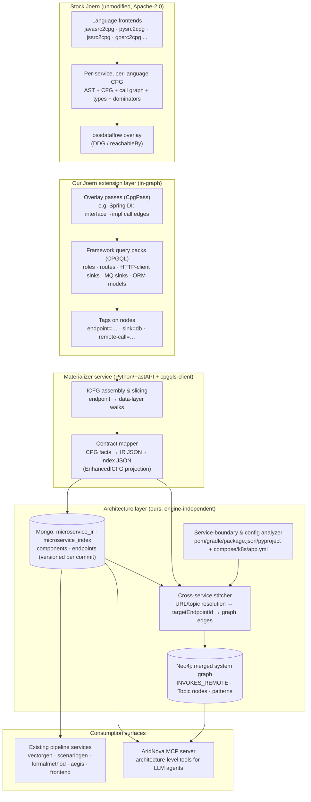

# AridNova Next-Gen Extraction Platform — Joern Migration Architecture

**Status:** Design approved for prototyping
**Date:** 2026-07-20
**Decision:** Migrate the static-analysis substrate from CIMET/JavaParser to [Joern](https://joern.io) (code property graphs), keep a thin custom layer for everything Joern cannot own (framework semantics, cross-service stitching, materialized index), and build an architecture-level MCP server on top.

---

## Table of Contents

1. [Goals & Requirements](#1-goals--requirements)
2. [Current System Analysis](#2-current-system-analysis)
3. [Tool Evaluation](#3-tool-evaluation)
4. [Decision & Rationale](#4-decision--rationale)
5. [Target Architecture](#5-target-architecture)
6. [Design Details](#6-design-details)
7. [Data Contracts to Preserve](#7-data-contracts-to-preserve)
8. [MCP Server](#8-mcp-server)
9. [LLM Integration Points](#9-llm-integration-points)
10. [Risks, Limitations & Mitigations](#10-risks-limitations--mitigations)
11. [Validation Spike & Phased Roadmap](#11-validation-spike--phased-roadmap)
12. [References](#12-references)

---

## 1. Goals & Requirements

### Product goals

For any microservice system (polyglot — **not** Java/Spring only):

1. **Extract all REST endpoints** exposed by every service.
2. **Per-endpoint interprocedural control flow graph (ICFG)** from the endpoint entry point through every function call down to the data layer (repository/ORM/driver calls).
3. **Data flow + data shape**: understand what data each endpoint touches and the shape of data persisted to the database.
4. **Detect all outbound communication**: HTTP/REST remote calls, message-queue publish/consume, other inter-service mechanisms.
5. **Cross-service stitching**: when service A's endpoint calls service B, the ICFG must *branch into* service B's handler — the complete, true picture of what an endpoint does across the whole system (today's `targetEndpointId` concept, promoted to real graph edges).
6. **Architectural pattern inference** on the resulting system graph (gateway, saga, event-driven, shared-DB and other anti-patterns) for future analyses.
7. **LLM-consumable interface**: an MCP server so any coding agent can query ground-truth architecture facts instead of fuzzy file search.

### Hard constraints

- **Multi-language is mandatory.** Java/Spring must not be a privileged case in the architecture.
- Downstream pipeline services (vectorgenerator, scenariogenerator, formalmethod, aegis) must keep working during migration → the existing JSON data contracts (§7) are preserved initially.
- Permissive licensing throughout (product may be commercialized). No GPL foundations, no CodeQL.

---

## 2. Current System Analysis

### 2.1 Two parallel extraction paths

| Path | Service / port | Endpoint | Mongo collections | Consumers |
|---|---|---|---|---|
| **A. "IR"** (raw CIMET `MicroserviceSystem`) | `backend/` :8080 | `POST /ir/create` | `microservice_ir` | formalmethod (:9000), aegis (:8900), frontend graph |
| **B. "Index"** (endpoint + component + CFG index) | `componentanalysis/` :8060 | `POST /component/create` | `microservice_index`, `microservice_components`, `microservice_endpoints` | vectorgenerator (:8050), scenariogenerator (:8040) |

- `irId` = id of a `microservice_ir` document. `indexId` = id of a `microservice_index` join document (`{componentId, endpointId}`).
- `repomanager/` (:8020) is a language-agnostic GitHub API proxy + encrypted token store. **No parsing. Survives migration untouched.**

### 2.2 The CIMET library (`cimet-extract-lib-extended`)

Source at `~/Documents/research/ai-test/cimet-extract-lib-extended` (fork, 46 commits ahead of upstream). Java 24 / Maven / JavaParser. ~158 files.

- **Upstream core (~6k LOC)**: IR models (`MicroserviceSystem → Microservice → JClass → Method/Endpoint/RestCall`), `SourceToObjectUtils` (681 L, the parsing core), `IRExtractionService`, delta/merge (JGit-based).
- **Extended indexer (~27k LOC, `intermediate/index/**`)**: two-phase indexer (`IndexerService`, 3,237 L), hand-rolled CFG generators (`EnhancedASTControlFlowGenerator` 2,708 L + `ASTControlFlowGenerator` 688 L + 25 ICFG model files), `RemoteCallDetector` (1,072 L), `SpringDIResolver` (691 L), 14 endpoint-enrichment extractors (~5.4k LOC: params, validation, security/roles, response schemas, curl examples).

**The indexer's original purpose** — O(1) method lookup to chase call chains and assemble complete CFGs — is exactly what a CPG *is*. That role is fully subsumed by Joern.

### 2.3 Current rule catalog (becomes CPG query packs)

**Class roles** (`SourceToObjectUtils.parseClassRole:385`):

| ClassRole | Trigger |
|---|---|
| CONTROLLER | `@RestController`, `@Controller` |
| SERVICE | `@Service` |
| REPOSITORY | `@Repository`; fallback: `extends MongoRepository \| CrudRepository` |
| REP_REST_RSC | `@RepositoryRestResource` (synthesizes GET endpoints) |
| ENTITY | `@Entity`, `@Embeddable` |
| FEIGN_CLIENT | `@FeignClient` (interface methods → synthetic RestCalls) |

**Endpoints** (`EndpointTemplate`): `@RequestMapping`, `@Get/Put/Post/Delete/PatchMapping`; URL = class-level `@RequestMapping` prefix + method path; multi-URL arrays → multiple endpoints; `{var}` → `{?}` simplified form; constants expanded via `ConstantResolver`.

**RestCalls** (`RestCallTemplate` + `RemoteCallDetector`): receiver ∈ {RestTemplate, WebClient, RestClient, OAuth2RestTemplate/Operations} × method-name table → HTTP verb; URL from literals / field initializers / `+` concat / `UriComponentsBuilder` chains; unresolvable → `{?}` / `{VAR:name}` markers.

**Endpoint identity** (`EndpointIdGenerator:33`): `normalizedService:sha256(service:url:METHOD)`; lossy service-name normalization (strips `-`,`_`, prefixes `ts|ms|svc`); match tiers EXACT(100) / FUZZY_HIGH_CONFIDENCE(≥90) / HEURISTIC(50) / NONE.

### 2.4 Where the Java-only lock-in lives (layered — not just CIMET)

1. **CIMET lib**: JavaParser + hardcoded Spring semantics.
2. **componentanalysis**: 24 files import `com.github.javaparser.*` directly (enrichment extractors, CFG generators, DI resolver).
3. **Python consumers**: formalmethod `parser.py:449,485` globs `SecurityConfig.java` and regexes `antMatchers(...)` on raw source; aegis + formalmethod key off Spring `classRole` buckets. **These break for non-Java targets regardless of the extractor** → in migration scope (Phase 4).
4. `repomanager`: no coupling.

### 2.5 Known weaknesses of the current approach (why migrate)

- **No real dataflow**: URL/topic reconstruction is regex/AST heuristics; every coding style needs a new special case; unresolvable values degrade to `{?}`.
- **Classpath-less symbol resolution**: JavaParser solver sees only repo source + JDK → beans typed by external jars silently dropped (why `RemoteCallDetector` exists as a second name-heuristic detector).
- **Hand-rolled ICFG**: 3,400+ LOC reimplementing what graph engines compute natively; Java-only.
- **Lossy fuzzy endpoint matching** compensating for weak URL reconstruction.
- **Service-boundary detection** is Maven/Gradle-only (`IRExtractionService.findRootDirectories:123`); Dockerfiles silently never parsed (matches literal `"DockerFile"`; not in `FileUtils.VALID_FILES`).
- **Single-language.** The fundamental limitation.

---

## 3. Tool Evaluation

### 3.1 Requirements vs candidates

| Option | Multi-language | CFG/ICFG | Dataflow | Embeddable / graph export | Killer problem |
|---|---|---|---|---|---|
| **Joern** ✅ | ~12 frontends (Java: very high; Python/JS: high; Go/Kotlin/PHP/Swift: medium) | Native + slicing | Native (DDG, taint, `reachableBy`) | Apache-2.0; server mode + Python clients; export dot/GraphML/GraphSON/Neo4j CSV | Framework catalogs are DIY; JVM memory-heavy |
| CodeQL | Excellent | Internal only | Best-in-class | ❌ findings-oriented; no graph export; closed engine | **License**: OSS + academic research only; commercial ⇒ GitHub Advanced Security |
| Fraunhofer AISEC CPG | Java/C++/Python/Go maintained; **TS/JS experimental** | Yes (EOG) | Yes (DFG) | Apache-2.0; library-first (Kotlin API); Neo4j export | Smaller ecosystem; JS/TS immaturity |
| tree-sitter + custom (Code2DFD/ModARO style) | Any (parse only) | ❌ build yourself | ❌ | Fully yours | Rebuilding Joern; dead end for CFG/dataflow goals |
| Semgrep OSS | Many | ❌ | Intra-file only (cross-file = paid) | Rules, no graphs | Not a graph substrate |
| WALA / Soot / SootUp | Java (+JS WALA) | Yes | Yes | Library | Fails multi-language |
| Infer | C/C++/Java/ObjC | Internal | Yes | Findings-oriented | No Python/JS/Go |
| Glean / SCIP | Many | ❌ | ❌ | Index/xref only | Navigation, not analysis |

### 3.2 Ecosystem evidence (the use case is proven on Joern)

- **[Privado](https://github.com/Privado-Inc/privado)** (open source, built on Joern): maps data elements → sinks classified as **databases, message queues, third parties, logs, internal APIs** via JSON rule packs. Java + Python GA. *Direct proof of goal #3/#4; rule catalog format is borrowable.*
- **[AppThreat atom](https://github.com/AppThreat/atom-samples)**: slim slicing (usages / data-flow / reachables) on Joern frontends, JSON output, NetworkX-friendly. Java/JS/Python/C.
- **[codebadger](https://github.com/Lekssays/codebadger)** (ICSE'26 SVM workshop): MCP server over Joern proving the LLM-over-CPG interaction model. **GPL-3.0 — reference only, never a foundation** (§8).
- **[Code2DFD](https://github.com/tuhh-softsec/code2DFD)**: best performer (F1 = 0.86 overall, 0.87 inter-service connections) in the 2025 EMSE benchmark of 9 microservice architecture-recovery tools — via per-technology pattern extractors, Java-only. *Lesson: framework knowledge, not parsing power, is the accuracy bottleneck. Its technology catalog (brokers, gateways, discovery, DBs) is the best public checklist to port.*

### 3.3 Research context

- Architecture-recovery benchmark: [arXiv:2412.08352](https://arxiv.org/html/2412.08352v1) — most tools Java-only; endpoint F1 best 0.79; several tools detect zero endpoints.
- [ModARO (arXiv:2602.08181)](https://arxiv.org/pdf/2602.08181): modular per-technology extractors, multi-language, regex-based — confirms the "catalog layer" cost exists under every approach.
- [codebadger paper (arXiv:2603.24837)](https://arxiv.org/html/2603.24837v1): LLMs fail at whole-repo analysis (token limits, semantic blindness across function boundaries, can't write CPGQL) — CPG-backed tools compensate.

---

## 4. Decision & Rationale

**Adopt stock, unmodified Joern as the graph engine.** All customization lives in Joern's designed extension points and in our own layers above it. **Never fork Joern** — frontend gaps go upstream as PRs.

Why the new requirements *strengthen* the Joern case:

1. The hardest current code (dataflow-free URL reconstruction, classpath-less type resolution, hand-rolled ICFG ≈ 7–8k LOC) is precisely what Joern supersedes with principled machinery (backward slices, type propagation with `fetch-dependencies`, native CFG/DDG/call graph).
2. Endpoint→data-layer flow analysis is CPG home turf, with production proof (Privado) and ready-made slicing (atom, `joern-slice`).
3. The parts Joern can't do are cleanly separable, already ours in source, and mostly language-agnostic (§5.3).
4. Coding-style sensitivity (the `{VAR:x}` special-case treadmill) is largely eliminated by dataflow; **framework sensitivity is not and never will be** — query packs are a permanent, first-class, growing catalog. They are also small: tens of declarative lines per framework instead of thousands of lines of AST plumbing.

**The indexer verdict:** the indexer *engine* dies (its O(1)-lookup/CFG-assembly role is what a CPG is); the *index* survives as a thin materialized product artifact (§5.2, §6.6). Downstream consumes versioned JSON from Mongo, never a live graph engine.

**Division of labor (the moat):** Joern owns everything *inside* a process; we own everything *between* processes (stitching, identity, config resolution). The in-process part anyone can rebuild; the between-process layer is the research/product contribution.

---

## 5. Target Architecture

### 5.1 Layer diagram

### 5.2 What dies / what survives from current code

| Component | Fate |
|---|---|
| CIMET jars + `SourceToObjectUtils` parsing | **Dies** → Joern frontends |
| `IndexerService` (3,237 L), O(1) lookup structures | **Dies** → CPG *is* the index |
| `EnhancedASTControlFlowGenerator` + `ASTControlFlowGenerator` + ICFG builders (~3.4k L) | **Dies** → native CFG + call graph; thin projection remains (§6.3) |
| `RemoteCallDetector` heuristic layer (most of 1,072 L) | **Dies** → sink queries + dataflow slices |
| JavaParser symbol-resolution workarounds | **Dies** → Joern type propagation + `fetch-dependencies` |
| `SpringDIResolver` *strategy* logic | **Survives** as a CpgPass (adds edges; same EXACT/PRIMARY/QUALIFIER/AMBIGUOUS strategy) |
| Rule tables (§2.3: roles, endpoint annotations, HTTP-client verbs) | **Survive** as declarative query packs |
| Enrichment extractor *rules* (security/roles, response schemas, validation, curl) | **Survive**, re-hosted as queries over CPG nodes (incremental port) |
| Service-boundary detection + config parsing (YAML/pom/gradle) | **Survives & generalizes** (compose, package.json, pyproject, k8s) |
| Endpoint identity + confidence-tiered matching | **Survives** (fuzzy tier shrinks as URL slices improve) |
| Delta / merge / change-impact (JGit) | **Survives** unchanged (diffs IR JSON via component IDs) |
| Mongo index contract + `indexId`/`irId` flow | **Survives** (contract frozen for Phase 1–2) |
| `repomanager` | **Survives** untouched |

### 5.3 Processing model

Joern is **batch, whole-codebase, two-phase**:

1. **Import** (once per service per commit): frontend parses *all* files → base CPG; overlay passes add types, call graph, per-method CFGs, dominators, dataflow. Result persisted to disk. Minutes + real JVM heap for large services. **No incrementality** — a change ⇒ rebuild that service's CPG (our JGit delta tells us *which* services changed).
2. **Query** (on demand, cheap): traversals start anywhere; `reachableBy` dataflow evaluated per query with caching.

Pipeline mapping: `/component/create` ⇒ *build (or fetch cached) CPG keyed by (service, language, commit) → run passes + query packs → materialize JSON → cache CPG file → optionally discard from memory*. One CPG **per language** in polyglot repos; cross-language unification happens only in the architecture layer (correct for microservices: boundaries are HTTP/MQ anyway).

---

## 6. Design Details

### 6.1 Framework query packs (the permanent catalog — this is the product)

Per **language × framework**, declarative catalogs compiled into CPGQL:

| Pack type | Java examples | Python examples | JS/TS examples |
|---|---|---|---|
| Roles/structure | Spring stereotypes (§2.3 table) | — (module/package conventions) | — |
| Routes/endpoints | `@*Mapping` annotations (`cpg.method.where(_.annotation.fullName("org.springframework.web.bind.annotation..*Mapping"))`) | FastAPI/Flask **decorators** (call/modifier nodes, *not* annotation nodes) | Express `app.get(...)` call sites |
| HTTP-client sinks | RestTemplate/WebClient/RestClient/Feign | `requests`, `httpx`, `aiohttp` | `fetch`, `axios` |
| MQ sinks | `KafkaTemplate.send`, `@KafkaListener`, `RabbitTemplate`, `@RabbitListener`, SQS/SNS clients, gRPC stubs | `pika`, `kafka-python`, `celery` | `amqplib`, `kafkajs` |
| ORM/data models | JPA `@Entity` fields + relations, Mongo `@Document`, repository `save/insert` | SQLAlchemy/Django models, `session.add`, pymongo | Mongoose schemas, Prisma, TypeORM |

Conventions:
- Packs **tag** nodes (`endpoint=GET /orders`, `sink=db`, `sink=mq:kafka`, `model=Order`) — tags persist in the CPG; the materializer collects tags rather than re-detecting.
- Seed catalogs from **Privado's OSS rule packs** (sink classification, Java+Python) and **Code2DFD's** technology extractor list. LLM-drafted, conformance-suite-validated (§9).
- Each pack ships with fixture repos + expected-output JSON (the conformance suite).

### 6.2 DI resolution pass (Java/Spring first)

`CpgPass` that ports `SpringDIResolver` strategy: for each `@Autowired`/constructor-injected interface dependency, resolve implementing `typeDecl` (EXACT / `@Primary` / `@Qualifier` / AMBIGUOUS) and **add interface→impl call edges** so every downstream traversal (ICFG walks, slices) transparently crosses DI boundaries. Without this, endpoint→data-layer walks dead-end at service interfaces.

### 6.3 Per-endpoint ICFG & the `EnhancedICFG` projection

- **Within-service**: start at tagged endpoint method → walk call edges (DI-augmented) → stitch per-method CFGs → terminate at tagged sinks. A graph traversal (~hundreds of lines, language-independent), replacing ~3.4k LOC of AST interpretation.
- **CFG depth available** (per CPG spec): expression-level nodes; `CONTROL_STRUCTURE` nodes typed **IF, ELSE, FOR, WHILE, DO, SWITCH, BREAK, CONTINUE, GOTO, TRY, THROW**; distinguishable true/false branch edges; dominator/post-dominator trees; CDG (statement→controlling-condition edges); REACHING_DEF/DDG. Structural loop detection via back-edges covers non-syntactic loops.
- **Projection to the legacy contract**: current `EnhancedICFG` (Entry/Exit/Branch/Call/Return/Statement nodes, `loopStructure[]`, `exceptionFlow[]`, `dataFlowSummary`) is a strict subset — the mapper *coarsens* expression-level CFG to statement granularity, maps CONTROL_STRUCTURE→Branch/Loop, tags catalog-matched calls as REMOTE_CALL. Nothing currently modeled is lost; condition semantics, CDG, dominators are gained.

### 6.4 Remote-call & MQ detection with dataflow

- Sink catalogs find call sites; **backward slices** (`joern-slice` data-flow mode / `reachableBy`) reconstruct URL/topic arguments through variables, fields, helpers, `String.format`, config keys — replacing the literal/concat/`{VAR:x}` heuristics.
- MQ: pair producers/consumers on resolved topic names → async edges.
- Expected effect: EXACT match rate ↑, fuzzy tier becomes a fallback instead of load-bearing.

### 6.5 Cross-service stitching (ours by design — no engine can do this)

A CPG is per-program; an HTTP call is a leaf in it. Cross-service control flow is an *architecture* fact requiring config knowledge. The stitcher:

1. Inputs: per-service endpoint tables + remote-call/MQ records (with sliced URLs/topics + confidence) + **config resolution** (application.yml service names, compose hostnames, discovery names, gateway route prefixes).
2. Match → `targetEndpointId` (kept as the contract), then **graft as real edges** in the merged Neo4j graph:
   - Sync REST: `remoteCallNode -[:INVOKES_REMOTE {url, confidence, mechanism}]-> targetEndpointEntry` **plus a return edge** — traversals walk into service B's ICFG and back, like an inlined call.
   - MQ: `producer -> (:Topic) -> consumerHandlerEntry`, **deliberately no return edge** — async fan-out is not a call; keep sync/async edge types distinct (pattern inference depends on it).
3. Handles: cross-service **cycles** (graph edges, never tree-inlining), fan-out depth limits, **snapshot consistency** (stitch only within one analysis run's commit set).
4. Estimated size: 1–2k LOC including config resolution. This module is the novel contribution — nothing public ships endpoint-ICFG-to-endpoint-ICFG stitching.

### 6.6 The materialized index (why not live CPG queries downstream)

Downstream reads versioned JSON from Mongo, not a graph engine, because: CPGs must be JVM-resident to query (hot, memory-heavy infra at query time vs one-shot at extraction); cross-service/cross-language facts don't exist inside any single CPG; commit-stamped artifacts power delta/merge and keep consumers decoupled. **Extract once → JSON → cache/discard CPG.**

### 6.7 Data-shape recovery — honest ceiling

From code we recover the **ORM model shape** (entities/fields/relations per framework pack), which is goal #3's main deliverable. The *actual* DB schema lives in migration files — plan a small dedicated parser (Flyway/Liquibase SQL, Alembic) beside the CPG when true DDL is needed.

### 6.8 Service-boundary & config analyzer (generalized)

Extend beyond leaf-`pom.xml`/`build.gradle`: docker-compose service enumeration (fixes today's Dockerfile-never-parsed bug), `package.json`, `pyproject.toml`, k8s manifests. Output: service list + language(s) + build roots + network identities (hostnames/ports/env) feeding both CPG imports and the stitcher.

---

## 7. Data Contracts to Preserve (frozen through Phase 2)

### 7.1 Path A — IR JSON (`microservice_ir`)

`microservices[].{controllers,services,repositories,entities,feignClients,unknowns}[]` with per-class `name/classRole/classType/packageName/annotations[]/fields[]/methods[]/imports[]`; per-method `url/httpMethod/annotations[].attributes/methodCalls[]`; `methodCall.{calledFrom,objectType,objectName,name,type,url,httpMethod,parameterContents}`; `type` discriminators (`"Endpoint"`, `"RestCall"`, `"JInterface"`); `path`, `commitID`; injected `id`, `metadata.{createDate,modifyDate}`, `antiPattern` (GOD_SERVICE / SHARED_DB / CYCLIC_DEPENDENCY / CHATTY_SERVICE). Gzipped payload.

**Readers**: formalmethod (`parser.py` — also reads `annotations[].attributes.{path,value}`, builds Z3 role model), aegis (`graph_loader.py` — classRole, annotations, packageName, fieldType), frontend (`getData.ts`).

### 7.2 Path B — Index (`microservice_index` → components + endpoints)

- `microservice_index`: `{id, componentId, endpointId}` — **`indexId` = this document's id.**
- `EndpointInfo`: `id, endpointId, methodId, httpMethod, fullUri, simplifiedUri` (`{?}` placeholders), `pathParameterDetails[], queryParameterDetails[], requestBodyDetail, responseType, responseSchema, controllerClass, methodName, authentication, authorization` (roles), `serviceName, physicalServiceName, urlDerivedServiceName, curlExample`.
- `ComponentIndex.components{}` keyed by service-scoped id, incl. `IndexedMethod.controlFlowGraph` = `EnhancedICFG {methodId, entryNodeIndex, exitNodeIndices, nodes[], edges[], exceptionFlow[], loopStructure[], dataFlowSummary}`; CFG CALL node `methodCall` = `{remoteCall, endpoint, httpMethod, targetEndpointId, endpointResolved, targetService, callType(LOCAL/…), targetMethodId}`.

**Readers**: vectorgenerator `call_chain_analyzer.py` (walks CFG nodes; `remoteCall==true` / `targetMethodId` drive transitive call chains), scenariogenerator (`fullUri/simplifiedUri/httpMethod`, annotations, parameters, PII heuristics over field names).

---

## 8. MCP Server

**Positioning:** codebadger et al. wrap the *raw CPG of one codebase* (commodity layer, several implementations exist). Ours serves **architecture-level answers from the index + merged Neo4j graph** — tools no raw-CPG server can offer without our extraction layer.

**Tools (initial):** `list_services`, `list_endpoints(service)`, `endpoint_icfg(endpoint_id, cross_service=true)`, `data_model(endpoint_id | service)`, `remote_edges(service)`, `mq_topology()`, `find_flows(source, sink)`, `detect_patterns()`, plus an optional `raw_cpg_query`/slice escape hatch delegating to our Joern server.

**Implementation:** FastMCP (Python) over Mongo + Neo4j; the protocol layer is a few hundred lines — the value is the data behind it.

**Codebadger policy:** GPL-3.0 ⇒ *deploy unmodified for learning* (fine), *mine its tool taxonomy (`docs/available-tools.md`), paper findings, and session/memory-scheduling design as reference* (fine), **never fork or vendor its code** (copyleft contaminates a distributed product). Sequence: build after the extraction migration proves out — the server is a presentation layer.

**LLM-over-CPG lessons (codebadger paper):** expose high-level semantic tools; do **not** expect LLMs to write CPGQL.

---

## 9. LLM Integration Points

Division of labor: **graphs for truth, LLMs for judgment.** An LLM cannot produce a guaranteed-complete endpoint inventory or a correct cross-service ICFG (sampled-context inference has no exhaustiveness mechanism) — that's the symbolic layer's job. The pipeline is already neuro-symbolic (IR → scenario/prompt → LLM testgen; aegis); the migration upgrades the symbolic half feeding it.

Where LLMs slot in:
1. **Catalog authoring**: draft framework query packs from examples; conformance suite validates. Directly attacks the catalog cost that dominates the multi-language roadmap.
2. **Gap resolution**: where statics structurally can't answer (runtime-config URLs, reflection, AMBIGUOUS DI), an LLM given the surrounding slice emits a *low-confidence* candidate edge — a principled home for fuzziness.
3. **Semantic labeling**: PII/business-logic classification of fields/models (replacing scenariogenerator's name heuristics); node labeling stays out of the symbolic graph's truth claims.
4. **Consumption**: the MCP server makes any coding agent grounded in the customer's true architecture — the product surface.

---

## 10. Risks, Limitations & Mitigations

| Risk / limitation | Mitigation |
|---|---|
| CPG import cost (minutes, JVM heap; separate JVM per frontend) hurts interactive pipeline UX | Cache CPGs keyed by (service, language, commit); rebuild only JGit-delta-changed services; async job UX |
| Frontend maturity varies (Python/JS dataflow < Java; Go medium) | Spike validates per-language early (§11 gate); Fraunhofer CPG as warm fallback; upstream PRs for gaps |
| One CPG per language — no in-engine polyglot graph | By design: unify in the architecture layer (service boundaries are HTTP/MQ) |
| Framework catalogs are permanent DIY work | Declarative packs + tags (small per pack); seed from Privado/Code2DFD; LLM-drafted + conformance-tested |
| Cross-service URL resolution still imperfect (runtime config, gateways) | Config analyzer + confidence tiers retained; LLM gap-resolution as low-confidence oracle |
| DB "shape" from code = ORM shape, not DDL | Migration-file parser (Flyway/Liquibase/Alembic) when needed |
| Non-Java couplings in formalmethod/aegis break for polyglot targets | Explicit Phase 4 scope — without it, multi-language extraction feeds Java-only analyzers |
| Joern version churn | Stock engine + pinned version per release; extensions only via stable APIs (queries, CpgPass, tags, server) |
| License hygiene | Joern Apache-2.0 ✅; codebadger GPL-3.0 (reference only); CodeQL excluded |

---

## 11. Validation Spike & Phased Roadmap

### Spike (≈1–2 weeks) — three risky claims, two languages

On one already-indexed Java/Spring service **and** one Python/FastAPI service:

| # | Claim to prove | Acceptance |
|---|---|---|
| a | Endpoint extraction parity | Query-pack endpoint list diffs clean against existing `endpoints.json` (ground truth in Mongo) |
| b | Endpoint→data-layer slice works | Backward slice from an endpoint parameter reaches `repository.save` / `session.add`; URL/topic slices beat current `{?}`/`{VAR:x}` rate |
| c | MQ detection | One Kafka (or equivalent) producer/consumer pair detected and paired on topic |

Use `javasrc2cpg --fetch-dependencies`, `pysrc2cpg`, `run.ossdataflow`, `joern-slice`. **Gate:** if Python dataflow quality disappoints → evaluate Fraunhofer CPG before further investment.

### Phases

1. **Extraction service v1 (Java parity).** Joern server + FastAPI materializer emitting the *existing* Path A + Path B contracts (§7). DI pass, Spring packs, `EnhancedICFG` projection. componentanalysis + CIMET jars retire behind the same API. Conformance suite = existing ~30 test classes' fixtures + Mongo ground truth diffs.
2. **Cross-service stitcher + Neo4j system graph.** Config analyzer generalization, `INVOKES_REMOTE`/Topic edges, `targetEndpointId` promoted to traversable edges. MQ packs (Java).
3. **Second language end-to-end.** Python packs (routes, sinks, SQLAlchemy/pymongo models) through the same materializer → proves the multi-language claim in the product, not just the spike.
4. **De-Java the consumers.** formalmethod security parsing → consume extracted authorization facts from the index instead of regexing `SecurityConfig.java`; aegis role/annotation assumptions generalized.
5. **MCP server + pattern inference.** Architecture-level tools (§8) over index + Neo4j; anti-pattern/pattern queries in Cypher; LLM catalog-authoring loop (§9).

---

## 12. References

**Internal:**
- Current pipeline repo: this repository (`backend/`, `componentanalysis/`, `repomanager/`, Python services; contracts per §7 with file/line pointers in §2).
- CIMET source: `~/Documents/research/ai-test/cimet-extract-lib-extended` (rule tables §2.3; `plan/` design docs; `docs/MicroserviceSystemSchema.json`).

**Joern:** [docs](https://docs.joern.io/) · [frontends](https://docs.joern.io/frontends/) · [Java frontend](https://docs.joern.io/frontends/java/) · [export](https://docs.joern.io/export/) · [server](https://docs.joern.io/server/) · [CPG slicing](https://docs.joern.io/cpg-slicing/) · [CPG spec](https://cpg.joern.io/) · [integrate](https://joern.io/integrate/) · [cpgqls-client-python](https://github.com/joernio/cpgqls-client-python) · [joern-lib](https://github.com/AppThreat/joern-lib)

**Ecosystem:** [Privado](https://github.com/Privado-Inc/privado) · [atom samples](https://github.com/AppThreat/atom-samples) · [codebadger](https://github.com/Lekssays/codebadger) (GPL-3.0) · [Code2DFD](https://github.com/tuhh-softsec/code2DFD) · [Fraunhofer AISEC CPG](https://github.com/Fraunhofer-AISEC/cpg)

**Research:** [Architecture-recovery benchmark, arXiv:2412.08352](https://arxiv.org/html/2412.08352v1) · [ModARO, arXiv:2602.08181](https://arxiv.org/pdf/2602.08181) · [Bridging CPGs and LMs (codebadger), arXiv:2603.24837](https://arxiv.org/html/2603.24837v1) · [Spring endpoint queries with Joern](https://akhilmahendra.com/blog/program-analysis-with-joern/)

**Licensing notes:** Joern Apache-2.0 (safe); CodeQL research/OSS-only ([license](https://github.com/github/codeql-cli-binaries/blob/main/LICENSE.md)); codebadger GPL-3.0 (reference only).
